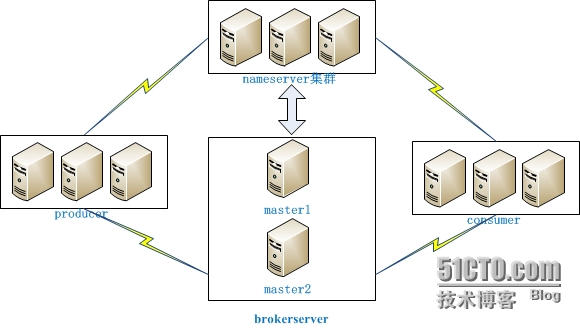

 # RocketMQ 消息队列单机部署及使用


nameServer在RocketMQ中的两个主要作用：

- **NameServer维护了一份Broker的地址列表和，broker在启动的时候会去NameServer进行注册，会维护Broker的存活状态.**

- **NameServer维护了一份Topic和Topic对应队列的地址列表,broker每次发送心跳过来的时候都会把Topic信息带上.**

  ​

# 简介

## 服务器说明

| **IP地址**        | **主机名**       | **机型** | **角色**       | **架构模式**           |
| --------------- | ------------- | ------ | ------------ | ------------------ |
| 192.168.152.131 | centos-mq     |        | nameserver   | Master1（双Master模式） |
| 192.168.152.132 | centos-master |        | brokerserver | Master1（双Master模式） |

## 修改host

```bash
# vim /etc/hosts
10.217.121.123  mqnameserver1
10.217.122.31    mqnameserver2
10.217.121.123  rocketmq-master1
10.217.122.31    rocketmq-master2
```

## 总体架构



## 安装与配置

### 安装环境(nameserver&&broker)

>CentOS Linux release 7.3.1611
>alibaba-rocketmq-3.2.6.tar.gz
>jdk1.8.0_101

```bash
https://github.com/alibaba/RocketMQ/releases
[root@centos-mq local]# tar -xvzf alibaba-rocketmq-3.2.6.tar.gz -C /usr/local
[root@centos-mq local]# cd /usr/local/
[root@centos-mq local]# ll
total 4
drwxr-xr-x.  2 root root    6 Nov  5 11:38 bin
drwxr-xr-x.  2 root root    6 Nov  5 11:38 etc
drwxr-xr-x.  2 root root    6 Nov  5 11:38 games
drwxr-xr-x.  2 root root    6 Nov  5 11:38 include
drwxr-xr-x.  2 root root    6 Nov  5 11:38 lib
drwxr-xr-x.  2 root root    6 Nov  5 11:38 lib64
drwxr-xr-x.  2 root root    6 Nov  5 11:38 libexec
drwxrwxr-x. 20 root root 4096 Sep 18  2016 RocketMQ-3.5.8
drwxr-xr-x.  2 root root    6 Nov  5 11:38 sbin
drwxr-xr-x.  5 root root   49 Mar 22 02:12 share
drwxr-xr-x.  2 root root    6 Nov  5 11:38 src
[root@centos-mq local]# mv alibaba-rocketmq/ rocketmq
################### ln -s alibaba-rocketmq-3.2.6 rocketmq   非必需#########################
# ll /usr/local
```

### 环境配置(nameserver&&broker)

```bash
[root@centos-mq local]# vim /etc/profile
#-------------------------------------------------------------
## java environment
export PATH=$PATH:/usr/local/bin
export JAVA_HOME=/home/soft/jdk1.8.0_101
export CLASSPATH=.:$JAVA_HOME/lib/dt.jar:$JAVA_HOME/lib/tools.jar
export PATH=$PATH:$JAVA_HOME/bin

##rocketmq  environment
export ROCKETMQ_HOME=/usr/local/rocketmq
export PATH=$JAVA_HOME/bin:$ROCKETMQ_HOME/bin:$PATH
#-------------------------------------------------------------
## 配置生效
[root@centos-mq local]# source /etc/profile

##  修改权限
[root@centos-mq local]# cd  /usr/local/rocketmq/bin/
[root@centos-mq bin]# chmod +x mqadmin mqbroker mqfiltersrv mqshutdown  mqnamesrv

## 创建日志文件夹
[root@centos-mq bin]# mkdir -p /usr/local/rocketmq/log
```

### 时间同步(nameserver&&broker)

```bash
[root@centos-mq rocketmq]# date -R; date +%z  
#修改时区
[root@centos-mq rocketmq]# cp /usr/share/zoneinfo/Asia/Shanghai /etc/localtime    
[root@centos-mq rocketmq]# ntpdate time.windows.com
[root@centos-mq rocketmq]# hwclock -w
```


### 启动nameserver(192.168.152.131)

```bash
##启动nameserver#
[root@centos-mq rocketmq]# nohup mqnamesrv 1>/usr/local/rocketmq/log/ng.log 2>/usr/local/rocketmq/log/ng-err.log &
[1] 20979
##查看启动状态
[root@centos-mq rocketmq]# ps -ef|grep java
root      21736  21734  0 04:48 pts/0    00:00:00 /home/soft/jdk1.8.0_101/bin/java -server -Xms4g -Xmx4g -Xmn2g -XX:PermSize=128m -XX:MaxPermSize=320m -XX:+UseConcMarkSweepGC -XX:+UseCMSCompactAtFullCollection -XX:CMSInitiatingOccupancyFraction=70 -XX:+CMSParallelRemarkEnabled -XX:SoftRefLRUPolicyMSPerMB=0 -XX:+CMSClassUnloadingEnabled -XX:SurvivorRatio=8 -XX:+DisableExplicitGC -verbose:gc -Xloggc:/root/rmq_srv_gc.log -XX:+PrintGCDetails -XX:-OmitStackTraceInFastThrow -Djava.ext.dirs=/usr/local/rocketmq/bin/../lib -cp .:/usr/local/rocketmq/bin/../conf:.:/home/soft/jdk1.8.0_101/lib/dt.jar:/home/soft/jdk1.8.0_101/lib/tools.jar com.alibaba.rocketmq.namesrv.NamesrvStartup
root      21755  10574  0 04:48 pts/0    00:00:00 grep --color=auto java
[root@centos-mq rocketmq]# 

##验证nameserver是否启动
[root@centos-mq rocketmq]# tail -f /usr/local/rocketmq/log/ng.log
The Name Server boot success.


##打开防火墙端口
[root@centos-mq rocketmq]# firewall-cmd --zone=public --add-port=9876/tcp --permanent
[root@centos-mq rocketmq]# firewall-cmd --reload  
```

### 启动broker(192.168.152.132)

启动broker，在启动borker之前需要指定nameserver地址，其中192.168.152.132为所在服务器IP

```bash
## 创建日志文件夹
[root@centos-master bin]# mkdir -p /usr/local/rocketmq/log
[root@centos-master bin]# export NAMESRV_ADDR=192.168.152.131:9876
[root@centos-master ~]# echo $NAMESRV_ADDR
[root@centos-master bin]# nohup mqbroker >/usr/local/rocketmq/log/mq.log &

##验证broker是否启动
[root@centos-master rocketmq]# tail -f /usr/local/rocketmq/log/mq.log
Java HotSpot(TM) 64-Bit Server VM warning: ignoring option PermSize=128m; support was removed in 8.0
Java HotSpot(TM) 64-Bit Server VM warning: ignoring option MaxPermSize=320m; support was removed in 8.0
Java HotSpot(TM) 64-Bit Server VM warning: UseCMSCompactAtFullCollection is deprecated and will likely be removed in a future release.
The broker[centos-master, 192.168.152.133:10911] boot success. and name server is 192.168.152.131:9876

##打开防火墙端口
[root@centos-mq master]# firewall-cmd --zone=public --add-port=10911/tcp --permanent
[root@centos-mq master]# firewall-cmd --reload  

```

### 常用命令

```bash
##关闭nameserver broker执行的命令
[root@centos-mq local]# mqshutdown namesrv
[root@centos-mq master]# mqshutdown broker
##关闭nameserver
[root@centos-mq local]# mqshutdown namesrv
The mqnamesrv(12248) is running...
Send shutdown request to mqnamesrv(12248) OK

#关闭broker
[root@centos-mq master]# mqshutdown broker
The mqbroker(13634) is running...
Send shutdown request to mqbroker(13634) OK
```


## 常见问题

### Error: Could not find or load main class com.alibaba.rocketmq.namesrv.NamesrvStartup

