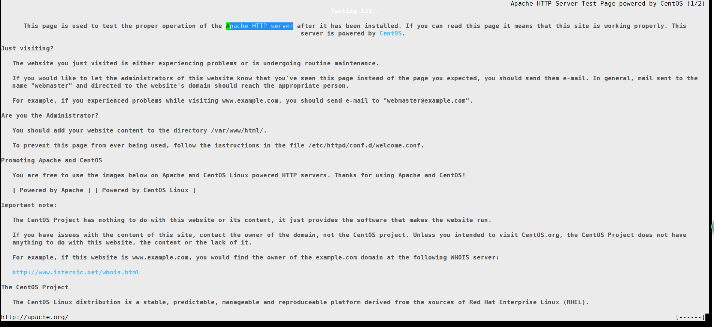

## CentOS7安装 Apache HTTP 服务器

时间:2015-05-02 00:45来源:linux.cn 作者:linux.cn [举报](http://www.centoscn.com/plus/erraddsave.php?aid=5325&title=CentOS7%B0%B2%D7%B0%20Apache%20HTTP%20%B7%FE%CE%F1%C6%F7) 点击:4338次

不管你因为什么原因使用服务器，大部分情况下你都需要一个 HTTP 服务器运行网站、多媒体、用户端脚本和很多其它的东西。

```
# yum install httpd
```

安装 Apache 服务器

如果你想更改 Apache HTTP 服务器的默认端口号(80)为其它端口，你需要编辑配置文件 ‘/etc/httpd/conf/httpd.conf’ 并查找以下面开始的行：

```
LISTEN 80
```

把端口号 ‘80’ 改为其它任何端口(例如 3221)，保存并退出。

更改 Apache 端口

增加刚才分配给 Apache 的端口通过防火墙，然后重新加载防火墙。

允许 http 服务通过防火墙(永久)。

```
# firewall-cmd –add-service=http
```

允许 3221 号端口通过防火墙(永久)。

```
# firewall-cmd –permanent –add-port=3221/tcp
```

重新加载防火墙。

```
# firewall-cmd –reload
```

（LCTT 译注：关于 firewall 的进一步使用，请参照：http://www.linux.cn/article-4425-1.html ）

完成上面的所有事情之后，是时候重启 Apache HTTP 服务器了，然后新的端口号才能生效。

```
# systemctl restart httpd.service
```

现在添加 Apache 服务到系统层使其随系统自动启动。

```
# systemctl start httpd.service
# systemctl enable httpd.service
```

（LCTT 译注：关于 systemctl 的进一步使用，请参照：http://www.linux.cn/article-3719-1.html ）

如下图所示，用 links 命令行工具 验证 Apache HTTP 服务器。

```
yum install links 
```

1.  \# links 127.0.0.1



验证 Apache 状态