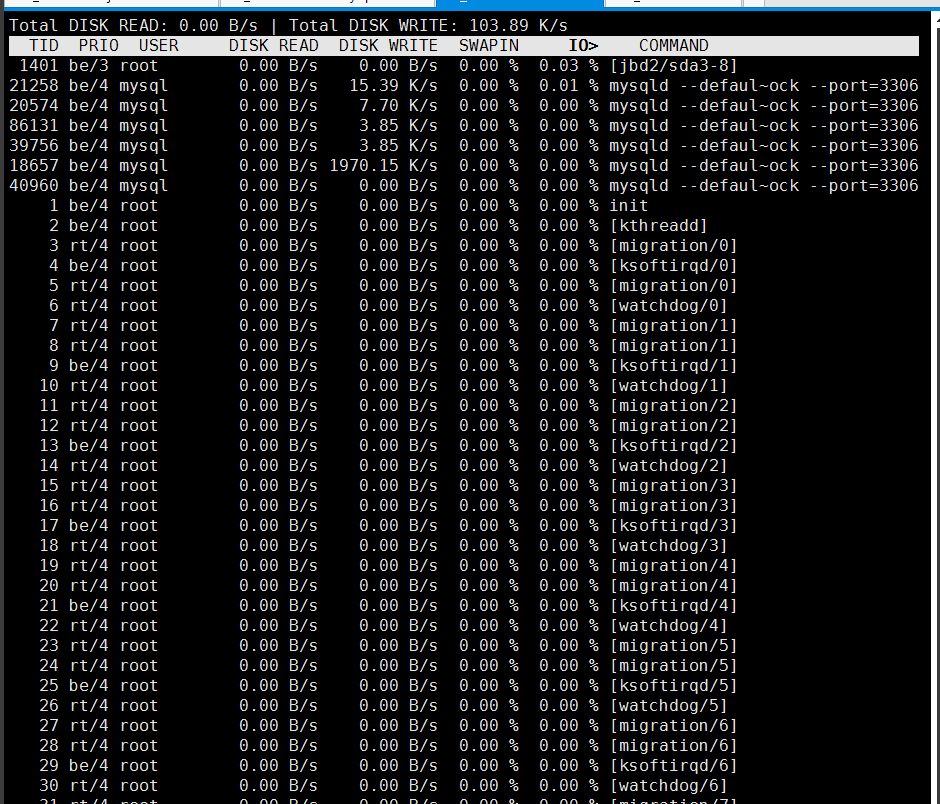
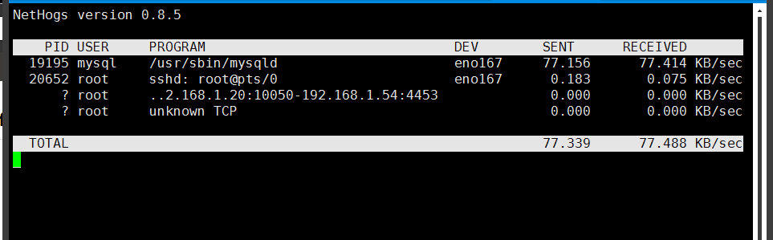
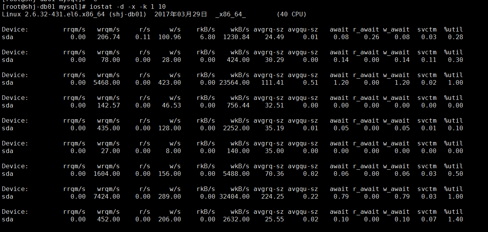
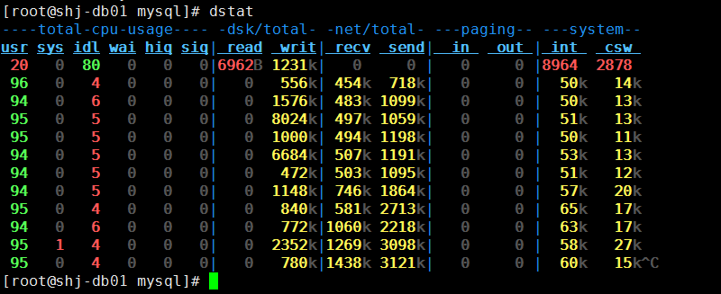
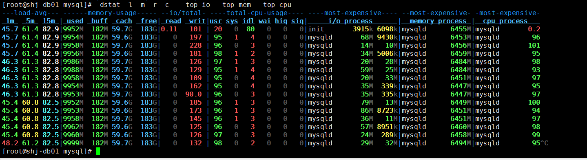

# Centos 系统性能监控

## 测试磁盘读写速度

```bash
/dev/null 伪设备,回收站.写该文件不会产生IO
/dev/zero 伪设备,会产生空字符流,对它不会产生IO

##测试写速度
[root@localhost mysql]# time dd if=/dev/zero of=/test.dbf bs=8k count=300000
300000+0 records in
300000+0 records out
2457600000 bytes (2.5 GB) copied, 3.9186 s, 627 MB/s

real	0m3.922s
user	0m0.043s
sys	0m2.402s
可以看到,在3.922秒的时间里，生成2.5 GB的一个文件,IO写的速度
[root@localhost mysql]# 


##测试读速度
[root@mysql01 mysql]# time dd if=/dev/mapper/centos-home of=/dev/null bs=8k
25209077+0 records in
25209076+0 records out
206512750592 bytes (207 GB) copied, 208.107 s, 992 MB/s

real	3m28.110s
user	0m1.997s
sys	1m57.586s
[root@mysql01 mysql]# 
```

## 实时监控磁盘IO-IOTop

```bash
yum -y install iotop 
```



## 监控内网网卡流量

nethogs

```bash
###源码编译
wget http://sourceforge.NET/projects/nethogs/files/nethogs/0.8/nethogs-0.8.0.tar.gz/download
##安装依赖
yum  -y install libpcap-devel  ncurses-devel
make&& make install
nethogs eth0


###########或者直接安装
yum install nethogs，
nethogs eth0


```



## yum install -y sysstat

## iostat -d -x -k 1 10



rrqm/s：每秒这个设备相关的读取请求有多少被Merge了（当系统调用需要读取数据的时候，VFS将请求发到各个FS，如果FS发现不同的读取请求读取的是相同Block的数据，FS会将这个请求合并Merge）
wrqm/s：每秒这个设备相关的写入请求有多少被Merge了。
rsec/s：每秒读取的扇区数；
wsec/：每秒写入的扇区数。

rkB/s: 每秒读K字节数。是 rsect/s 的一半，因为每扇区大小为512字节。(需要计算)
wkB/s: 每秒写K字节数。是 wsect/s 的一半。(需要计算)
avgrq-sz 平均请求扇区的大小
avgqu-sz 是平均请求队列的长度。毫无疑问，队列长度越短越好。    
await：  每一个IO请求的处理的平均时间（单位是微秒毫秒）。这里可以理解为IO的响应时间，一般地系统IO响应时间应该低于5ms，如果大于10ms就比较大了。 这个时间包括了队列时间和服务时间，也就是说，一般情况下，await大于svctm，它们的差值越小，则说明队列时间越短，反之差值越大，队列时间越长，说明系统出了问题。
svctm    表示平均每次设备I/O操作的服务时间（以毫秒为单位）。如果svctm的值与await很接近，表示几乎没有I/O等待，磁盘性能很好，如果await的值远高于svctm的值，则表示I/O队列等待太长，         系统上运行的应用程序将变慢。
%util： 在统计时间内所有处理IO时间，除以总共统计时间。例如，如果统计间隔1秒，该设备有0.8秒在处理IO，而0.2秒闲置，那么该设备的%util = 0.8/1 = 80%，所以该参数暗示了设备的繁忙程度
。一般地，如果该参数是100%表示设备已经接近满负荷运行了（当然如果是多磁盘，即使%util是100%，因为磁盘的并发能力，所以磁盘使用未必就到了瓶颈）。

## dstat 工具

### 特性

- 结合了vmstat，iostat，ifstat，netstat以及更多的信息
- 实时显示统计情况
- 在分析和排障时可以通过启用监控项并排序
- 模块化设计
- 使用python编写的，更方便扩展现有的工作任务
- 容易扩展和添加你的计数器（请为此做出贡献）
- 包含的许多扩展插件充分说明了增加新的监控项目是很方便的
- 可以分组统计块设备/网络设备，并给出总数
- 可以显示每台设备的当前状态
- 极准确的时间精度，即便是系统负荷较高也不会延迟显示
- 显示准确地单位和和限制转换误差范围
- 用不同的颜色显示不同的单位
- 显示中间结果延时小于1秒
- 支持输出CSV格式报表，并能导入到Gnumeric和Excel以生成图形

### 安装命令

```bash
yum install dstat
```

### dstat

```bash
[root@shj-db01 mysql]# dstat
----total-cpu-usage---- -dsk/total- -net/total- ---paging-- ---system--
usr sys idl wai hiq siq| read  writ| recv  send|  in   out | int   csw 
 20   0  80   0   0   0|6962B 1231k|   0     0 |   0     0 |8964  2878 
 96   0   4   0   0   0|   0   556k| 454k  718k|   0     0 |  50k   14k
 94   0   6   0   0   0|   0  1576k| 483k 1099k|   0     0 |  50k   13k
 95   0   5   0   0   0|   0  8024k| 497k 1059k|   0     0 |  51k   13k
 95   0   5   0   0   0|   0  1000k| 494k 1198k|   0     0 |  50k   11k
 94   0   5   0   0   0|   0  6684k| 507k 1191k|   0     0 |  53k   13k
 94   0   5   0   0   0|   0   472k| 503k 1095k|   0     0 |  51k   12k
 94   0   5   0   0   0|   0  1148k| 746k 1864k|   0     0 |  57k   20k
 95   0   4   0   0   0|   0   840k| 581k 2713k|   0     0 |  65k   17k
 94   0   6   0   0   0|   0   772k|1060k 2218k|   0     0 |  63k   17k
 95   1   4   0   0   0|   0  2352k|1269k 3098k|   0     0 |  58k   27k
 95   0   4   0   0   0|   0   780k|1438k 3121k|   0     0 |  60k   15k^C
```

> 想要dstat输出默认监控、报表输出的时间间隔为3秒钟,并且报表中输出10个结果，你可以运行如下命令：
>
> ```bash
> dstat 3 10
> ```
>
> int是可中断次数,csw是进程切换次数.
>
> **CPU状态**：CPU的使用率。这项报告更有趣的部分是显示了用户，系统和空闲部分，这更好地分析了CPU当前的使用状况。如果你看到"wait"一栏中，CPU的状态是一个高使用率值，那说明系统存在一些其它问题。当CPU的状态处在"waits"时，那是因为它正在等待I/O设备（例如内存，磁盘或者网络）的响应而且还没有收到。
>
> **磁盘统计**：磁盘的读写操作，这一栏显示磁盘的读、写总数。
>
> **网络统计**：网络设备发送和接受的数据，这一栏显示的网络收、发数据总数。
>
> **分页统计**：系统的分页活动。分页指的是一种内存管理技术用于查找系统场景，一个较大的分页表明系统正在使用大量的交换空间，或者说内存非常分散，大多数情况下你都希望看到page in（换入）和page out（换出）的值是0 0。
>
> **系统统计**：这一项显示的是中断（int）和上下文切换（csw）。这项统计仅在有比较基线时才有意义。这一栏中较高的统计值通常表示大量的进程造成拥塞，需要对CPU进行关注。你的服务器一般情况下都会运行运行一些程序，所以这项总是显示一些数值。



### dstat -l -m -r -c  --top-io --top-mem --top-cpu

```bash
[root@shj-db01 mysql]#  dstat -l -m -r -c  --top-io --top-mem --top-cpu
---load-avg--- ------memory-usage----- --io/total- ----total-cpu-usage---- ----most-expensive---- --most-expensive- -most-expensive-
 1m   5m  15m | used  buff  cach  free| read  writ|usr sys idl wai hiq siq|     i/o process      |  memory process |  cpu process   
45.7 61.4 82.9|9952M  182M 59.7G  183G|0.11   101 | 20   0  80   0   0   0|init       3915k 6098k|mysqld      6455M|mysqld       0.2
45.7 61.4 82.9|9954M  182M 59.6G  183G|   0   197 | 95   1   4   0   0   0|mysqld       68M 9430k|mysqld      6453M|mysqld        96
45.7 61.4 82.9|9958M  182M 59.7G  183G|   0   228 | 96   0   3   0   0   0|mysqld       14M   10M|mysqld      6456M|mysqld       101
45.7 61.4 82.9|9956M  182M 59.6G  183G|   0   181 | 98   1   2   0   0   0|mysqld       34M 5006k|mysqld      6459M|mysqld        95
46.3 61.3 82.8|9986M  182M 59.7G  183G|   0   126 | 97   1   3   0   0   0|mysqld       20M   28M|mysqld      6484M|mysqld        98
46.3 61.3 82.8|9988M  182M 59.7G  183G|   0   129 | 95   1   4   0   0   0|mysqld       59M   25M|mysqld      6484M|mysqld        93
46.3 61.3 82.8|9958M  182M 59.7G  183G|   0   109 | 95   0   4   0   0   0|mysqld       20M   33M|mysqld      6451M|mysqld        97
46.3 61.3 82.8|9954M  182M 59.7G  183G|   0   162 | 95   0   4   0   0   0|mysqld       35M  339k|mysqld      6447M|mysqld        95
46.3 61.3 82.8|9953M  182M 59.7G  183G|   0  90.0 | 96   0   3   0   0   0|mysqld       35M  335k|mysqld      6447M|mysqld        97
45.4 60.8 82.5|9952M  182M 59.6G  183G|   0   185 | 96   1   3   0   0   0|mysqld       79M   13M|mysqld      6449M|mysqld       100
```


### 输出CSV

想输出一个csv格式的文件用于以后，可以通过下面的命令：

```bash

# dstat –output /tmp/sampleoutput.csv -cdn
```

## tcpdump -i em1 -A -s0 port 3306 

抓取mysql包分析，一般抓3306端口的数据

```bash
yum install tcpdump

tcpdump -i em1 -A -s0 port 3306 >/home/mysql_3306.txt
tcpdump -s 0 -l -w - dst 192.168.1.121 and port 3306 -i em1 |strings 
```


# MySQL性能监控

pt-query-digest

分析mysql慢日志，查看哪些sql语句最耗时

[root@cc ~]#  pt-query-digest slow.logs

```bash
390ms USER TIME, 10ms system TIME, 15.67M rss, 105.84M vsz
CURRENT DATE: Thu DEC 29 13:22:42 2014
Hostname: test
Files: slow.log
Overall: 776 total, 11 UNIQUE, 0.00 QPS, 0.00x concurrency _____
TIME range: 2011-09-10 04:03:19 TO 2011-12-29 05:02:51
Attribute          total     MIN     MAX     avg     95%  stddev  median
====     === === === === === === ===
EXEC TIME          5657s      2s     33s      7s     23s      6s      5s
LOCK TIME            33s       0     19s    43ms    98us   715ms    38us
ROWS sent        323.38k       0 107.36k  426.73    0.99   6.35k       0
ROWS examine     323.39k       0 107.36k  426.74       0   6.35k       0
Query SIZE       217.95k      38     562  287.61  420.77   81.78  284.79
```

show processlist

查看系统到底在干什么

```bash
mysql> show full processlist;
+-----------+---------------+---------------------+---------------------+---------+------+---------------+---------------------------+
| Id        | User          | Host                | db                  | Command | Time | State         | Info                      |
+-----------+---------------+---------------------+---------------------+---------+------+---------------+---------------------------+
| 184498848 | testdb_rr1356 | 10.11.211.120:61343 | testdb_rr1356_db121 | Sleep   | 1384 |               | NULL                      |
| 184508740 | testdb_rr1356 | 10.11.211.120:11809 | testdb_rr1356_db121 | Sleep   |   87 |               | NULL                      |
| 184509415 | testdb_rr1356 | 10.11.211.120:12760 | testdb_rr1356_db121 | Query   |    0 | NULL          | show full processlist     |
| 184509451 | testdb_rr1356 | 10.11.211.120:12804 | testdb_rr1356_db121 | Sleep   |   10 |               | NULL                      |
| 184509528 | testdb_rr1356 | 10.11.211.120:12919 | testdb_rr1356_db121 | Query   |    0 | freeing items | DESCRIBE test_channel     |

```

检查mysql配置参数是否有问题，引起大量的IO或者高CPU操作

innodb_flush_log_at_trx_commit 、innodb_buffer_pool_size 、key_buffer_size 等重要参数

```bash
mysql> show variables like '%innodb%';
+---------------------------------+----------------------------+
| Variable_name                   | Value                      |
+---------------------------------+----------------------------+
| have_innodb                     | YES                        |
| ignore_builtin_innodb           | ON                         |
| innodb_adaptive_flushing        | ON                         |
| innodb_adaptive_hash_index      | ON                         |
| innodb_additional_mem_pool_size | 2097152                    |
| innodb_autoextend_increment     | 8                          |
| innodb_autoinc_lock_mode        | 1                          |
| innodb_buffer_pool_size         | 2013265920                 |
| innodb_change_buffering         | inserts                    |
| innodb_checksums                | ON                         |
通过show engine innodb status查看当前事务，内存使用

```


mysql> show engine innodb status  \G

```bash
LATEST DETECTED DEADLOCK

150731 10:36:50
*** (1) TRANSACTION:
TRANSACTION EBFBBEC, ACTIVE 0 sec, process no 20691, OS thread id 47345217033984 inserting
mysql tables in use 1, locked 1
LOCK WAIT 5 lock struct(s), heap size 1248, 4 row lock(s), undo log entries 2
MySQL thread id 143249904, query id 1286731854 10.135.21.120 tybuser2014 update
此处具体sql省略
---
BUFFER POOL AND MEMORY
Total memory allocated 2058485760; in additional pool allocated 0
Dictionary memory allocated 819282
Buffer pool size   122879
Free buffers       97599
Database pages     24313
Old database pages 8954
Modified db pages  7
Pending reads 0
Pending writes: LRU 0, flush list 0, single page 0
Pages made young 6, not young 0
0.00 youngs/s, 0.00 non-youngs/s
Pages read 1049, created 41853, written 30401604
0.00 reads/s, 0.00 creates/s, 1.75 writes/s
Buffer pool hit rate 1000 / 1000, young-making rate 0 / 1000 not 0 / 1000
Pages read ahead 0.00/s, evicted without access 0.00/s, Random read ahead 0.00/s
LRU len: 24313, unzip_LRU len: 0
I/O sum[45]:cur[0], unzip sum[0]:cur[0]

```


## Htop

```bash
# Centos 安装Htop 性能监控

​```bash
rpm -ivh http://download.fedoraproject.org/pub/epel/5/i386/epel-release-5-4.noarch.rpm 
rpm --import /etc/pki/rpm-gpg/RPM-GPG-KEY-EPEL
yum install htop
​```


```

