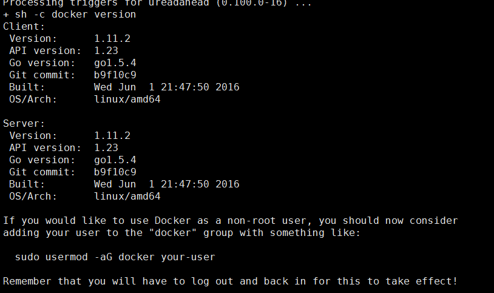
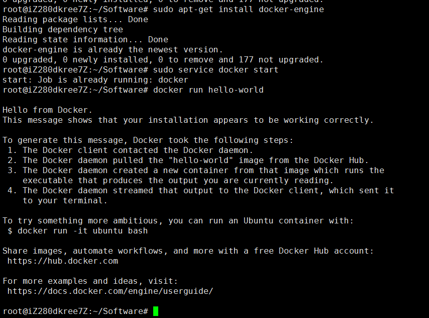
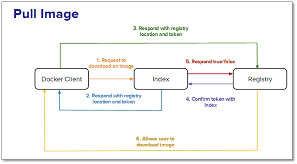
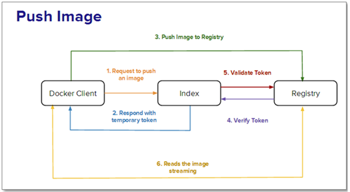
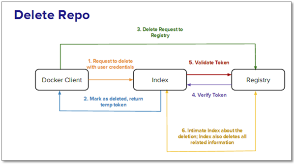

# Docker大全

[TOC]

## Docker 常用命令

* 查看docker版本
```
$docker version
```
* 显示docker系统的信息
```
$docker info
```
* 查看容器中运行着哪些进程
```
$ docker top <CONTAINER ID|IMAGE NAME>
```
* 查看容器的相关信息
```
$ docker inspect  <CONTAINER ID|IMAGE NAME>
```
**注意:containID 和image name 查看的是不一样的**
* 进入运行时的容器
```
$ docker exec -it <CONTAINER ID> /bin/bash
```
* 构建一个容器
```
$ docker build -t dockerfile-jdk-tomcat .
```
* 运行一个容器
```
$ docker run -d -p 8090:8080 dockerfile-jdk-tomcat
```

## Docker Dao 国内Docker 加速器 

```bash
curl -sSL https://get.daocloud.io/daotools/set_mirror.sh | sh -s http://04943e38.m.daocloud.io Copy

该脚本可以将 --registry-mirror 加入到你的 Docker 配置文件 /etc/default/docker 中。适用于 Ubuntu14.04、Debian、CentOS6 、CentOS7、Fedora、Arch Linux、openSUSE Leap 42.1，其他版本可能有细微不同。更多详情请访问文档。
```


##Docker 安装步骤(Ubuntu14.04)

###1 First of all
打开控制台使用 uname -r命令来查看你当前的内核版本。
```bash
$ uname -r 
3.11.0-15-generic
```
**Docker 要求 Ubuntu 系统的内核版本高于 3.10 ，查看本页面的前提条件来验证你的Ubuntu版本是否支持 Docker **


###2 Update package information, ensure that APT works with the https method, and that CA certificates are installed.
```bash
$ sudo apt-get update
$ sudo apt-get install linux-image-generic-lts-trusty
```
###3 Add the new GPG key.
```bash
$ sudo apt-key adv --keyserver hkp://p80.pool.sks-keyservers.net:80 --recv-keys 58118E89F3A912897C070ADBF76221572C52609D
```
###4 check /etc/apt/sources.list.d/docker.list file in your favorite editor.

***(/etc/apt/sources.list.d/目录下的文件是通过sudo add-apt-repository命令安装的第三方源)***

If the file doesn’t exist, create it.Remove any existing entries.Add an entry for your Ubuntu operating system.
* On Ubuntu Precise 12.04 (LTS)
>deb https://apt.dockerproject.org/repo ubuntu-precise main

* On Ubuntu Trusty 14.04 (LTS)
>deb https://apt.dockerproject.org/repo ubuntu-trusty main

* Ubuntu Wily 15.10
>deb https://apt.dockerproject.org/repo ubuntu-wily main

* Ubuntu Xenial 16.04 (LTS)
>deb https://apt.dockerproject.org/repo ubuntu-xenial main

###5 update
```bash
$ sudo apt-get update
```
###6 Purge the old repo if it exists.
```bash
$ sudo apt-get purge lxc-docker
```
###7 Verify that APT is pulling from the right repository.
```bash
$ sudo apt-cache policy docker-engine
```
###8 Install the recommended package.
```bash
$ sudo apt-get install linux-image-extra-$(uname -r)
```
###9 Install Docker.
```bash
$ sudo apt-get install docker-engine
```
###10 Start the docker daemon.
```bash
$ sudo service docker start
```
###11 Verify docker is installed correctly.
```bash
$ docker run hello-world
```


运行结果截图			


###Install



## Docker 安装步骤(Centos7)


```bash
# 安装Docker
[root@localhost ~]# yum install docker
# 安装完成后，使用下面的命令来启动 docker 服务，并将其设置为开机启动：
[root@localhost ~]# service docker start
#测试
[root@localhost ~]# docker run hello-world
[root@localhost ~]# chkconfig docker on
[root@localhost ~]# systemctl enable docker   设置开启启动
```


## Docker 安装步骤(Centos6.5)


### EPEL源安装Docker

Centos5安装

```bash
rpm -ivh http://dl.fedoraproject.org/pub/epel/5/i386/epel-release-5-4.noarch.rpm
rpm -ivh http://dl.fedoraproject.org/pub/epel/5/x86_64/epel-release-5-4.noarch.rpm

```

centos6安装

```bash
rpm -ivh http://dl.fedoraproject.org/pub/epel/6/i386/epel-release-6-8.noarch.rpm
rpm -ivh http://dl.fedoraproject.org/pub/epel/6/x86_64/epel-release-6-8.noarch.rpm

rpm --import /etc/pki/rpm-gpg/RPM-GPG-KEY-EPEL-6
```

```bash
#安装 Fedora EPEL
#epel-release-6-8.noarch.rpm包在发行版的介质里面已经自带了，可以从rpm安装。
[root@localhost ~]# yum install epel-release-6-8.noarch.rpm
#或
[root@localhost ~]# rpm -ivh http://dl.fedoraproject.org/pub/epel/6/x86_64/epel-release-6-8.noarch.rpm
[root@localhost ~]# rpm --import /etc/pki/rpm-gpg/RPM-GPG-KEY-EPEL-6
#实在不行就执行下面的
[root@localhost ~]# yum -y install epel-release
#CentOS 6.5已经是2.6.32-431内核了，所以最好安装这个版本
[root@localhost ~]# yum -y install docker-io
#升级
[root@localhost ~]# yum -y update docker-io

#测试
[root@localhost ~]# docker run hello-world


#查看docker日志	
cat /var/log/docker
```


There are two ways to install Docker Engine. You can [install using the `yum` package manager](https://docs.docker.com/engine/installation/linux/centos/#install-with-yum). Or you can use `curl` with the [`get.docker.com` site](https://docs.docker.com/engine/installation/linux/centos/#install-with-the-script). This second method runs an installation script which also installs via the `yum` package manager.

### Install with yum

1.    Log into your machine as a user with `sudo` or `root` privileges.

2. Make sure your existing packages are up-to-date.

      ```bash
       $ sudo yum update
      ```

3. Add the `yum` repo.

      ```bash
       $ sudo tee /etc/yum.repos.d/docker.repo <<-'EOF'
       [dockerrepo]
       name=Docker Repository
       baseurl=https://yum.dockerproject.org/repo/main/centos/7/
       enabled=1
       gpgcheck=1
       gpgkey=https://yum.dockerproject.org/gpg
       EOF
      ```

4. Install the Docker package.

      ```bash
       $ sudo yum install docker-engine
      ```

5. Enable the service.

      ```bash
       $ sudo systemctl enable docker.service
      ```

6. Start the Docker daemon.

      ```bash
       $ sudo systemctl start docker
      ```

7. Verify `docker` is installed correctly by running a test image in a container.

      ```bash
        $ sudo docker run --rm hello-world

        Unable to find image 'hello-world:latest' locally
        latest: Pulling from library/hello-world
        c04b14da8d14: Pull complete
        Digest: sha256:0256e8a36e2070f7bf2d0b0763dbabdd67798512411de4cdcf9431a1feb60fd9
        Status: Downloaded newer image for hello-world:latest

        Hello from Docker!
        This message shows that your installation appears to be working correctly.

        To generate this message, Docker took the following steps:
      1. The Docker client contacted the Docker daemon.
      2. The Docker daemon pulled the "hello-world" image from the Docker Hub.
      3. The Docker daemon created a new container from that image which runs the
         executable that produces the output you are currently reading.
      4. The Docker daemon streamed that output to the Docker client, which sent it
         to your terminal.
      ```

     To try something more ambitious, you can run an Ubuntu container with:
      $ docker run -it ubuntu bash
    
     Share images, automate workflows, and more with a free Docker Hub account:
      https://hub.docker.com
    
     For more examples and ideas, visit:
      https://docs.docker.com/engine/userguide/
    ​```

If you need to add an HTTP Proxy, set a different directory or partition for the Docker runtime files, or make other customizations, read our Systemd article to learn how to [customize your Systemd Docker daemon options](https://docs.docker.com/engine/admin/systemd/).

### Install with the script

1.  Log into your machine as a user with `sudo` or `root` privileges.

2. Make sure your existing packages are up-to-date.

    ```bash
     $ sudo yum update
    ```

3. Run the Docker installation script.

    ```bash
     $ curl -fsSL https://get.docker.com/ | sh
    ```

     This script adds the `docker.repo` repository and installs Docker.

4. Enable the service.

    ```bash
     $ sudo systemctl enable docker.service
    ```

5. Start the Docker daemon.

    ```bash
     $ sudo systemctl start docker
    ```

6. Verify `docker` is installed correctly by running a test image in a container.

    ```bash
     $ sudo docker run --rm hello-world
    ```

If you need to add an HTTP Proxy, set a different directory or partition for the Docker runtime files, or make other customizations, read our Systemd article to learn how to [customize your Systemd Docker daemon options](https://docs.docker.com/engine/admin/systemd/).

##Docker 组件与元素


Docker有三个组件和三个基本元素，读者可以快速浏览下面这个视频来了解这些组建和元素，以及它们的关系。三个组件分别是：
* Docker Client 是用户界面，它支持用户与Docker Daemon之间通信。
* Docker Daemon运行于主机上，处理服务请求。
* Docker Index是中央registry，支持拥有公有与私有访问权限的Docker容器镜像的备份。
  三个基本要素分别是：
* Docker Containers负责应用程序的运行，包括操作系统、用户添加的文件以及元数据。
* Docker Images是一个只读模板，用来运行Docker容器。
* DockerFile是文件指令集，用来说明如何自动创建Docker镜像。


创建一个名为docker 容器
>sample_job=$(docker run -d busybox /bin/sh -c "while true; do echo Docker;

运行Docker logs命令来查看job的当前状态：
>docker logs $sample_job

名为sample_job的容器，可以使用以下命令来停止
>docker stop $sample_job
>使用以下命令可以重新启动该容器：
>docker restart $sample_job

如果要完全移除容器，需要先将该容器停止，然后才能移除。像这样：
>docker stop $sample_job docker rm $sample_job

将容器的状态保存为镜像，使用以下命令：
>docker commit $sample_job job1

**注意，镜像名称只能取字符[a-z]和数字[0-9]**

现在，你就可以使用以下命令查看所有镜像的列表：
>docker image

在之前的Docker教程中，我们学习过镜像是存储在Docker registry。在registry中的镜像可以使用以下命令查找到：
>docker search (image-name)

查看镜像的历史版本可以执行以下命令：
>docker history (image-name)

最后，使用以下命令将镜像推送到registry：
>docker push (image-name)

**非常重要的一点是，你必须要知道存储库不是根存储库，它应该使用此格式(user)/(repo_name)**


##Dockfile 配置介绍
Dockfile包含了创建镜像所需要的全部指令.基于在DockerFile中的指令,我们可以使用Docker build命令来创建镜像.通过减少镜像和容器的创建过程来简化部署.
 **指令不分大小写,但是,命名约定为全部大写**
所有Dockerfile都必须以FROM命令开始。 FROM命令会指定镜像基于哪个基础镜像创建，接下来的命令也会基于这个基础镜像（译者注：CentOS和Ubuntu有些命令可是不一样的）。FROM命令可以多次使用，表示会创建多个镜像。具体语法如下：
>FROM  (image name) 

 MAINTAINER：设置该镜像的作者。语法如下：
 >MAINTAINER (author name)

RUN：在shell或者exec的环境下执行的命令。RUN指令会在新创建的镜像上添加新的层面，接下来提交的结果用在Dockerfile的下一条指令中。语法如下：
>RUN (command)

ADD：复制文件指令。它有两个参数<source>和<destination>。destination是容器内的路径。source可以是URL或者是启动配置上下文中的一个文件。语法如下
> ADD (src)  (destination)

CMD：提供了容器默认的执行命令。 Dockerfile只允许使用一次CMD指令。 使用多个CMD会抵消之前所有的指令，只有最后一个指令生效。 CMD有三种形式：
>CMD ["executable","param1","param2"]
>CMD["param1","param2"]
>CMD command param1 param2

.EXPOSE：指定容器在运行时监听的端口。语法如下：
>EXPOSE (port)

 ENTRYPOINT：配置给容器一个可执行的命令，这意味着在每次使用镜像创建容器时一个特定的应用程序可以被设置为默认程序。同时也意味着该镜像每次被调用时仅能运行指定的应用。类似于CMD，Docker只允许一个ENTRYPOINT，多个ENTRYPOINT会抵消之前所有的指令，只执行最后的ENTRYPOINT指令。语法如下：
>ENTRYPOINT ["executable","param1","param2"]
>ENTRYPOINT command param1 param2

 WORKDIR：指定RUN、CMD与ENTRYPOINT命令的工作目录。语法如下：
 >WORKDIR /path/to/workdir

ENV：设置环境变量。它们使用键值对，增加运行程序的灵活性。语法如下：
>ENV (key) (value)

 USER：镜像正在运行时设置一个UID。语法如下：
 >USER (uid)

VOLUME：授权访问从容器内到主机上的目录。语法如下
>VOLUME ("/data")

##Docker Registry  私人镜像仓库

###Docker Registry角色
Docker Registry有三个角色，分别是index、registry和registry client。

* 角色1 --Index
  index 负责并维护有关账号,镜像的校验以及公共命名空间的信息.它使用以下组件维护这些信息
  * Web UI
  * 元数据存储
  * 认证服务区
  * 符合话

* 角色 2 --Registry
  egistry是镜像和图表的仓库。然而，它没有一个本地数据库，也不提供用户的身份认证，由S3、云文件和本地文件系统提供数据库支持。此外，它通过Index Auth service的Token方式进行身份认证。Registries可以有不同的类型。现在让我们来分析其中的几中类型：
* Sponsor Registry：第三方的registry，供客户和Docker社区使用。
* Mirror Registry：第三方的registry，只让客户使用。
* Vendor Registry：由发布Docker镜像的供应商提供的registry。
* Private Registry：通过设有防火墙和额外的安全层的私有实体提供的registry。

* 角色 3 --Registry Client
  Docker充当registry客户端来负责维护推送和拉取的任务，以及客户端的授权。

###Docker Registry工作流程详解
####情景A：用户要获取并下载镜像。所涉及的步骤如下：
1 用户发送请求到index来下载镜像。
2 index 发出响应，返回三个相关部分信息：
3 该镜像所处的registry
4 该镜像包括所有层的校验
5 以授权为目的的Token > 注意：当请求header里有X-Docker-Token时才会返回Token。而私人仓库需要基本的身份验证，对于公有仓库这一点不是强制性的。
6 用户通过响应后返回的Token和registry沟通，registry全权负责镜像，它用来存储基本的镜像和继承的层。
7 registry现在要与index证实该token是被授权的。
8 index会发送“true” 或者 “false”给registry，由此判定是否允许用户下载所需要的镜像。



####情景B：用户想要将镜像推送到registry中。其中涉及的步骤如下：
1 用户发送附带证书的请求到index要求分配库名。
2 在认证成功，命名空间可用之后，库名也被分配。
3 index发出响应返回临时的token。镜像连带token，一起被推送到registry中。
4 registry与index证实token被授权，然后在index验证之后开始读取推送流。
5 该index由Docker校验的镜像更新。


####情景C：用户想要从index或registry中删除镜像：
1 index接收来自Docker一个删除库的信号。
2 如果index对库验证成功，它将删除该库，并返回一个临时的token。
3 registry现在接收到带有该token的删除信号。
4 registry与index核实该token，然后删除库以及所有与其相关的信息。
5 Docker现在通知有关删除的index，然后index移除库的所有记录。


####情景D：用户希望在没有index的独立模式中使用registry。
使用没有index的registry，这完全由Docker控制，它最适合于在私有网络中存储镜像。registry运行在一个特殊的模式里，此模式限制了registry与Docker index的通信。所有有关安全性和身份验证的信息需要用户自己注意。

####情景E：用户想要在有index的独立模式中使用registry。
在这种情况下，一个自定义的index会被创建在私有网络里来存储和访问镜像的问题。然而，通知Docker有关定制的index是耗时的。 Docker提供一个有趣的概念chaining registries，从而，实现负载均衡和为具体请求而指定的registry分配。在接下来的Docker教程系列中，我们将讨论如何在上述每个情景中使用Docker Registry API ，以及深入了解Docker Security。


##Docker 安全 (略)

##Docker入门教程（六）另外的15个Docker命令
##Docker 数据管理
* 数据卷 Datavilumes
* 数据卷容器  Data volume containers

###数据卷
数据卷是一个可供一个或多个容器使用的特殊目录，它绕过	UFS，可以提供很多有用的特性：
* 数据卷可以在容器之间共享和重用
* 对数据卷的修改会立马生效
* 对数据卷的更新，不会影响镜像
* 卷会一直存在，直到没有容器使用
  **数据卷的使用，类似于Linux	下对目录或文件进行	mount**


#Docker 常用命令
* 查看docker版本
```bash
$docker version
```
* 显示docker系统的信息
```bash
$docker info
```
* 查看容器中运行着哪些进程
```bash
$ docker top <CONTAINER ID|IMAGE NAME>
```
* 查看容器的相关信息
```bash
$ docker inspect  <CONTAINER ID|IMAGE NAME>
```
**注意:containID 和image name 查看的是不一样的**
* 进入运行时的容器
```bash
$ docker exec -it <CONTAINER ID> /bin/bash
```
* 构建一个容器
```bash
$ docker build -t dockerfile-jdk-tomcat .
```
* 运行一个容器
```bash
$ docker run -d -p 8090:8080 dockerfile-jdk-tomcat
```
### 查看docker信息（version、info）

[plain] view plain copy

*   查看docker版本

```bash
$docker version  
```

*   显示docker系统的信息

```bash
$ docker info
```

### 对image的操作（search、pull、images、rmi、history）

*   检索image

```bash
$docker search image_name  
```

*   下载image

```bash
$docker pull image_name  
```

*   列出镜像列表;

```bash
$docker images  
```

*   删除一个或者多个镜像;

```bash
$docker rmi image_name  
```

*   显示一个镜像的历史;

```bash
$docker history image_name  
```

### 启动容器（run）

Docker容器可以理解为在沙盒中运行的进程。这个沙盒包含了该进程运行所必须的资源，包括文件系统、系统类库、shell 环境等等。但这个沙盒默认是不会运行任何程序的。你需要在沙盒中运行一个进程来启动某一个容器。这个进程是该容器的唯一进程，所以当该进程结束的时候，容器也会完全的停止。


*   在容器中运行"echo"命令，输出"hello word"

```bash
$docker run image_name echo "hello word"  
```

*   交互式进入容器中

```bash
$docker run -i -t image_name /bin/bash  
```

*   在容器中安装新的程序

```bash
$docker run image_name apt-get install -y app_name  
```

>Note：  在执行apt-get 命令的时候，要带上-y参数。如果不指定-y参数的话，apt-get命令会进入交互模式，需要用户输入命令来进行确认，但在docker环境中是无法响应这种交互的。apt-get 命令执行完毕之后，容器就会停止，但对容器的改动不会丢失。

### 查看容器（ps）

*   列出当前所有正在运行的container

```bash
$docker ps  
```

*   列出所有的container

```bash
$docker ps -a  
```

*   列出最近一次启动的container

```bash
$docker ps -l  
```

### 保存对容器的修改（commit）

当你对某一个容器做了修改之后（通过在容器中运行某一个命令），可以把对容器的修改保存下来，这样下次可以从保存后的最新状态运行该容器。

*   保存对容器的修改; 

```bash
$docker commit ID new_image_name 
```

>Note：  image相当于类，Container相当于实例，不过可以动态给实例安装新软件，然后把这个container用commit命令固化成一个image。

### 对容器的操作（rm、stop、start、kill、logs、diff、top、cp、restart、attach）

*   删除所有容器

```bash
$docker rm docker ps -a -q  
```

*   删除单个容器

```bash
$docker rm Name/ID  
```

*   停止、启动、杀死一个容器

```bash
$docker stop Name/ID  
$docker start Name/ID  
$docker kill Name/ID  
```

*   从一个容器中取日志

```bash
$docker logs Name/ID  
```

*   列出一个容器里面被改变的文件或者目录，list列表会显示出三种事件，A 增加的，D 删除的，C 被改变的

```bash
$docker diff Name/ID  
```

*   显示一个运行的容器里面的进程信息

```bash
$docker top Name/ID  
```

*   从容器里面拷贝文件/目录到本地一个路径

```bash
$docker cp Name:/container_path to_path  
$docker cp ID:/container_path to_path  
```

*   重启一个正在运行的容器

```bash
$docker restart Name/ID  
```

*   附加到一个运行的容器上面

```bash
$docker attach ID  
```

>Note： attach命令允许你查看或者影响一个运行的容器。你可以在同一时间attach同一个容器。你也可以从一个容器中脱离出来，是从CTRL-C。

*   保存和加载镜像（save、load）

当需要把一台机器上的镜像迁移到另一台机器的时候，需要保存镜像与加载镜像。

1 保存镜像到一个tar包

```bash
$docker save image_name -o file_path  
#demo
$docker save image_name > /home/save.tar  
```

2 加载一个tar包格式的镜像

```bash
$docker load -i file_path  
#demo
$docker load < /home/save.tar  
```

*    登录registry server（login）

### 登陆registry server

$docker login  

9. 发布image（push）
   [plain] view plain copy
### 发布docker镜像

```bash
$docker push new_image_name  
```


10.  根据Dockerfile 构建出一个容器
    [plain] view plain copy


# docker compose

[curl -Lhttps://github.com/docker/compose/releases/download/1.7.1/docker-compose-`uname-s`-`uname -m` > /usr/local/bin/docker-compose](undefined)


