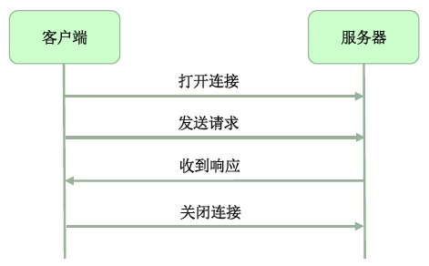

# Java网络教程

Java提供了非常易用的网络API，调用这些API我们可以很方便的通过建立TCP/IP或UDP套接字，在网络之间进行相互通信，其中TCP要比UDP更加常用，但在本教程中我们对这两种方式都有说明。

在网站上还有其他三个与Java网络相关的教程，如下：

1.[Java IO 教程](http://tutorials.jenkov.com/java-io/index.html)

2.[Java NIO 教程](http://ifeve.com/java-nio-all/)

3.[Java服务器多线程教程](http://tutorials.jenkov.com/java-multithreaded-servers/index.html) （参与翻译可以联系我们）

尽管Java网络API允许我们通过套接字（Socket）打开或关闭网络连接，但所有的网络通信均是基于Java IO类 [InputStream](http://tutorials.jenkov.com/java-io/inputstream.html)和[OutputStream](http://tutorials.jenkov.com/java-io/outputstream.html)实现的。

此外，我们还可以使用Java NIO API中相关的网络类，用法与Java网络API基本类似，Java NIO API可以以非阻塞模式工作，在某些特定的场景中使用非阻塞模式可以获得较大的性能提升。

## Java TCP网络基础

通常情况下，客户端打开一个连接到服务器端的TCP/IP连接，然后客户端开始与服务器之间通信，当通信结束后客户端关闭连接，过程如下图所示：

客户端通过一个已打开的连接可以发送不止一个请求。事实上在服务器处于接收状态下，客户端可以发送尽可能多的数据，服务器也可以主动关闭连接。

## Java中Socket类和ServerSocket类

当客户端想要打开一个连接到服务器的TCP/IP连接时，就要使用到[Java Socket](http://tutorials.jenkov.com/java-networking/sockets.html)类。socket类只需要被告知连接的IP地址和TCP端口，其余的都有Java实现。

假如我们想要打开一个监听服务，来监听客户端连接某些指定TCP端口的连接，那就需要使用[Java ServerSocket](http://tutorials.jenkov.com/java-networking/server-sockets.html)类。当客户端通过Socket连接服务器端的ServerSocket监听时，服务器端会指定这个连接的一个Socket，此时客户端与服务器端间的通信就变成Socket与Socket之间的通信。

关于Socket类和ServerSocket类会在后面的文章中有详细的介绍。

## Java UDP网络基础

UDP的工作方式与TCP相比略有不同。使用UDP通信时，在客户端与服务器之间并没有建立连接的概念，客户端发送到服务器的数据，服务器可能（也可能并没有）收到这些数据，而且客户端也并不知道这些数据是否被服务器成功接收。当服务器向客户端发送数据时也是如此。

正因为是不可靠的数据传输，UDP相比与TCP来说少了很多的协议开销。

在某些场景中，使用无连接的UDP要优于TCP，这些在文章Java UDP [DatagramSocket](http://tutorials.jenkov.com/java-networking/udp-datagram-sockets.html)类介绍中会有更多介绍。