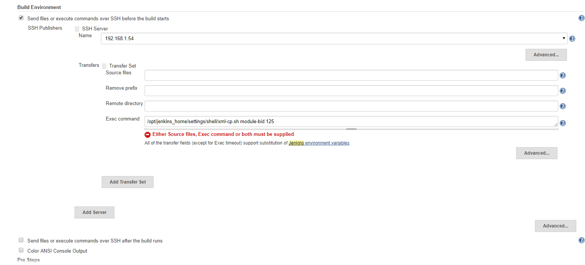
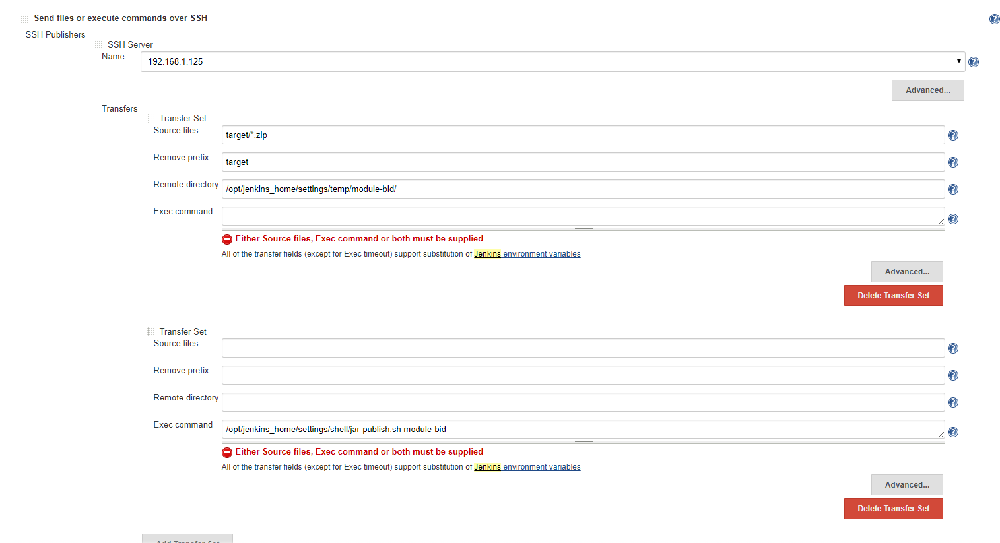
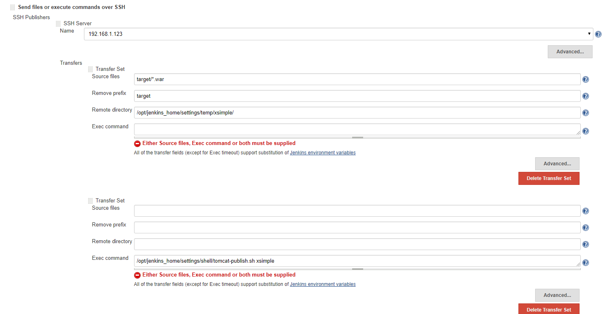
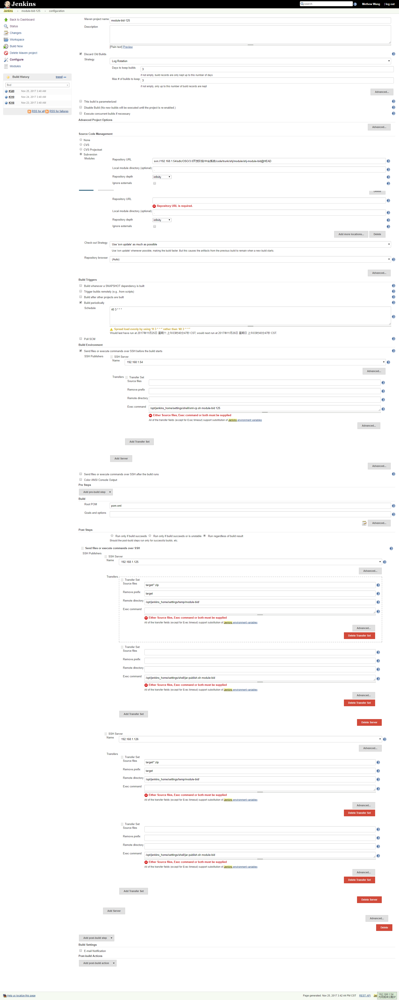
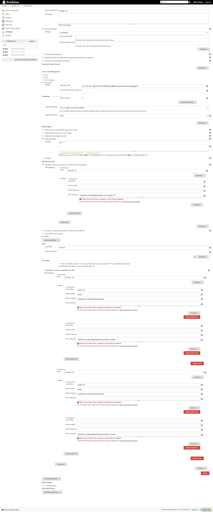

# Jenkins+Maven+Docker 全自动化发布部署应用(Centos7)

[TOC]

## 基础

###查看IP

```bash
[root@localhost ~]# ip addr
1: lo: <LOOPBACK,UP,LOWER_UP> mtu 65536 qdisc noqueue state UNKNOWN qlen 1
    link/loopback 00:00:00:00:00:00 brd 00:00:00:00:00:00
    inet 127.0.0.1/8 scope host lo
       valid_lft forever preferred_lft forever
    inet6 ::1/128 scope host 
       valid_lft forever preferred_lft forever
2: ens33: <BROADCAST,MULTICAST,UP,LOWER_UP> mtu 1500 qdisc pfifo_fast state UP qlen 1000
    link/ether 00:0c:29:79:12:fc brd ff:ff:ff:ff:ff:ff
    inet 192.168.19.129/24 brd 192.168.19.255 scope global dynamic ens33
       valid_lft 1657sec preferred_lft 1657sec
    inet6 fe80::ef49:ef98:6678:b28/64 scope link 
       valid_lft forever preferred_lft forever
[root@localhost ~]# 

```

### 切换yum源为阿里源

```bash
wget -O /etc/yum.repos.d/CentOS-Base.repo http://mirrors.aliyun.com/repo/Centos-7.repo
```


-------------

## Docker 安装

```bash
# 安装Docker
[root@localhost ~]# yum install docker
# 安装完成后，使用下面的命令来启动 docker 服务，并将其设置为开机启动：
[root@localhost ~]# service docker start
#测试
[root@localhost ~]# docker run hello-world

[root@localhost ~]# chkconfig docker on
[root@localhost ~]# systemctl enable docker   设置开启启动
```

### 使用Alibaba dockert加速

```bash
[root@localhost ~]# sudo mkdir -p /etc/docker
[root@localhost ~]# sudo tee /etc/docker/daemon.json <<-'EOF'
{
  "registry-mirrors": ["https://bdy6coc5.mirror.aliyuncs.com"]
}
EOF
[root@localhost ~]# sudo systemctl daemon-reload
[root@localhost ~]# sudo systemctl restart docker
```

###Docker 常用命令

####docker exec进入容器

```bash
$ docker exec -it <CONTAINER ID> /bin/bash
```

####Docker 导入,导出

保存镜像到一个tar包

```bash
$docker save image_name -o file_path  
#demo
$docker save image_name > /home/save.tar  
```

2 加载一个tar包格式的镜像

```bash
$docker load -i file_path  
#demo
$docker load < /home/save.tar  
```

####查看Docker 日志

```bash
docker logs 84dab279a03d
#或者
docker logs -f -t --since="2017-05-31" --tail=10 84dab279a03d
--since : 此参数指定了输出日志开始日期，即只输出指定日期之后的日志。
-f : 查看实时日志
-t : 查看日志产生的日期
-tail=10 : 查看最后的10条日志。
84dab279a03d : 容器名称
```


## Docker Compose 安装

###curl安装[非常慢]

https://github.com/docker/compose/releases 官网下载

```bash


[root@shj-134 ~]#  curl -L https://github.com/docker/compose/releases/download/1.14.0-rc2/docker-compose-`uname -s`-`uname -m` > /usr/local/bin/docker-compose
[root@shj-134 ~]#  chmod +x /usr/local/bin/docker-compose
[root@localhost ~]# docker-compose --version
docker-compose version 1.18.0dev, build ed841e2
[root@localhost ~]# 
```

> 注意：如果你在安装的时候出现了 “Permission denied” 的错误信息，这说明你的 `/usr/local/bin` 目录是不可写的，你需要使用超级用户来安装。运行 `sudo -i` , 然后运行上边的两个命令，然后 `exit` 退出。

###pip安装[版本可能比较旧]

Compose 适用于 OS X 和 64位的Linux 。 如果你使用其他平台，你可以安装一个 Compose 的 Python 包来完成安装。**[使用pip安装，版本可能比较旧]**

```bash
# Ubunut
[root@shj-134 ~]#  pip install -U docker-compose

# Centos
[root@shj-134 ~]#  yum install wget
[root@shj-134 ~]#  wget https://bootstrap.pypa.io/get-pip.py
[root@shj-134 ~]#  python get-pip.py
[root@shj-134 ~]#  pip install -U docker-compose
[root@shj-134 ~]#  chmod +x /usr/local/bin/docker-compose
[root@shj-134 ~]# docker-compose --version
docker-compose version: 1.3.1
CPython version: 2.7.9
OpenSSL version: OpenSSL 1.0.1e 11 Feb 2013
[root@shj-134 ~]# 

pip uninstall docker-compose  # 卸载
```

###官方安装

https://dl.bintray.com/docker-compose/master/

```bash
[root@shj-134 ~]#  wget https://dl.bintray.com/docker-compose/master/docker-compose-Linux-x86_64
[root@shj-134 ~]#  mv docker-compose-Linux-x86_64  /usr/local/bin/docker-compose
[root@shj-134 ~]#  chmod +x /usr/local/bin/docker-compose
[root@localhost ~]# docker-compose --version
docker-compose version 1.18.0dev, build ed841e2
[root@localhost ~]# 

```


到这里安装就结束了；Compose已经安装完成。你可以使用 `docker-compose --version` 来进行测试 。

###构建容器命令

```bash

docker-compose -f /opt/oso.yml up -d jenkins2
```

## Java 安装

```bash
rpm -ivh *.rpm
```

##Maven 安装

```bash
[root@shj-134]# wget http://mirrors.hust.edu.cn/apache/maven/maven-3/3.5.2/binaries/apache-maven-3.5.2-bin.tar.gz

[root@shj-134]# tar -zxvf apache-maven-3.5.2-bin.tar.gz -C /opt/ # 解压到opt目录

[root@shj-134]# mv apache-maven-3.5.2-bin maven
```


```xml
[root@shj-134]# cd apache-maven-3.5.2
[root@shj-134 apache-maven-3.5.2]# vim conf/settings.xml 
#----------------------------------
<mirror>
 <id>alimaven</id>
 <name>aliyun maven</name>
 <url>http://maven.aliyun.com/nexus/content/groups/public/</url>
 <mirrorOf>central</mirrorOf>        
</mirror>
#----------------------------------
```

### Maven 项目pom.xml配置

使用assembly 自定义打包(assembly.xml和pom.xml在同一级目录)

pom.xml

```xml

    <build>
        <finalName>xframework</finalName>
		<plugins>
	        <plugin>
	            <groupId>org.apache.maven.plugins</groupId>
	            <artifactId>maven-assembly-plugin</artifactId>
	            <configuration>
	                <descriptors>
	                    <descriptor>assembly.xml</descriptor>
	                </descriptors>
	            </configuration>
	            <executions>
	                <execution>
	                    <id>make-assembly</id>
	                    <phase>package</phase>
	                    <goals>
	                        <goal>single</goal>
	                    </goals>
	                </execution>
	            </executions>
	        </plugin>
		
	    </plugins>
    </build>
```

assembly.xml

```xml
<assembly xmlns="http://maven.apache.org/plugins/maven-assembly-plugin/assembly/1.1.0"

          xmlns:xsi="http://www.w3.org/2001/XMLSchema-instance"

          xsi:schemaLocation="http://maven.apache.org/plugins/maven-assembly-plugin/assembly/1.1.0 http://maven.apache.org/xsd/assembly-1.1.0.xsd">
    <formats>
        <format>zip</format>
    </formats>
    <fileSets>
        <fileSet>
            <directory>${project.basedir}</directory>
            <outputDirectory>/</outputDirectory>
            <includes>
                <include>README*</include>
                <include>LICENSE*</include>
                <include>NOTICE*</include>
            </includes>
        </fileSet>
        <fileSet>
            <directory>${project.basedir}/bin</directory>
            <outputDirectory>/</outputDirectory>
        </fileSet>
        <fileSet>
            <directory>${project.build.directory}/</directory>
            <outputDirectory>/</outputDirectory>
            <includes>
                <include>*.jar</include>
            </includes>
        </fileSet>
    </fileSets>
    <dependencySets>
        <dependencySet>
            <outputDirectory>/lib</outputDirectory>
            <useProjectArtifact>false</useProjectArtifact>
            <scope>runtime</scope>
        </dependencySet>
    </dependencySets>
</assembly>
```


##jenkins 安装

###直接安装

```bash
docker pull jenkins/jenkins:lts

docker run -d --name jenkins -p 8080:8080 -p 50000:50000 -v /opt/jenkins_home:/var/jenkins_home -v /opt/maven:/usr/local/maven -v /usr/java/jdk1.7.0_79/:/usr/local/jdk jenkins


-v后面就是我将宿主机的安装路劲映射到镜像中，这样在jenkins中就可以配置了。
```

### Docker Compose

```bash
[root@localhost soft]# vim oso.yml
#-----------------------------------
jenkins_lts:
   image: jenkins/jenkins:lts
   privileged: true
   volumes: 
    -  /opt/jenkins_home:/var/jenkins_home
    -  /opt/maven:/opt/maven
   ports:
    - "8088:8080"
    - "5000:5000"
#-----------------------------------

#拉取容器
[root@localhost soft]# docker-compose -f /opt/oso.yml up -d jenkins_lts
#启动容器
[root@localhost soft]# docker start 84dab279a03d
#查看日志
[root@localhost opt]# docker logs 84dab279a03d
```

###权限错误

```bash
[root@localhost opt]# docker logs -f -t --since="2017-05-31" --tail=10 84dab279a03d
2017-11-25T06:51:08.916644000Z Can not write to /var/jenkins_home/copy_reference_file.log. Wrong volume permissions?
2017-11-25T06:51:08.916958000Z touch: cannot touch '/var/jenkins_home/copy_reference_file.log': Permission denied
2017-11-25T06:52:22.097460000Z Can not write to /var/jenkins_home/copy_reference_file.log. Wrong volume permissions?
2017-11-25T06:52:22.097762000Z touch: cannot touch '/var/jenkins_home/copy_reference_file.log': Permission denied

```

[解决办法]目录没有权限

```bash
sudo chown -R 1000 /opt/jenkins_home
```

### 目录结构(/opt)

```bash
[root@localhost opt]# ll
total 8
drwxr-xr-x. 13 1000 root 4096 Nov 25 14:57 jenkins_home
drwxr-xr-x.  6 root root   99 Nov 25 14:31 maven
-rw-r--r--.  1 root root  373 Nov 25 14:47 oso.yml
[root@localhost opt]# 
```

###访问192.168.19.129:8088完成配置

慢一点,因为admin密码会一闪而过

### 找回密码问题

 这个问题在使用2.x时遇到的比较多，因为2.x默认是需要登录的，在安装时就设置了管理员密码，如果忘记密码将无法登录。在Jenkins不提供找回密码功能的情况下，可以通过修改配置文件的方式解决这个问题。

首先，修改${JENKINS_HOME}/users/admin/config.xml中的<passwordHash>标签的值

```bash
#jbcrypt:$2a$10$DdaWzN64JgUtLdvxWIflcuQu2fgrrMSAMabF5TSrGK5nXitqK9ZMS
密码111111     #jbcrypt:$2a$10$tfywiyBGpHNtP9nRuZMfjOvKsRPF/umvU.2ZD5mmkVsEx9bXQkZri
 密码123456
  
```

### 必备插件

```bash
Publish Over SSH Plugin
Maven
Subversion
```


### 配置文件复制脚本(xml-cp.sh)

为了避免本地的配置文件冲突,打包之前把生成的配置文件覆盖到项目下,然后才打包

```bash
FROM=/opt/jenkins_home/settings/config/$1/$2
TO=/opt/jenkins_home/workspace/$1-$2/src/main/resources/
echo FROM $FROM TO $TO
cp -r  $FROM/* $TO


```

使用方式

```bash
/opt/jenkins_home/settings/shell/xml-cp.sh module-bid 125
```



### 自动部署jar包到服务器并启动(jar-publish.sh)

注意:这个对Maven打包有要求,均打包成zip格式

```bash
if [ $# -lt 1 ]
then
echo PARAMETER IS MISSING : PROJECT__NAME
exit
fi
#define variable
JENKINS_FOLDER=/opt/jenkins_home/settings
DATE_STR=`date +%Y%m%d-%H%M%S`
BACKUP_FOLDER=$JENKINS_FOLDER/backup/$1/$DATE_STR/
PROJECT_FOLDER=/opt/service/$1
#backup
#echo EXECUTE BACKUP! BACKUP FOLDER : $BACKUP_FOLDER
#if [ ! -d $BACKUP_FOLDER ]
#then
#mkdir $BACKUP_FOLDER
#fi
#delete original files
#mv $PROJECT_FOLDER/*.zip $BACKUP_FOLDER
rm -rf $PROJECT_FOLDER/*
#copy new files
echo COPY NEW FILE TO $PROJECT_FOLDER...
mv $JENKINS_FOLDER/temp/$1/*.zip $PROJECT_FOLDER/
cd $PROJECT_FOLDER/
unzip *$1*.zip
#kill original process
ID=`ps -ef | grep java | grep $1 | grep -v grep | awk '{print $2}'`
echo PROCESS_NAME : $1, PROCESS_ID : $ID
kill -9 $ID
echo PROCESS HAS BEEN KILLED!
#start new process
echo START PROCESS...
cd *$1*/
sh ./bin/start.sh
#nohup java -Xms512M -Xmx1024M -XX:PermSize=128M -XX:MaxPermSize=256M -jar $1.jar > output 2>&1 &
str=$"/n"
sstr=$(echo -e $str)
echo "$sstr"
echo MISSION ACCOMPLISH!
exit

```

使用方式

````bash
/opt/jenkins_home/settings/shell/jar-publish.sh module-bid
````



### 自动部署应用到tomcat脚本(tomcat-publish.sh)

```bash
if [ $# -lt 1 ]
then
echo PARAM IS MISSING...
exit
fi
#define variable
PROJECT_NAME=$1
JENKINS_FOLDER=/opt/jenkins_home/settings
DATE_STR=`date +%Y%m%d-%H%M%S`
BACKUP_FOLDER=$JENKINS_FOLDER/backup/$PROJECT_NAME/$DATE_STR/
TEMP_FOLDER=$JENKINS_FOLDER/temp/$PROJECT_NAME/
TOMCAT_FOLDER=/opt/web/tomcat.$PROJECT_NAME
TARGET_FOLDER=$TOMCAT_FOLDER/webapps/$PROJECT_NAME/
#CONFIG_FOLDER=$JENKINS_FOLDER/config/$PROJECT_NAME/$2
#kill process
#ID=`ps -ef | grep java | grep $PROJECT_NAME | grep -v grep | awk '{print $2}'`
#echo PROCESS_NAME : $PROJECT_NAME, PROCESS_ID : $ID
#kill -9 $ID
#echo PROCESS HAS BEEN KILLED!
#backup
#echo EXECUTE BACKUP... BACKUP FOLDER : $BACKUP_FOLDER
#if [ ! -d $BACKUP_FOLDER ]
#then
#mkdir $BACKUP_FOLDER
#fi
#cp -r $TARGET_FOLDER $BACKUP_FOLDER
#unzip(delete useless jar)
echo UNZIP...
cd $TEMP_FOLDER
unzip *.war
rm -rf *.war
rm -rf WEB-INF/lib/spring-boot-starter-tomcat*.jar
rm -rf WEB-INF/lib/tomcat-embed*.jar
#rsync copy
echo RSYNC COPY...
rsync -av -rf '+ */' $TEMP_FOLDER $TARGET_FOLDER
#kill process
ID=`ps -ef | grep java | grep tomcat.$PROJECT_NAME | grep -v grep | awk '{print $2}'`
echo PROCESS_NAME : $PROJECT_NAME, PROCESS_ID : $ID
#kill -9 $ID
#echo PROCESS HAS BEEN KILLED!
#delete temp files
rm -rf *
#start tomcat
#echo START TOMCAT...
#sh $TOMCAT_FOLDER/bin/startup.sh
echo MISSION ACCOMPLISH!


```

使用方式

```bash
/opt/jenkins_home/settings/shell/tomcat-publish.sh xsimple
```




在jenkins镜像通过ssh连接到宿主机以后，会发现好多命令都执行不了了，这个问题纠结了我好久，后来查资料发现，原来没有了环境变量，因此，在执行ssh远程脚本时，需要首先采用：

```bash
export PATH="/bin:/usr/local/sbin:/usr/local/bin..."
```

## 附录

### Jar 发布完整配置



### war发布完整配置




