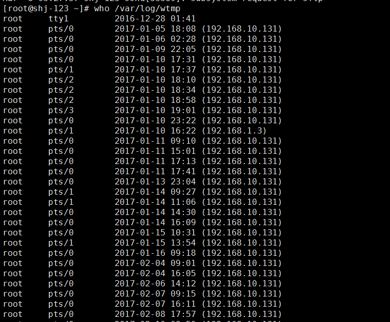

# Linux 常用命令

## 常用软件安装

```bash
yum install vim
yum install vim-enhanced 
# VIM 自身对编辑相当大的文件支持不太好，因为它会一下子把整个文件都加载进内存。例如，用 VIM 装载 1G　大小的文件，它就会占很多内存和交换空间，

yum install joe		#打开大文件并编辑,占用内存小,打开慢,
#JOE的内存消耗令人印象深刻。加载并编辑一个1GB的文本文件，只花费47MB的物理内存。

yum install glogg   #打开大文件但是不编辑,打开快
#我花了大约 12 秒就打开了一个 1G 的日志文件
#从装载文件来跟 VIM 对比， glogg　显得更轻量级，在加载完一个 1G 的日志文件后，它仅仅只使用了 83M 的物理内存。
```

## 程序后台运行

```bash
 nohup java -jar module-etl.jar > output &
  nohup java -Xmx8024M -Xms8024M -jar minecraft_server.1.12.jar > output &
```

## 查看系统版本

```sh
cat /etc/redhat-release
```

## 创建连续的文件夹

```bash
mkdir -p /data/site/test.php.com/
```

## 批量创建目录

```bash
[root@own-server home]# mkdir -p data/{3306,3307,3308}/data
[root@own-server home]# tree data/
data/
├── 3306
│   └── data
├── 3307
│   └── data
└── 3308
    └── data

6 directories, 0 files
```

## 查找文件并显示文件大小

```bash
find / -name '*.log'  -exec ls -lh {} \;

```

## 文件夹下的文件让文件按大小

```bash
方法一：
# ls -lhSl 长格式显示，h human readable模式，大小单位为M,G等易读格式，S size按大小排序。
方法二：
# du -h * | sort -n

```


##查找大于指定大小的文件：

```
find . -type f -size +800M
find / -type f -size +10G
```

## 查看文件夹大小

```bash

du -h --max-depth=1

du -hs
du -ah user  #列出user目录及其子目录下所有目录和文件的大小：
du -h –exclude='*xyz*' #列出当前目录中的目录名不包括xyz字符串的目录的大小：
du -h /boot  #显示目录的总大小及目录树中各文件夹的大小，并以较好的单位表示
du -sh –max-depth=1 #查看当前目录下所有一级子目录文件夹大小
du -h -max-depth=1 |sort #查看当前目录下所有一级子目录文件夹大小 并排序

du -k /home/linux #要通过以1024字节为单位显示一个目录树及其每个子树的磁盘使用情况,这在/home/linux目录及其每个子目录中显示了 1024 字节磁盘块数。
du -m /home/linux  #以MB为单位显示一个目录树及其每个子树的磁盘使用情况,这在/home/linux目录及其每个子目录中显示了 MB 磁盘块数。
du -g /home/linux  # 以GB为单位显示一个目录树及其每个子树的磁盘使用情况


-a: 显示目录中个别文件的大小;
-b: 显示目录或文件大小时，以byte为单位;
-c: 除了显示个别目录或文件的大小外，同时也显示所有目录或文件的总和;
-D: 显示指定符号连接的源文件大小;
-h: 以K，M，G为单位，提高信息的可读性;
-H: 与-h参数相同，但是K，M，G是以1000为换算单位;
-k: 以1024 bytes为单位;
-l: 重复计算硬链接文件;
-L<符号连接>: 显示选项中所指定符号链接(软链接)的源文件大小;
-m: 以1MB为单位;
-s: 显示总计大小;
-S: 显示个别目录的大小时，并不含其子目录的大小;
-x: 以一开始处理时的文件系统为准，若遇上其它不同的文件系统目录则略过;
–exclude=<目录或文件>: 略过指定的目录或文件;
–max-depth=<目录层数>: 超过指定层数的目录后，予以忽略;
```

## 统计文件夹里面文件个数

```bash
# 统计当前文件夹下文件的个数
ls -l |grep "^-"|wc -l
# 统计当前文件夹下目录的个数

ls -l |grep "^d"|wc -l
 
# 统计当前文件夹下文件的个数，包括子文件夹里的 

ls -lR|grep "^-"|wc -l

# 统计文件夹下目录的个数，包括子文件夹里的
ls -lR|grep "^d"|wc -l
```


## 查看硬件配置

```bash
   fdisk -l   #查看磁盘分区
   cat /proc/partitions
```

查看系统登陆信息

```bash
more /var/log/secure
who /var/log/wtmp

#查看某个账号的历史
cat /home/username/.bash_history
```



## 软连接

 ln -s /data/data/report/ ./

## 查看端口被哪个进程占用

```bash
[root@shj-ftp01 nginx]# netstat -nltp | grep mysqld
#88请换为你的apache需要的端口，如：80
[root@shj-ftp01 nginx]# netstat -lnp|grep 88
tcp        0      0 0.0.0.0:8088                0.0.0.0:*                   LISTEN      2342/nginx          
[root@shj-ftp01 nginx]# ps 2342
   PID TTY      STAT   TIME COMMAND
  2342 ?        Ss     0:00 nginx: master process /opt/nginx/sbin/nginx
```


## 批量kill 进程

```bash
ps -ef | grep nginx| awk {'print $2'} | xargs kill -9 
或者
ps -ef|grep LOCAL=NO|grep -v grep|cut -c 9-15|xargs kill -9 

管道符“|”用来隔开两个命令，管道符左边命令的输出会作为管道符右边命令的输入。下面说说用管道符联接起来的 
几个命令： 
“ps - ef”是Red Hat 里查看所有进程的命令。这时检索出的进程将作为下一条命令“grep LOCAL=NO”的输入。 
“grep LOCAL=NO”的输出结果是，所有含有关键字“LOCAL=NO”的进程，这是Oracle数据库中远程连接进程的共同特点。 
“grep -v grep”是在列出的进程中去除含有关键字“grep”的进程。 
“cut -c 9-15”是截取输入行的第9个字符到第15个字符，而这正好是进程号PID。 
“xargs kill -9”中的xargs命令是用来把前面命令的输出结果（PID）作为“kill -9”命令的参数，并执行该令。 
“kill -9”会强行杀掉指定进程，这样就成功清除了oracle的所有远程连接进程。其它类似的任务，只需要修改“grep LOCAL=NO”中的关键字部分就可以了。 
```

## Htop

```bash
 RHEL/CentOS 安装
可以通过 yum install htop 来安装它，但前提是要添加epel 的yum源，具体请参考 CentOS yum 源的配置与使用。
# rpm -ivh http://download.fedoraproject.org/pub/epel/5/i386/epel-release-5-4.noarch.rpm 
# rpm --import /etc/pki/rpm-gpg/RPM-GPG-KEY-EPEL        //导入key 
# yum install htop

#-------------------------------------------------------
PID ：表示进程号
USER ：发起该进程的用户名
PRI ：进程优先级
NI ： nice 值
VIRT ：进程需要的虚拟内存
RES ：常驻内存，也就是物理内存
SHR ：共享内存
S ：进程的运行状况： R 表示正在运行， S 表示休眠， Z 表示僵死状态
CPU% ：占用的 CPU 使用率
MEM% ：物理内存使用率
TIME% ：占用 CPU 的累计时长
Command ：进程启动的启动命令名称即路径
#-------------------------------------------------------

三、htop 参数
键入htop 命令，打开htop。
# htop
上面左上角显示CPU、内存、交换区的使用情况，右边显示任务、负载、开机时间，下面就是进程实时状况。
下面是 F1~F10 的功能和对应的字母快捷键。
Shortcut Key	Function Key	Description	中文说明
h, ?	F1	Invoke htop Help	查看htop使用说明
S	F2	Htop Setup Menu	htop 设定
/	F3	Search for a Process	搜索进程
\	F4	Incremental process filtering	增量进程过滤器
t	F5	Tree View	显示树形结构
<, >	F6	Sort by a column	选择排序方式
[	F7	Nice - (change priority)	可减少nice值，这样就可以提高对应进程的优先级
]	F8	Nice + (change priority)	可增加nice值，这样就可以降低对应进程的优先级
k	F9	Kill a Process	可对进程传递信号
q	F10	Quit htop	结束htop
命令行选项（COMMAND-LINE OPTIONS）
-C --no-color　　　　 　　 使用一个单色的配色方案
-d --delay=DELAY　　　　 设置延迟更新时间，单位秒
-h --help　　　　　　  　　 显示htop 命令帮助信息
-u --user=USERNAME　　  只显示一个给定的用户的过程
-p --pid=PID,PID…　　　    只显示给定的PIDs
-s --sort-key COLUMN　    依此列来排序
-v –version　　　　　　　   显示版本信息
交互式命令（INTERACTIVE COMMANDS）
上下键或PgUP, PgDn 选定想要的进程，左右键或Home, End 移动字段，当然也可以直接用鼠标选定进程；
Space    标记/取消标记一个进程。命令可以作用于多个进程，例如 "kill"，将应用于所有已标记的进程
U    取消标记所有进程
s    选择某一进程，按s:用strace追踪进程的系统调用
l    显示进程打开的文件: 如果安装了lsof，按此键可以显示进程所打开的文件
I    倒转排序顺序，如果排序是正序的，则反转成倒序的，反之亦然
+, -    When in tree view mode, expand or collapse subtree. When a subtree is collapsed a "+" sign shows to the left of the process name.
a (在有多处理器的机器上)    设置 CPU affinity: 标记一个进程允许使用哪些CPU
u    显示特定用户进程
M    按Memory 使用排序
P    按CPU 使用排序
T    按Time+ 使用排序
F    跟踪进程: 如果排序顺序引起选定的进程在列表上到处移动，让选定条跟随该进程。这对监视一个进程非常有用：通过这种方式，你可以让一个进程在屏幕上一直可见。使用方向键会停止该功能。
K    显示/隐藏内核线程
H    显示/隐藏用户线程
Ctrl-L    刷新
Numbers    PID 查找: 输入PID，光标将移动到相应的进程上
```

## grep 命令

```bash
grep -A1 keyword filename
找出filename中带有keyword的行，输出中除显示该行外，还显示之后的一行(After 1)
grep -B1 keyword filename
找出filename中带有keyword的行，输出中除显示该行外，还显示之前的一行(Before 1)

##或者用管道符号
mysqlbinlog --start-datetime='2017-03-31 00:00:00' --stop-datetime='2017-03-31 09:00:00' mysql-bin.000003 |grep 'bid_budget' -B6 -A6 >>/home/bid_budget_mater_addition.sql
```

## RPM 命令介绍


```bash
yum list |grep Term |grep ReadKey

perl-TermReadKey.x86_64
```


1）查询系统中已经安装的软件

```bash
rpm -qa 
```

 2）查询一个已经安装的文件属于哪个软件包；

```bash
rpm -qf 文件名的绝对路径
```

3）查询已安装软件包都安装到何处；

**软件名定义是:rpm包去除平台信息和后缀后的信息**

```bash
rpm -ql 软件名
```

4）查询一个已安装软件包的信息

```bash
rpm  -qi 软件名
```

5）查看一下已安装软件的配置文件；

```bash
rpm -qc 软件名
```

6）查看一个已经安装软件的文档安装位置：

```bash
rpm -qd 软件名
```

7）查看一下已安装软件所依赖的软件包及文件；

```bash
rpm -qR 软件名
```

**对于未安装的软件包信息查询**

1）查看一个软件包的用途、版本等信息；

```bash
rpm -qpi rpm文件
```

2）查看一件软件包所包含的文件；

```bash
rpm -qpl rpm文件
```

3）查看软件包的文档所在的位置；

```bash
rpm -qpd rpm文件
```

4）查看一个软件包的配置文件；

```bash
rpm -qpc rpm文件
```

5）查看一个软件包的依赖关系

```bash
rpm -qpR rpm文件
```

安装或者升级一个rpm包

```bash
rpm -ivh rpm文件【安装】 rpm -Uvh rpm文件【更新】
```

2)删除一个rpm 包

```bash
rpm -e 软件名
rpm -e --nodeps jdk
--nodeps：不考慮相依屬性的關係，給他強制的安裝下去；
--force当然是强制了
```


## tcpdump 抓包工具监控端口

```bash
##监控后台运行并输出到日志
nohup tcpdump -i em1 -s 0 -l -w - dst  port 8082 | strings > monitor8082.log 2>&1 &

tcpdump -i eth1 -s 0 -l -w - dst  port 3306 | strings


#对8082端口进行抓包,并输出到a.cap
tcpdump -tttt -i em1 -s 0 -w a.cap dst port 8082
nohup tcpdump -tttt -i em1 -s 0 -w a.cap dst port 8082 > monitor8082.log 2>&1 &
#显示分析抓包日志,有时间
tcpdump -A -r a.cap 

-A 以ASCII格式打印出所有分组，并将链路层的头最小化。
-c 在收到指定的数量的分组后，tcpdump就会停止。
-C 在将一个原始分组写入文件之前，检查文件当前的大小是否超过了参数file_size 中指定的大小。如果超过了指定大小，则关闭当前文件，然后在打开一个新的文件。参数 file_size 的单位是兆字节（是1,000,000字节，而不是1,048,576字节）。
-d 将匹配信息包的代码以人们能够理解的汇编格式给出。
-dd 将匹配信息包的代码以c语言程序段的格式给出。
-ddd 将匹配信息包的代码以十进制的形式给出。
-D 打印出系统中所有可以用tcpdump截包的网络接口。
-e 在输出行打印出数据链路层的头部信息。
-E 用spi@ipaddr algo:secret解密那些以addr作为地址，并且包含了安全参数索引值spi的IPsec ESP分组。
-f 将外部的Internet地址以数字的形式打印出来。
-F 从指定的文件中读取表达式，忽略命令行中给出的表达式。
-i 指定监听的网络接口。
-l 使标准输出变为缓冲行形式，可以把数据导出到文件。
-L 列出网络接口的已知数据链路。
-m 从文件module中导入SMI MIB模块定义。该参数可以被使用多次，以导入多个MIB模块。
-M 如果tcp报文中存在TCP-MD5选项，则需要用secret作为共享的验证码用于验证TCP-MD5选选项摘要（详情可参考RFC 2385）。
-b 在数据-链路层上选择协议，包括ip、arp、rarp、ipx都是这一层的。
-n 不把网络地址转换成名字。
-nn 不进行端口名称的转换。
-N 不输出主机名中的域名部分。例如，‘nic.ddn.mil‘只输出’nic‘。
-t 在输出的每一行不打印时间戳。
-O 不运行分组分组匹配（packet-matching）代码优化程序。
-P 不将网络接口设置成混杂模式。
-q 快速输出。只输出较少的协议信息。
-r 从指定的文件中读取包(这些包一般通过-w选项产生)。
-S 将tcp的序列号以绝对值形式输出，而不是相对值。
-s 从每个分组中读取最开始的snaplen个字节，而不是默认的68个字节。
-T 将监听到的包直接解释为指定的类型的报文，常见的类型有rpc远程过程调用）和snmp（简单网络管理协议；）。
-t 不在每一行中输出时间戳。
-tt 在每一行中输出非格式化的时间戳。
-ttt 输出本行和前面一行之间的时间差。
-tttt 在每一行中输出由date处理的默认格式的时间戳。
-u 输出未解码的NFS句柄。
-v 输出一个稍微详细的信息，例如在ip包中可以包括ttl和服务类型的信息。
-vv 输出详细的报文信息。
-w 直接将分组写入文件中，而不是不分析并打印出来。
```


## Centos修改IP地址

### Centos7

```bash
#使用下面的命令来验证网络管理器服务的状态：
systemctl status NetworkManager.service
#运行以下命令来检查受网络管理器管理的网络接口：
nmcli dev status
```


## 防火墙的基本操作命令

### Centos 6 iptables防火墙

```bash

##Centos 6 iptables防火墙
#   查询防火墙状态:
[root@localhost ~]# service   iptables status
#   停止防火墙:
[root@localhost ~]# service   iptables stop 
#   启动防火墙:
[root@localhost ~]# service   iptables start 
#   重启防火墙:
[root@localhost ~]# service   iptables restart
#   永久关闭防火墙:
[root@localhost ~]# chkconfig   iptables off
#   永久关闭后启用:
[root@localhost ~]# chkconfig   iptables on
#----------------------------------------------------------------------------------------------------
*filter
:INPUT ACCEPT [0:0]
:FORWARD ACCEPT [0:0]
:OUTPUT ACCEPT [4:528]
-A INPUT -p tcp -m tcp --dport 3690 -j ACCEPT
-A INPUT -p tcp -m state --state NEW -m tcp --dport 3690 -j ACCEPT
-A INPUT -p tcp -m tcp --dport 80 -j ACCEPT
-A INPUT -m state --state RELATED,ESTABLISHED -j ACCEPT
-A INPUT -p icmp -j ACCEPT
-A INPUT -i lo -j ACCEPT
-A INPUT -p tcp -m state --state NEW -m tcp --dport 22 -j ACCEPT
-A INPUT -p tcp -m state --state NEW -m tcp --dport 8081 -j ACCEPT
-A INPUT -p tcp -m state --state NEW -m tcp --dport 20884 -j ACCEPT
-A INPUT -p tcp -m state --state NEW -m tcp --dport 20998 -j ACCEPT
-A INPUT -p tcp -m state --state NEW -m tcp --dport 20999 -j ACCEPT
-A INPUT -p tcp -m state --state NEW -m tcp --dport 20997 -j ACCEPT
-A INPUT -p tcp -m state --state NEW -m tcp --dport 3306 -j ACCEPT
-A INPUT -j REJECT --reject-with icmp-host-prohibited
-A INPUT -p tcp -m state --state NEW -m tcp --dport 3690 -j ACCEPT
-A FORWARD -j REJECT --reject-with icmp-host-prohibited
COMMIT
#----------------------------------------------------------------------------------------------------

```

### Centos 7 firewalld防火墙

```bash
## 添加规则

禁用防火墙
[root@rhel7 ~]# systemctl stop firewalld.service
[root@rhel7 ~]# systemctl disable firewalld.service
[root@rhel7 ~]# systemctl status firewalld.service

#永久打开一个新端口（如TCP/80）,需要reload
[root@rhel7 ~]# firewall-cmd --zone=public --add-port=3306/tcp --permanent
#查看一个新端口（如TCP/80）。
[root@rhel7 ~]# firewall-cmd --zone=public --query-port=3306/tcp
#永久关闭一个新端口（如TCP/80）。
[root@rhel7 ~]# firewall-cmd --zone=public --remove-port=80/tcp --permanent


[root@rhel7 ~]# firewall-cmd --reload             # 更新规则，不重启服务
[root@rhel7 ~]# firewall-cmd --complete-reload    # 更新规则，重启服务
[root@rhel7 ~]#firewall-cmd --zone=public --list-ports		#列出 public 级别的被允许的进入端口
```

### Ubuntu(UFW防火墙)

```bash
UFW使用范例：
查看防火墙状态#
sudo ufw status 
#开启/关闭防火墙 (默认设置是’disable’)
ufw enable|disable
#允许 53 端口
$ sudo ufw allow 53
#禁用 53 端口
$ sudo ufw delete allow 53
#允许 80 端口
$ sudo ufw allow 80/tcp
#禁用 80 端口
$ sudo ufw delete allow 80/tcp
#允许 smtp 端口
$ sudo ufw allow smtp
#删除 smtp 端口的许可
$ sudo ufw delete allow smtp
#允许某特定 IP
$ sudo ufw allow from 192.168.254.254
#删除上面的规则
$ sudo ufw delete allow from 192.168.254.254   
```


## Find 查找文件命令

### 根据部分文件名查找方法：

```bash

#例如我们知道某个文件包含有srm这3个字母，那么要找到系统中所有包含有这3个字母的文件是可以实现的，输入：
find /etc -name '*srm*' 
#这个命令表明了Linux系统将在/etc整个目录中查找所有的包含有srm这3个字母的文件，比如 absrmyz， tibc.srm等等符合条件的文件都能显示出来。
```

　　

### 根据修改的时间查找

```bash
find / -amin -10 # 查找在系统中最后10分钟访问的文件
find / -atime -2 # 查找在系统中最后48小时访问的文件
find / -empty # 查找在系统中为空的文件或者文件夹
find / -group cat # 查找在系统中属于 groupcat的文件
find / -mmin -5 # 查找在系统中最后5分钟里修改过的文件
find / -mtime -1 #查找在系统中最后24小时里修改过的文件
find / -nouser #查找在系统中属于作废用户的文件
find / -user fred #查找在系统中属于FRED这个用户的文件


-amin n
#查找系统中最后N分钟访问的文件
-atime n
#查找系统中最后n*24小时访问的文件
-cmin n
#查找系统中最后N分钟被改变状态的文件
-ctime n
#查找系统中最后n*24小时被改变状态的文件
-empty
#查找系统中空白的文件，或空白的文件目录，或目录中没有子目录的文件夹
```

### 根据文件大小查找

```bash
# 例如我们知道一个Linux文件大小为1,500 bytes，那么我们可是使用如下命令来查询
find / -size 1500c  #字符 c 表明这个要查找的文件的大小是以bytes为单位

# 如果我们连这个文件的具体大小都不知道，那么在Linux中还可以进行模糊查找方式来解决。例如我们输入
find/ -size +10000000c  
#标明我们指定系统在根目录中查找出大于10000000字节的文件并显示出来。命令中的“＋”是表示要求系统只列出大于指定大小的文件，而使用“-”则表示要求系统列出小于指定大小的文件。
```

### 指定文件查找的深度

```bash
find . -maxdepth 2 -name fred 
```

假如这个fred文件在./sub1/fred目录中，那么这个命令就会直接定位这个文件，查找很容易成功。

假如，这个文件在./sub1/sub2/fred目录中，那么这个命令就无法查找到。因为前面已经给find命令在目录中最大的查询目录级别为2，只能查找2层目录下的文件。这样做的目的就是为了让find命令更加精确的定位文件，如果你已经知道了某个文件大概所在的文件目录级数，那么加入-maxdepth n 就很快的能在指定目录中查找成功。

### 使用混合查找方式查找文件

　　find命令可以使用混合查找的方法，例如我们想在/tmp目录中查找大于100000000字节并且在48小时内修改的某个文件，我们可以使用-and 来把两个查找选项链接起来组合成一个混合的查找方式。

```bash
find /tmp -size +10000000c -and -mtime +2 
```

## ssh 上传下载文件

1

```bash
scp -rp /path/filename username@remoteIP:/path #将本地文件拷贝到服务器上
scp -rp username@remoteIP:/path/filename /path #将远程文件从服务器下载到本地

/home/xsimple_upload.tar.gz
```

demo

```bash
/home/xsimple_upload.tar.gz
scp -rp root@192.168.1.199:/home/xsimple_upload.tar.gz ./  #　从192.168.1.199　下载文件到本地


scp -rp root@192.168.1.122://data/soft/dubbo-monitor-simple-2.4.1
```

## Tar 解压缩命令

用tar命令打包


```bash
## .tar 文件解压
tar -xvf Percona-XtraBackup-2.4.6-r8ec05b7-el7-x86_64-bundle.tar 
```

例：将当前目录下的zzz文件打包到根目录下并命名为zzz.tar.gz

```bash
tar -zcvf zzz.tar.gz ./zzz
```

将text.tar.gz 解压到 /home/app/test/ （绝对路径）下

```bash
tar -zxvf ./text.tar.gz -C /home/app/test/
```

从网络上下载到的源码包， 最常见的是 .tar.gz 包， 还有一部分是 .tar.bz2包

```bash
#.tar.gz    格式解压为          
tar -zxvf xx.tar.gz
#.tar.bz2   格式解压为          
tar -jxvf xx.tar.bz2
```

**tar.bz2 需要安装依赖**

```bash
# yum install bzip2
```


## Zip 和UnZip 解压缩命令

```bash
zip test.zip test.txt 
#它会将 test.txt 文件压缩为 test.zip ，当然也可以指定压缩包的目录，例如 /root/test.zip 
unzip test.zip 
#它会默认将文件解压到当前目录，如果要解压到指定目录，可以加上 -d 选项 
unzip test.zip -d /root/ 
```

## chkconfig

 --level<等级代号> 　指定读系统服务要在哪一个执行等级中开启或关毕。
      等级0表示：表示关机
      等级1表示：单用户模式
      等级2表示：无网络连接的多用户命令行模式
      等级3表示：有网络连接的多用户命令行模式
      等级4表示：不可用
      等级5表示：带图形界面的多用户模式
      等级6表示：重新启动
      需要说明的是，level选项可以指定要查看的运行级而不一定是当前运行级。对于每个运行级，只能有一个启动脚本或者停止脚本。当切换运行级时，init不会重新启动已经启动的服务，也不会再次去停止已经停止的服务。


使用范例：
chkconfig --list        #列出所有的系统服务
chkconfig --add httpd        #增加httpd服务
chkconfig --del httpd        #删除httpd服务
chkconfig --level httpd 2345 on        #设置httpd在运行级别为2、3、4、5的情况下都是on（开启）的状态
chkconfig --list        #列出系统所有的服务启动情况
chkconfig --list mysqld        #列出mysqld服务设置情况
chkconfig --level 35 mysqld on        #设定mysqld在等级3和5为开机运行服务，--level 35表示操作只在等级3和5执行，on表示启动，off表示关闭
chkconfig mysqld on        #设定mysqld在各等级为on，“各等级”包括2、3、4、5等级

如何增加一个服务：
1.服务脚本必须存放在/etc/ini.d/目录下；
2.chkconfig --add servicename
    在chkconfig工具服务列表中增加此服务，此时服务会被在/etc/rc.d/rcN.d中赋予K/S入口了；
3.chkconfig --level 35 mysqld on
    修改服务的默认启动等级。

## Centos 添加用户/bin/false   /sbin/nologin  区别

 ```bash
useradd -s /bin/false -g nagios nagios

#/bin/false是最严格的禁止login选项，一切服务都不能用，而/sbin/nologin只是不允许系统login，可以使用其他ftp等服务
#如果想要用false在禁止login的同时允许ftp，则必须在/etc/shells里增加一行/bin/false。
 ```


## centos中查看用户和用户组

用户列表文件：/etc/passwd
用户组列表文件：/etc/group

查看系统中有哪些用户：cut -d : -f 1 /etc/passwd
查看可以登录系统的用户：cat /etc/passwd | grep -v /sbin/nologin | cut -d : -f 1
查看用户操作：w命令(需要root权限)
查看某一用户：w 用户名
查看登录用户：who
查看用户登录历史记录：last

## Centos7修改主机名Hostname

```bash
[root@localhost home]# hostnamectl  
   Static hostname: localhost.localdomain
         Icon name: computer-vm
           Chassis: vm
        Machine ID: 7d5c9dfb05af459eb165cee17e787444
           Boot ID: d6bf132017d743ffa65aa0840ba0d22a
    Virtualization: vmware
  Operating System: CentOS Linux 7 (Core)
       CPE OS Name: cpe:/o:centos:centos:7
            Kernel: Linux 3.10.0-327.el7.x86_64
      Architecture: x86-64
[root@localhost home]# 

#要同时修改所有三个主机名：静态、瞬态和灵活主机名：
[root@localhost ~]# hostnamectl set-hostname Linuxidc
[root@localhost ~]# hostnamectl --pretty
Linuxidc
[root@localhost ~]# hostnamectl --static
Linuxidc
[root@localhost ~]# hostnamectl --transient
Linuxidc
```


## Centos6修改主机名Hostname

### 临时修改主机名

 

显示主机名：
spark@master:~$ hostname
master
修改主机名：
spark@master:~$ sudo hostname hadoop
spark@master:~$ hostname
hadoop

 

PS:以上的修改只是临时修改，重启后就恢复原样了。

 

### 永久修改主机名

 

**redhat/centos上永久修改**

[root@localhost ~]# cat /etc/sysconfig/network
NETWORKING=yes
HOSTNAME=localhost.localdomain
GATEWAY=192.168.10.1

修改network的HOSTNAME项。点前面是主机名，点后面是域名。没有点就是主机名。

[root@localhost ~]# vi /etc/sysconfig/network

NETWORKING=yes
NETWORKING_IPV6=no
HOSTNAME=master

这个是永久修改，重启后生效。目前不知道怎么立即生效。

想立即生效，可以同时采用第一种方法。

还有一个修改是：

/etc/hosts

127.0.0.1              localhost.localdomain

127.0.0.1后面的那一部分


## 如何在CentOS 7上修改主机名

在CentOS中，有三种定义的主机名:静态的（static），瞬态的（transient），和灵活的（pretty）。“静态”主机名也称为内核主机名，是系统在启动时从/etc/hostname自动初始化的主机名。“瞬态”主机名是在系统运行时临时分配的主机名，例如，通过DHCP或mDNS服务器分配。静态主机名和瞬态主机名都遵从作为互联网域名同样的字符限制规则。而另一方面，“灵活”主机名则允许使用自由形式（包括特殊/空白字符）的主机名，以展示给终端用户（如Linuxidc）。

### 使用hostnamectl命令

#### 如何显示现在的hostname设置情况

使用命令hostnamectl 或者 hostnamectl status

```
$ hostnamectl
```

结果

```bash
   Static hostname: Auto.redhat72.qatest.talend.lan
         Icon name: computer-vm
           Chassis: vm
        Machine ID: 892b6f5b25594ad9b72c89cee1723abf
           Boot ID: 9e399a2bcc1f4a2fb615aed2dce513d3
    Virtualization: vmware
  Operating System: Red Hat Enterprise Linux Server 7.2 (Maipo)
       CPE OS Name: cpe:/o:redhat:enterprise_linux:7.2:GA:server
            Kernel: Linux 3.10.0-327.el7.x86_64
      Architecture: x86-641234567891012345678910
```

```bash
$ hostnamectl status
```

结果

```bash
   Static hostname: Auto.redhat72.qatest.talend.lan
         Icon name: computer-vm
           Chassis: vm
        Machine ID: 892b6f5b25594ad9b72c89cee1723abf
           Boot ID: 9e399a2bcc1f4a2fb615aed2dce513d3
    Virtualization: vmware
  Operating System: Red Hat Enterprise Linux Server 7.2 (Maipo)
       CPE OS Name: cpe:/o:redhat:enterprise_linux:7.2:GA:server
            Kernel: Linux 3.10.0-327.el7.x86_64
      Architecture: x86-641234567891012345678910
```

#### 如何设置hostname

```bash
# hostnamectl set-hostname Your-New-Host-Name-Here
# hostnamectl set-hostname "Your New Host Name Here" --pretty
# hostnamectl set-hostname Your-New-Host-Name-Here --static
# hostnamectl set-hostname Your-New-Host-Name-Here --transient


hostnamectl set-hostname own-server
hostnamectl set-hostname own-server --pretty
hostnamectl set-hostname own-server --static
hostnamectl set-hostname own-server --transient
```

#### 如何删除某个hostname

```bash
# hostnamectl set-hostname ""
# hostnamectl set-hostname "" --static
# hostnamectl set-hostname "" --pretty123123
```

#### 如何远程设置hostname


##  /etc/profile .bash_profile和.bashrc的什么区别


/etc/profile:此文件为系统的每个用户设置环境信息,当用户第一次登录时,该文件被执行.并从/etc/profile.d目录的配置文件中搜集shell的设置

./etc/bashrc:为每一个运行bash shell的用户执行此文件.当bash shell被打开时,该文件被读取.

~/.bash_profile:每个用户都可使用该文件输入专用于自己使用的shell信息,当用户登录时,该文件仅仅执行一次!默认情况下,他设置一些环境变量,执行用户的.bashrc文件.~/.bashrc:该文件包含专用于你的bash shell的bash信息,当登录时以及每次打开新的shell时,该该文件被读取.

~/.bash_logout:当每次退出系统(退出bash shell)时,执行该文件.

 另外,/etc/profile中设定的变量(全局)的可以作用于任何用户,而~/.bashrc等中设定的变量(局部)只能继承/etc/profile中的变量,他们是"父子"关系. ~/.bash_profile 是交互式、login 方式进入 bash 运行的~/.bashrc 是交互式 non-login 方式进入 bash 运行的通常二者设置大致相同，所以通常前者会调用后者。 


## 设置开机启动

```bash
echo "/usr/bin/rsync --daemon" >> /etc/rc.d/rc.local
```


## 查看端口占用

```bash
##列出所有的端口号
netstat -ntlp


##查询端口号占用，根据端口查看进程信息
[root@server2 ~]# lsof -i:80
COMMAND  PID   USER   FD   TYPE DEVICE SIZE NODE NAME
httpd   5014   root    3u  IPv4  14346       TCP server2:http (LISTEN)
##根据进程号查看进程对应的可执行程序 
ps -f -p 进程号
# ps -f -p 5014
UID        PID  PPID  C STIME TTY          TIME CMD
root      5014     1  0 17:26 ?        00:00:00 /usr/local/apache/bin/httpd -k
##根据可执行程序查看动态链接 
ldd 可执行文件名
ldd  /usr/local/apache/bin/httpd
        linux-vdso.so.1 =>  (0x00007fff9dc90000)
        libaprutil-0.so.0 => /usr/local/apache/lib/libaprutil-0.so.0 (0x00002af026fcd000)   
###根据端口号得到其占用的进程的详细信息
netstat -tlnp|grep 80
tcp        0      0 192.168.33.10:80            0.0.0.0:*                   LISTEN      5014/httpd
tcp        0      0 0.0.0.0:48054               0.0.0.0:*                   LISTEN      5386/java
##根据端口号查询，查询其占用进程ID

netstat -tlnp|grep 80|awk '{print 7}'|awk -F '/' '{print1}'
```


## Linux如何查看mount的源路径

```
你好，有很多种方法可以看到
第一：查看/etc/fstab文件
命令:cat /etc/fstab
第二：df -Th可以看到挂载的信息
第三：mount可以看到你所要的信息
```

```bash
[root@shj-ftp02 ~]# df -Th
Filesystem                 Type   Size  Used Avail Use% Mounted on
/dev/sda2                  ext4   985G   16G  920G   2% /
tmpfs                      tmpfs   63G     0   63G   0% /dev/shm
/dev/sda1                  ext4   485M   32M  428M   7% /boot
/dev/sda4                  ext4   3.8T  196M  3.6T   1% /data
192.168.1.122:/home/plist/ nfs    197G  155G   33G  83% /opt/httpd_v4/htdocs/pool
[root@shj-ftp02 ~]# mount
/dev/sda2 on / type ext4 (rw)
proc on /proc type proc (rw)
sysfs on /sys type sysfs (rw)
devpts on /dev/pts type devpts (rw,gid=5,mode=620)
tmpfs on /dev/shm type tmpfs (rw,rootcontext="system_u:object_r:tmpfs_t:s0")
/dev/sda1 on /boot type ext4 (rw)
/dev/sda4 on /data type ext4 (rw)
none on /proc/sys/fs/binfmt_misc type binfmt_misc (rw)
192.168.1.122:/home/plist/ on /opt/httpd_v4/htdocs/pool type nfs (rw,vers=4,addr=192.168.1.122,clientaddr=192.168.1.128)
[root@shj-ftp02 ~]# 
```

