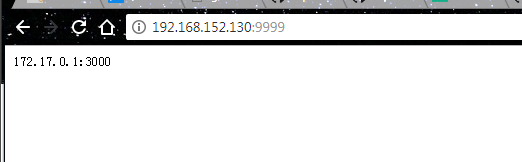

# MPush 安装使用

## 安装步骤

1. 安装`jdk 1.8` 以上版本并设置`%JAVA_HOME%`

   ```bash
   [root@shj-236 local]# vim /etc/profile
   ##打开之后在末尾添加
   export JAVA_HOME=/usr/local/jdk1.8.0_101
   export CLASSPATH=.:%JAVA_HOME%/lib/dt.jar:%JAVA_HOME%/lib/tools.jar  
   export PATH=$PATH:$JAVA_HOME/bin  

   [root@shj-236 local]#source /etc/profile
   ```

2. 安装`zookeeper` (安装配置步骤略)

   ```bash
   [root@shj-236 zookeeper-3.4.6]#netstat -tplan | grep 2181
   # 停止 zookeeper 进程：
   [root@shj-236 zookeeper-3.4.6]# bin/zkServer.sh stop
   # 启动 zookeeper 进程：
   [root@shj-236 zookeeper-3.4.6]# bin/zkServer.sh start
   #查看状态：
   [root@shj-236 zookeeper-3.4.6]# bin/zkServer.sh status
   #查看 zookeeper 服务输出信息：
   由于服务信息输出文件在/home/soft/zookeeper-3.4.6/bin/zookeeper.out
   [root@shj-236 zookeeper-3.4.6]# tail -500f zookeeper.out
   ```

3. 安装`Redis` (安装配置步骤略)

   ```bash
   #启动redis
   [root@shj-124 local]# redis-server redis_cluster/7006/redis.conf
   #查看redis进程
   [root@shj-124 local]# ps -ef|grep redis
   root      71359      1 99 14:08 ?        00:00:03 redis-server 192.168.1.124:7006           
   root      71363  70150  0 14:08 pts/0    00:00:00 grep redis
   ##关闭redis
   [root@shj-129 local]# /usr/local/redis-3.2.4/src/redis-cli -h 127.0.0.1 -p 7003 shutdown
   #或者
   [root@shj-129 local]# /usr/local/redis-3.2.4/src/redis-cli -h 192.168.1.133 -p 7005 shutdown
   ```


3. 下载mpush server 最新的正式包

   ```bash
   https://github.com/mpusher/mpush/releases
   ```

4. 解压下载的tar包`tar -zvxf mpush-release-0.0.2.tar.gz`到 mpush 目录, 结构如下

   ```bash
   tar -zxvf mpush-release-0.0.2.tar.gz -C /usr/local/
   ```

   > ```
   > drwxrwxr-x 2 shinemo shinemo  4096 Aug 20 09:30 bin —> 启动脚本
   > drwxrwxr-x 2 shinemo shinemo  4096 Aug 20 09:52 conf —> 配置文件
   > drwxrwxr-x 2 shinemo shinemo  4096 Aug 20 09:29 lib —> 核心类库
   > -rw-rw-r-- 1 shinemo shinemo 11357 May 31 11:07 LICENSE
   > drwxrwxr-x 2 shinemo shinemo  4096 Aug 20 09:32 logs —> 日志目录
   > -rw-rw-r-- 1 shinemo shinemo    21 May 31 11:07 README.md
   > drwxrwxr-x 2 shinemo shinemo  4096 Aug 20 09:52 tmp
   > ```

5. 修改 conf 目录下的 `vi mpush.conf`文件, `mpush.conf`里的配置项会覆盖同目录下的`reference.conf`文件

   ```
      #主要修改以下配置
      mp.net.connect-server-port=3000//长链接服务对外端口, 公网端口
      mp.zk.server-address="127.0.0.1:2181"//zk 机器的地址
      mp.redis={//redis 相关配置
            nodes:["127.0.0.1:6379"] //格式是ip:port
            cluster-model:single //single, cluster
      }
      //还有用于安全加密的RSA mp.security.private-key 和 mp.security.public-key 等...
   ```

   如果要修改其他配置请参照reference.conf文件

6. 给bin目录下的脚本增加执行权限`chmod u+x *.sh`

7. 执行`./mp.sh start` 启动服务, 查看帮助`./mp.sh` 目前支持的命令：

   `Usage: ./mp.sh {start|start-foreground|stop|restart|status|upgrade|print-cmd}`

   `set-env.sh` 用于增加和修改jvm启动参数，比如堆内存、开启远程调试端口、开启jmx等

8. `cd logs`目录，`cat mpush.out`查看服务是否启动成功

9. 集成部署，比如集成到现有web工程一起部署到tomcat,可以添加如下依赖

```
<dependency>
   <groupId>com.github.mpusher</groupId>
   <artifactId>mpush-boot</artifactId>
   <version>0.0.2</version>
</dependency>
```

启动入口`com.mpush.bootstrap.ServerLauncher.java`

## 启动关闭

```bash
[root@own-server mpush-0.7.1]# /usr/local/mpush-0.7.1/bin/mp.sh start 
[root@own-server mpush-0.7.1]# /usr/local/mpush-0.7.1/bin/mp.sh start 
```


# 安装Mpush-Alloc

```bash
[root@own-server soft]# tar xf alloc-release-0.7.0.tar.gz  -C /usr/local/
[root@own-server local]# ln -s mpush-alloc-0.7.0 mpush-alloc


#编辑配置文件(注意，这里不需要修改，如果分布式部署，修改zookeeper地址信息即可)。
[root@own-server mpush-alloc]# vim conf/mpush.conf 
[root@own-server mpush-alloc]# chmod +x bin/*.sh
[root@own-server mpush-alloc]# bin/mp.sh start

##查看日志和启动情况
[root@own-server mpush-alloc]# netstat -tplan |grep 9999
tcp6       0      0 :::9999                 :::*                    LISTEN      6525/java           
[root@own-server mpush-alloc]# ps 6525
   PID TTY      STAT   TIME COMMAND
  6525 pts/0    Sl     0:01 java -Dmp.home=/usr/local/mpush-alloc/bin/.. -Dmp.conf=/usr/loca
[root@own-server mpush-alloc]# 

```

##浏览器测试


可以看到，已经有mpush服务的信息


## 防火墙配置

```bash
[root@own-server local]# firewall-cmd --zone=public --add-port=9999/tcp --permanent
[root@own-server local]# firewall-cmd --zone=public --add-port=3000/tcp --permanent
[root@own-server local]# firewall-cmd --reload   
#查看开放的端口
[root@own-server local]# firewall-cmd --zone=public --list-all 
```

