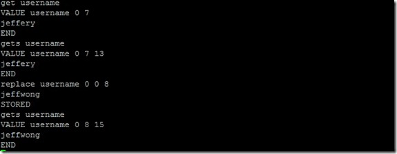
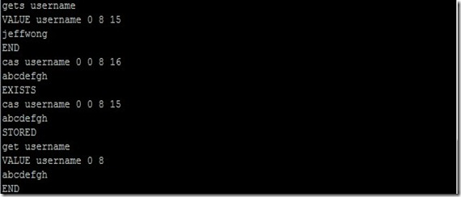
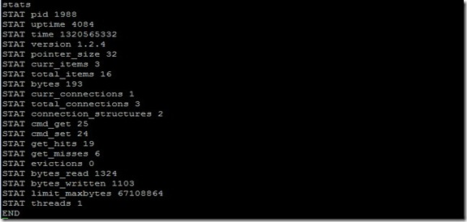
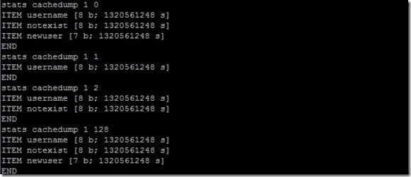
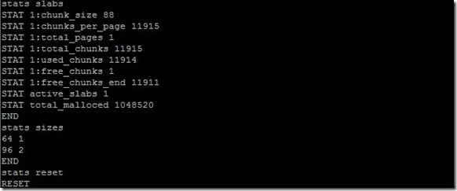
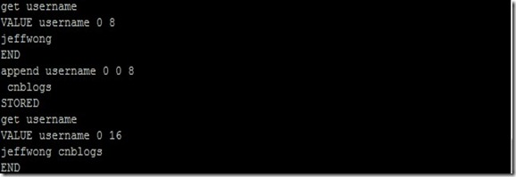

#Memcached常用命令及使用说明

[TOC]
###存储命令

存储命令的格式：
```
<command name> <key> <flags> <exptime> <bytes>
<data block>
```
参数说明如下：
```
<command name>	set/add/replace
<key>	查找关键字
<flags>	客户机使用它存储关于键值对的额外信息
<exptime>	该数据的存活时间，0表示永远
<bytes>	存储字节数
<data block>	存储的数据块（可直接理解为key-value结构中的value）
```
###添加
* 无论如何都存储的set
  
  这个set的命令在memcached中的使用频率极高。set命令不但可以简单添加，如果set的key已经存在，该命令可以更新该key所对应的原来的数据，也就是实现更新的作用。
  可以通过“get 键名”的方式查看添加进去的记录：
  
  如你所知，我们也可以通过delete命令删除掉，然后重新添加。
  
* 只有数据不存在时进行添加的add
  
* 只有数据存在时进行替换的replace
  
* 删除
  
  可以看到，删除已存在的键值和不存在的记录可以返回不同的结果。


###读取命令

* get

get命令的key可以表示一个或者多个键，键之间以空格隔开


* gets



可以看到，gets命令比普通的get命令多返回了一个数字（上图中为13）。这个数字可以检查数据是否发生改变。当key对应的数据改变时，这个多返回的数字也会改变。

* cas

cas即checked and set的意思，只有当最后一个参数和gets所获取的参数匹配时才能存储，否则返回“EXISTS”。




###状态命令

* stats


* stats items


执行stats items，可以看到STAT items行，如果memcached存储内容很多，那么这里也会列出很多的STAT items行。

 

* stats cachedump slab_id limit_num

我们执行stats cachedump 1 0 命令效果如下：


这里slab_id为1，是由2中的stats items返回的结果（STAT items后面的数字）决定的；limit_num看起来好像是返回多少条记录，猜的一点不错， 不过0表示显示出所有记录，而n(n>0)就表示显示n条记录，如果n超过该slab下的所有记录，则结果和0返回的结果一致。


通过stats items、stats cachedump slab_id limit_num配合get命令可以遍历memcached的记录。
* 其他stats命令
  如stats slabs,stats sizes,stats reset等等使用也比较常见。
  
###其他常见命令
* append
  
  在现有的缓存数据后添加缓存数据，如现有缓存的key不存在服务器响应为NOT_STORED。
* prepend
  和append非常类似，但它的作用是在现有的缓存数据前添加缓存数据。
  
* flush_all


该命令有一个可选的数字参数。它总是执行成功，服务器会发送 “OK\r\n” 回应。它的效果是使已经存在的项目立即失效（缺省），或在指定的时间后。此后执行取回命令，将不会有任何内容返回（除非重新存储同样的键名）。 flush_all 实际上没有立即释放项目所占用的内存，而是在随后陆续有新的项目被储存时执行（这是由memcached的懒惰检测和删除机制决定的）。

flush_all 效果是它导致所有更新时间早于 flush_all 所设定时间的项目，在被执行取回命令时命令被忽略。

* 其他命令

memcached还有很多命令，比如对于存储为数字型的可以通过incr/decr命令进行增减操作等等，这里只列出开发和运维中经常使用的命令，其他的不再一一举例说明。

 

###stats命令详细介绍
通过它可以查看Memcached服务的许多状态信息。使用方法如下：
先在命令行直接输入telnet 主机名端口号，连接到memcached服务器，然后再连接成功后，输入stats 命令，即可显示当前memcached服务的状态信息。
比如在我本机测试如下：
```
stats
STAT pid 1552
STAT uptime 3792
STAT time 1262517674
STAT version 1.2.6
STAT pointer_size 32
STAT curr_items 1
STAT total_items 2
STAT bytes 593
STAT curr_connections 2
STAT total_connections 28
STAT connection_structures 9
STAT cmd_get 3
STAT cmd_set 2
STAT get_hits 2
STAT get_misses 1
STAT evictions 0
STAT bytes_read 1284
STAT bytes_written 5362
STAT limit_maxbytes 67108864
STAT threads 1
END
```
这里显示了很多状态信息，下边详细解释每个状态项：
1.  pid: memcached服务进程的进程ID
2.  uptime: memcached服务从启动到当前所经过的时间，单位是秒。
3.  time: memcached服务器所在主机当前系统的时间，单位是秒。
4.  version: memcached组件的版本。这里是我当前使用的1.2.6。
5.  pointer_size：服务器所在主机操作系统的指针大小，一般为32或64.
6.  curr_items：表示当前缓存中存放的所有缓存对象的数量。不包括目前已经从缓存中删除的对象。
7.  total_items：表示从memcached服务启动到当前时间，系统存储过的所有对象的数量，包括目前已经从缓存中删除的对象。
8.  bytes：表示系统存储缓存对象所使用的存储空间，单位为字节。
9.  curr_connections：表示当前系统打开的连接数。
10.  total_connections：表示从memcached服务启动到当前时间，系统打开过的连接的总数。
11.  connection_structures：表示从memcached服务启动到当前时间，被服务器分配的连接结构的数量，这个解释是协议文档给的，具体什么意思，我目前还没搞明白。
12.  cmd_get：累积获取数据的数量，这里是3，因为我测试过3次，第一次因为没有序列化对象，所以获取数据失败，是null，后边有2次是我用不同对象测试了2次。
13.  cmd_set：累积保存数据的树立数量，这里是2.虽然我存储了3次，但是第一次因为没有序列化，所以没有保存到缓存，也就没有记录。
14.  get_hits：表示获取数据成功的次数。
15.  get_misses：表示获取数据失败的次数。
16.  evictions：为了给新的数据项目释放空间，从缓存移除的缓存对象的数目。比如超过缓存大小时根据LRU算法移除的对象，以及过期的对象。
17.  bytes_read：memcached服务器从网络读取的总的字节数。
18.  bytes_written：memcached服务器发送到网络的总的字节数。
19.  limit_maxbytes：memcached服务缓存允许使用的最大字节数。这里为67108864字节，也就是是64M.与我们启动memcached服务设置的大小一致。
20.  threads：被请求的工作线程的总数量。这个解释是协议文档给的，具体什么意思，我目前还没搞明白。
   总结：stats命令总体来说很有用，通过这个命令我们很清楚当前memcached服务的各方面的信息。