# MySQL SQL优化

[TOC]

##  DBA五分钟速成

### 识别性能问题

#### 寻找运行缓慢的SQL语句

```mysql
mysql>SHOW FULL PROCESSLIST\G
*************************** 695. row ***************************
     Id: 4274417
   User: ykee_xsimple
   Host: 192.168.1.128:60927
     db: ykee_xsimple
Command: Sleep
   Time: 4
  State: 
   Info: NULL
*************************** 696. row ***************************
     Id: 4274418
   User: ykee_xsimple
   Host: 192.168.1.128:60928
     db: ykee_xsimple
Command: Query
   Time: 0
  State: Creating sort index
   Info: SELECT *   FROM (SELECT t1.MSGID      "msgID",                t1.SENDER     "sender",                t1.SENDTIME   "sendTime",                t1.MSGCONTENT "msgContent",                t2.MSGVER     "msgVersion"           FROM msg_messages t1, msg_msgvermap t2          WHERE t1.MSGID = t2.MSGID            AND t2.USERID = '8973'            AND t2.MOVEFLAG = 0            AND t1.app_key = '6ffb4341-1161-4d82-9415-3e829bfb411e'          ORDER BY t2.MSGVER ASC) t3  LIMIT 0,10
696 rows in set (0.00 sec)
mysql> 

##或者  
SELECT * FROM information_schema.PROCESSLIST   WHERE COMMAND != "Sleep" order by TIME DESC;     
```

#### 确认低效查询

* 运行SQL语句并记录执行时间(SELECT)

* 生成一个查询执行计划(QUERY Execution Plan,QEP)
  <当MySQL要执行一个SQL查询的时候,它首先会对该SQL语句进行语法检查,然后构建一个QEP,QEP决定了MySQL从底层存储引擎总获取信息的方式.如果想要查看MySQL查询优化器为SQL语句构造的QEP,只需要在SELECT 语句前加上如下的EXPLAIN关键字前缀

  ```mysql
  mysql> EXPLAIN select * from ykee_biz.start_work_apply where process_id=20000116314612\G
  *************************** 1. row ***************************
             id: 1
    select_type: SIMPLE
          table: start_work_apply
           type: ALL
  possible_keys: NULL
            key: NULL
        key_len: NULL
            ref: NULL
           rows: 6612
          Extra: Using where
  1 row in set (0.00 sec)
  mysql> 
   
  select_type DERIVED
  ```

  ​

### 1.2优化查询

#### 不应该做的事

决定是否添加一个新的索引并部署它需要考虑很多因素.该语句仅强调其对生成环境的一个潜在的影响.完成这条数据定义语句(DDL)花了55s,在此期间,由于ALTER语句是阻塞操作,因此所有为表添加和修改数据的额外请求都被阻塞了.根据其他数据操作语言DML的执行顺序,此时SELECT 语句也会被阻塞二无法完成.如果表更大一些的话,一个ALTER语句可能需要几小时甚至几天才能执行完成;另外iyige需要考虑的因素是在一个表有多个索引的情况下DML语句的性能开销.

#### 确认优化

```mysql
select * frominventory where item_id=1111
##查看查询效率
explain * frominventory where item_id=1111\G
```

#### 正确的方式

再决定添加索引之前,通常需要至少做2项检查:
首先验证表现有的结构,然后确定表的大小

```mysql
SHOW CREATE TABLE inventory\G

show table status LIKE 'inventory'\G
```

### 本章总结

优化SQL语句觉不仅仅是添加索引.本章介绍了集中用于优化语句的分析工具,包括EXPLAIN和SHOW CREATE TABLE.

## 基本分析命令

```mysql
EXPLAIN 命令
SHOW CREATE TABLE 命令
SHOW INDEXES 命令
SHOW TABLE STATUS 命令
SHOW STATUS 命令
SHOW VARIABLES 命令
```

### EXPLAIN

> 提示:
>
> 理想情况下,应该对每条SQL语句都运行EXPLAIN命令,所有SELECT语句前都可以直接加上EXPLAIN关键字,而对于UPDATE和DELETE语句,需要把查询重写成SELECT 语句以确保有效使用索引.

```mysql
mysql> explain select host,user,password from mysql.user where user LIKE 'r%'\G
*************************** 1. row ***************************
           id: 1
  select_type: SIMPLE
        table: user
         type: ALL
possible_keys: NULL
          key: NULL
      key_len: NULL
          ref: NULL
         rows: 6
        Extra: Using where
1 row in set (0.00 sec)

mysql> explain select host,user,password from mysql.user where host='localhost' and user LIKE 'r%'\G
*************************** 1. row ***************************
           id: 1
  select_type: SIMPLE
        table: user
         type: range
possible_keys: PRIMARY
          key: PRIMARY
      key_len: 228
          ref: NULL
         rows: 1
        Extra: Using index condition
1 row in set (0.01 sec)

mysql> 
```

* 没有使用索引(key列的值为NULL)
* 很多处理过的行(row列)
* 很多被评估的索引(possible_keys列)


#### EXPLAIN PARTITIONS 命令

用于满足partitions列种的查询的特定表分区提供附加信息

#### EXPLAIN EXTENDED命令

提供额外的filtered列;

用explain extended查看执行计划会比explain多一列 filtered。
filtered列给出了一个百分比的值，这个百分比值和rows列的值一起使用，可以估计出那些将要和explain中的前一个表进行连接的行的数目

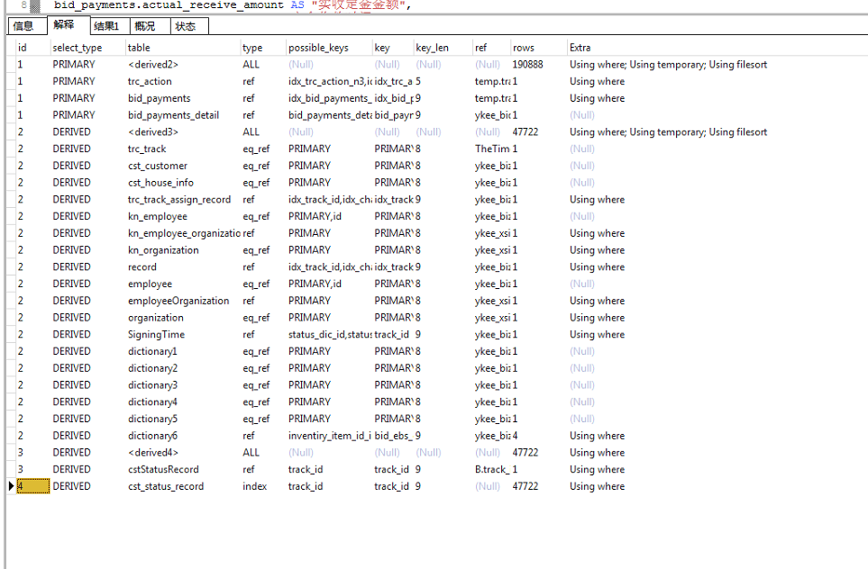

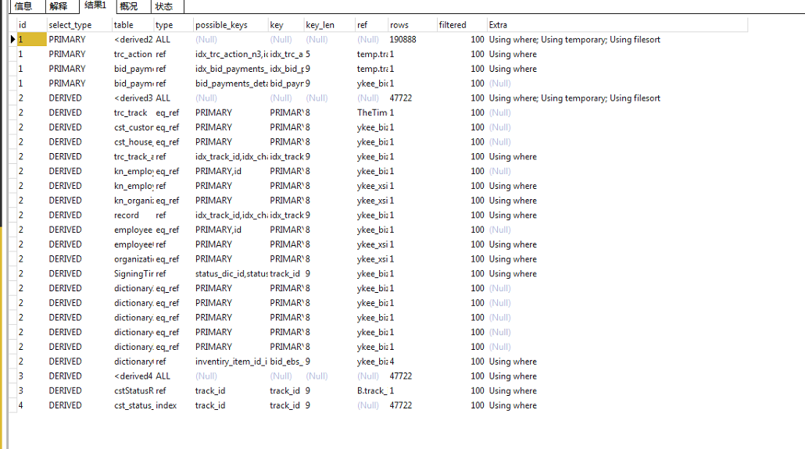

```mysql
MySQL> explain extended select * from account\G;
id: 1  
select_type: SIMPLE  
table: account  
type: ALL  
possible_keys: NULL  
key: NULL  
key_len: NULL  
ref: NULL  
rows: 1  
filtered: 100.00  
Extra:  
1 row in set, 1 warning (0.00 sec) 

MySQL> show warnings\G;
Level: Note
Code: 1003  
Message: select `dbunit`.`account`.`id` AS `id`,`dbunit`.`account`.`name` AS `name` from `dbunit`.`account`  
1 row in set (0.00 sec) 
```

从 show warnings的输出结果中我们可以看到原本的select * 被MySQL优化成了

```mysql
select `dbunit`.`account`.`id` AS `id`,`dbunit`.`account`.`name` AS `name`
```

**explain extended 除了能够告诉我们MySQL的查询优化能做什么，同时也能告诉我们MySQL的查询优化做不了什么**。MySQL performance的Extended EXPLAIN这篇文中中作者就利用explainextended +show warnings 找到了MySQL查询优化器中不能查询优化的地方。从 

```mysql
EXPLAIN extended SELECT * FROM sbtest WHERE id>5 AND id>6 AND c=”a” AND pad=c
```

语句的输出我们得知MySQL的查询优化器不能将id>5 和 id>6 这两个查询条件优化合并成一个 id>6。

### SHOW CREATE TABLE命令

此命令告诉用户如何用准确的语法来重新创建数据库表,并且用户可以很容易地在给定表上对新的或更改的索引,数据类型,时候为null限制条件,字符集以及存储引擎创建优化.

```mysql
mysql> SHOW CREATE TABLE wp_option\G
```

MySQL dump工具能够快速生产用户模式或数据库实例中所有表的定义

```bash
# mysqldump -u user -p --no-data[name-of-schema] >schema.sql
# more schema.sql
```

用户也可以使用INFORMATION_SCHEMA表获取表结构的组件,这些INFORMATION_SCHEMA的表包括:TABLES,COLUMNS,TABLE_CONSTRAAINTS,KEY_COLUMN_USAGE,REFERENTIAL_CONSTRAINTS以及PARTITIONS

### SHOW INDEXES 命令

可以查看索引信息,这些信息包括索引的类型和当前报告的MySQL索引的基数

```mysql
mysql> show indexes from ykee_biz.cst_customer;

```
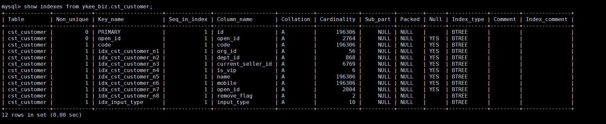
```
mysql> 
mysql> show indexes from ykee_biz.cst_customer\G
*************************** 1. row ***************************
        Table: cst_customer
   Non_unique: 0
     Key_name: PRIMARY
 Seq_in_index: 1
  Column_name: id
    Collation: A
  Cardinality: 196306
     Sub_part: NULL
       Packed: NULL
         Null: 
   Index_type: BTREE
      Comment: 
Index_comment: 
*************************** 2. row ***************************
        Table: cst_customer
   Non_unique: 0
     Key_name: open_id
 Seq_in_index: 1
  Column_name: open_id
    Collation: A
  Cardinality: 2764
     Sub_part: NULL
       Packed: NULL
         Null: YES
   Index_type: BTREE
      Comment: 
Index_comment: 
*************************** 3. row ***************************
```

Cardinality 列的值非常重要,该值代表在索引中每一列唯一值.

### SHOW TABLE STATUS 命令

查看数据表的底层大小以及表结构,其中包括存储引擎类型,版本,数据和索引大小,行的平均长度以及行数.

```mysql
mysql> use ykee_biz
Reading table information for completion of table and column names
You can turn off this feature to get a quicker startup with -A
Database changed
mysql> show table status LIKE 'cst_customer'\G
*************************** 1. row ***************************
           Name: cst_customer
         Engine: InnoDB
        Version: 10
     Row_format: Compact
           Rows: 196309
 Avg_row_length: 190
    Data_length: 37306368
Max_data_length: 0
   Index_length: 71499776
      Data_free: 7340032
 Auto_increment: 970182
    Create_time: 2017-05-09 14:34:10
    Update_time: NULL
     Check_time: NULL
      Collation: utf8mb4_unicode_ci
       Checksum: NULL
 Create_options: 
        Comment: 顾客表
1 row in set (0.00 sec)

mysql> 
```

这条命令返回值的准确度取决于数据库试用的存储引擎.例如,如果使用MyISAM,MEMORY,ARCHIVE或者BLACKHOLE存储引擎,那么行的平均长度和行数就都是精确值.而如果是INnoDB存储引擎能够,上述值都将是估计值并且可能存在很大的误差,从下面的例子可以看出MyISAM和InnoDB存储引擎的值的差异.

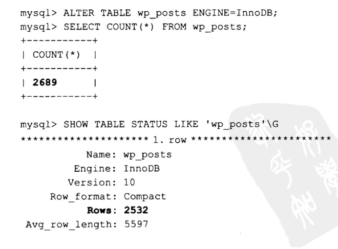

```mysql
SELECT
	table_schema,
	table_name,
	ENGINE,
	row_format AS format,
	table_rows,
	avg_row_length AS avg_row,
	round(
		sum(data_length + index_length) / 1024 / 1024
	) AS total_mb,
	round(sum(data_length) / 1024 / 1024) AS data_mb,
	round(
		sum(index_length) / 1024 / 1024
	) AS index_mb,
	CURDATE() AS today
FROM
	information_schema. TABLES
WHERE
	table_schema NOT IN (
		'mysql',
		'information_schema',
		'performance_schema'
	)
GROUP BY
	table_schema,
-- 	table_name,
	ENGINE
ORDER BY
	table_schema,
	table_name
```

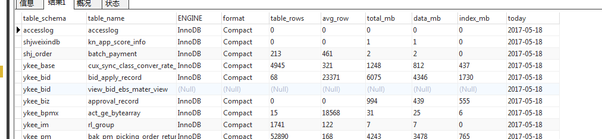

### SHOW STATUS命令

SHOW[GLOBAL|SESSION] STATUS 命令可以用那查看MySQL服务器的当前内部状态信息.

```
SESSION: show status -->questions是本次连接的请求数,flush status重置。
GLOBAL: show global status -->questions是本次MYSQL服务开启（或重置）到现在总请求数。
```

```mysql
mysql> SHOW GLOBAL STATUS LIKE 'Created_tmp_%tables';
+-------------------------+-----------+
| Variable_name           | Value     |
+-------------------------+-----------+
| Created_tmp_disk_tables | 548482    |
| Created_tmp_tables      | 123546356 |
+-------------------------+-----------+
2 rows in set (0.00 sec)

mysql> SHOW SESSION STATUS LIKE 'Created_tmp_%tables';
+-------------------------+-------+
| Variable_name           | Value |
+-------------------------+-------+
| Created_tmp_disk_tables | 3     |
| Created_tmp_tables      | 20    |
+-------------------------+-------+
2 rows in set (0.00 sec)

mysql> 
```


下面就是一个对帮助提高索引效率的状态值进行比较的离职:

```mysql
mysql> FLUSH STATUS;
mysql> SELECT ....
mysql> SHOW SESSION STATUS LIKE 'handler_read%';
+-----------------------+---------+
| Variable_name         | Value   |
+-----------------------+---------+
| Handler_read_first    | 2       |
| Handler_read_key      | 816363  |
| Handler_read_last     | 0       |
| Handler_read_next     | 1345022 |
| Handler_read_prev     | 0       |
| Handler_read_rnd      | 50103   |
| Handler_read_rnd_next | 364791  |
+-----------------------+---------+
7 rows in set (0.00 sec)
mysql> 
```

Handler_read_key  表示使用了816363个索引,Handler_read_next表示这个索引被用来读取其他1345022行数据

* Handler_read_key 读索引的某一项（的次数）

* Handler_read_next

  此选项表明在进行索引扫描时，按照索引从数据文件里取数据的次数。

* Handler_read_prev

  此选项表明在进行索引扫描时，按照索引倒序从数据文件里取数据的次数，一般就是ORDER BY … DESC

* Handler_read_rnd
  简单的说，就是查询直接操作了数据文件，很多时候表现为没有使用索引或者文件排序。

* Handler_read_rnd_next
  此选项表明在进行数据文件扫描时，从数据文件里取数据的次数。在数据文件中读下一行的请求数。如果你正进行大量的表扫描，该值较高。通常说明你的表索引不正确或写入的查询没有利用索引。”


```mysql
mysql>  SHOW GLOBAL STATUS LIKE 'handler_read%';
+-----------------------+----------------+
| Variable_name         | Value          |
+-----------------------+----------------+
| Handler_read_first    | 4698733773     |
| Handler_read_key      | 198744577673   |
| Handler_read_last     | 857451         |
| Handler_read_next     | 1280851496243  |
| Handler_read_prev     | 40200139960    |
| Handler_read_rnd      | 13471521439    |
| Handler_read_rnd_next | 29374430603730 |
+-----------------------+----------------+
7 rows in set (0.00 sec)

mysql> 
```

* Handler_read_first：索引中第一条被读的次数。如果较高，它表示服务器正执行大量全索引扫描；例如，SELECT col1 FROM foo，假定col1有索引（这个值越低越好）。
* Handler_read_key：如果索引正在工作，这个值代表一个行被索引值读的次数，如果值越低，表示索引得到的性能改善不高，因为索引不经常使用（这个值越高越好）。
* Handler_read_next ：按照键顺序读下一行的请求数。如果你用范围约束或如果执行索引扫描来查询索引列，该值增加。
* Handler_read_prev：按照键顺序读前一行的请求数。该读方法主要用于优化ORDER BY ... DESC。
* Handler_read_rnd ：根据固定位置读一行的请求数。如果你正执行大量查询并需要对结果进行排序该值较高。你可能使用了大量需要MySQL扫描整个表的查询或你的连接没有正确使用键。这个值较高，意味着运行效率低，应该建立索引来补救。
* Handler_read_rnd_next：在数据文件中读下一行的请求数。如果你正进行大量的表扫描，该值较高。通常说明你的表索引不正确或写入的查询没有利用索引。

### SHOW VARIABLES 命令

用来查看MySQL系统变量的当前值.其中一些变量影响到SQL语句执行的方式,例如,tmp_table_size限制了内部创建的临时表的最大内存使用量.通过了解当前会话或者特殊设置的全局变量的值并用SET命令动态地更改这些变量的值,可以改变SQL的性能.当没有指定SHOW VARIABLES命令的范围时,默认在SESSION范围内执行.

```mysql
mysql> SHOW SESSION VARIABLES LIKE 'tmp_table_size';
+----------------+-----------+
| Variable_name  | Value     |
+----------------+-----------+
| tmp_table_size | 268435456 |
+----------------+-----------+
1 row in set (0.00 sec)
```

### INFORMATION_SCHEMA


## 3深入了解MySQL索引

* MySQL索引各种可能的用途
* 理解各种索引数据结构理论
* 各种存储引擎的索引实现方式
* 分区的MySQL索引


```bash
wget http://effectivemysql.com/downloads/words
```

### 3.1生成示例文件:

```mysql
mysql> CREATE SCHEMA IF NOT EXISTS book
mysql> use book;
mysql> CREATE TABLE source_words(word VARCHAR(50) NOT null,
INDEX(word)
) ENGINE=MyISAM;
mysql> LOAD DATA LOCAL INFILE '/home/words' INTO TABLE source_words(word);
mysql>CREATE TABLE million_words(
id INT UNSIGNED NOT NULL AUTO_INCREMENT,
word VARCHAR(50) not null,
PRIMARY KEY(id),
UNIQUE INDEX(word)
)ENGINE=InnoDB;
mysql>insert into million_words(word)
select DISTINCT word from source_words;
mysql>insert into million_words(word)
select DISTINCT REVERSE(word) from source_words where REVERSE(word) not in (select word from source_words);

mysql>select @cnt:=COUNT(*) FROM million_words;
mysql>select @diff:=1000000-@cnt;
mysql>set @sql=CONCAT("INSERT INTO million_words(word) select DISTINCT CONCAT(word,'X1Y') from source_words limit",@diff);
mysql>prepare cmd from @sql;
mysql>execute cmd;
mysql>select count(*)from million_words;
```

### 3.2 MySQL索引用法

索引用途:

* 保持数据完整性
* 优化数据访问性能
* 改进表的连接操作
* 对结果进行排序
* 简化聚合数据操作

#### 3.2.1数据完整性

##### 主键

* 每个表只能有一个主键
* 主键不能包括null值
* 通过主键可以获取表中任意特定行
* 如果定义了AUTO INCREMENT列,那么此列必需是主键的一部分

##### 唯一键

* 表可有多个唯一键
* 唯一键可以包含NULL值,并且每个NULL值都是唯一的(即NULL!=NULL)

有些MySQL的存储引擎可以创建外键你;爱确保数据完整性.外键其实不是索引,他们术语约束.然而通常情况下大部分外键约束实现的先决条件就是外键所在的表和外键参照的表都必须有索引,这样才能管理外键约束.目前在MySQL的默认存储引擎中,只有InnoDB支持外键约束且不要求存在对应的索引,但考虑到性能因素,还是建议在添加外键约束时建立索引.

#### 3.2.2优化数据访问

#### 3.2.3表连接

除了在给定表上限制需要读取的数据外,索引的另一个主要用途就是快捷高效的在相关的表之间做连接操作.如前所述,在需要连接的列上使用索引可以显著提升性能,并可以在另一个表中快速找到一个匹配的值.

#### 3.2.4结果排序

MySQL索引会把数据存储在一个有序的表格中.如果希望SELECT 语句的结果是有序的,那么就应该适当的使用索引.通过ORDER BY 关键字可以任意SELECT 查询的结果进行排序.如果在需要排序的裂伤没有找到索引,MySQL一般会对获取的表进行内部排序.在高并发系统中使用预先建立的索引可以带来巨大的性能改进,这些查询结果顺理成章地按顺序存放在索引中了.但是仅仅简单地根据读者对此法讯结果的顺序要求创建一个索引,并不总是意味着MySQL会选用塔.

#### 3.2.5聚合操作

索引还可以作为一种更方便的计算聚合结果的工具.例如在计算指定时期内所有账单的总和时,如果在日期和账单账户上添加合适的索引就可以更高效地执行

### 3.3关于存储引擎

有关存储引擎的功能和特性的基本信息,主要包括以下几个方面:

* 事务性和非事务性
* 持久性和非持久性
* 表和行级锁定
* 不同的索引方法,例如B-树,B+树,散列以及R-树
* 集簇索引和非聚簇索引
* 主码索引和非主码索引
* 数据压缩
* 全文索引能力


三种主要的存储引擎:

* MyISAM 一种非事务性的存储引擎,是MySQL5.5之前版本的默认存储引擎
* InnoDB最流行的事务性存储引擎
* Memory 顾名思义,这是一种基于内存的非事务性的以及非持久性的存储引擎

当前版本的MySQL也包括一些内置的存储引擎,例如ARCHIVE,MERGE,BLACKHOLE以及CSV等.其他一些由MySQL或者第三方提供的存储引擎还包括Federated,ExtraDB等

### 3.4 索引专业术语

| 索引技术 | B-树,B+树,R-树以及散列          |      |
| ---- | ------------------------ | ---- |
| 索引实现 |                          |      |
| 索引类型 | 主键,唯一键,非主码索引,全文本索引以及空间索引 |      |
|      |                          |      |

### 3.5MySQL索引类型

#### 3.5.1 索引理论

* B-树
  支持数据插入,控制操作以及通过管理一系列树根状结构的彼此联通的节点中来做选择.B-树中有两种节点类型:索引节点和叶子节点.叶子节点是用来存储数据的,而索引节点则用来高速用户存储在叶子节点中的数据的顺序,并帮助用户找到相应数据.注意不要把B-树和二叉树混淆了,二叉树只是一种简单的节点层次结构的实现.

  B-树数据结构如图:

  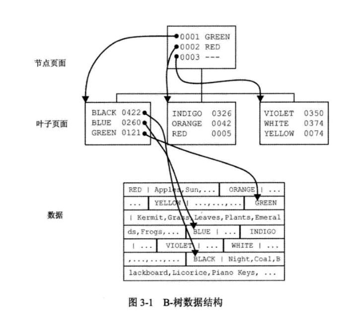

* B+树
  是B-树实现的增强版本.尽管B+树支持B-树索引的所有特性,它们之间的最显著不同点在于B+树种底层数据是根据被提及的索引列进行排序的.B+树还通过在叶子节点(没有子节点的节点)之间的附加应用来优化扫描性能
  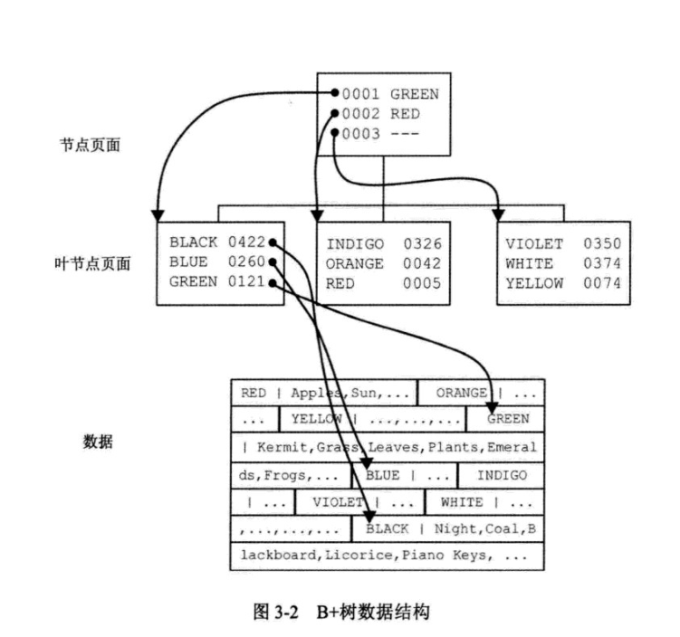


散列实现对直接查找方式能提供最优的性能,但对一定范围的查找却效率低下;而一个B-树的索引实现这是专门为给定范围的查询设计的.

* 散列
  他将一种算法应用到给定值中以在底层数据存储系统中返回一个唯一的指针或位置.散列表的优点是始终以线性时间复杂度找到需要读取的行的位置,而不像B-树那样需要横跨多层节点来确定位置.

  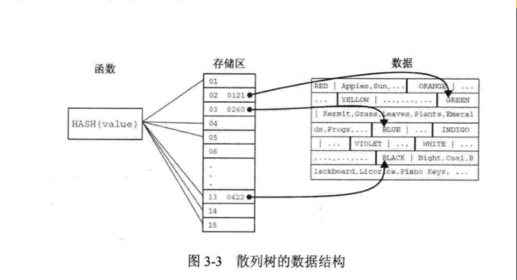

* 通信R-树
  R-树数据结构支持基于数据类型对集合数据进行管理.目前只有MyISAM使用R-树实现支持空间索引.使用空间索引也有很多限制,比如只支持唯一的NOT NULL列等.

* 全文本
  全文本也是一种MySQL采用的基本数据结构.这种数据结构目前只有当前版本MySQL中的MyISAM存储引擎支持.全文本索引在大规模系统中并没有什么实用价值,因为在这些大规模系统中有很多专门用于文本检索的产品.

#### 3.5.2 MyQL实现

##### MyISAM 的B-树

MyISAM存储引擎使用B-树数据结构来实现主码索引,唯一索引以及非主码索引.在MySQL实例数据目录和数据库模式子目录中,用户可以找到每个MySQL表对应的.MYD和.MYI文件.数据库表上定义的索引信息就存储在MYI文件中,该文件的块大小是1024字节.这个大小是可以通过myisam-block-size系统变量来配置的;

在MyISAM中,非主码索引的B-树结构存储索引值和一个指向主码数据的指针,这是MyISAM和InnoDB的一个显著区别.这一点导致了两种存储引擎中的索引的不同工作方式.

MyISAM索引实在内存的一个公共键缓存中管理的,这个缓存的大小可以通过key_buffer_size或者其他命名键缓存来定义.这是根据统计和规划的表索引的大小来设定缓存大小时来定义.这是在根据统计和规划的表索引的大小来设定缓存大小时主要考虑因素.

```mysql
CREATE TABLE colors (
  name VARCHAR(20) NOT NULL,
  items VARCHAR(255) NOT NULL
 ) ENGINE=MyISAM;
INSERT INTO colors(name,items) values
('RED','Apple,Sun,Blood'),
('ORANGE','Oranges,Sand'),
('GREEN','Kermity,Grass,Leaves,Plants,Frogs,Seaweed'),
('BLUE','Sky,Water,Blueberries,Earth'),
('BLACK','Night,Coal,Blackboard,SuLicorice,Piano Keys');
ALTER TABLE colors ADD index(name);
```

可以通过MyISAM数据文件来了解数据是根据INSERT语句的指定来有序存放的.

```bash
[root@own-server test]# od -c colors.MYD
0000000 003  \0 024  \0 003   R   E   D 017   A   p   p   l   e   ,   S
0000020   u   n   ,   B   l   o   o   d 003  \0 024  \0 006   O   R   A
0000040   N   G   E  \f   O   r   a   n   g   e   s   ,   S   a   n   d
0000060 003  \0   0  \0 005   G   R   E   E   N   )   K   e   r   m   i
0000100   t   y   ,   G   r   a   s   s   ,   L   e   a   v   e   s   ,
0000120   P   l   a   n   t   s   ,   F   r   o   g   s   ,   S   e   a
0000140   w   e   e   d 001  \0   ! 004   B   L   U   E 033   S   k   y
0000160   ,   W   a   t   e   r   ,   B   l   u   e   b   e   r   r   i
0000200   e   s   ,   E   a   r   t   h 003  \0   2 002 005   B   L   A
0000220   C   K   +   N   i   g   h   t   ,   C   o   a   l   ,   B   l
0000240   a   c   k   b   o   a   r   d   ,   S   u   L   i   c   o   r
0000260   i   c   e   ,   P   i   a   n   o       K   e   y   s  \0  \0
0000300
[root@own-server test]# 
```
也可以通过查看MyISAM索引来观察升序排列的值,例如:

```bash
[root@own-server test]# od -c colors.MYI
0000000 376 376  \a 001  \0 003 001   T  \0 260  \0   d  \0 304  \0 001
0000020  \0  \0 001  \0   S 001  \0  \0  \0  \0   9 377  \0  \0  \0  \0
0000040  \0  \0  \0 005  \0  \0  \0  \0  \0  \0  \0  \0  \0  \0  \0  \0
0000060  \0  \0  \0 005 377 377 377 377 377 377 377 377  \0  \0  \0  \0
0000100  \0  \0  \b  \0  \0  \0  \0  \0  \0  \0  \0 300  \0  \0  \0  \0
0000120  \0  \0  \0  \0  \0  \0  \0  \0  \0  \0  \0  \0  \0  \0  \0  \0
0000140  \0  \0  \0  \0  \0  \0  \0  \0  \0  \0  \0  \0  \0  \0  \n   O
0000160  \0  \0  \0   #  \0  \0  \0  \0  \0  \0  \0 001  \0  \0  \0  \0
0000200  \0  \0 004  \0 377 377 377 377 377 377 377 377  \0  \0  \0  \0
0000220  \0  \0  \0  \0   Y   $   !   |  \0  \0  \0  \0  \0  \0  \0 001
0000240  \0  \0  \0  \0   Y   $   !   |  \0  \0  \0  \0  \0  \0  \0  \0
0000260  \0  \0  \0  \0  \0  \0  \0  \0  \0  \0  \0  \0  \0  \0  \0  \0
0000300  \0  \0  \0  \0  \0  \0  \0  \0  \0  \0 004  \0  \0  \0  \0  \0
0000320  \0  \0  \0  \0  \0  \0  \0  \0  \0  \0  \0  \0  \0  \0  \0  \0
*
0000360  \0  \0 003   <  \0  \0 003   =  \0  \0  \0 002  \0  \0 003   @
0000400  \0  \0  \0 024  \0  \0  \0 002  \0  \0  \0  \0 006 006 001  \0
0000420  \0  \0  \0  \0 004  \0  \0   H  \0  \0  \0  \0  \0  \0  \0  \0
0000440  \0  \0  \0  \0  \0  \0  \0  \0 001 001  \0   ( 004  \0  \0   B
0000460  \0  \a  \0   C 017   S  \0 001  \0  \0  \0  \b  \0   <  \0  \0
0000500  \0  \0  \0  \0  \0  \0  \0  \b  \0   =  \0  \0  \0  \0  \b 002
0000520 377  \0  \0  \0  \0  \0  \0  \0  \0  \0  \0  \0  \0  \0  \0  \0
0000540  \0  \0  \0  \0  \0  \0  \0  \0  \0  \0  \0  \0  \0  \0  \0  \0
*
0002000  \0   A  \0 005   B   L   A   C   K  \0  \0  \0  \0  \0 210  \0
0002020 004   B   L   U   E  \0  \0  \0  \0  \0   d  \0 005   G   R   E
0002040   E   N  \0  \0  \0  \0  \0   0  \0 006   O   R   A   N   G   E
0002060  \0  \0  \0  \0  \0 030  \0 003   R   E   D  \0  \0  \0  \0  \0
0002100  \0  \0  \0  \0  \0  \0  \0  \0  \0  \0  \0  \0  \0  \0  \0  \0
*
0004000
[root@own-server test]# 
```

##### InnoDB的B+树聚簇主码

InnoDB存储引擎在它的主码索引(也被称为聚簇主码)中使用了B+树.这种结构吧所有数据都和对应的主码组织在一起,并且在叶子节点这一层行添加额外的向前和向后的指针,这样就可以更方便的进行范围扫描操作.

在文件系统层面,所有InnoDB数据和索引信息都默认在公共InnoDB表空间中管理,否则管理员就通过innodb_data_file_path这个变量指定文件路径.这是一个叫做ibdata1的文件,可以在MySQL数据

用户可以指定innodb_file_per_table选项来定义InnoDB为每个表使用单独的表空间,这样用户就可以查看每个文件中合并的表数据和索引大小了.


由于InnoDB用聚簇主码存储数据,底层信息占用磁盘空间的大小很大程度取决于页面的填充因子.对于按序排列的主码,InnoDB会用16K页面的15/16作为填充因子.对于不是按序排列的主码,默认情况下InnoDB会在插入初始数据的时候为每个页面分配50%作为填充因子.


> 注意:
>
> 相对于MyISAM,数据在InnoDB 中是按照有序的方式存储的


##### InnoDB的B-树聚簇非主码

InnoDB中的非主码索引使用了B-数数据结构;但InnoDB中的B-树结构实现和MyISAM中的并不一样.在InnoDB中,非主码索引存储的是主码的实际值.而在MyISAM中,非主码索引存储的是包含主码值的数据的指针.

当定义了很大的主码的时候--例如:当读者的主码长度是40字节的时候,InnoDB的非主码索引可能会更大.睡着非主码索引数量的增加,索引之间大小差别可能会变得很大.另一个不同点在于非主码索引当前可以包含主键的值,并且可以不是索引必需有的部分.在做表连接操作或者使用覆盖索引的时候,这将会带来很大的性能改进.

##### 内存散列索引

在默认的MySQL的引擎索引中,只有MEMORY引擎支持散列数据结构,散列也是主码索引和非主码索引的默认结构.散列的强度可以表示为直接键查找的简单性.

```mysql
SET SESSION max_heap_table_size=1024*1024*100;
INSERT INTO memory_words(id,word)
SELECT id,word FROM million_words;
SELECT COUNT(*) FROM memory_words;
SET PROFILING=1;
SELECT * FROM memory_words WHERE word='apple';
SELECT * FROM memory_words WHERE word='orange';
SELECT * FROM memory_words WHERE word='lemon';
SELECT * FROM memory_words WHERE word='wordnotfound';
SELECT * FROM memory_words WHERE word LIKE 'apple%';
SHOW PROFILES;

mysql> SHOW PROFILES;
+----------+------------+------------------------------------------------------+
| Query_ID | Duration   | Query                                                |
+----------+------------+------------------------------------------------------+
|        1 | 0.00047925 | SELECT * FROM memory_words WHERE word='apple'        |
|        2 | 0.00022650 | SELECT * FROM memory_words WHERE word='orange'       |
|        3 | 0.00022800 | SELECT * FROM memory_words WHERE word='lemon'        |
|        4 | 0.00030150 | SELECT * FROM memory_words WHERE word='wordnotfound' |
|        5 | 0.02279650 | SELECT * FROM memory_words WHERE word LIKE 'apple%'  |
+----------+------------+------------------------------------------------------+
5 rows in set, 1 warning (0.00 sec)

mysql> 
```

在这个例子中,散列索引的相似范围模式匹配比直接值查询慢了1000倍;

也可以为MEMORY存储引擎指定一个B-树索引实现.从下面的信息可以看到表数据和索引空间的大小,这可以和稍后给出的MEMORY使用B-树结构的情况做个比较.

```mysql
[root@own-server home]# cat tabesize.sql 
SET @schema=IFNULL(@schema,DATABASE());
SELECT @sachma AS table_schema,CURDATE() as today;
SELECT table_name,engine,row_format AS format,table_rows,avg_row_length AS avg_row,round((data_length+index_length)/1024/1024,2) as total_mb,round((data_length)/1024/1024,2) as data_mb,round((index_length)/1024/1024,2) as index_mb
from INFORMATION_SCHEMA.tables
where table_schema=@schema
AND table_name=@table\G
```
```mysql
mysql>SET @table='memory_words';
mysql> SOURCE /home/tabesize.sql ;
Query OK, 0 rows affected (0.00 sec)

+--------------+------------+
| table_schema | today      |
+--------------+------------+
| NULL         | 2017-05-24 |
+--------------+------------+
1 row in set (0.00 sec)

*************************** 1. row ***************************
table_name: memory_words
    engine: MEMORY
    format: Fixed
table_rows: 87340
   avg_row: 155
  total_mb: 16.36
   data_mb: 13.43
  index_mb: 2.93
1 row in set (0.00 sec)

mysql> 
```


##### 内存B-树索引

```mysql
SET SESSION max_heap_table_size=1024*1024*150;
ALTER TABLE memory_words DROP INDEX word,ADD INDEX USING BTREE(word);
SHOW PROFILES;
mysql> SHOW PROFILES\G
*************************** 13. row ***************************
Query_ID: 13
Duration: 0.00010850
   Query: SET SESSION max_heap_table_size=1024*1024*150
*************************** 14. row ***************************
Query_ID: 14
Duration: 0.21908200
   Query: ALTER TABLE memory_words DROP INDEX word,ADD INDEX USING BTREE(word)
14 rows in set, 1 warning (0.00 sec)

mysql>  
```

从下面的结果的最后一行可以看出索引空间容量的增加

```mysql
mysql> SET @table='memory_words';
Query OK, 0 rows affected (0.00 sec)

mysql> SOURCE /home/tabesize.sql ;
Query OK, 0 rows affected (0.00 sec)

+--------------+------------+
| table_schema | today      |
+--------------+------------+
| NULL         | 2017-05-24 |
+--------------+------------+
1 row in set (0.00 sec)

*************************** 1. row ***************************
table_name: memory_words
    engine: MEMORY
    format: Fixed
table_rows: 87340
   avg_row: 155
  total_mb: 18.36
   data_mb: 13.43
  index_mb: 4.93
1 row in set (0.00 sec)

mysql> 
```

可以看出,B-树索引的大小是散列索引的两倍之多;

> 注意:
>
> 在这个例子中,读者会发现B-树索引在执行直接键查询时确实比使用默认的散列索引块.根据B-树的不同深度,B-树索引在个人操作中的确可能比散列算法块.

##### InnoDB内部散列索引

InnoDB存储引擎在聚簇B+树索引中存储主码;但在InnoDB内部还是使用内存中的散列表来更高效进行主码查找.这个机制由InnoDB存储引擎来管理,用户只能通过innodb_adaptive_hash_index配置项来选择是否启用这个唯一的配置选项;


#### 3.6 MySQL分区

一个已分区的表不支持全文本索引,空间索引以及外键索引.分区表上的主索引和唯一索引必需包含分区表达式中用到的所有列.

分区的一个优势就是使得执行SQL语句时启用分区精简.就像第二章对EXPLAIN PARTIONS 命令介绍的那样,MySQL可以通过控制分区来实现只扫描一些用到的索引,而不是扫描所有索引.

## 4 创建MySQL索引

* 基本索引类型,包括单列和多列索引
* MySQL是如何使用索引的
* 添加索引对性能造成的影响
* 各种MySQL索引的限制和不足


### 4.1  示例表

```mysql
DROP TABLE IF EXISTS `artist`;
/*!40101 SET @saved_cs_client     = @@character_set_client */;
/*!40101 SET character_set_client = utf8 */;
CREATE TABLE `artist` (
  `artist_id` int(10) unsigned NOT NULL,
  `type` enum('Band','Person','Unknown','Combination') NOT NULL,
  `name` varchar(255) NOT NULL,
  `gender` enum('Male','Female') DEFAULT NULL,
  `founded` year(4) DEFAULT NULL,
  `country_id` smallint(5) unsigned DEFAULT NULL,
  PRIMARY KEY (`artist_id`),
  KEY `name` (`name`)
) ENGINE=InnoDB DEFAULT CHARSET=latin1;
DROP TABLE IF EXISTS `album`;
/*!40101 SET @saved_cs_client     = @@character_set_client */;
/*!40101 SET character_set_client = utf8 */;
CREATE TABLE `album` (
  `album_id` int(10) unsigned NOT NULL,
  `artist_id` int(10) unsigned NOT NULL,
  `album_type_id` int(10) unsigned NOT NULL,
  `name` varchar(255) NOT NULL,
  `first_released` year(4) NOT NULL,
  `country_id` smallint(5) unsigned DEFAULT NULL,
  PRIMARY KEY (`album_id`)
) ENGINE=InnoDB DEFAULT CHARSET=latin1;
/*!40101 SET character_set_client = @saved_cs_client */;

```

### 4.2 已有的索引

```mysql
mysql> EXPLAIN SELECT artist_id,type,founded FROM artist WHERE name='Coldplay'\G
*************************** 1. row ***************************
           id: 1
  select_type: SIMPLE
        table: artist
         type: ref
possible_keys: name
          key: name
      key_len: 257
          ref: const
         rows: 1
        Extra: Using index condition
1 row in set (0.00 sec)

mysql> 

mysql> SHOW CREATE TABLE  artist\G
*************************** 1. row ***************************
       Table: artist
Create Table: CREATE TABLE `artist` (
  `artist_id` int(10) unsigned NOT NULL,
  `type` enum('Band','Person','Unknown','Combination') NOT NULL,
  `name` varchar(255) NOT NULL,
  `gender` enum('Male','Female') DEFAULT NULL,
  `founded` year(4) DEFAULT NULL,
  `country_id` smallint(5) unsigned DEFAULT NULL,
  PRIMARY KEY (`artist_id`),
  KEY `name` (`name`)
) ENGINE=InnoDB DEFAULT CHARSET=latin1
1 row in set (0.01 sec)

mysql> 
```

### 4.3 单列索引

建立在数据库表中特定列的索引

#### 4.3.1 创建单列索引的语法

```mysql
ALTER TABLE <table> ADD PROMARY KEY [index-name] (<column>);

ALTER TABLE <table> ADD [UNIQUE] KEY [index-name] (<column>);
```

#### 4.3.2 利用索引限制查询读取的行数

MySQL并不限制一个表上创建索引的数目,用户甚至可以创建重复的索引.如果用户无意中创建了同样的索引,将会看到下列信息:

```mysql
mysql> EXPLAIN SELECT artist_id,type,founded FROM artist WHERE founded=1942\G
*************************** 1. row ***************************
           id: 1
  select_type: SIMPLE
        table: artist
         type: ALL
possible_keys: NULL
          key: NULL
      key_len: NULL
          ref: NULL
         rows: 155209
        Extra: Using where
1 row in set (0.00 sec)
#在founded上创建一个索引
mysql> ALTER TABLE artist ADD INDEX(founded);
mysql> EXPLAIN SELECT artist_id,type,founded FROM artist WHERE founded=1942\G
*************************** 1. row ***************************
           id: 1
  select_type: SIMPLE
        table: artist
         type: ref
possible_keys: founded
          key: founded
      key_len: 2
          ref: const
         rows: 114
        Extra: Using index condition
1 row in set (0.00 sec)

#在founded上重复创建一个索引
mysql>  ALTER TABLE artist ADD INDEX(founded);
Query OK, 0 rows affected, 1 warning (0.43 sec)
Records: 0  Duplicates: 0  Warnings: 1

mysql> EXPLAIN SELECT artist_id,type,founded FROM artist WHERE founded=1942\G
*************************** 1. row ***************************
           id: 1
  select_type: SIMPLE
        table: artist
         type: ref
possible_keys: founded,founded_2###  <-----------------
          key: founded
      key_len: 2
          ref: const
         rows: 114
        Extra: Using index condition
1 row in set (0.00 sec)

mysql> 
```


> 注意:
>
> 用户并不需要指定索引的名称.MySQL会根据索引所在的首列的名称自动为索引命名,并在名字后面添加可选的附加信息确保唯一性.重复的索引会产生性能开销.

#### 4.3.3 使用索引连接表

索引的另外一个好处就是可以提高关系表连接操作的性能.例如,下列SQL语句要获取指定一人的专辑信息:

```mysql
mysql> EXPLAIN SELECT ar.name,ar.founded,al.name,al.first_released FROM artist ar INNER JOIN album al USING(ARTIST_ID)
    -> WHERE ar.name='Queen'\G
*************************** 1. row ***************************
           id: 1
  select_type: SIMPLE
        table: ar
         type: ref
possible_keys: PRIMARY,name
          key: name
      key_len: 257
          ref: const
         rows: 1
        Extra: Using index condition
*************************** 2. row ***************************
           id: 1
  select_type: SIMPLE
        table: al
         type: ALL
possible_keys: NULL
          key: NULL
      key_len: NULL
          ref: NULL
         rows: 58353
        Extra: Using where; Using join buffer (Block Nested Loop)
2 rows in set (0.00 sec)

mysql> 
```

> USING 用法:
>
> using()指定的列在两个表中均存在，并使用之用于join的条件
>
> ```mysql
> select a.*, b.* from a left join b using(colA);
> #等同于
> select a.*, b.* from a left join b on a.colA = b.colA;
> ```

这个示例的结果显示album表会执行权标查询.我们可以通过为连接条件添加索引并重复EXPLAIN命令来解决这个问题.

````mysql
mysql> ALTER TABLE album ADD INDEX(artist_id);

mysql> EXPLAIN SELECT ar.name,ar.founded,al.name,al.first_released FROM artist ar INNER JOIN album al USING(ARTIST_ID) WHERE ar.name='Queen'\G
*************************** 1. row ***************************
           id: 1
  select_type: SIMPLE
        table: ar
         type: ref
possible_keys: PRIMARY,name
          key: name
      key_len: 257
          ref: const
         rows: 1
        Extra: Using index condition
*************************** 2. row ***************************
           id: 1
  select_type: SIMPLE
        table: al
         type: ref
possible_keys: artist_id
          key: artist_id
      key_len: 4
          ref: book.ar.artist_id
         rows: 1
        Extra: NULL
2 rows in set (0.00 sec)

mysql>
````

在album表中我们现在使用了由key值新创建的artist_id索引,并且可以看到ref的值显示album表将要和artist 表做连接操作.   ref: book.ar.artist_id

#### 4.3.4 理解索引的基数

当一个查询中使用不止一个索引的时候,MySQL会试图找到一个最高效的索引.它通过分析每条索引内部数据分布的统计信息来做到这一点.本例中我们要查询创建于1980年的所有品牌,因此我们在artist表的type列上创建一个索引,因为我们要在上面执行搜索

```mysql
mysql>ALTER TABLE artist ADD INDEX(type);
```

本例中要禁用一个优化器设置:

optimizer_switch, 控制mysql优化器行为。他有一些结果集，通过on和off控制开启和关闭优化器行为。使用有效期全局和会话两个级别

```mysql
mysql> EXPLAIN SELECT artist_id,name,country_id FROM artist  where type='Band' AND founded=1980\G
*************************** 1. row ***************************
           id: 1
  select_type: SIMPLE
        table: artist
         type: index_merge
possible_keys: type,founded,founded_2  ###    <------------
          key: founded,type            ###    <------------这里
      key_len: 2,1
          ref: NULL
         rows: 160
        Extra: Using intersect(founded,type); Using where
1 row in set (0.00 sec)

mysql>
mysql> SET @@session.optimizer_switch='index_merge_intersection=off';
mysql> EXPLAIN SELECT artist_id,name,country_id FROM artist  where type='Band' AND founded=1980\G
*************************** 1. row ***************************
           id: 1
  select_type: SIMPLE
        table: artist
         type: ref
possible_keys: type,founded,founded_2
          key: founded       ###    <------------这里
      key_len: 2
          ref: const
         rows: 324
        Extra: Using index condition; Using where
1 row in set (0.00 sec)

mysql> 
```


在本例中,MySQL必需在possible_keys列出的索引中做出选择.优化器会根据最少工作量的估算开销来选择索引,这往往和人们想到的顺序不一样.我们可以使用索引基数来确定最有可能被选中的索引.

```mysql
mysql>SHOW INDEXES FROM artist\G
*************************** 3. row ***************************
        Table: artist
   Non_unique: 1
     Key_name: type
 Seq_in_index: 1
  Column_name: type
    Collation: A
  Cardinality: 6			 #--------------------->这个
     Sub_part: NULL
       Packed: NULL
         Null: 
   Index_type: BTREE
      Comment: 
Index_comment: 
*************************** 4. row ***************************
        Table: artist
   Non_unique: 1
     Key_name: founded
 Seq_in_index: 1
  Column_name: founded
    Collation: A
  Cardinality: 222			 #--------------------->这个
     Sub_part: NULL
       Packed: NULL
         Null: YES
   Index_type: BTREE
      Comment: 
Index_comment: 
mysql> 
```

这些信息表明dounded列拥有更高的基数,也就是说该列种唯一值的数量越多,那么越有可能在选用这个索引时以更少的读操作找到需要的记录.这些统计信息只是估计值.从数据分析中我们可以知道,**artist 表中的type只有4个唯一值,但在统计信息中则不是这样的.**

**Cardinality  越大越容易走索引**

关于基数不得不提不提的一点就是选择性.仅仅知道索引唯一值得数目意义并不大,重要的是将这个数值和索引中的总行数做比较.选择性就是表中明确值的数量和表中包含的记录的中暑的关系.理想情况下:选择性值为1,且每一个值都是一个非空唯一值.一个有着优秀选择性的索引意味着有更少的相同值的行.当某一列中仅仅有少数不同的值的时候就会有较差的选择性--例如性别或者状态列.单查询需要用到所有列时,这些信息不但可以帮助我们判断索引时候高效,还可以告诉我们如何在多列索引中对列进行排序.

结果中显示的索引基数提供了一些简单的线索.下面的两个查询想要查找2-世纪80年代的乐队和组合.

```mysql
mysql> EXPLAIN SELECT artist_id,name,country_id FROm artist WHERE founded BETWEEN 1980 AND 1989 AND type='Band'\G
*************************** 1. row ***************************
           id: 1
  select_type: SIMPLE
        table: artist
         type: range
possible_keys: type,founded,founded_2
          key: founded			##------------->这里
      key_len: 2
          ref: NULL
         rows: 2589
        Extra: Using index condition; Using where
1 row in set (0.01 sec)

mysql> EXPLAIN SELECT artist_id,name,country_id FROm artist WHERE founded BETWEEN 1980 AND 1989 AND type='Combination'\G
*************************** 1. row ***************************
           id: 1
  select_type: SIMPLE
        table: artist
         type: ref
possible_keys: type,founded,founded_2
          key: type				##------------->这里
      key_len: 1
          ref: const
         rows: 5029
        Extra: Using index condition; Using where
1 row in set (0.00 sec)

mysql>
```

这两个查询看起来很简单,但他们却根据列信息分布的详细统计信息选择了不同的索引路径;

#### 4.3.5 使用索引进行模式匹配

利用通配符可以通过索引来做模式匹配的工作.

```mysql
mysql>  EXPLAIN SELECT artist_id,type,founded  FROM artist WHERE name LIKE 'Queen%'\G
*************************** 1. row ***************************
           id: 1
  select_type: SIMPLE
        table: artist
         type: range
possible_keys: name
          key: name
      key_len: 257
          ref: NULL
         rows: 21
        Extra: Using index condition
1 row in set (0.00 sec)

mysql> 
```

如果你查找的词是以通配符开头,则MySQL不会使索引:

```mysql
mysql> EXPLAIN SELECT artist_id,type,founded  FROM artist WHERE name LIKE '%Queen%'\G
*************************** 1. row ***************************
           id: 1
  select_type: SIMPLE
        table: artist
         type: ALL
possible_keys: NULL
          key: NULL
      key_len: NULL
          ref: NULL
         rows: 155812
        Extra: Using where
1 row in set (0.00 sec)

mysql> 
```

> 注意
>
> 如果你经常需要一个以通配符开头的查询,常用的干哈是在数据库中保存需要查询的值的反序值.例如,加入你想要找需要以.com结尾的电子邮件地址,当搜索email LIKE '%.com'时,MySQL不能使用索引;而搜索reverse_email LIKE REVERSE(%.com)就可以使用定义在reverse_email列上的索引;

MySQL不支持基于索引的函数.如果想创建一个带有列函数的索引将会导致语法错误.不同数据库产品背景知识的开发者在执行下面的语句遇到一个共同的问题,希望在name列上的一个索引能够被用来满足这个查询:

```mysql
mysql>  EXPLAIN SELECT artist_id,type,founded FROM artist WHERE UPPER(name)=UPPER('Billy Joel')\G
*************************** 1. row ***************************
           id: 1
  select_type: SIMPLE
        table: artist
         type: ALL
possible_keys: NULL
          key: NULL
      key_len: NULL
          ref: NULL
         rows: 155209
        Extra: Using where
1 row in set (0.00 sec)

mysql>
```

**因为使用了name 列上的UPPER 函数,MySQL不会使用name 上的索引**

> 注意:
>
> MySQL默认使用大小写敏感的字符集存储文本信息.因此没有必要用特殊的格式存储数据并在SQL语句中启用时间特定比较;

#### 4.3.6选择唯一的行

如果饿哦们想要保证每个一人都有一个唯一的名字,可以创建唯一索引.唯一索引有两个目的:

* 提供数据完整性以保证在列种任何值都只出现一次
* 告知优化器对给定的记录最多可能有一行结果返回;这一点很重要,因为有了这些信息就可以避免额外的索引扫描

```mysql
mysql> FLUSH STATUS;
mysql> SHOW SESSION STATUS LIKE 'Handler_read_next';
+-------------------+-------+
| Variable_name     | Value |
+-------------------+-------+
| Handler_read_next | 0     |
+-------------------+-------+
1 row in set (0.00 sec)
mysql> SELECT name FROM artist WHERE name='Thaed';
+-------+
| name  |
+-------+
| Thaed |
+-------+
1 row in set (0.00 sec)

mysql> SHOW SESSION Status LIKE 'Handler_read_next';
+-------------------+-------+
| Variable_name     | Value |
+-------------------+-------+
| Handler_read_next | 1     |
+-------------------+-------+
1 row in set (0.01 sec)

mysql> 
```

在内部,MySQL 回去读索引中下一项纪录来判断name 索引的下一个值不是那个指定的值.创建一个唯一索引并再次运行同一个查询,我们可以看到以下的结果:

```mysql
mysql> ALTER TABLE artist DROP INDEX name,
ADD UNIQUE INDEX(name);

mysql> FLUSH STATUS;
Query OK, 0 rows affected (0.00 sec)

mysql>  SHOW SESSION STATUS LIKE 'Handler_read_next';
+-------------------+-------+
| Variable_name     | Value |
+-------------------+-------+
| Handler_read_next | 0     |
+-------------------+-------+
1 row in set (0.00 sec)

mysql>  SELECT name FROM artist WHERE name='Thaed';
+-------+
| name  |
+-------+
| Thaed |
+-------+
1 row in set (0.00 sec)

mysql>  SHOW SESSION Status LIKE 'Handler_read_next';
+-------------------+-------+
| Variable_name     | Value |
+-------------------+-------+
| Handler_read_next | 0     |
+-------------------+-------+
1 row in set (0.00 sec)

mysql>
```

对比两个结果可以发现,当使用唯一索引时MySQL知道最多只可能返回一行数据,当找到一个匹配结果以后,就不需要继续扫描了.当数据确实是唯一的情况下,把索引定义为唯一索引是非常好的方式;

> 技巧:
>
> 在可以为空的列上定义唯一索引也是可行的.这种情况下,NUL的值被认为是一个未知的值,并且NULL!=NULL.这就是三态逻辑的好处,它避免了使用默认值或者一个空字符串值

#### 4.3.7 结果排序

索引也可以用来对查询结果进行排序.如果没有索引,MySQL会使用内部文件排序算法对汉惠帝额行按照指定顺序进行排序,

```mysql
mysql>  EXPLAIN SELECT name,founded FROM artist WHERE name LIKE 'AUSTRALIA%' ORDER BY founded\G
*************************** 1. row ***************************
           id: 1
  select_type: SIMPLE
        table: artist
         type: range
possible_keys: name
          key: name
      key_len: 257
          ref: NULL
         rows: 4
        Extra: Using index condition; Using filesort
1 row in set (0.00 sec)

mysql> 
```

可以看到,通过Extra 的属性中设置了Using filesort 信息,MySQL内部使用sort_buffer 来对结果进行排序.

> 在使用order by关键字的时候，如果待排序的内容不能由所使用的索引直接完成排序的话，那么[MySQL](http://lib.csdn.net/base/mysql)有可能就要进行文件排序。当然，using filesort不一定引起mysql的性能问题。但是如果查询次数非常多，那么每次在mysql中进行排序，还是会有影响的。

也可以通过下面的命令从内部确认上述结论:

```mysql
mysql>  FLUSH STATUS;
mysql> SELECT name,founded FROM artist WHERE name LIKE 'AUSTRALIA%' ORDER BY founded\G
mysql> SHOW SESSION STATUS LIKE '%sort%';
+-------------------+-------+
| Variable_name     | Value |
+-------------------+-------+
| Sort_merge_passes | 0     |
| Sort_range        | 1     |
| Sort_rows         | 4     |
| Sort_scan         | 0     |
+-------------------+-------+
4 rows in set (0.00 sec)

mysql> 
```

通过使用基于索引的数据排序方法,就可以免去分类的过程,如下:

```mysql
mysql> EXPLAIN SELECT name,founded FROM artist WHERE name like 'AUSTRALIA%' ORDER BY name\G
*************************** 1. row ***************************
           id: 1
  select_type: SIMPLE
        table: artist
         type: range
possible_keys: name
          key: name
      key_len: 257
          ref: NULL
         rows: 4
        Extra: Using index condition
1 row in set (0.00 sec)

mysql>  FLUSH STATUS;
mysql> SELECT name,founded FROM artist WHERE name like 'AUSTRALIA%' ORDER BY name\G
mysql> SHOW SESSION STATUS LIKE '%sort%';
+-------------------+-------+
| Variable_name     | Value |
+-------------------+-------+
| Sort_merge_passes | 0     |
| Sort_range        | 0     |
| Sort_rows         | 0     |
| Sort_scan         | 0     |
+-------------------+-------+
4 rows in set (0.00 sec)

mysql> 
```

接下来我们将讨论如何使用索引来限制返回的行并使用多列索引对结果排序;

### 4.4 多列索引

索引可以创建在两列或多列上.多列索引页被称为混合索引或者连接索引.

#### 4.4.1 确定使用何种索引

```mysql
mysql> ALTER TABLE album ADD INDEX (country_id),ADD INDEX (album_type_id);
Query OK, 0 rows affected (0.22 sec)
Records: 0  Duplicates: 0  Warnings: 0

mysql> 
```

尽可地合并给定表DML语句会获得更高的效率.如果选择以两条独立语句的方式分别运行这些ALTER 语句,则会有下面的结果:

```mysql
mysql> ALTER TABLE album DROP index country_id,drop index album_type_id;
Query OK, 0 rows affected (0.00 sec)
Records: 0  Duplicates: 0  Warnings: 0

mysql>  ALTER TABLE album ADD INDEX (country_id);
Query OK, 0 rows affected (0.12 sec)
Records: 0  Duplicates: 0  Warnings: 0

mysql>  ALTER TABLE album ADD INDEX(album_type_id);
Query OK, 0 rows affected (0.13 sec)
Records: 0  Duplicates: 0  Warnings: 0

mysql>
```

如果这是一张生产环境规模的表,二每条ALTER 语句运行需要60分钟或者6小时,那么合并ALTER 语句会显著地节省时间;

> 注意:
>
> 创建索引是一件非常耗时的工作,并且会阻塞其他操作.你可以使用一条ALTER 语句将给定表上多个索引创建的语句合并起来


```mysql
mysql> EXPLAIN SELECT al.name,al.first_released,al.album_type_id FROM album al where al.country_id=221 AND album_type_id=1\G
*************************** 1. row ***************************
           id: 1
  select_type: SIMPLE
        table: al
         type: ref
possible_keys: country_id,album_type_id
          key: country_id
      key_len: 3
          ref: const
         rows: 8705
        Extra: Using where
1 row in set (0.00 sec)

##禁用复合索引
mysql> SET @@session.optimizer_switch='index_merge_intersection=off';
mysql> EXPLAIN SELECT al.name,al.first_released,al.album_type_id FROM album al where al.country_id=221 AND album_type_id=5\G
*************************** 1. row ***************************
           id: 1
  select_type: SIMPLE
        table: al
         type: ref
possible_keys: country_id,album_type_id
          key: album_type_id
      key_len: 4
          ref: const
         rows: 1097
        Extra: Using where
1 row in set (0.00 sec)

mysql> 
```

为什么MySQL会这样决定了?从EXPLAIN 语句的rows列,我们可以得出结论:基于开销的优化器会选择开销更小的方法,也就是相对于读取8705行,优化器选择读取1097行的方案

```mysql
mysql> SHOW INDEXES FROM album\G
...
Index_comment: 
*************************** 3. row ***************************
        Table: album
   Non_unique: 1
     Key_name: country_id
 Seq_in_index: 1
  Column_name: country_id
    Collation: A
  Cardinality: 220
     Sub_part: NULL
       Packed: NULL
         Null: YES
   Index_type: BTREE
      Comment: 
Index_comment: 
*************************** 4. row ***************************
        Table: album
   Non_unique: 1
     Key_name: album_type_id
 Seq_in_index: 1
  Column_name: album_type_id
    Collation: A
  Cardinality: 8
     Sub_part: NULL
       Packed: NULL
         Null: 
   Index_type: BTREE
      Comment: 
Index_comment: 
4 rows in set (0.00 sec)

mysql> 
```

如果MySQL仅仅使用索引基数,那么你可能会认为QEP总是会使用country_id列,因为该列拥有更多的唯一值并且可以获取更少的行.尽管索引基数是唯一性的一个重要指标,当MySQL也会参考有关唯一值的范围和容量等统计信息.我们可以通过查看实际表分布来确定这些数目:


```mysql
mysql> SELECT count(*) FROM album WHERE country_id=221;
+----------+
| count(*) |
+----------+
|     8706 |
+----------+
1 row in set (0.01 sec)

mysql> SELECT count(*) FROM album WHERE album_type_id=4;
+----------+
| count(*) |
+----------+
|    13447 |
+----------+
1 row in set (0.01 sec)

mysql> SELECT COUNT(*) FROM album where album_type_id=1;
+----------+
| COUNT(*) |
+----------+
|    30043 |
+----------+
1 row in set (0.01 sec)

mysql> 

```


#### 4.4.2 多列索引的语法

创建多列索引的语法和之前相同,唯一不同的是需要之帝国该索引是要跨越多列的:

```mysql
ALTET TABLE<table> ADD PROMARY KEY [index-name] (<column>,<column2>...)

ALTET TABLE<table> ADD [UNIQUE] KEY|INDEX [index-name] (<column>,<column2>...)

```

#### 4.4.3 创建更好的索引

我们可以在故宫家和专辑类型列上创建多列索引,这样优化器就可以得到更多信息.

```mysql
mysql> ALTER TABLE album ADD INDEX m1(country_id,album_type_id);

mysql>  EXPLAIN SELECT al.name,al.first_released,al.album_type_id FROM album al WHERE al.country_id=221 AND album_type_id=4\G
*************************** 1. row ***************************
           id: 1
  select_type: SIMPLE
        table: al
         type: ref
possible_keys: country_id,album_type_id,m1
          key: m1
      key_len: 7
          ref: const,const
         rows: 2451
        Extra: NULL
1 row in set (0.00 sec)

mysql> 
```

这次优化器选择使用新的索引了.你可能还会注意到key_len=7.这是用来去顶索引所使用的列的效率工具.

按照这样的顺序来创建所有的列的索引看起来是合理的;但由于你的查询同时使用到两列,你可能会选择使用相反的乜许:

```mysql
mysql> ALTER TABLE album ADD INDEX m2(album_type_id,country_id);
```

再次查看QEP可以发现使用了新的索引:

```mysql
mysql> EXPLAIN SELECT al.name,al.first_released,al.album_type_id FROM album al WHERE al.country_id=221 AND album_type_id=4\G
*************************** 1. row ***************************
           id: 1
  select_type: SIMPLE
        table: al
         type: ref
possible_keys: country_id,album_type_id,m1,m2
          key: m1
      key_len: 7
          ref: const,const
         rows: 2451
        Extra: NULL
1 row in set (0.00 sec)

mysql> 
```

```mysql
mysql> SHOW INDEXES FROM album\G
...
*************************** 3. row ***************************
        Table: album
   Non_unique: 1
     Key_name: country_id
 Seq_in_index: 1
  Column_name: country_id
    Collation: A
  Cardinality: 220
     Sub_part: NULL
       Packed: NULL
         Null: YES
   Index_type: BTREE
      Comment: 
Index_comment: 
*************************** 4. row ***************************
        Table: album
   Non_unique: 1
     Key_name: album_type_id
 Seq_in_index: 1
  Column_name: album_type_id
    Collation: A
  Cardinality: 8
     Sub_part: NULL
       Packed: NULL
         Null: 
   Index_type: BTREE
      Comment: 
Index_comment: 
*************************** 5. row ***************************
        Table: album
   Non_unique: 1
     Key_name: m1
 Seq_in_index: 1
  Column_name: country_id
    Collation: A
  Cardinality: 218
     Sub_part: NULL
       Packed: NULL
         Null: YES
   Index_type: BTREE
      Comment: 
Index_comment: 
*************************** 6. row ***************************
        Table: album
   Non_unique: 1
     Key_name: m1
 Seq_in_index: 2
  Column_name: album_type_id
    Collation: A
  Cardinality: 670
     Sub_part: NULL
       Packed: NULL
         Null: 
   Index_type: BTREE
      Comment: 
Index_comment: 
*************************** 7. row ***************************
        Table: album
   Non_unique: 1
     Key_name: m2
 Seq_in_index: 1
  Column_name: album_type_id
    Collation: A
  Cardinality: 8
     Sub_part: NULL
       Packed: NULL
         Null: 
   Index_type: BTREE
      Comment: 
Index_comment: 
*************************** 8. row ***************************
        Table: album
   Non_unique: 1
     Key_name: m2
 Seq_in_index: 2
  Column_name: country_id
    Collation: A
  Cardinality: 778
     Sub_part: NULL
       Packed: NULL
         Null: YES
   Index_type: BTREE
      Comment: 
Index_comment: 
8 rows in set (0.00 sec)

mysql> 
```

> 注意:
>
> 当你在对一个交集表使用多列索引时,尤其是在每一列都有指定值时,交换列的顺序可能会创建出更好的索引.

#### 4.4.4 多个列上的索引

虽然索引可以包含在多列,但实际上对索引的效率会有所限制.索引是用于改进性能的关系模型的一部分.索引的行的宽度应该尽可能的端,这样就可以在一个索引数据页面中饭饭更多的索引记录.这样做的好处是可以读取尽量少的数据,从而尽可能快的遍历索引.你可能还希望你的索引保持这样的搞笑,这样能使系统内存的使用最大化.EXPLAIN 命令结果中的key_len和ref两个属性可以用来判断选中的索引的列的利用率;

```mysql
mysql > ALTER TABLE artist ADD index(type,gender,country_id);
mysql> EXPLAIN SELECT name FROM artist WHERE type='Person' AND gender='Male' AND country_id=13\G
*************************** 1. row ***************************
           id: 1
  select_type: SIMPLE
        table: artist
         type: ref
possible_keys: type,type_2
          key: type_2
      key_len: 6
          ref: const,const,const
         rows: 23
        Extra: Using index condition
1 row in set (0.00 sec)

mysql>
```

从结果中可以看到,ref列的值为3个常量,正好和索引中的三列匹配.key_len的值为6页同样证实了这一点:ENUM长度1字节,SMALLINT 类型长度2字节,可以为空占用1字节,ENUM类型1字节,可以为空类型占用1字节;

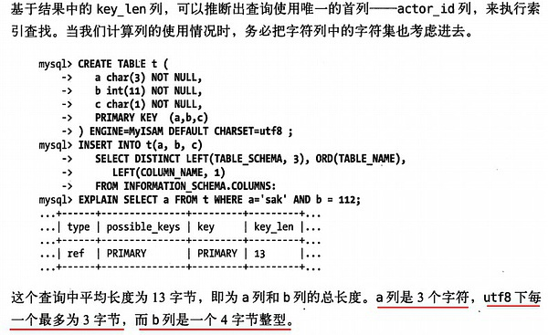

```mysql
mysql>  EXPLAIN SELECT name FROM artist WHERE type='Person' AND gender='Male'\G
*************************** 1. row ***************************
           id: 1
  select_type: SIMPLE
        table: artist
         type: ref
possible_keys: type,type_2
          key: type_2
      key_len: 3
          ref: const,const
         rows: 1282
        Extra: Using index condition
1 row in set (0.00 sec)

mysql> 
```

这就强调了当使用索引时,多余的列没有被用到查询中.如果没有其他查询用到了第三列,那么这就是一个可优化的点以减少索引行长度;

#### 4.4.5  合并WHERE 和ORDER BY 语句

我们已经通过示例演示了如何使用所用优化数据行的限制条件,以及如何使用索引优化排序结果.MySQL还可以利用多列所以哦个执行上述两种操作.

```mysql
mysql> ALTER TABLE album ADD INDEX(name);
mysql>  EXPLAIN SELECT a.name,ar.name,a.first_released FROM album a INNER JOIN artist ar USING(artist_id) WHERE a.name='Greatest Hits' ORDER BY  a.first_released\G
*************************** 1. row ***************************
           id: 1
  select_type: SIMPLE
        table: a
         type: ref
possible_keys: artist_id,name
          key: name
      key_len: 257
          ref: const
         rows: 70
        Extra: Using index condition; Using where; Using filesort
*************************** 2. row ***************************
           id: 1
  select_type: SIMPLE
        table: ar
         type: eq_ref
possible_keys: PRIMARY
          key: PRIMARY
      key_len: 4
          ref: book.a.artist_id
         rows: 1
        Extra: NULL
2 rows in set (0.00 sec)

mysql> 
```

我们可以监理一个同事满足WHERE语句和ORDER BY语句的索引:

```mysql
mysql> ALTER TABLE album ADD INDEX name_release(name,first_released);
mysql>  EXPLAIN SELECT a.name,ar.name,a.first_released FROM album a INNER JOIN artist ar USING (artist_id) WHERE a.name='Greatest Hits' ORDER BY a.first_released\G
*************************** 1. row ***************************
           id: 1
  select_type: SIMPLE
        table: a
         type: ref
possible_keys: artist_id,name,name_release
          key: name_release  #------------------->这里
      key_len: 257
          ref: const
         rows: 70
        Extra: Using where
*************************** 2. row ***************************
           id: 1
  select_type: SIMPLE
        table: ar
         type: eq_ref
possible_keys: PRIMARY
          key: PRIMARY
      key_len: 4
          ref: book.a.artist_id
         rows: 1
        Extra: NULL
2 rows in set (0.00 sec)

mysql> 
```

> 注意:
>
> 优化器也可能为WHERE 条件和ORDER BY语句使用一个索引;而这一点是不能从key_len的值看出来的.
>
> 技巧:
>
> 创建一个能够用于对结果排序时的索引是有难度的;然而在某些频繁地(例如每秒100次)对相同数据进行排序的应用程序中,这样做将会带来很多益处.从使用PROCESSLIST 命令查看sorting results 的症状中,明显可以看出对CPU的影响,以及对一个经过优化的模式和SQL设计的参考方案的强烈需求.


#### 4.4.6 MySQL 优化器的特性

MySQL 可以在WHERE,ORDER BY 以及GROUP BY列中使用索引;然而,一般来说MySQL在一个表上只选择一个索引.从MySQL5.0 开始,在个别例外的情况中优化器可能会使用要给以上的索引,但是在早期的版本中这样做回导致查询运行更加缓慢.最常见的索引合并的操作是两个索引取并集,当用户对两个有高基数的索引执行OR操作时会出现这种索引合并操作.

``` mysql
mysql> SET @@session.optimizer_switch='index_merge_intersection=on';
mysql> EXPLAIN SELECT artist_id,name FROM artist WHERE name='Queen' OR founded=1942\G
*************************** 1. row ***************************
           id: 1
  select_type: SIMPLE
        table: artist
         type: index_merge
possible_keys: name,founded,founded_2
          key: name,founded
      key_len: 257,2
          ref: NULL
         rows: 115
        Extra: Using union(name,founded); Using where  #-->这里
1 row in set (0.05 sec)

mysql> EXPLAIN SELECT artist_id,name FROM artist WHERE name='Queen' AND founded=1942\G
*************************** 1. row ***************************
           id: 1
  select_type: SIMPLE
        table: artist
         type: ref
possible_keys: name,founded,founded_2
          key: name
      key_len: 257
          ref: const
         rows: 1
        Extra: Using index condition; Using where #-->这里
1 row in set (0.01 sec)

mysql> 
```

> 注意:
>
> 在MySQL5.1中首次引入了optimizer_switch系统变量,可以通过启用或禁用这个变量来控制这些附加选项.

第二种类型的索引合并是对两个有少量唯一值的索引取交集,如下所示:

```mysql
mysql> EXPLAIN SELECT artist_id,name FROM artist WHERE type='Band' AND founded=1942\G
*************************** 1. row ***************************
           id: 1
  select_type: SIMPLE
        table: artist
         type: index_merge
possible_keys: type,founded,founded_2
          key: founded,type
      key_len: 2,1
          ref: NULL
         rows: 56
        Extra: Using intersect(founded,type); Using where
1 row in set (0.01 sec)

mysql> 
```

第三种类型的索引合并操作和对两个索引取并集比较类似,当它需要先经过排序:

```mysql
EXPLAIN SELECT artist_id,name FROM artist WHERE name='Queen' OR (founded BETWEEN 1942 AND 1950)\G
*************************** 1. row ***************************
           id: 1
  select_type: SIMPLE
        table: artist
         type: index_merge
possible_keys: name,founded,founded_2
          key: name,founded
      key_len: 257,2
          ref: NULL
         rows: 1324
        Extra: Using sort_union(name,founded); Using where
1 row in set (0.01 sec)

mysql>
```

> 技巧
>
> 应该经常评估多列索引是否比让优化器合并索引效率更高

单个多列索引和多个多列索引到底哪个更有优势?这个问题只有结合特定应用程序的查询类型和查询容量才能给出答案.在各种个不同的查询条件下,将一下高基数列上的那些单列索引进行索引合并能够带来很高的灵活性.

#### 4.4.7查询提示

MySQL中少数介个查询提示会影响性能.这些查询提示有些会影响到整个查询,而有些会影响到每个表索引的用法.

* 总查询提示
  STRIGHE_JOIN

  ```mysql
  mysql> EXPLAIN SELECT album.name,artist.name,album.first_released FROM artist INNER JOIN album USING (artist_id) WHERE album.name='Greatest Hist'\G
  *************************** 1. row ***************************
             id: 1
    select_type: SIMPLE
          table: album
           type: ref
  possible_keys: artist_id,name,name_release
            key: name
        key_len: 257
            ref: const
           rows: 1
          Extra: Using index condition
  *************************** 2. row ***************************
             id: 1
    select_type: SIMPLE
          table: artist
           type: eq_ref
  possible_keys: PRIMARY
            key: PRIMARY
        key_len: 4
            ref: book.album.artist_id
           rows: 1
          Extra: NULL
  2 rows in set (0.04 sec)
  ```


  mysql>  EXPLAIN SELECT STRAIGHT_JOIN album.name,artist.name,album.first_released FROM artist INNER JOIN album USING(artist_id) WHERE album.name='Greatest Hist'\G
  *************************** 1. row ***************************
             id: 1
    select_type: SIMPLE
          table: artist
           type: index
  possible_keys: PRIMARY
            key: name
        key_len: 257
            ref: NULL
           rows: 155209
          Extra: Using index
  *************************** 2. row ***************************
             id: 1
    select_type: SIMPLE
          table: album
           type: ref
  possible_keys: artist_id,name,name_release
            key: artist_id
        key_len: 4
            ref: book.artist.artist_id
           rows: 1
          Extra: Using where
  2 rows in set (0.00 sec)

  mysql> 

  ```

  第一题个查询中可以看出,优化器选择先在album表上执行连接操作.在第二个有STRAIGHT_JOIN提示的查询中,优化器会强制按照表所指定的顺序对name字段做连接.尽管这个查询在两个表上都使用了索引,但第二个查询需要处理的行数比第一个查询多很多,因此在本例中它的效率也更低.

  STRAIGHT_JOIN需要从MySQL对多表连接的处理方式说起，首先要确定以谁为驱动表，也就是说以哪个表为基准，在处理此类问题时，MySQL优化器采用了简单粗暴的解决方法：哪个表的结果集小，就以哪个表为驱动表，通常这都是最佳选择。

     说明：在EXPLAIN结果中，第一行出现的表就是驱动表。

     继续post连接post_tag的例子，MySQL优化器有如下两个选择，分别是：

  1. ​    以album为驱动表，通过album.name索引过滤，结果集257行
  2. ​    以artist为驱动表，通过artist.name索引过滤，结果集155209行

  ​       显而易见，album.name过滤的结果集更小，所以MySQL优化器选择它作为驱动表，

* 索引提示
  除了STRAIGHT_JOIN 查询提示意外,所有索引提示都会被连接语句中的表所使用.可以为每张表定义一个索引的USE,IGNORE 或者FORCE 列表.也可以选择限制索引在查询中JOIN,ORDER BY 或者GROUP BY 部分的使用.在查询的每个表后面都可以添加下面的语法:

  ```mysql
  mysql>  EXPLAIN SELECT artist_id,name,country_id FROM artist WHERE founded =1980 AND type="Band"\G
  *************************** 1. row ***************************
             id: 1
    select_type: SIMPLE
          table: artist
           type: index_merge
  possible_keys: type,founded,founded_2,type_2
            key: founded,type
        key_len: 2,1
            ref: NULL
           rows: 160
          Extra: Using intersect(founded,type); Using where
  1 row in set (0.10 sec)

  mysql> 
  ```

  在这个插叙优化器有多个索引可供选择,但它着重选择了founded索引.

  下面的示例会提示优化器使用某个特定的索引:

  ````mysql
  mysql> EXPLAIN SELECT artist_id,name,country_id FROM artist  USE INDEX (type) WHERE founded =1980 AND type="Band"\G
  *************************** 1. row ***************************
             id: 1
    select_type: SIMPLE
          table: artist
           type: ref
  possible_keys: type
            key: type
        key_len: 1
            ref: const
           rows: 77010
          Extra: Using index condition; Using where
  1 row in set (0.00 sec)

  mysql> 
  ````

  同样也可以要求优化器忽略特定的索引

  ```mysql
  mysql>  EXPLAIN SELECT artist_id,name,country_id FROM artist  IGNORE INDEX (founded,founded_2) WHERE founded =1980 AND type="Band"\G
  *************************** 1. row ***************************
             id: 1
    select_type: SIMPLE
          table: artist
           type: ref
  possible_keys: type,type_2
            key: type_2
        key_len: 1
            ref: const
           rows: 74184
          Extra: Using index condition; Using where
  1 row in set (0.00 sec)

  mysql> 
  ```

  也可以组合

  ```mysql
  mysql> EXPLAIN SELECT artist_id,name,country_id FROM artist  IGNORE INDEX (founded,founded_2)  USE INDEX (type) WHERE founded =1980 AND type="Band"\G
  *************************** 1. row ***************************
             id: 1
    select_type: SIMPLE
          table: artist
           type: ref
  possible_keys: type
            key: type
        key_len: 1
            ref: const
           rows: 77010
          Extra: Using index condition; Using where
  1 row in set (0.00 sec)

  mysql> 
  ```

  **使用MySQL 提示对更改全部的执行路径不会产生影响,因此你可以指定多个提示,使用USE INDEX 提示会让MySQL从指定的索引中选择一个.FORCE INDEX 会对基于开销的优化器产生影响,让优化器更倾向于索引扫描而不是全表扫描**

  > 注意:
  >
  > 在SQL 与uzhong添加提示是有很大风险的.尽管这可能会对查询有帮助,然而数据量睡随着时间的推移而变化会改变查询的有效性.添加或者改变表上的索引并不会影响到一个在特定索引中指定的硬编码SQL语句,所以查询提示应该是你最后考虑的.


  #### 4.4.8复杂查询

### 4.5 添加索引造成的影响

#### 4.5.1 DML影响

在表上添加索引会影响写操作的性能.这一点可以很明显地从本章使用的artist表中看出.查看目前此表的定义可以看到此表上有很多索引.


* 重复索引在各种索引优化的技术中最简单的就是删除重复的索引.虽然找到重复的索引很容易,但是还有其他情况发生,例如一个索引与主码或者某些其他索引的子集相匹配.任何包含在其他索引的最左边部分中的索引都属于重复索引,且不会被使用; 

    冗余索引和重复索引有一些不同，如果创建了索引（a,b），再创建索引（a）就是冗余索引，因为这只是前面一个索引的前缀索引，因此（a,b）也可以当作(a)来使用，但是（b,a）就不是冗余索引，索引(b)也不是，因为b不是索引（a,b）的最左前缀列，另外，其他不同类型的索引在相同列上创建（如哈希索引和全文索引）不会是btree索引的冗余索引。

  ​

  例如：表userinfo，myisam引擎，有100W行记录，每个state_id值大概2W行，在state_id列有一个索引对下面的查询有用：如：select count(*) from userinfo where state_id=5;测试每秒115次QPS

  ​

  对于下面的查询这个state_id列的索引就不太顶用了，每秒QPS是10次

  select state_id,city,address from userinfo where state_id=5;

   

  　　如果把state_id索引扩展为(state_id,city,address)，那么第二个查询的性能更快了，但是第一个查询却变慢了，如果要两个查询都快，那么就必须要把state_id列索引进行冗余了。但如果是innodb表，不冗余state_id列索引对第一个查询的影响并不明显，因为innodb没有使用索引压缩，myisam和innmodb表使用不同的索引策略的select查询的qps测试结果（以下测试数据仅供参考）：

  ​                    只有state_id列索引    只有state_id_2索引    同时有两个索引

  myisam,第一个查询    114.96                25.40                112.19

  myisam,第二个查询    9.97                  16.34                16.37

  innodb,第一个查询    108.55                100.33               107.97

  innodb,第二个查询    12.12                 28.04                28.06

   

  从上图中可以看出，两个索引都有的时候，缺点是成本更高，下面是在不同的索引策略时插入innodb和myisam表100W行数据的速度（以下测试数据仅供参考）：

  ​                                            　　　　　　只有state_id列索引    同时有两个索引

  innodb,对有两个索引都有足够的内容的时候       80秒                136秒

  myisam,只有一个索引有足够的内容的时候        72秒                470秒

   

  　　可以看到，不论什么引擎，索引越多，插入速度越慢，特别是新增索引后导致达到了内存瓶颈的时候。解决冗余索引和重复索引的方法很简单，删除这些索引就可以了，但首先要做的是找出这样的索引，可以通过一些复杂的访问information_schema表的查询来找，不过还有两个更简单的方法，使用：shlomi noach的common_schema中的一些视图来定位，也可以使用percona toolkit中的pt-dupulicate-key-checker工具，该工具通过分析表结构来找出冗余和重复的索引，对于大型服务器来说，使用外部的工具更合适，如果服务器上有大量的数据或者大量的表，查询information_schema表可能会导致性能问题。建议使用pt-dupulicate-key-checker工具。

   

  在删除索引的时候要非常小心：

  　　如果在innodb引擎表上有where a=5 order by id 这样的查询，那么索引（a）就会很有用，索引(a,b)实际上是（a,b,id）索引，这个索引对于where a=5 order by id 这样的查询就无法使用索引做排序，而只能使用文件排序了。所以，建议使用percona工具箱中的pt-upgrade工具来仔细检查计划中的索引变更。

  

* 索引的使用
  MYSQL 机制的一个缺点是不能确定索引的使用.只有分析完成所有SQL语句才能知道哪些索引没有被使用.找出使用到的没有使用到的索引是非常重要的.索引会影响写操作的性能,并且会占用磁盘空间从而影响你的备份和恢复策略.有些低效的索引还会占用很大的内存资源.

#### 4.5.2 DDL 影响

随着表的大小的不断正常,对性能的影响也不断加大.例如,在逐表上添加索引平均需要20-30秒.

在以往版本中,ALTER 语句的开销是阻塞其他语句,就像创建一个新版本的表那样.在这期间可以SELECT 数据,但根据标准的升级法则,任何DML操作都会导致所有语句被阻塞.当婊的大小有1G或者100G,这个阻塞时间可能会非常长.但比较近期的版本在包括MySQL产品方面的创新的解决方案方面都有了很多改进.

添加索引带来的额影响并不总是一样,也会有些例外情况InnoDB提供了快速创建索引的特性.其他搜索引擎也可以以不同方式来实现执行锁定的快速索引的创建,Tokutek 就是其中一个.

对磁盘空间的影响也是一个重要的考虑因素,尤其是当你在InnoDB中,使用默认的公共表空间配置的时候.MySQL会为你在InnoDB中使用默认的公共表空间配置的时候.MySQL会为例的表创建一份副本.如果表的大小有200GB,那么自信ALTER TABLE使你需要至少200GB额外的磁盘空间.使用InnoDB时,在执行期间这些额外的磁盘空间会被添加到公共表空间中.这部分磁盘空间在命令完成后不会被文件系统回收,而是当InnoDB需要额外磁盘空间时在内部被重复利用,尽管你可以调整策略让每个表用单独的表空间,但对于写操作密集的系统,这也是有影响的.

> 技巧:
>
> 有一些技巧可以阻塞操作减少到最低限度.你可以选择使用一个高可用性的容错度搞的主表复制技术来支持在线变更表结构.比如: oak-inline-alter-table工具,http://code.openark.org/blog/mysql/online-alter-table-now-available-in-openark-kit
>
> ```bash
> oak-online-alter-table -u root --ask-pass --socket=/tmp/mysql.sock --database=world --table=City --alter="MODIFY Id BIGINT UNSIGNED AUTO_INCREMENT, ADD COLUMN Mayor VARCHAR(64) CHARSET utf8, DROP COLUMN District, ADD KEY(Population)"
> ```
>
> #### How does it work?
>
> Well, there are some wiki pages [[1\]](http://code.google.com/p/openarkkit/wiki/OakOnlineAlterTableSteps) [[2\]](http://code.google.com/p/openarkkit/wiki/OakOnlineAlterTableConcurrency) [[3\]](http://code.google.com/p/openarkkit/wiki/OakOnlineAlterTableConstraints) which explain the details, but in general it goes as follows:
>
> 1. The utility creates an empty 'ghost'  table, a copy of the original
> 2. The ghost table is ALTERed (or left unchanged, if no ALTER specified)
> 3. Triggers are created on the original table, which propagate changes to the ghost table.
> 4. In two passes, data is copied from the original table to the ghost table, then reviewed for deletion.
> 5. The ghost table is renamed to take place of the original table; the original table is dropped.
>
> What kind of ALTERs are supported?
>
> - ADD COLUMN (new column must have a default value)
> - DROP COLUMN (as long as there's still a shared single-column UNIQUE KEY between the old table and the altered one)
> - MODIFY COLUMN (change type, including UNIQUE KEY columns)
> - ADD KEY (normal, unique, fulltext etc.)
> - DROP KEY (as long as there's still a shared single-column UNIQUE KEY between the old table and the altered one)
> - Change ENGINE: works, but great care should be taken when dealing with non-transactional engines
> - Adding FOREIGN KEY constraints is possible
> - More... Not all ALTERS have been tested, e.g. CONVERT, partition handling...
> - none: it is possible to just do an online rebuild of the table, with no modification to its structure
>
> The following are not allowed *while the utility is running*:
>
> - An ALTER TABLE on the original table (well, obviously)
> - A TRUNCATE on the original table
> - LOAD DATA INFILE into the original table
> - OPTIMIZE on the original table

#### 4.5.3 磁盘空间影响

使用第二章介绍的INFORMATION_SCHEMA.TABLES查询可以查看本章使用的album表的大小

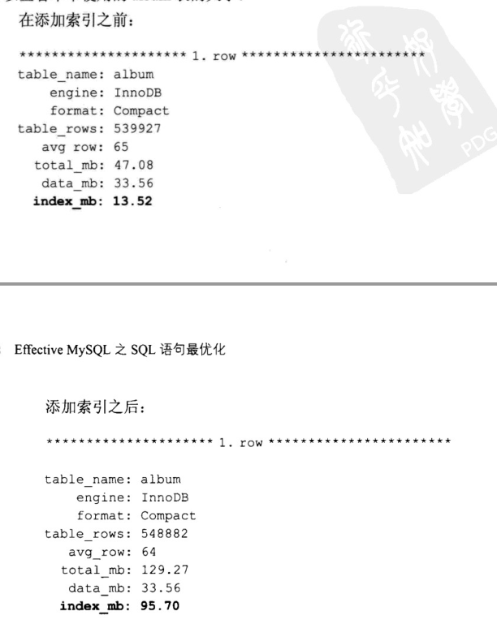

可以看到添加索引后表中的索引空间的使用量增加了7倍.根据你选择的备份和恢复程序,添加索引也会对备份和恢复这两个过程需要的时间产生影响.添加索引还会有其他方面的影响.所以在添加索引之前,一定要理解并且考虑到这些影响.

使用InnoDB也会对磁盘使用空间产生直接影响,这些影响取决于所选择的主码以及如何使用这些主码.对于非主码索引,总是有一个主码索引附在非主码索引的记录后面.因此对于InnoDB表,一定更要在主码中使用尽可能小的数据类型.

**也有一种例外情况存在,更大的磁盘空间占用从长期角度也会对性能有好的影响.在表容量极大的情况下(例如几百GB),当所有查询都使用主码排序时,一个有序的但并不是按次序排列的主码可能产生更加有序的磁盘活动.尽管填充因子导致了庞大的数据总量,但在一个高并发系统中按照主码速录获取大量行的总时间会提升磁盘细嫩和总体查询性能.这是个很罕见的示例,它强调了在考虑总体查询性能的长期益处时,信息的监控数据以及合适的产品空间占用量的测试必不可少.**

* 页面填充因子
  选择用现实中存在的属性做主码而不是用现实中无意义的编,会对默认页面的额填充因子产生直接影响.对于一个现实中无意义的病号,当InnoDB会把数据插入一个使用率已经达到15/16的页面时将填充页面,因为主码是自增加的编号.当主码是现实中存在的属性时,INnoDB插入新数码时,会尝试吧页面分割开来今年降低数据重新组织的次数,
* 非主码索引
  在InnDB中由B-树内部实现的非主码索引和MyISAM中B-树非主码索引有显著不同.InnoDB在非主码索引中使用了主码的值,而不是一个指向主码的指针.在每个索引记录后面都附上了一个可应用的主码的副本.当书居库表有一个长度为40字节的主码,并且你还拥有15个索引时,引入一个更短的主码可以大幅度减少索引的空间占有量.这种使用主码的值的思想方式与InnoDB内部的主码散列算法结合能够改善性能.

### 4.6 MySQL的限制和不足

#### 4.6.1 基于开销的优化器

MySQL 用基于开销的优化器来调整可能的查询树以创建最优的SQL执行路径.MySQL通过生成的统计信息来辅助优化器的能力是有限的.MySQL支持数量有限的索引提示用于帮助优化器选择一个合适的路径.

#### 4.6.2指定QEP

MySQL不支持位给定查询指定QEP.在MySQL中,没有办法为一个数据一直随时间变化的查询定义一个QEP.这也影响了对QEP的选择.也导致了需要为每个查询的执行计划确定QEP.

#### 4.6.3索引的统计信息

MySQL 支持有限的索引统计信息,这些统计信息因存储引擎不同而不同.是哟个MyISAM存储引擎的话,ANALYZE TABLE 命令会为书居库生成统计信息.

#### 4.6.4 基于函数的索引

目前MySQL不支持基于函数的索引.而且,在已有的索引中使用函数会导致性能下降.MYSQL支持部分列的索引,实际上就是索引左边的子串.我们将在第五章详细讨论这个问题.

你也不能指定一个索引的相反序列,因为事实上所有的所述都是圣墟排列的.当需要对数据排序时,如果有DESC关键字,MySQL会反向遍历一个已有的索引.

#### 4.6.5 一个表上的多个索引

默认情况下,MySQL会对一个表只使用一个索引,但是有5种例外情况.

## 5 创建更好的MySQL索引
本章将介绍两个其他的索引技术
* 创建覆盖索引
* 创建局部列索引
### 5.1 更好的索引

即使对执行时间的改进仅仅是数毫秒,但对于一个每秒执行1000次的查询来说,这也是非常有意义的性能提升.例如,吧一个原本需要20毫秒执行的每秒运营1000次的查询的执行之间缩短4毫秒,这对于优化MySQL语句来说是至关重要的.
#### 5.1.1 覆盖索引

一个包含查询所需字段的索引称为“覆盖索引”,就是SELECT * ,* 组成一个索引

```mysql
mysql>  EXPLAIN SELECT artist_id,name,founded FROM artist WHERE founded=1969\G
*************************** 1. row ***************************
           id: 1
  select_type: SIMPLE
        table: artist
         type: ALL
possible_keys: NULL
          key: NULL
      key_len: NULL
          ref: NULL
         rows: 155209
        Extra: Using where
1 row in set (0.00 sec)

mysql> ALTER TABLE artist ADD INDEX(founded);
mysql>  EXPLAIN SELECT artist_id,name,founded FROM artist WHERE founded=1969\G
*************************** 1. row ***************************
           id: 1
  select_type: SIMPLE
        table: artist
         type: ref
possible_keys: founded
          key: founded
      key_len: 2
          ref: const
         rows: 248
        Extra: Using index condition
1 row in set (0.00 sec)
mysql> 
-- ALTER TABLE artist DROP INDEX founded,founded_2
```
在Where 条件用到的founded 列上添加索引之后,查询耗时减少了,这样一个简单的一个该懂就可以让查询执行速度比原来提高了97%.然而,还可以创建一个使这条查询执行起来更快的索引.

```mysql
mysql>  ALTER TABLE artist DROP INDEX founded, ADD INDEX founded_name(founded,name)

mysql>  EXPLAIN SELECT artist_id,name,founded FROM artist WHERE founded=1969\G
*************************** 1. row ***************************
           id: 1
  select_type: SIMPLE
        table: artist
         type: ref
possible_keys: founded_name
          key: founded_name
      key_len: 2
          ref: const
         rows: 247
        Extra: Using where; Using index
1 row in set (0.00 sec)

mysql> 
```

使用了多列索引支付,查询执行只需要1.2毫秒了,这比刚才的查询快乐4倍,查询执行时间比第一次优化又减少80%,从总体来看我们节省了99%的查询执行时间.

尽管我们是通过多列索引来获得这样的性能提升的,但改善查询的真正因素并不是因为额外增加的列限制了访问的行数.使用第4章介绍的分析技术,我们可以看到这个多列索引值占用了2个字节.可能你会认为这个多列索引中额外的列是无效的,但要注意在Extra 这一列中显示了Using index.

当QEP在Extra列显示Using index 时,这并不意味着在访问底层表数据时使用到了索引,这表示只有这个索引才是满足查询所有要求的.这种索引可以为大型查询或者平方执行的查询带来显著的性能提升,它被称为覆盖索引.

覆盖索引得名于它满足你查询中给定表用到的所有的列.项要创建一个覆盖索引,这个索引必需包含指定表上包括WHERE 语句,ORDER BY 语句,GROUP BY 语句(如果有的话)以及SELECT 语句中所有列.

看了覆盖索引的介绍之后,你可能会好奇为什么artist_id这一列没有在索引中?对那些选择跳过第三章中介绍的索引的理论知识的读者来说,你们可以需要了解InnoDB的非主码索引的一个重要的特性.在InnoDB中,主码的值会被附加在非主码索引的每个对应记录后面,因此没有必要在非主码索引中指定主码.这一重要特性意味着InnoDB引擎中所有非主码索引都隐含主码列了.并且对于那些从MyISAM存储引擎转换过来的表,通常会在它们InnoDB表索引中将主码添加为最后一个元素.

> 技巧
>
> 有很多理由可以说服用户不要在SQL查询中使用SELECT * ,上面提到的就是其中一个原因,说明如果在select 语句中只包含真正需要的列,就能够通过创建合适的索引来获得更好的SQL优化.
>
>  

```mysql
mysql> EXPLAIN SELECT artist_id,name,founded FROM artist WHERE founded=1969 AND type='Person'\G
*************************** 1. row ***************************
           id: 1
  select_type: SIMPLE
        table: artist
         type: ref
possible_keys: type,type_2,founded_name
          key: founded_name
      key_len: 2
          ref: const
         rows: 247
        Extra: Using index condition; Using where
1 row in set (0.05 sec)				===================>这里

mysql> ALTER TABLE artist DROP INDEX founded_name ,ADD INDEX founded_type_name(founded,type,name);
Query OK, 0 rows affected (0.49 sec)
Records: 0  Duplicates: 0  Warnings: 0

mysql> EXPLAIN SELECT artist_id,name,founded FROM artist WHERE founded=1969 AND type='Person'\G
*************************** 1. row ***************************
           id: 1
  select_type: SIMPLE
        table: artist
         type: ref
possible_keys: type,type_2,founded_type_name
          key: founded_type_name
      key_len: 3
          ref: const,const
         rows: 213
        Extra: Using where; Using index
1 row in set (0.00 sec)                 ===================>这里

mysql>
```

以上使用了修改之后的索引,我们还可以通过key_len的值为3来确定type列现在也是很优化器限制的一部分,并且可以看出founded_type_name是覆盖索引,执行查询在耗时1.3毫秒


> 警告:
>
> 创建这些索引只是用来描述确认覆盖索引的过程,但在生产环境中他们可能并不是你想的索引.由于数据集大小有限,我们在这些离职中使用了一个长字符列.睡着数据容量的证件,尤其是超过内存和磁盘最大容量的时候,为一个大型列创建索引可能会对系统整体性能有影响.覆盖索引对于那些使用了很多较少长度的主码和外键约束的大型规范模式来说是理想的优化方式

#### 5.1.2 存储引擎的含义

```mysql
mysql> ALTER TABLE artist ENGINE =MyISAM
mysql> EXPLAIN SELECT artist_id,name,founded FROM artist WHERE founded=1969 AND type='Person'\G
*************************** 1. row ***************************
           id: 1
  select_type: SIMPLE
        table: artist
         type: ref
possible_keys: founded_type_name
          key: founded_type_name
      key_len: 3
          ref: const,const
         rows: 207
        Extra: Using index condition
1 row in set (0.00 sec)

mysql> 
```

这个查询并没有使用之前QEP所给出的索引的全部.MyISAM的平均查询时间大约为3.3毫秒,比优化过的InnoDB语句慢,但是比没有使用覆盖索引的查询快.为了确定这个重要的底层架构的不同点,我们修改这个索引来满足MyISAM引擎的全部要求

```mysql
mysql> ALTER TABLE artist DROP INDEX founded_type_name,ADD INDEX founded_myisam(founded,type,name,artist_id);
mysql> EXPLAIN SELECT artist_id,name,founded FROM artist WHERE founded=1969 AND type='Person'\G
*************************** 1. row ***************************
           id: 1
  select_type: SIMPLE
        table: artist
         type: ref
possible_keys: founded_myisam
          key: founded_myisam
      key_len: 3
          ref: const,const
         rows: 209
        Extra: Using where; Using index
1 row in set (0.00 sec)


## 重置表使用的存储引擎
mysql> ALTER TABLE artist DROP INDEX founded_myisam, ENGINE=InnoDB;
```

#### 5.1.3 局部索引

尽管索引可以用来限制需要查询的行数,但如果MySQL需要获取大量行中的更多列的数据,那么创建具有更小行宽度的小型索引则会更加高效.就像在创建覆盖索引的示例里面看到的那样,使用一个索引来做更多的工作可以显著地改善SQL查询的性能.当数据大小超过屋里内存资源时,你在选择使用说一个的时候就要考虑到物流资源,而不是仅仅考虑查询执行计划.

首先从album表中删除已有的索引:
album表应该只有一个定义好的主码索引.我们可以通过查询定义好的INFORMATION_SCHEMA.TABLE查询来确定表和索引空间的大小.

```mysql
mysql> SHOW CREATE TABLE album\G
*************************** 1. row ***************************
       Table: album
Create Table: CREATE TABLE `album` (
  `album_id` int(10) unsigned NOT NULL,
  `artist_id` int(10) unsigned NOT NULL,
  `album_type_id` int(10) unsigned NOT NULL,
  `name` varchar(255) NOT NULL,
  `first_released` year(4) NOT NULL,
  `country_id` smallint(5) unsigned DEFAULT NULL,
  PRIMARY KEY (`album_id`)
) ENGINE=InnoDB DEFAULT CHARSET=latin1
1 row in set (0.00 sec)

mysql> 
```

album表应该只有一个定义好的主码索引.我们可以通过查询定义好的INFORMATIOn_SCHEMA.TABLES查询来确定表和索引空间的大小:

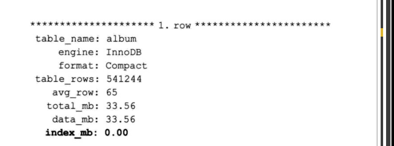

可以看出这个表的所用不占用空间,因为InnoDB的主码索引是聚集索引,并且与顶层数据相结合.**如果这个表使用的是MyISAM存储引擎,我们可以看到一下信息重点强调了数据和索引的占用空间**.

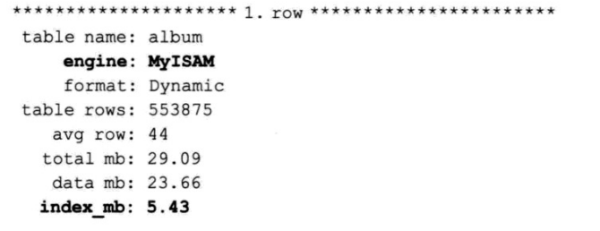


现在要在album表的name列上添加一个索引

```mysql
mysql> ALTER TABLE album ADD INDEX(name);
mysql> source tablesize.sql
*************************** 1. row ***************************
table_schema: book
  table_name: album
      ENGINE: InnoDB
      format: Compact
  table_rows: 58353
     avg_row: 72
    total_mb: 80
     data_mb: 42
    index_mb: 38
       today: 2017-06-17
```

在name 列上的新的索引使用了大约30MB的磁盘空间.现在让我们为name内创建一个更紧凑的索引:

```mysql
mysql> ALTER TABLE album DROP INDEX name,ADD INDEX(name(10));

```

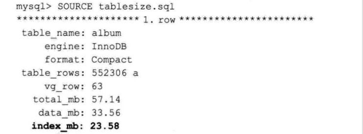


这里考虑的是如何减少索引占用的空间.一个更少的索引意味着更少的磁盘I/O开销,而这又意味着能更快地访问到需要访问的行,尤其是当磁盘上的索引和数据列远大于可用的系统内存时,这样获得的性能改将会超过一个非唯一的并且拥有低技术的索引带来的影响.

局部索引时候适用取决于数据是如何访问的.之前介绍覆盖索引时,你可以看到记录一个短小版本的name列不会对执行过的SQL有任何的好处.最大的益处只有当你在被索引的列上添加限制条件时才能体现出来.

```mysql
mysql>  ALTER TABLE album DROP INDEX name,ADD INDEX(name(20));
Query OK, 0 rows affected (0.20 sec)
Records: 0  Duplicates: 0  Warnings: 0

mysql> EXPLAIN SELECT artist_id,name,founded FROM artist WHERE name LIKE 'Queen%'\G
*************************** 1. row ***************************
           id: 1
  select_type: SIMPLE
        table: artist
         type: range
possible_keys: name
          key: name
      key_len: 257
          ref: NULL
         rows: 21
        Extra: Using index condition
1 row in set (0.06 sec)

mysql> 
```


## 6 MySQL配置选项

* 内存相关的系统变量
* 日志和工具系统变量
* 各种查询相关的系统变量

### 6.1 内存相关的系统变量

一定要注意的是,MySQL对于进程分配和内存存储引擎的分配是没有限制的.错误的系统调整会导致系统可用的内存资源耗尽.

这些MySQL系统变量可以在MySQL配置文件中定义并在启动时加载.很多MySQL变量是动态的,也就是说,可以运行客户端的SET命令更改.

> 注意:
>
> 在MySQL中,应用会话其实与一个给定的连接有关.默认情况下,一个连接也就是一个线程---即一个连接有且只有一个线程.


```mysql
mysql> show variables  like '%query_cache%';
```

* 全局内存缓冲区

| MySQL变量名                        | 描述                                       |
| ------------------------------- | ---------------------------------------- |
| key_buffer_size                 | 这个变量定义了MyISAM索引码的缓冲区的大小,通常这个变量也被称为码缓存.可以定义多个不同大小的已命名的码缓冲区 |
| innodb_buffer_pool_size         | 这个变量定义了InnoDB缓冲池的大小,InnoDB缓冲池是存储数据和索引页的主要场所 |
| innodb_additional_mem_pool_size | 这个变量定义了InnoDB的数据字典以及内部数据接口缓冲区的大小         |
| query_cache_size                | 这个动态变量定义了查询缓存的大小.查询缓存可以用来缓存经常执行的SELECT 语句 |

* 全局/会话内存缓冲区

| max_heap_table_size | 这个动态变量定义了一个MEMORY存储引擎表的最大容量              |
| ------------------- | ---------------------------------------- |
| tmp_table_size      | 这个动态变量定义了一个内部基于内存的临时表(在此表被修改并写入磁盘之前)的最大容量.这个变量和max_heap_table_size密切相关 |
|                     |                                          |
|                     |                                          |
|                     |                                          |
|                     |                                          |

* 会话缓冲区

| join_bufffer_size   | 这个动态变量定义当索引不发满足连接条件时在两个表之间做全表连接操作能够使用的内存缓冲区的大小 |
| ------------------- | ---------------------------------------- |
| sort_buffer_size    | 这个动态变量义了当索引无法满足需要的顺序信息时对结果排序能够使用的内存缓冲    |
| read_buffer_size    | 这个动态变量定义了连续数据扫描时能使用的内存缓冲区大小              |
| read_md_buffer_size | 这个动态变量定义了有序(也就是不连续的)数据扫描时能够使用的内存缓冲区大小    |


> 警告
>
> 一个常见的问题是管理员没有认识到这4个缓冲区是以每个线程为基础定义的.在MySQL 5.1以及更高的版本中,sort_buffer_size缓冲区的默认值可以在128K/256K-2M之间变化.如果一个缓冲区的大小定义为10M或者100M的话,就会对查询和系统性能产生相反的影响.在没有证据能证明性能提升的情况下,最好的方法是恢复这4个变量的默认值来保证总体内存利用率最大
>
> ````mysql
> mysql> show  variables  like '%sort_buffer_size%';
> +-------------------------+---------+
> | Variable_name           | Value   |
> +-------------------------+---------+
> | innodb_sort_buffer_size | 1048576 |
> | myisam_sort_buffer_size | 8388608 |
> | sort_buffer_size        | 1048576 |
> +-------------------------+---------+
> 3 rows in set (0.00 sec)
>
> mysql> show global variables  like '%sort_buffer_size%';
> +-------------------------+---------+
> | Variable_name           | Value   |
> +-------------------------+---------+
> | innodb_sort_buffer_size | 1048576 |
> | myisam_sort_buffer_size | 8388608 |
> | sort_buffer_size        | 1048576 |
> +-------------------------+---------+
> 3 rows in set (0.00 sec)
>
> mysql> 
> ````

#### 6.1.1 key_buffer_size

key_buffer_size 是只存储MyISAM索引信息的全局内存缓冲区.在对应的.MYI文件中的索引数据从磁盘上被读取出来然后存如这个缓冲区.想要调整变量key_buffer_size的大小,只需要简单地统计所有的MyISAM表中的总索引的大小,然后随着数据随时间增长不断调整即可

.

当观察单个MySQL连接时,一个没调整好的MyISAM索引码缓冲区能够呈现出不同状态.在SHOW FULL PROCESSLIST 的State列种,值Reparing the keycache是一个明显的子表,它指出当前索引码缓冲区大小不足以执行当前运营SQL语句.这将导致额外的磁盘I/O开销.


想要了解更高级调整信息可以使用以下的变量:key_cache_age_threshold,ley_cache_block_size,key_cache_division_limit和preload_buffer_size

#### 6.1.2 命名码缓冲区

除了默认的MyISAM码缓冲区,MYSQL支持其他的命名码缓冲区.这使得管理员能够为MyISAM索引定义专用的内存池,该MyISAM可以为命名码缓冲区分配和指定给定表.下面是创建一个已命名64M的缓存的实例.

```mysql
mysql>SET GLOBAL hot.key_buffer_size=1024*1024*64;
```

也可以在MYSQL配置文件my.cnf中定义这个缓存

> 注意:
>
> 在MySQL配置文件中,可以用字节或者KB,MB和GB这样的通用格式来定义变量的大小.当使用Set命令动态定义一个变量时候,只有以直接为单位的数字值是合法的.

可以使用CACHE INDEX 语句把表索引分配到指定的命令缓存上:

```mysql
mysql>CACHE INDEX table1,table2 IN hot
```

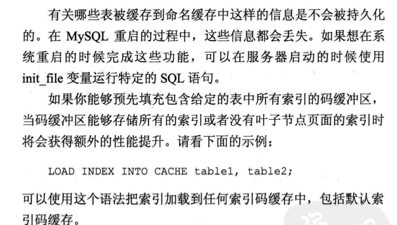


#### 6.1.3 innodb_buffer_pool_size

innodb_buffer_pool_size 是用来存储所有的InnoDB数据和所有的全局内存缓冲区/对完全使用InnoDB引擎的模式来说.这是最重要的缓冲区,一定要正确分配.不正确的分配这个缓冲区的空间可能导致额外的磁盘I/O开销并降低查询性能.


对小型系统来说,可以用所有InnoDB表的容量加上一个小的额外开销来计算出这个缓冲区的合适大小.如果你只有一个有限的1.7GB的RAW存储器的Amazon Web Service 小实例上分配1GB的InnoDB缓冲区,而总书居库大小仅有200MB时,你就等于分配了不必要的内存空间.

对于这个变量,没有最好的估计大小的方式,因为还有很多其他因素都会影响到MySQL的内存使用量常见的方法是把这个变量设定为RAM空间的80%,当在很多清苦那个下这样设定也是不合理的.

对于这个变量,没有最好的

可以使用SHOW GLOBAL STATUS或者SHOW ENGINE INNODB STATUS 命令来监控InnoDB缓冲池的使用情况

```mysql
mysql> SHOW GLOBAL STATUS LIKE 'innodb_buffer%';
+---------------------------------------+--------------+
| Variable_name                         | Value        |
+---------------------------------------+--------------+
| Innodb_buffer_pool_dump_status        | not started  |
| Innodb_buffer_pool_load_status        | not started  |
| Innodb_buffer_pool_pages_data         | 1129409      |
| Innodb_buffer_pool_bytes_data         | 18504237056  |
| Innodb_buffer_pool_pages_dirty        | 0            |
| Innodb_buffer_pool_bytes_dirty        | 0            |
| Innodb_buffer_pool_pages_flushed      | 17265447     |
| Innodb_buffer_pool_pages_free         | 6661316      |
| Innodb_buffer_pool_pages_misc         | 73587        |
| Innodb_buffer_pool_pages_total        | 7864312      |
| Innodb_buffer_pool_read_ahead_rnd     | 0            |
| Innodb_buffer_pool_read_ahead         | 319260       |
| Innodb_buffer_pool_read_ahead_evicted | 0            |
| Innodb_buffer_pool_read_requests      | 863564854575 |
| Innodb_buffer_pool_reads              | 661494       |
| Innodb_buffer_pool_wait_free          | 0            |
| Innodb_buffer_pool_write_requests     | 98632078     |
+---------------------------------------+--------------+
17 rows in set (0.00 sec)

mysql> SHOW ENGINE INNODB STATUS
----------------------
BUFFER POOL AND MEMORY
----------------------
Total memory allocated 131868917760; in additional pool allocated 0
Dictionary memory allocated 3580392
Buffer pool size   7864312
Free buffers       6661276
Database pages     1129444
Old database pages 417061
Modified db pages  16
Pending reads 0
Pending writes: LRU 0, flush list 0, single page 0
Pages made young 3814, not young 0
0.00 youngs/s, 0.00 non-youngs/s
Pages read 1019521, created 109923, written 17274721
0.00 reads/s, 0.05 creates/s, 30.52 writes/s
Buffer pool hit rate 1000 / 1000, young-making rate 0 / 1000 not 0 / 1000
Pages read ahead 0.00/s, evicted without access 0.00/s, Random read ahead 0.00/s
LRU len: 1129444, unzip_LRU len: 0
I/O sum[0]:cur[272], unzip sum[0]:cur[0]
----------------------
INDIVIDUAL BUFFER POOL INFO
----------------------
---BUFFER POOL 0
Buffer pool size   983039
Free buffers       831614
Database pages     142221
Old database pages 52516
Modified db pages  3
Pending reads 0
Pending writes: LRU 0, flush list 0, single page 0
Pages made young 479, not young 0
0.00 youngs/s, 0.00 non-youngs/s
Pages read 128725, created 13496, written 2861564
0.00 reads/s, 0.00 creates/s, 4.43 writes/s
Buffer pool hit rate 1000 / 1000, young-making rate 0 / 1000 not 0 / 1000
Pages read ahead 0.00/s, evicted without access 0.00/s, Random read ahead 0.00/s
LRU len: 142221, unzip_LRU len: 0
I/O sum[0]:cur[34], unzip sum[0]:cur[0]
---BUFFER POOL 1
Buffer pool size   983039
Free buffers       832076
Database pages     141757
Old database pages 52345
Modified db pages  0
Pending reads 0
Pending writes: LRU 0, flush list 0, single page 0
Pages made young 384, not young 0
0.00 youngs/s, 0.00 non-youngs/s
Pages read 128376, created 13381, written 1670670
0.00 reads/s, 0.00 creates/s, 2.90 writes/s
Buffer pool hit rate 1000 / 1000, young-making rate 0 / 1000 not 0 / 1000
Pages read ahead 0.00/s, evicted without access 0.00/s, Random read ahead 0.00/s
LRU len: 141757, unzip_LRU len: 0
I/O sum[0]:cur[34], unzip sum[0]:cur[0]
---BUFFER POOL 2
Buffer pool size   983039
Free buffers       833477
Database pages     140284
Old database pages 51802
Modified db pages  0
Pending reads 0
Pending writes: LRU 0, flush list 0, single page 0
Pages made young 500, not young 0
0.00 youngs/s, 0.00 non-youngs/s
Pages read 126391, created 13893, written 2309364
0.00 reads/s, 0.00 creates/s, 4.43 writes/s
Buffer pool hit rate 1000 / 1000, young-making rate 0 / 1000 not 0 / 1000
Pages read ahead 0.00/s, evicted without access 0.00/s, Random read ahead 0.00/s
LRU len: 140284, unzip_LRU len: 0
I/O sum[0]:cur[34], unzip sum[0]:cur[0]
---BUFFER POOL 3
Buffer pool size   983039
Free buffers       833008
Database pages     140848
Old database pages 52012
Modified db pages  1
Pending reads 0
Pending writes: LRU 0, flush list 0, single page 0
Pages made young 494, not young 0
0.00 youngs/s, 0.00 non-youngs/s
Pages read 127227, created 13621, written 2604045
0.00 reads/s, 0.00 creates/s, 3.67 writes/s
Buffer pool hit rate 1000 / 1000, young-making rate 0 / 1000 not 0 / 1000
Pages read ahead 0.00/s, evicted without access 0.00/s, Random read ahead 0.00/s
LRU len: 140848, unzip_LRU len: 0
I/O sum[0]:cur[34], unzip sum[0]:cur[0]
---BUFFER POOL 4
Buffer pool size   983039
Free buffers       833430
Database pages     140422
Old database pages 51854
Modified db pages  4
Pending reads 0
Pending writes: LRU 0, flush list 0, single page 0
Pages made young 509, not young 0
0.00 youngs/s, 0.00 non-youngs/s
Pages read 126788, created 13634, written 2252634
0.00 reads/s, 0.05 creates/s, 6.62 writes/s
Buffer pool hit rate 1000 / 1000, young-making rate 0 / 1000 not 0 / 1000
Pages read ahead 0.00/s, evicted without access 0.00/s, Random read ahead 0.00/s
LRU len: 140422, unzip_LRU len: 0
I/O sum[0]:cur[34], unzip sum[0]:cur[0]
---BUFFER POOL 5
Buffer pool size   983039
Free buffers       833048
Database pages     140826
Old database pages 51998
Modified db pages  2
Pending reads 0
Pending writes: LRU 0, flush list 0, single page 0
Pages made young 441, not young 0
0.00 youngs/s, 0.00 non-youngs/s
Pages read 127762, created 13064, written 1585218
0.00 reads/s, 0.00 creates/s, 2.43 writes/s
Buffer pool hit rate 1000 / 1000, young-making rate 0 / 1000 not 0 / 1000
Pages read ahead 0.00/s, evicted without access 0.00/s, Random read ahead 0.00/s
LRU len: 140826, unzip_LRU len: 0
I/O sum[0]:cur[34], unzip sum[0]:cur[0]
---BUFFER POOL 6
Buffer pool size   983039
Free buffers       832571
Database pages     141252
Old database pages 52161
Modified db pages  4
Pending reads 0
Pending writes: LRU 0, flush list 0, single page 0
Pages made young 507, not young 0
0.00 youngs/s, 0.00 non-youngs/s
Pages read 127071, created 14181, written 2100458
0.00 reads/s, 0.00 creates/s, 3.81 writes/s
Buffer pool hit rate 1000 / 1000, young-making rate 0 / 1000 not 0 / 1000
Pages read ahead 0.00/s, evicted without access 0.00/s, Random read ahead 0.00/s
LRU len: 141252, unzip_LRU len: 0
I/O sum[0]:cur[34], unzip sum[0]:cur[0]
---BUFFER POOL 7
Buffer pool size   983039
Free buffers       832052
Database pages     141834
Old database pages 52373
Modified db pages  2z
```

总共查过50个InnoDB相关的系统变量.所有的这些变量都以innodb_前缀开头.哪些会影响到整体系统性能并且应该在定义innodb_key_buffer_size变量时应该考虑到的InnoDB变量包括:
innodb_buffer_pool_instances(从5.5开始)
innodb_max_dirty_page_pct
innodb_thread_concurrency
innodb_spin_wait_delay
innodb_purge_threads(从5.5开始)
innodb_checksums
innodb_file_per_table
innodb_log_file_size


#### 6.1.4 innodb_additional_mem_pool_size

innodb_additional_mem_pool_size 变量为InnoDB特定数据字典信息定义了内存池.对于这个变量,没有什么好的方法来确定它的最优值,一般将其设定为10M.在MySQL5.5 中默认为8M,在早期版本中,默认值为1M,如果这个缓冲区空间不足,MySQL会在错误日志中报告一个警告信息.

#### 6.1.5 query_cache_size

 是一个用来存储经常缓存过的查询全局内存缓冲区.当启用query_cache_type变量之后,SELECT 查询会被自动缓存起来.还可以通过SQL_CACHE和SQL_NO_CACHE来进一步确定哪些语句需要被缓存.启用查询缓存能够在读取操作频繁的系统中显著地改进性能,但它也可能降低读写系统的整体性能.

使用query_cache_type变量可以总体启用和禁用缓存.启用时,query_cache_size 的值可能为0,这表示没有查询需要被缓存;而MYSQL实例可以通过动态地改变query_cache_size的值,在某个时间仍然可以支持缓存.在不需要的时候从物理上禁用查询缓存可以带来一些小的性能开销.

可以使用下面的语句动态启用查询缓存:

```mysql
mysql>SET GLOBAL query_cache_type=1;
mysql>SET GLOBAL query_cache_size=1024*1024**1024*4;
```

要动态禁用查询缓存可以使用下面的语句:

```mysql
mysql>SET GLOBAL query_cache_type=0;
mysql>SET GLOBAL query_cache_size=0;
```

可以通过 HSOW GLOBAL STATUS 命令或者INFORMATION_SCHEMA.GLOBAL_STATUS 表来监控查询缓存的有效性:

```mysql
mysql>  SHOW GLOBAL STATUS LIKE 'Qcache%';
+-------------------------+------------+
| Variable_name           | Value      |
+-------------------------+------------+
| Qcache_free_blocks      | 120213     |
| Qcache_free_memory      | 3707350072 |
| Qcache_hits             | 282076191  |
| Qcache_inserts          | 277107515  |
| Qcache_lowmem_prunes    | 0          |
| Qcache_not_cached       | 134704304  |
| Qcache_queries_in_cache | 216353     |
| Qcache_total_blocks     | 554334     |
+-------------------------+------------+
8 rows in set (0.00 sec)

mysql> 
```

可以用下面的公式来确定查询缓存的有效性:

((Qcache_hits/(Qcache_hits+Com_select+1))*100

$282076191/(282076191+412074728+1))*100\approx40.63%$%

在确定读写量时,一定一套吧Qcache_queries_in_cache状态变量考虑进去.这个变量将和Com_select状态变量一起决定你的MySQL实例的总体操作的满意率.

查询缓存还可以通过很多不同的系统变量来进一步优化,这些系统变量会影响到个别查询的分配.这些变量包括:

query_cache_limit
query_case_min_res_unit
query_cahce_alloc_block_size
query_cache_wlock_invalidatehe
query_prealloc_size


#### 6.1.6 max_heap_tabe_size

这个变量定义了MySQL ME MORY存储引擎表的最大容量.当某个表容量超过最大值时,应用程序会受到下面的信息:

```mysql
mysql>SET SESSION max_heap_table_size=1024*1024;
mysql>CREATE TABLE t1(i INT NULL AUTO_INCREMENT PRIMARY KEY,c VARCHAR(1000)) ENGINE=MEMORY;
mysql> INSERT INTO t1(i) VALUES(NULL),(NULL),(NULL),(NULL),(NULL),(NULL),(NULL),(NULL),(NULL),(NULL);
mysql> INSERT INTO t1(i) SELECT NULL FROM t1 AS a,t1 AS b,t1 AS cc;

```

**ERROR 1114(HY000): The table 't1' is full**

如前所述,这个变量有一个全局默认值,而且在上例的每个线程上也可以指定这个变量的值.MYSQL并没有为所有的MEMORY表的总容量做任何限制.这个变量仅用于单个表.

MEMORY 存储引擎表的总大小可以通过SHOW TABLE STATUS 命令和INFORMATION_SCHEMA.TABLES表来确定.

i,MEMORY 存储引擎表对任意字符列都使用固定的宽度,在前面的实例中,当在MEMORY表中定义时,那么VARCHAR(1000)列实际上是用的是CHAR(1000).因为有了这个限制,一个MEMORY表无法包含任何TEXT(即CLOB)或者BLOB字段.这也是temp_table_size中非常重要的一点.

 #### 6.1.7 tmp_table_size

max_heap_table_size变量和tmp_table_size变量中的最小值定义了内部临时表的最大容量,内部临时表用于存储在内存中查询执行过程.如果在EXPLAIN SELECT 的结果中的EXTRA列种出现了Using temporary,那么可以判断在插叙执行过程中用到了内部临时表,一个SQL查询可以使用多个临时表.

MySQL使用MEMORY存储引擎来支持这些内部临时表.当内部临时表的容量超过max_heap_table_size 变量和tmp_table_size变量中的最小值时,MySQL会在临时位置创建一个居于MyISAM磁盘的表.由于MEMORY存储引擎的限制,为临时表定义的任何TEXY和BLOB列都会导致一个基于磁盘的MyISAM临时表.

在临时表中定义大变量支付数据类型也会导致创建基于磁盘的临时表 ,因为这些字段是固定宽度的.

目前没有一种简便的方式来确定内部临时表的总容量.可以通过MySQL状态变量created_tmp_tables和created_tmp_disk_tables 来区别确认创建了临时表或者基于磁盘的临时表.

```mysql
mysql> SHOW SESSION STATUS LIKE 'create%tables';
+-------------------------+-------+
| Variable_name           | Value |
+-------------------------+-------+
| Created_tmp_disk_tables | 0     |
| Created_tmp_tables      | 0     |
+-------------------------+-------+
2 rows in set (0.02 sec)

mysql> SELECT ...

```

> 注意
>
> 衡量MySQL状态变量的值也会对返回的结果又影响.例如,执行HSOW STATUS 命令生成一个临时表.在MySQL版本,全局范围以及会话范围内的变量的值也会有不同.所有一定更不要忘记经常检查测量变量带来的影响.

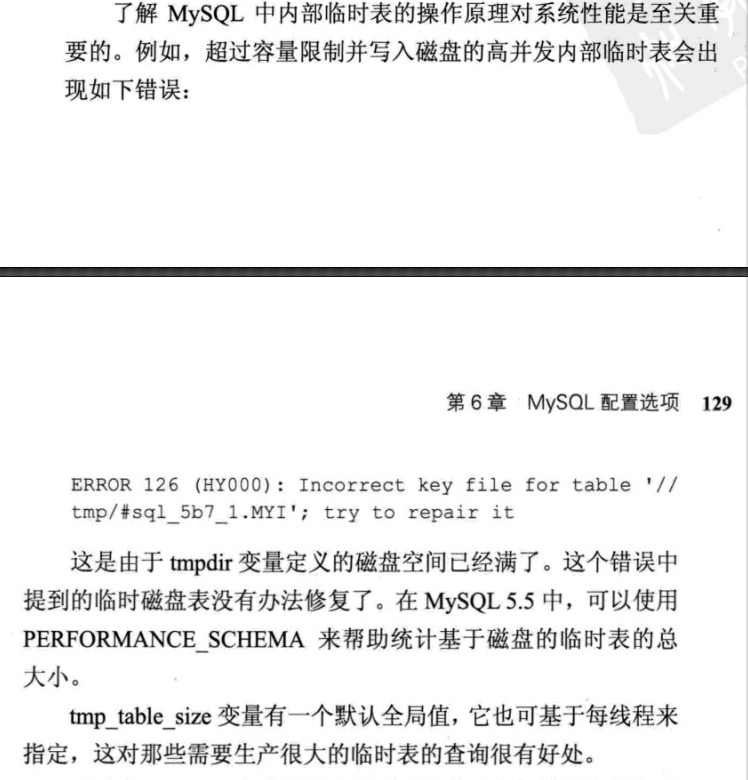

#### 6.1.8 join_buffer_size

定义了每个线程的内存缓冲区,当查询必须连接两个表的数据集并且不能使用索引时,这个缓冲区会被用到.这个缓冲区是专门为每个线程的无索引连接操作作准备的.可以通过查询计划中Extra列的值为Using join buffer 来证实使用了这个缓冲区.建议将这个缓冲区设置为默认大小.增加这个缓冲区的大小也不会加快全连接操作的速度.为这个缓冲区设定太大的容量可能会对高连接的环境中的内存使用造成影响.

#### 6.1.9 sort_buffer_size

这个变量定义了每个线程用于对结果集排序的每线程缓冲区.可以通过查询激活中Extra列的值为Using file-sort 来确定使用了这个缓存区不推荐你增加这个缓冲区的大小,因为这个缓冲区是完全分配给每个请求的,而且当默认值太大时,可能会降低查询的执行速度.


#### 6.1.10 read_buffer_size

当SQL查询执行连续的表数据扫描时会用到这个缓冲区.只有在大量连续表数据扫描时才推荐增加这个缓冲区的大小.

#### 6.1.11 read_rnd_buffer_size

这个缓冲区用来存储哪些作为排序操作的结果被读取的数据.这个缓冲区和read_buffer_size的不同之处在于,它读取连续数据是和数据在磁盘上的存储方式相同的.只有在执行大型ORDER BY语句时才推荐增加这个缓冲区的大小.


read_rnd_buffer_size增加order by查询效率

在[What exactly is read_rnd_buffer_size](http://www.percona.com/blog/2007/07/24/what-exactly-is-read_rnd_buffer_size/)中有了一点理解，其中提到了read_buffer_size，在[三个方法优化MySQL数据库查询](http://www.bitscn.com/pdb/mysql/200710/116880.html)中大概的了解了这个参数的作用，当一个查询不断地扫描某一个表，MySQL会为它分配一段内存缓冲区。*read_buffer_size*变 量控制这一缓冲区的大小。如果你认为连续扫描进行得太慢，可以通过增加该变量值以及内存缓冲区大小提高其性能。不过貌似这两个参数都是值针对于 MyIsam表的，在mysql安装目录my.ini中看到这样一句注释：Size of the buffer used for doing full table scans of MyISAM table**对于这个参数的配置还需要再讨论。


设置变量为一个大的值来大大的改善ORDER BY 性能,

这个是一个buffer 分配给每个客户端,因此你不能设置全局变量为一个大的值。

相反,只改变session 变量对那些客户端需要运行大的查询,

The maximum permissible setting for read_rnd_buffer_size is 2GB.

最大值为read_rnd_buffer_size is 2GB.


### 6.2 有关基础工具的变量

# MySQL SQL 优化(第二部分)


### 6.2 有关基础工具的变量

| show_query_log(从5.1版本开始)                 | 这个动态布尔变量决定是否在日志记录执行缓慢的查询                 |
| ---------------------------------------- | ---------------------------------------- |
| show_query_log_file(从5.1版本开始);low_slow_queries(对5.0和更早版本,5.1开始废弃) | 当输出结果记录到文件中时,这个动态变量用来指定执行缓慢的查询日志的文件名.    |
| long_query_time                          | 这个动态变量用来指定一个正常查询最大的执行时间,超过这个时间,查询就被认为是执行缓慢的查询 |
| general_log(5.1开始)                       | 这个动态布尔变量决定是否把所有的书居库查询都记录在日志中。            |
| general_log_file(5.1 开始);log(5.0和更早版本,5.1废弃) | 当输出结果记录到日志中时,这个动态变量指定全面日志的文件名            |
| log_output(5.1版本开始)                      | 这个动态变量定义了执行缓慢的查询日志和全面日志的目标类型             |
| profiling                                | 这个动态变量定义了分析每个线程的语句                       |
|                                          |                                          |

#### 6.2.1 show_query_log

#### 6.2.2 show_query_log_file

#### 6.2.3 general_log

#### 6.2.4 general_log_file

#### 6.2.5 long_query_time

#### 6.2.6 log_output

#### 6.2.7 profiling

### 6.3 其他优化变量


| optimizer_switch(5.1开始)    | 这个变量决定了MySQL优化器中哪个高级索引合并功能会被启用    |
| -------------------------- | --------------------------------- |
| default_storage_engine     | 当没有指定存储引擎时,这个变量定义了表使用的存储引擎        |
| max_allow_packet           | 这个变量定义了结果集的最大容量                   |
| sql_mode                   | 这个变量定义了支持的各种服务器SQL模式              |
| innodb_strict_mode(5.1 开始) | 这个变量定义了一个专门为InnoDB插件提供的服务器SQL模式级别 |

#### 6.3.1 optimizer_switch

这个选项定义了一系列MySQL查询优化器特性的高级开关,可以用来关闭(默认是激活状态)三种不同的索引合并条件以及引擎下推条件.

具体内容可以从以下系统变量的介绍中了解到:

- max_seeks_for_key
- optimizer_prune_level
- optimizer_search_depth
- engine_condition_pushdown

#### 6.3.2 default_storage_engine

未指定ENGINE值时.这个变量用来为CREATE TABLE 命令指定存储引擎.在MySQL5.5 中,默认存储引擎由MyISAM编程InnoDB.

#### 6.3.3 max_allow_packet

来定义SQL查询结果集的最大值.增大这个值会允许查询返回更大的结果集.通过限制这个变量的大小,你会得到一个潜在的子表来表明有一个查询返回了很大的结果集,而这可能是无意义的.

#### 6.3.4 sql_mode

MySQL支持一系列不同的服务器SQL模式.这些模式之间区别很大,并且提供了更加符合美国国家标准学会ANSI的SQL语法,也提供了默认预期的数据验证,并支持不同的null和零日期数据的管理方式.这些设置非常重要,因为他们能够改变SQL语句的运行方式所带来的影响.

#### 6.3.5 innodb_strict_mode

这个变量为InnoDB插件提供了sql_mode功能,5.5已经是默认的InnoDB实现了.这些选项国战了元神的sql_mode,包括对标对象的管理以及行检查功能.

### 6.4 其他变量

| concurrent_insert | foreign_key_checks    | log_bin                |
| ----------------- | --------------------- | ---------------------- |
| max_join_size     | max_seeks_for_key     | min_examined_row_count |
| open-files_limit  | optimizer_prune_level | optimizer_search_depth |
| sql_buffer_result | sql_select_limit      | sync_binlog            |
| thread_cache_size | thread_stack          | tmpdir                 |
| tx_isolation      | unique_checks         |                        |


## 7 SQL的生命周期

优化SQL语句的生命周期涉及6个独立的部分,则包括街区SQL语句,识别有问题的SQL语句以及在开始分析前如何确认SQL语句;

本章讨论整个SQL优化生命周期中6个阶段:

### 7.1 截取SQL语句

下面累出的是MySQL中各种流行的SQL语句截取技术:

- 全面查询日志
- 慢查询日志
- 二进制日志
- 进程列表
- 引擎状态
- MySQL 连接器
- 应用程序代码
- INFORMATION_SCHEAM
- PERFORMANCE_SCHEMA
- SQL语句统计信息插件
- MySQL代理
- TCP/IP

#### 7.1.1全面查询日志

全面查询日志允许你街区所有在这个数据库实例上运行的SQL语句.可以通过下面的MYSQL配置来启用:

```mysql
[mysqld]
general_log=1
general_log_file=/path/to/file
log_output=FILE
```

也可以通过SQL语句动态地启用胡总和禁用全面日志,并且让日志输出到文件,数据库表或者两者同时写入,例如:

```mysql
mysql> SET GLOBAL general_log=1;
mysql>SET GLOBAL log_output='TABLE';
mysql>SELECT * FROM mysql.general_log\G
```


```mysql
mysql> show variables like 'log_output';
+---------------+-------+
| Variable_name | Value |
+---------------+-------+
| log_output    | FILE  |
+---------------+-------+
1 row in set (0.00 sec)

mysql>  show global variables like '%general%';
+------------------+-------------------------------+
| Variable_name    | Value                         |
+------------------+-------------------------------+
| general_log      | OFF                           |
| general_log_file | /home/mysql/data/shj-db01.log |
+------------------+-------------------------------+
2 rows in set (0.00 sec)

mysql> 
```

> 注意:
>
> 不要在生产环境中启用这个功能

#### 7.1.2 慢查询日志

```mysql
[mysqld]
slow_query_log=1
slow_query_log_file=/path/to/file
long-query_time=0.2
log_output=FILE
```


#### 7.1.3 二进制日志

MySQL 的二进制日志涵盖了所有非SELECT 语句,其中包括DML和DDL语句.这个日子功能可以用来提供标记别的粒度的语句容量的历史分析.UPDATE和DELETE语句的街区内容能投揭示出潜在可优化的索引.

```nysql
[mysqld]
log-bin=/path/to/file
```

#### 7.1.4 进程列表

```mysql
mysql>SHOW FULL PROCESSLIST;
#或者
$ mysqladmin -uroot -p [-v] PROCESSLIST
#或者
mysql> SELECT * FROM  INFORMATION_SCHEAM.PROCESSLIST
```

#### 7.1.5 引擎状态

```mysql
SHOW ENGINE INNODB STATUS
```


#### 7.1.6 MySQL 连接器

- Connector/J
  - logSlowQueries
  - slowQueryThresholdMillis
  - useNanosForElapsedTime
  - slowQueryThresholdNanos
  - autoSlowLog
- PHP mysqlnd

#### 7.1.7  应用程序代码

#### 7.1.8 INFORMATION_SCHEAM

目前的INFORMATION_SCHEAM.INNODB_TRX表提供了一些同样可用于HSOW ENGINE INNODB STATUS 事务列表中的信息.


#### 7.1.9 PERFORMANCE_SCHEMA

PERFORMANCE_SCHEMA主要用于收集数据库服务器性能参数。[mysql](http://lib.csdn.net/base/mysql)用户是不能创建存储引擎为PERFORMANCE_SCHEMA的表

performance_schema提供以下功能：

1. 提供进程等待的详细信息，包括锁、互斥变量、文件信息；
2. 保存历史的事件汇总信息，为提供MySQL服务器性能做出详细的判断；
3. 对于新增和删除监控事件点都非常容易，并可以随意改变mysql服务器的监控周期，例如（CYCLE、MICROSECOND）

#### 7.1.10 SQL语句统计信息插件

开源项目sqlstats是一个利用审计插件接口来街区MySQL5.5 或更高版本中所有SQL语句的MySQL插件.

#### 7.1.11 MySQL  proxy

MySQL proxy 或者其他代理的派生产品,在通过网络与MYSQL实例的通信中扮演了一个中间人的角色.这个命令可以拦截客户端和服务端之间的TCP/IP数据包,并根据很多灵活的可以用程序定制的需求来处理这些数据包.MYSQL proxy默认安装中附带了一些样例,包括SQL截取,SQL日志记录以及SQL语句分析.

#### 7.1.12 TCP/IP

```bash
tcpdump -l -i em1 -w - src or dst port 3306 -c 1000 |strings
```


### 7.2 识别有问题的SQL

当你通过网络连接到MySQL时,可能会街区到和MySQL服务器通信的物理层网络数据包.

```bash
tcpdump -l -i em1 -w - src or dst port 3306 -c 1000 |strings
tcpdump -i em1 -s 0 -l -w - dst  port 3306 | strings
```

#### 7.2.1 慢查询日志分析

```bash
pt-query-digest  slow.log > slow_report.log
```

### 7.3 确认语句执行

确认一条SQL语句和运行SQL语句以及确认响应时间一样的简单.在确认SQL语句的精确返回时间时应该考虑到的因素包括:当前系统负债,查询并发成都,网络开销,MySQL查询缓存以及能否在内存内部访问必要的表索引和数据.在确认SQL语句时,一定要尽量重现这些工作环境.一条语句在隔绝环境中的运行坑定和同样的语句在多任务环境中运行的返回不同的结果.

#### 7.3.1环境

你的最终目标是使用一种可以重现的方式来确认你发现的SQL语句.这种情况将允许你为后面的优化重现这些信息.在确认SQL语句时,你应该在SELECT 语句上天假SQL_NO_CACHE提示来保证没有使用MySQL查询缓存.另一个技巧是在确认SQL语句之前尽量把所有表数据都加载到合适的MYSQL内存缓冲区中,这样可以保证更加一致的结果返回时间.包括内存,CPU以及磁盘在内的系统资源将会对SQL查询执行产生重要影响.你应该在有网络开销和没有网络开销的两种环境中验证你的SQL语句.

#### 7.3.2 时间统计

mysql客户端默认以10毫秒为单位显示查询时间.有一个补丁可以让精确到微秒级别

> http://effectivemysql.com/article/microsecond-mysql-client


```mysql
mysql> show variables like '%profiling%';
mysql> SET profiling=1;
mysql> SELECT NOW();
mysql> SELECT BENCHMARK(1+1,100000);
mysql> SELECT BENCHMARK('1'+'1',100000);
mysql> SELECT SLEEP(1);
mysql> SELECT SLEEP(2);
mysql> SHOW PROFILES;
+----------+------------+----------------------------------+
| Query_ID | Duration   | Query                            |
+----------+------------+----------------------------------+
|        1 | 0.00067875 | SELECT NOW()                     |
|        2 | 0.00099475 | SELECT BENCHMARK(1+1,100000)     |
|        3 | 0.00055625 | SELECT BENCHMARK('1'+'1',100000) |
|        4 | 1.00117350 | SELECT SLEEP(1)                  |
|        5 | 0.00046250 | SELECT SLEEEP(2)                 |
|        6 | 2.00126000 | SELECT SLEEP(2)                  |
+----------+------------+----------------------------------+
6 rows in set, 1 warning (0.00 sec)

mysql> 
```

一个定义良好且在SQL性能方面很积极的基础架构能够主动收集很多信息,不仅仅包括SQL语句,QEP,查询执行时间,还包括很多其他的查询细节,例如获取的行数,结果集大小,底层有代表性的表数据大小以及查询分析中用到的MySQL配置信息.这些长期收集的SQL语句信息能够帮助我们找到查询性能的变化,还有助于验证不同的MYSQL配置,模式结构以及MySQL版本.如果想要把上述信息合并并以自定义的格式输出,那么MySQL Proxy是一个不错的选择.

### 7.4 语句分析

参考第二张介绍的命令和工具来分析

### 7.5 语句优化

第四章和第五章详细介绍了使用索引来优化SQL语句的过程.其他优化SQL语句的技术也可能提供更好的性能改进,包括通过去除连接操作或减少列的数目来讲话SQL语句,还有通过精简数据类型和约束条件(比如是否可以为空)来改进表的结构.第八章会详细介绍各种相关技术.

### 7.6 结果验证

在生产环境中,一个高并发并且混喝的工作负债来验证会带来真正能够的益处.

### 7.7 本章小结

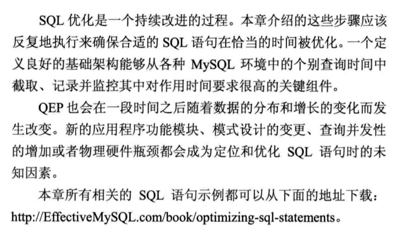

## 8 性能优化之隐藏秘籍

本章将讨论下面几种性能优化的技巧

- 去除重复的索引
- 找到没有被使用的或者无效的索引
- 改进索引
- 减少SQL语句
- 简化SQL语句
- 缓存选项

### 8.1 索引管理优化

#### 8.1.1 整合DDL语句

在将索引添加到MySQL表的过程中,一个需要注意的管理问题就是DDL语句的阻塞性.在以前,由于ALTER语句的阻塞性影响,执行ALTER语句时需要为表创建一个新的副本.在改变大型表时,这个操作将消耗大量的时间和磁盘存储空间.有了在MySQL 5.1种首次出现的InnoDB插件以及其他第三方存储引擎,各种ALTER语句现在运行非常迅速,因为它们不用再执行全表复制操作了.

**把多条ALTER语句整合成一条SQL语句是一种简单的优化改进.**

#### 8.1.2 去除重复索引

重复的索引有两个主要的影响:

- 所有的DML语句都会运行的更慢,因为需要做更多工作来保持数据和索引的一致性
- 数据库的磁盘占用量将会更大,这将导致备份和回复需要的时间增加.

当一个给定索引的坐左边部分被包含在其他索引中时也会产生重复索引,请看下面的示例:

```mysql
CREATE TABLE test(
  id INT UNSIGNED NOT NULL,
  first_name VARCHAR(30) NOT NULL,
  last_name VARCHAR(30) NOT NULL,
  joined DATE NOT NULL,
  PRIMARY KEY(id),
  INDEX name1(last_name),
  INDEX name2(last_name,first_name),
)
```

name1 这个索引是多余的,因为此索引所在的列已经被包含在索引name2的最左边部分里面了.

**pt-duplicate-key-checker检查数据库的重复索引**

#### 8.1.3 删除不用的索引

官方没有提供识别不用的索引的方法.Google的MySQL补丁首次引入了SHOW INDEX_STATISTICS功能.这个特性是诸多用来衡量每个用户监控的新命令的一部分.

#### 8.1.4 监控无效的索引

当定义多列索引时,一定要注意确定所指定的每一列时候真的有效.

可以通过分析指定表上的所有SQL语句的key_len列来找到那些可能包含没有使用到的列索引.

第九章会给出详细的示例说明如何理解和分析key_len列

### 8.2 索引列的改进

- BIGINT和INT 
  ronaldbradford.com/blog/bigint-v-int-is-there-a-big-deal-2008-07-18

- DATETIME 和TIMESTAMP
  日期范围

  **TIMESTAMP** 支持从**’1970-01-01 00:00:01′** 到 **’2038-01-19 03:14:07′** UTC. 这个时间可能对目前正在工作的人来说没什么问题，可以坚持到我们退休，但对一些年轻的读者，就会有 Bug2K+38 的问题。

  **DATETIME** 从 **’1000-01-01 00:00:00′** 直到**’9999-12-31 23:59:59′**.

  考虑到二者在范围上的不同，你当前的事件日志使用 **TIMESTAMP** 是没有任何问题的，不过如果是为了记录你祖父和孙子的生日，那还是要用 **DATETIME**.

  另外我建议，如果是一些跟现在相关的时间，可以选择 **TIMESTAMP**. 例如记录的添加时间之类的，其他的话还是要选择  **DATETIME**.

  存储方面的比较

  **TIMESTAMP** 需要 **4** 字节的存储空间，而 **DATETIME** 则需要 **8** 字节

- ENUM

- NULL 和NOT NULL

- 隐含的变换

#### 8.2.2 列的类型

- IP地址处理
  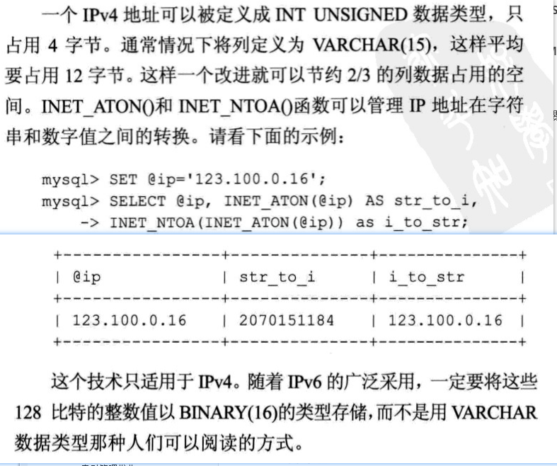
- MD5 处理
  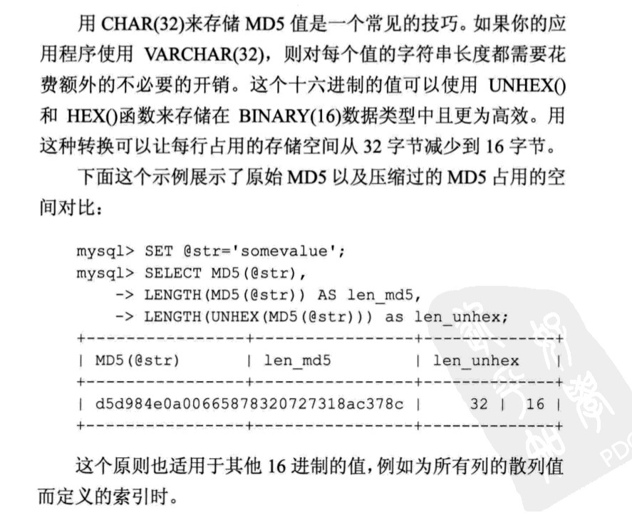

### 8.3 其他SQL优化

添加索引能够带来显著的性能提升,然而,对关系型数据库来说最有效的SQL优化方法是完全删除不需要执行的SQL语句.对于一个高度优化的应用程序来说,占总执行时间最大比重的是网络开销.去除SQL语句能够减少应用程序的处理时间.对于SQL语句来说其他必要的步骤还包括解析语句,安全许可检查以及生成查询执行计划.如果其中有不必要的语句,那么这些都会为数据库服务器不必要的负担.

```mysql
show profile source for 7;
```

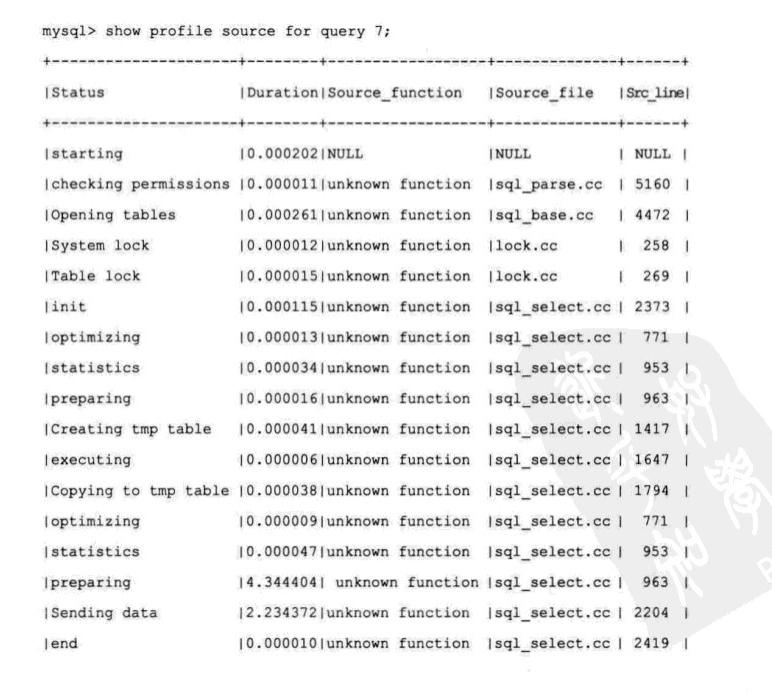

status 列的值可能会有误导性,因为这些值揭示内部信息,原本并不是用来公开访问的.强烈推荐你检查实际的MySQL源代码文件以及制定的行,这样有助于理解所有的描述信息.

#### 8.3.1 减少SQL语句

- 删除内容重复的SQL语句

- 删除重复执行的SQL语句
  
  还有
  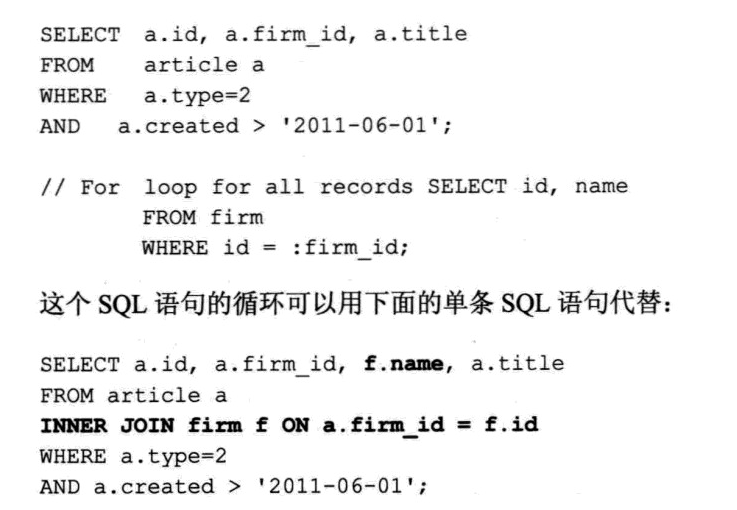

- 删除不必要的SQL语句
  随着时间的推移,应用程序会不断修改和增加功能,这可能产生不必要的SQL语句,例如:

  - 不再需要的选择信息
  - 仅仅在给定函数的某些路径上用到的选择信息.
  - 可以从之前的SQL语句中选择的信息

- 缓存SQL语句的返回结果
  当普通数据的变化率相对较低时,缓存SQL结果能够为你的应用程序带来性能变化和对数据库服务器的可扩展性

- MySQL缓存
  MySQL查询缓存能够为读操作频繁的环境带来性能提升,且在不需要其他应用程序开销的情况下就能实现.

  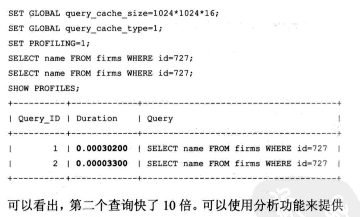

  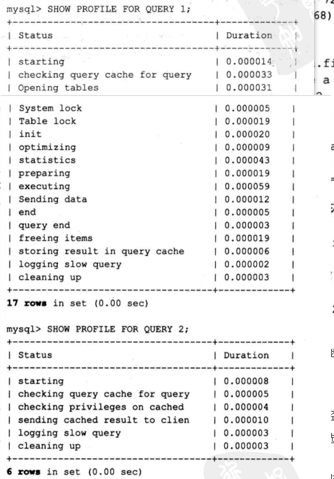
  MySQL查询缓存可能会让那些写操作多余读操作的系统性能退化.这是由查询缓存的粗略性导致的,对给定表的任意数据的改变都会导致所有使用那个表的缓存的SQL语句无效.读操作和写操作都很多的环境会导致没有从以前的使用中收益的SELECT语句失效

- 应用程序缓存
  Memcached

#### 8.3.2 简化SQL语句

- 查询中所有的列都是必须的吗?
- 表的连接操作能被省去吗?
- 在给定的函数中,连接或WHERE条件限制对其他SQL语句是必要的吗?

##### 改进列

##### 改进连接操作

##### 重写子查询

##### 理解试图view所带来的影响

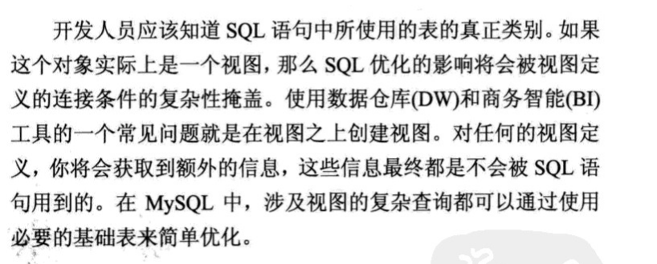

#### 8.3.3 使用MySQL的复制功能


### 9 MySQL EXPLAIN 命令详解

#### 9.1 语法

#### 9.2 各列详解

- id

- select_type

  - SIMPLE

  - PRIMARY
    这是为更复杂的查询而创建的首要表(也就是最外层的表)这个这个类型通常可以在DERIVER和UNION类型回合使用时见到.

  - DERIVED
    当一个表不是一个物理表时,就会被叫做DERIVED.

  - UNION
    这是UNION语句其中的一个SQL元素

  - UNION RSULT

    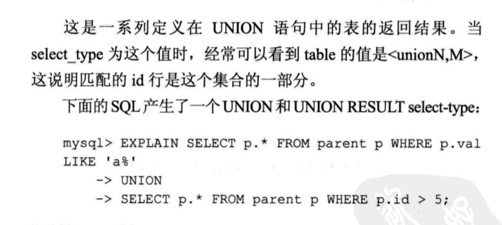

  - DEPENDENT SUBQUERY
    这个select-type值是为使用子查询而定义的
    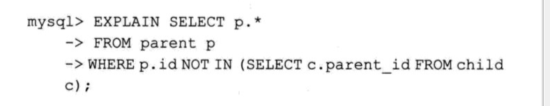
    ​

  - DEPENDENT UNION 

  - UNCACHEABLE UNION

  - UNCACHEABLE QUERY


- table
  EXPLAIN命令输出结果中的一个单独行的唯一标识符.这个值可能是表名,表的别名或者一个伪查询产生临时表的标识符,如派生表,子查询或集合.
  

- partitions(这一列只有在EXPLAIN PARTITIONS 语法中才会出现)

  ​

- possible_keys
  指出优化器为查询选定的索引,,一个会列出大量可能的索引(例如多余三个)的QEP意味着备选索引数量太多了,同时也可能提示出存在一个无效的单列索引.可以使用SHOW INDEXES命令来检查索引时候有效

- key
  指出优化器选择使用的索引

- key_len 定义了用于SQL语句的连接条件的键长度.此列值对于确认索引的有效性以及多列索引中用到的列的数目很重要.
  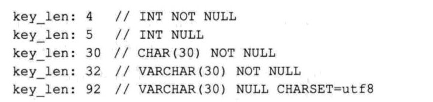
  示例中可以看出,是否可以为空,可变长度的列以及字符集都会影响到表索引的内部内存大小.
  key_len列的值


- ref
  可以被用来标识那些用来进行索引比较的列或者常量

- rows
  提供了试图分析所有存在于累计结果集中的行数目的MySQL优化器估计值.

  ```mysql
  mysql> SHOW SESSION STATUS LIKE 'handler_read_%';
  +-----------------------+-------+
  | Variable_name | Value |
  +-----------------------+-------+
  | Handler_read_first | 1 |
  | Handler_read_key | 1 |
  | Handler_read_last | 0 |
  | Handler_read_next | 0 |
  | Handler_read_prev | 0 |
  | Handler_read_rnd | 0 |
  | Handler_read_rnd_next | 21 |
  +-----------------------+-------+
  7 rows in set (0.01 sec)
  ```

  ​

  - 对索引读的计数器：前面的5个都是对索引读情况的计数器，

  ```
   Handler_read_first：是指读索引的第一项（的次数）；
   Handler_read_key：是指读索引的某一项（的次数）；
   Handler_read_next：是指读索引的下一项（的次数）；
   Handler_read_last：是指读索引的最后第一项（的次数）；
   Handler_read_prev：是指读索引的前一项（的次数）；
  ```

  5者应该有四种组合：

  1. Handler_read_first 和 Handler_read_next 组合应该是索引覆盖扫描
  2. Handler_read_key 基于索引取值
  3. Handler_read_key 和 Handler_read_next 组合应该是索引范围扫描
  4. Handler_read_last 和 Handler_read_prev 组合应该是索引范围扫描（orde by desc）

  - 对数据文件的计数器：后面的2个都是对数据文件读情况的计数器，

  **Handler_read_rnd:**
  The number of requests to read a row based on a fixed position. This value is high if you are doing a lot of queries that require sorting of the result. You probably have a lot of queries that require MySQL to scan entire tables or you have joins that do not use keys properly.

  **Handler_read_rnd_next**
  The number of requests to read the next row in the data file. This value is high if you are doing a lot of
  table scans. Generally this suggests that your tables are not properly indexed or that your queries are
  not written to take advantage of the indexes you have.

  ​

  这里很重要的一点要理解：:
  **索引项之间都是有顺序的，所以才有first, last, next, prev等等，所以前面的5个都是对索引读情况的计数器，而后面的2个是对数据文件的读情况的计数器。**

  ​

- filtered(这一列只有在EXPLAINED EXTENDED)语法中才会出现
  

- Extra

  - Using where
    这个值表示查询使用了where语句来处理结果--例如执行全表扫描.如果也用到了索引,那么行的限制条件是通过获取必要的数据之后处理读缓冲区实现的.

  - Using temporary
    这跟 值表示使用了内部临时表(基于内存的表).一个查询可能用到多个临时表.有很多原因都会导致MYSQL在执行查询期间创建临时表.两个常见的原因是在来自不同表的列上使用了DISTINCT,或者使用了不同的ORDER BY和GROUP BY列.
    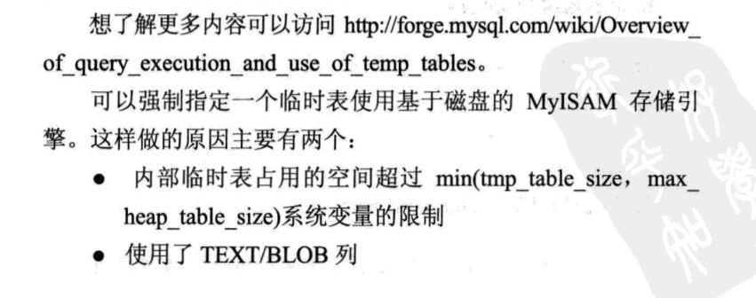

  - Using filesort
    这是ORDER BY 语句的结果.这可能是一个CPU密集型的过程.可以通过选择合适的

  - Using index
    这个值重点强调了只需要使用所用就可以满足查询表的要求,不需要直接访问表的数据

  - Using join buffer

  - 这个值强调了在获取连接条件时没有使用索引,并且需要连接缓冲区存储中间结果

  - Impossible where

    这个值强调了where 语句会导致没有符合条件的行.如:

    ```mysql
    mysql> EXPLAIN SELECT * FROM user WHERE 1=2;
    ```

  - Select tables optimized away
    这个值意味着仅通过使用索引,优化器可能仅从聚合函数结果中返回一行,如

    

  - Disinct

    这个意味着MySQL在找到第一个匹配的行之后就会停止搜索其他行

  - Index merges

    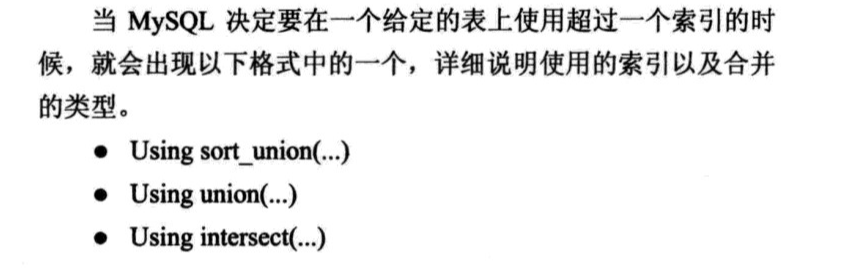

- type

  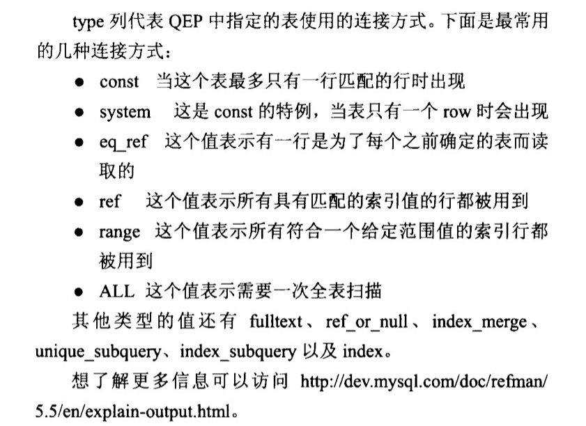


#### 9.3 解释EXPLAIN 输出结果


## 


 