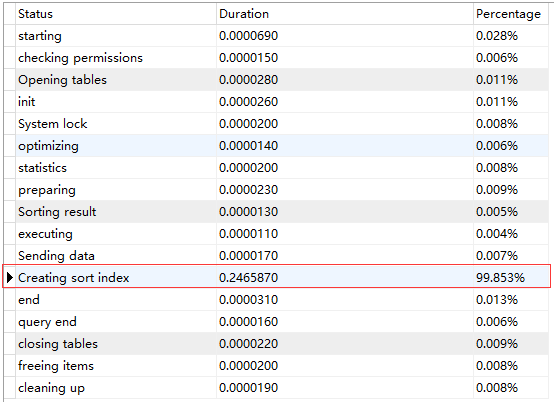
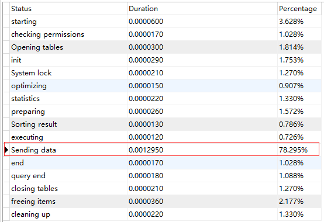

#MySQL SQL优化之覆盖索引

[TOC]

##摘要: 

利用索引提升SQL的查询效率是我们经常使用的一个技巧，但是有些时候MySQL给出的执行计划却完全出乎我们的意料，我们预想MySQL会通过索引扫描完成查询，但是MySQL给出的执行计划却是通过全表扫描完成查询的，其中的某些场景我们可以利用覆盖索引进行优化。

前些天，有个同事跟我说：“我写了个SQL，SQL很简单，但是查询速度很慢，并且针对查询条件创建了索引，然而索引却不起作用，你帮我看看有没有办法优化？”。

##优化过程

我对他提供的case进行了优化，并将优化过程整理了下来。

###现象

优化前的表结构、数据量、SQL、执行计划、执行时间等。

1. 表结构：

```mysql
CREATE TABLE `t_order` (
  `id` bigint(20) unsigned NOT NULL AUTO_INCREMENT,
  `order_code` char(12) NOT NULL,
  `order_amount` decimal(12,2) NOT NULL,
  PRIMARY KEY (`id`),
  UNIQUE KEY `uni_order_code` (`order_code`) USING BTREE
) ENGINE=InnoDB AUTO_INCREMENT=1 DEFAULT CHARSET=utf8;
```

隐藏了部分不相关字段后，可以看到表足够简单， 并且在order_code上创建了唯一性索引uni_order_code。

2. 数据量：316977

这个数据量还是比较小的，不过如果SQL足够差，一样会查询很慢。

3. SQL：

```mysql
select order_code, order_amount from t_order order by order_code limit 1000;
```

哇，SQL足够简单，不过有时候越简单也越难优化。

4. 执行计划：

| id   | select_type | table   | type | possible_keys | key  | key_len | ref  | rows   | Extra          |
| ---- | ----------- | ------- | ---- | ------------- | ---- | ------- | ---- | ------ | -------------- |
| 1    | SIMPLE      | t_order | ALL  | NULL          | NULL | NULL    | NULL | 316350 | Using filesort |

全表扫描、文件排序，注定查询慢！

那为什么MySQL没有利用索引（uni_order_code）扫描完成查询呢？因为MySQL认为这个场景利用索引扫描并非最优的结果。我们先来看下执行时间，然后再来分析为什么没有利用索引扫描。

 5. 执行时间：260ms



的确，执行时间太长了，如果表数据量继续增长下去，性能会越来越差。

 

###分析原因

接下来分心一下MySQL为什么使用全表扫描、文件排序，而没有使用索引扫描、利用索引顺序：

1. 全表扫描、文件排序：

虽然是全表扫描，但是扫描是顺序的（不管机械硬盘还是SSD顺序读写性能都是高的），并且数据量不是特别大，所以这部分消耗的时间应该不是特别大，主要的消耗应该是在排序上。

2. 利用索引扫描、利用索引顺序：

**uni_order_code是二级索引，索引上保存了（order_code,id），每扫描一条索引需要根据索引上的id定位（随机IO）到数据行上读取order_amount，需要1000次随机IO才能完成查询，而机械硬盘随机IO的效率是极低的（机械硬盘每秒寻址几百次）**。

根据我们自己的分析选择全表扫描相对更优。如果把limit 1000改成limit 10，则执行计划会完全不一样。

###解决方法 

既然我们已经知道是因为随机IO导致无法利用索引，那么有没有办法消除随机IO呢？

有，覆盖索引。

我们来看看利用覆盖索引优化后的索引、执行计划、执行时间。

1. 创建索引：

```mysql
ALTER TABLE `t_order` 
ADD INDEX `idx_ordercode_orderamount` USING BTREE (`order_code` ASC, `order_amount` ASC);
```

创建了复合索引idx_ordercode_orderamount(order_code,order_amount)，将select的列order_amount也放到索引中。

2. 执行计划：

| id   | select_type | table   | type  | possible_keys | key                       | key_len | ref  | rows | Extra       |
| ---- | ----------- | ------- | ----- | ------------- | ------------------------- | ------- | ---- | ---- | ----------- |
| 1    | SIMPLE      | t_order | index | NULL          | idx_ordercode_orderamount | 42      | NULL | 1000 | Using index |

执行计划显示查询会利用覆盖索引，并且只扫描了1000行数据，查询的性能应该是非常好的。

3. 执行时间：13ms



从执行时间来看，SQL的执行时间提升到原来的1/20，已经达到我们的预期。

 

##总结：

覆盖索引是select的数据列只用从索引中就能够取得，不必读取数据行，换句话说查询列要被所建的索引覆盖。索引的字段不只包含查询列，还包含查询条件、排序等。

要写出性能很好的SQL不仅需要学习SQL，还要能看懂数据库执行计划，了解数据库执行过程、索引的数据结构等。

 