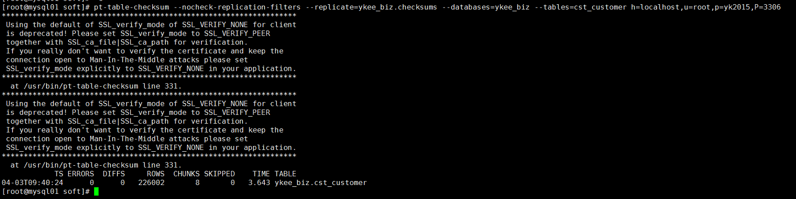
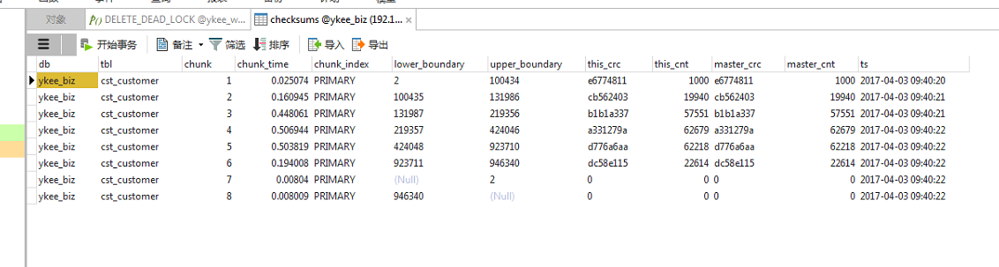
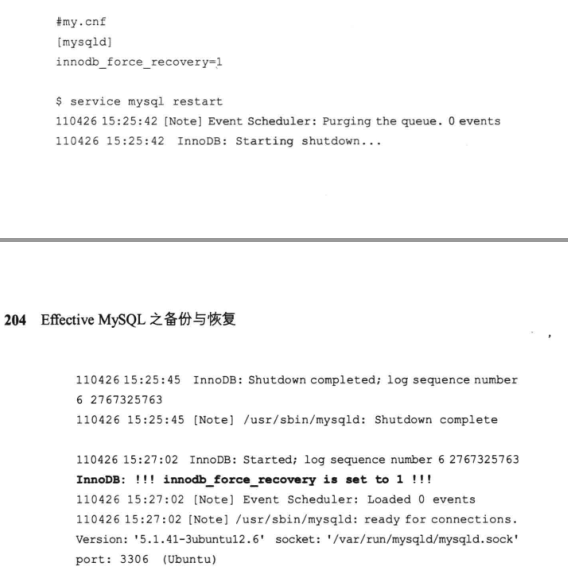
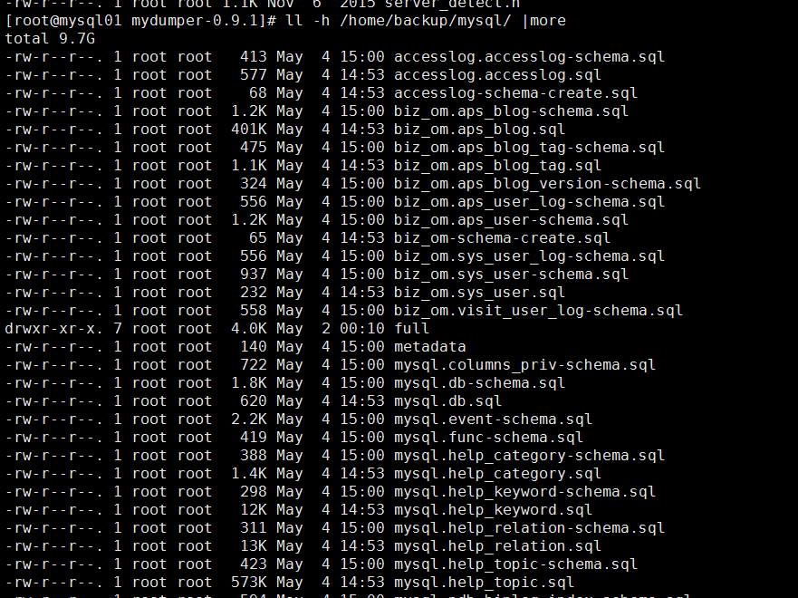

# MySQL 增量全量自动备份方案

[TOC]

## MySQL备份

### MySQL 备份方式

#### 冷备份

* 优点:
  保证所有的信息都进行了拷贝,包括:MySQL 数据,可用的失去和二进制日志数据以及当前的MySQL配置


* 缺点:
  MySQL 实例需要停止

#### 热备份(mysqldum bp)

- 优点:
- 缺点:

##### 需要备份的数据库有多大

```mysql
SELECT
	round(
		sum(data_length + index_length) / 1024 / 1024
	) AS total_mb,
	round(sum(data_length) / 1024 / 1024) AS data_mb,
	round(
		sum(index_length) / 1024 / 1024
	) AS index_mb
FROM
	INFORMATION_SCHEMA.TABLES
```


##### 要生成一个一致性的备份,什么锁策略是必须的

mysqldump 利用LOCK TABLES 命令进行表级枷锁,以确保所有数据有一个一致的版本

-- lock tables 默认是disabled

-- opt 默认是enabled

当使用MyISAM 存储引擎时,--lock -tables 对于确保备份的一致性而言是非常必要的.


mysqldump 提供了--simple-transaction 选项,它可以为一个单独的事务中所有的表创建一个版本一致的快照.这一选项只有使用某种支持多版本的存储引擎时才可用,InnoDB是MySQL默认安装时唯一包含的存储引擎,当使用这一选项时,自动关闭--lock -tables

```mysql
SELECT
	table_schema,
	ENGINE,
	count(*) AS TABLES
FROM
	INFORMATION_SCHEMA. TABLES
WHERE
	table_schema NOT IN (
		'INFORMATION_SCHEMA',
		'PERFORMANCE_SCHEMA'
	)
GROUP BY
	table_schema,
	ENGINE
ORDER BY
	3 DESC
```


##### 备份需要占用多长时间

##### 查询单独的表占用的空间

```mysql
SELECT
	TABLE_NAME,
	TABLE_ROWS,
	DATA_LENGTH / 1024 / 1024 "DATA_LENGTH",
	CREATE_TIME,
	TABLE_COLLATION
FROM
	INFORMATION_SCHEMA. TABLES
WHERE
	TABLE_SCHEMA = 'ykee_bid'
ORDER BY
	TABLE_ROWS DESC
```


##### 组合信息

```mysql
SELECT
	table_schema,
	ENGINE,
	count(*) AS TABLES,
	round(
		sum(data_length + index_length) / 1024 / 1024
	) AS total_mb,
	round(sum(data_length) / 1024 / 1024) AS data_mb,
	round(
		sum(index_length) / 1024 / 1024
	) AS index_mb
FROM
	information_schema. TABLES
GROUP BY
	table_schema,
	ENGINE
ORDER BY
	3 DESC
```


### 自行MySQL备份

在备份过程中,禁用任何cron和批处理,以便尽量减少附加的工作负债.这可以减少数据库争用并缩短所需的时间的窗口

#### 运行mysqldump

```mysql
[root@own-server home]# cat backup.sh 
time mysqldump --all-databases -uroot -p  > /home/all_databases.sql
echo $?
ls -lh /home/all_databases.sql
[root@own-server home]# ./backup.sh 
Enter password: 

real	0m2.342s
user	0m0.034s
sys	0m0.016s
0
-rw-r--r--. 1 root root 2.1M Mar 13 00:52 /home/all_databases.sql
[root@own-server home]# 
```

**解释**: 
备份耗时2.342 秒.
第一个命令:对所有的数据库运行mysqldump.产生一个ASCII存储文件,保存为backup.sql
第二个命令:确保第一个命令处于退出状态,若是非0结果,则说明在备份过程出现了问题.如果有什么错误就会显示在屏幕输出中.
第三个命令:显示备份文件的大小,以供在别处使用

#### 安全地备份

在最小限度的备份方法中,最后一步就是确保数据的安全.当前,备份与数据在同一个系统上,系统的丢失也会包括数据和备份的丢书.所以应该采取的措施是将备份拷贝到某一个辅位置;

```bash
## 压缩.gz
[root@own-server home]# time gzip /home/all_databases.sql 
## 上传压缩sql到服务器
[root@own-server home]# scp -rp /home/all_databases.sql.gz  root@192.168.1.122:/path
#------------------------------------------------------------------------
##本地下载服务器上的备份sql
[root@own-server home]#scp -rp root@192.168.190.128:/home/all_databases.sql.gz ./ 
##解压.gz
[root@own-server home]# gzip -d all_databases.sql.gz  
```

#### 使用mysqldump的好处

mysqldump 命令提供了一种基于SQL的备份文件,这对于创建一个能够在不同版本的MySQL 上,不同的操作系统上运行的备份来说,是很理想的.

查看MySQL 备份的文件内容

```mysql
[root@own-server home]# more all_databases.sql 
-- MySQL dump 10.13  Distrib 5.6.12, for linux-glibc2.5 (x86_64)
--
-- Host: localhost    Database: 
-- ------------------------------------------------------
-- Server version	5.6.12

/*!40101 SET @OLD_CHARACTER_SET_CLIENT=@@CHARACTER_SET_CLIENT */;
/*!40101 SET @OLD_CHARACTER_SET_RESULTS=@@CHARACTER_SET_RESULTS */;
/*!40101 SET @OLD_COLLATION_CONNECTION=@@COLLATION_CONNECTION */;
/*!40101 SET NAMES utf8 */;
/*!40103 SET @OLD_TIME_ZONE=@@TIME_ZONE */;
/*!40103 SET TIME_ZONE='+00:00' */;
/*!40014 SET @OLD_UNIQUE_CHECKS=@@UNIQUE_CHECKS, UNIQUE_CHECKS=0 */;
/*!40014 SET @OLD_FOREIGN_KEY_CHECKS=@@FOREIGN_KEY_CHECKS, FOREIGN_KEY_CHECKS=0 */;
/*!40101 SET @OLD_SQL_MODE=@@SQL_MODE, SQL_MODE='NO_AUTO_VALUE_ON_ZERO' */;
/*!40111 SET @OLD_SQL_NOTES=@@SQL_NOTES, SQL_NOTES=0 */;

--
-- Current Database: `mysql`
--

CREATE DATABASE /*!32312 IF NOT EXISTS*/ `mysql` /*!40100 DEFAULT CHARACTER SET utf8 */;

USE `mysql`;

--
-- Table structure for table `general_log`
--

/*!40101 SET @saved_cs_client     = @@character_set_client */;
/*!40101 SET character_set_client = utf8 */;
CREATE TABLE IF NOT EXISTS `general_log` (
  `event_time` timestamp NOT NULL DEFAULT CURRENT_TIMESTAMP ON UPDATE CURRENT_TIMESTAMP,
  `user_host` mediumtext NOT NULL,
  `thread_id` bigint(21) unsigned NOT NULL,
  `server_id` int(10) unsigned NOT NULL,
  `command_type` varchar(64) NOT NULL,
  `argument` mediumtext NOT NULL
) ENGINE=CSV DEFAULT CHARSET=utf8 COMMENT='General log';
/*!40101 SET character_set_client = @saved_cs_client */;

--More--(0%)
```


#### 其他考虑

如果数据库试用全部的InnoDB表,则默认的锁策略是受限的.通常情况下,假设不执行改变元数据的操作,则可以忽略一致性去求.这些不改变元数据的操作包括:

* 增加或改变用户及其权限,创建或删除数据库模式

否则就要选择执行两个单独的备份.第一个备份使用--single-transaction选项来排除mysql 模式.第二个备份只包含mysql模式,并使用默认的锁方案.


## 理解备份的选项

* 不同备份策略的需求和方法
* 各种常用的MySQL备份事项
* 硬件方面的考虑事项

### 术语

| 术语          | 描述                                       |
| ----------- | ---------------------------------------- |
| 静态备份        | 这是一种在给定时间点进行备份的数据备份方式.通常,MySQL备份应当每日进行一次,例如在凌晨2点进行 |
| 一致性备份       | 在这种数据备份方式中,所有备份有关的信息都是一致的.例如,对正在运行的生产系统的文件系统进行备份,顺序拷贝文件时,就会产生不一致的备份,这可能导致在各个单独的文件之间信息的不匹配 |
| 静态恢复        | 恢复过程涉及两个重要的初始步骤:第一个是静态恢复:第二个是对有效的静态恢复备份的验证 |
| 时间点恢复(PITR) | 在进行了成功的静态恢复之后,通常都有必要再进行一次当前事务的PITR 恢复.这时所恢复的就是从静态备份开始依赖发生的所有操作,例如从凌晨2点开始 |
| 维护窗口        | 备份通常是在系统基本无人使用时,或某段预先设定的时间里进行,这个时间段就称为维护窗口.这是可以执行管理任务的时间,此时只有有限的或受限的限制的应用程序可以访问系统,这些管理任务包括备份,软件升级和其他维护工作 |
|             |                                          |

### 选择备份的策略

#### 数据库的可用性

#### 存储引擎

MySQL 的官方二进制程序包括InnoDB,MyISAM,ARCHIVE,MERGE,MEMORY和BLACKHOLE引擎都有各自不同的锁和一致性要求,他们也会影响备份策略的选择

#### 锁策略

MySQL支持不同的并发和DML锁方法.并不是MySQL的所有引擎都支持控制表级锁的SQL命令.MySQL提供了两个可以直接控制表级锁的SQL命令,它们是LOCK TABLES he FLUSH TABLES 命令.

##### LOCK TABLES

可为一个或多个特定的表提供READ或WRITE锁.仅当LOCAL选项应用于MyISAM的表时,可以使并发插入得以继续进行.当MyISAM的表没有洞(因删除而产生)或当concurrent_insert 配置变量被适当设置的时候,可以对MyISAM的表进行并发插入;

当使用mysqldump将--lock-tables 选项设置为enable时,本命令才可使用/

##### UNLOCK TABLES

用于释放某个会话的所有当前锁.出这一命令外,终止一个会话,执行一条START TRANSACTION 命令或对同名表执行一条LOCK TABLES 命令也会隐含执行UNLOCK TABLES命令;

> 警告:
>
> 任何执行时间长于wait_timeout或interactive_timeout 选项值的备份,都会导致会话被关闭.这也会隐含执行UNLOCK TABLES 命令

##### FLUESH TABLES

当与可选关键词WITH READ LOCK 一起使用时,FLUSH　TABLES命令如果能被成功执行的话，将得到数据的一致视图．这个结果是采用了一个全局维持的读锁，然后关闭当前打开的表之后才产生的．这个命令的执行需要耗费一定时间，因为它要求所有正在执行的SQL语句都完成才行．

SET SESSION lock_wait_timeout=10;

INSERT INTO  t1 values(2);


#### MySQL拓扑

### 静态备份选项

#### 文件系统冷备份

* datadir 	  MySQL数据目录

* innodb_data_home_dir    InnoDB Data 数据目录

* innodb_data_file_path 单独  InnoDB数据文件,它可能包含特定的不同目录

* log-bin   二进制日志目录

* log-bin-index   二进制日志索引文件

* relay-log   中继日志文件目录

* relay-log-index  中继日志索引文件

  另外备份MySQL配置文件也非常重要,因为这些设置对于成功运行MySQL来讲尤为必要.尤其是innodb_data_file_path 和innodb_log_file_size

  限制应用程序的SQL访问MySQL服务器,使其不能对某个正在运行的MySQL实例进行文件拷贝.一个文件拷贝就是一个顺序进程,所以不能保证完整拷贝过程中所有文件的一致性.这个方法在使用InnoDB时尤为适用,因为额外的后台线程会从InnoDB缓存池中清楚底层数据或访问底层数据保存到InnoDB缓存池中,甚至在所有MySQL访问被限制之后,情况仍然如此;

  >缺点
  >
  >-   备份过程中,MySQL实例不可用
  >-   恢复过程需要一个相似的配置系统,这个系统要具有与原系统相同的操作系统和目录结构
  >-   当重启MySQL时,MySQL实例的内存池也要重新初始化.这回使系统耗费一些时间,以便为运行SQL语句提供最优性能
  >
  >优点
  >
  >*   过程简单
  >*   允许使用热河文件系统备份工具执行备份

  ​

#### SQL导出(dump)

```bash
mysqldump -u[user] -p --routines --master-data --complete-insert --all-databases >backup.sql

```

这个命令创建一个备份,该备份包含所有的表,属所存储的有关所有数据库模式和主二进制日志位置的例程.

*   --complete-insert

使用完整的insert语句(包含列名称)。这么做能提高插入效率，但是可能会受到max_allowed_packet参数的影响而导致插入失败。

*   --routines, -R

导出存储过程以及自定义函数。
mysqldump  -uroot -p --host=localhost --all-databases --routines

*   --master-data

该选项将binlog的位置和文件名追加到输出文件中。如果为1，将会输出CHANGE MASTER 命令；如果为2，输出的CHANGE  MASTER命令前添加注释信息。该选项将打开--lock-all-tables 选项，除非--single-transaction也被指定（在这种情况下，全局读锁在开始导出时获得很短的时间；其他内容参考下面的--single-transaction选项）。该选项自动关闭--lock-tables选项。
mysqldump  -uroot -p --host=localhost --all-databases --master-data=1;
mysqldump  -uroot -p --host=localhost --all-databases --master-data=2;


--single-transaction 是一个最常用的附加选项:但它仅能用在只有InnoDB的环境中或支持MVCC的传统存储引擎中.

--opt

本选项默认状态是enabled,等同于: --add-drop-table,--add-locks,--create-options,--quick,--extended-insert,--lock-tables,--set-charset和--disable-keys.


#### 表抽取

```mysql
##备份表
mysqldump -uroot -p --no-data --all-databases >schema.sql

## 备份routines
mysqldump -uroot -p --no-data --all-databases --no-create-info --routines >routines.sql

##保存快照
mysqldump -uroot -p --no-create-info --tab ./ --fields-terminated-by=, --fields-optionally-enclosed-by=\" zabbix graphs
Enter password: 
[root@own-server tmp]# ll
total 232
-rw-r--r--. 1 root   root        0 Mar 15 00:44 graphs.sql
-rw-rw-rw-. 1 mysql  mysql    9125 Mar 15 00:44 graphs.txt

##或者
select *from zabbix.graphs INTO OUTFILE '/tmp/graphs.csv' FIELDS TERMINATED BY ',' OPTIONALLY ENCLOSED BY '"';
```


#### 文件系统热快照

##### LVM 快照

*   用FLUSH TABLES WITH READ LOCK 生成一个一致的MySQL视图.可能会难以预计这个步骤会用多长时间

* 用SHOW MASTER STATUS 和/或 SHOW SLAVE STATUS 得到MySQL的二进制日志的位置

* 在一个不同线程中运行快照命令.执行完上面的命令后,不要从MySQL会话中退出,这一点很重要.

* 酌情执行一条FLUSH BINARY LOGS 命令

* 用UNLOCK TABLES 释放锁

* 验证文件系统快照

* 在不同的服务器或站点上为快照备份创建一个适当的副本

* 删除快照(为了优化I/O性能)

    >   注意
    >
    >   对快照进行备份并移到某个外部系统上是一种常用办法.而从某个外部系统恢复这些被压缩的备份文件则可能是恢复策略最耗时间的成分

##### 使用mylvmbackup

lenzg.net/mylvmbackup

#### InnoDB热备份

对于一个只有InnoDB的 MySQL实例,有两个产品可进行非阻断式热备份.它们是:MySQL Enterprise Backup(MEB),大家熟知的名称是InnoDB Hot Backup,he XtraBackup;

 执行热备份的过程与执行mysqldump和文件系统快照等方法的过程都不同,因为它将InnoDB中的特征和功能整合在一起,产生一个能够以非锁方式提供一致性数据的解决方案.这些工具通过保存所有InnoDB事务日志引擎(也称重做日志)的拷贝及之幸福和InnoDB数据页管理的数据拷贝来复制InnoDB存储引擎的某些特征.这两个产品也将对混杂有InnoDB和其他存储引擎的MySQL安装进行热备份.

>   注意:
>
>   除了支持仅适用于InnoDB的应用程序外,这些热备份选项也确实支持mysql的元模式和任何其他表的MyISAM备份,但需要将表锁定.

##### MySQL企业备份(MEB)

edelivery.oracle.com

##### xtrabackup  备份

##### 备份所有的MySQL数据

```bash
time innobackupex --default-file=/etc/mysql/my.cnf \
--user=root --password=passwd /mnt/backup/mysql

```

#### 未讨论到的选项

* mysqlhotcopy 是一个自带的使用程序,仅适用于MyISAM表.这个程序不应该再用了,因为已经不再被维护了
* ibbackup是InnoDB Hot Backuo曾经用过的名称.它已被改进了,目前的名称是MySQL Enterprise Backup
* mydumper 是一种高性能工具,可以提供许多mysqldump锁不具备的特征,包括并行性,事务性,和非事务性表的一致性以及二进制日志管理等.
* mt-paralley-dump 是一个被启用的Maatkit 工具,它尝试执行并行的mysqldump命令.不建议使用这个产品
* MySQL在线备份 它是MySQL5.2和6.0下研发的,当从来没有被纳入魏来的研发计划中.
* MySQL的Zmanda 恢复管理器 它为MySQL备份提供了用户界面和管理工具,但并未提供任何本章没有描述的功能(所以不值得提及)
* DRBD(分布式复制快设备)  笔者没有把它作为一种肯能的MySQL备份方案. DRBD 可用于提供具有更高可用性的系统,但它并非是一种专门的备份和恢复方法.

> 警告:
>
> 一个生产兄台那个需要的是一个专为其业务需求和目标定制的轻度达生产级别的备份方案

### 时间点要求

#### 二进制日志

MySQL二进制日志会记录所有在MySQL实例上执行的DML和DDL语句.拥有适当权限的用户可以关闭个别会话或全部会话的二进制日志.如此一来,就有可能导致在恢复过程中产生不一致版本的数据或复制拓扑.正式由于这个原因,应用程序的用户不能被授予SUPER的权限,这一点很重要.

可以利用--log-bin 选项激活二进制日志,这个选项价格在第6张详细讨论.使用SHOW BINARY LOGS命令可以得到MySQL所管理的当前二进制日志的列表.二使用SHOW MASTER LOGS 命令也可以得到相同的输出结果.

```mysql
mysql> show binary logs;
+------------------+-----------+
| Log_name         | File_size |
+------------------+-----------+
| mysql-bin.000001 |       120 |
+------------------+-----------+
1 row in set
mysql> 
```


一个繁忙的系统很容易就产生多大每分钟500MB的二进制日志.二进制日志,这会对可用的磁盘空间产生巨大影响. --expire-logs-days 选项会在预先设定好的天数之后自动删掉这些文件. 另外,**要用purge binary  logs 命令从文件系统删除这些文件,而不要用手工方式删除,这一点也非常重要,因为在数据库和文件系统存在内在的引用关系**

#### 二进制日志文件的位置

```mysql
show master status
```

#### 二进制日志备份的方案

二进制日志的备份和数据库的备份同样重要.有好多方案存在,包括文件系统拷贝,复制和其他基于磁盘的技术

##### 文件拷贝

二进制日志是顺序文件,可以被很容易地拷贝到某个外部服务器上而不影响其他运行中的MySQL数据库一致性.以某种固定的频率进行文件的远程同步是可能的--例如使用rsync 命令--以便确保服务器的二进制日志有一个辅助拷贝.

##### 复制(就是从库的binlog)

MySQL 复制是一种在辅助系统上保存一份二进制日志数据拷贝的简便方法.是用MySQL复制时,二进制日志条目的目的拷贝被写到了MySQL从数据库上的中继日志(relay log)中.尽管这是一份拷贝,但主日志文件及位置与相应的中继日志文件及位置之间没有精确的应用关系.中继日志并不一种获得二进制日志内容的拷贝的方法.默认状态下,中继日志文件的生命周期要比主二进制文件的寿命短得多.使用--log-slave-updates 选项应该是更实用的选择.

##### DRBD

通过使用包括DRBD 在内的附加软件,可以很容易地为为金链子日志创建一个景象.这样就确保了能够在一台独立的服务器上拥有全部二进制日志的拷贝.

> DRBD是linux的内核的存储层中的一个分布式存储系统，可用使用DRBD在两台Linux服务器之间共享块设备，共享文件系统和数据

#### 硬件方面的考虑事项

对于硬件方面,磁盘空间和网络带宽是支持MySQL备份的最重要考虑因素

### 数据源一致性

产生一个一致的数据库备份可能涉及要确保外部数据源的一致性.在设计能够存储图像的数据库系统时,就会遇到确保数据一致性的问题.这是一个经典例子,在这里,书居库中包含大的静态对象,这样就会在数据库性能以及数据库备份和恢复时间上产生巨大开销.对于设计正确的灾难恢复(DR)策略来讲,一定不能把图像储存到书数据库中,因为这会产生直接的影响并影响最优方案实现.

对整个MySQL实例进行备份时不需要一致性,这种备份策略的例子也是有的.在定义一个不同模式并要在mysqldump备份期间排除该模式时,首选方案是把备份和拷贝表包含进一个MySQL模式中.

### 备份的安全性

## 理解灾难恢复的业务要求

选择备份方法时需要考虑的一个因素是业务对数据恢复的要求.对于某些业务二眼,一条事物数据的丢失就会对其产生重大影响,也有另外一些业务,只需恢复到前一晚上的午夜时刻即可,其间的损失是可以接受的;

术语


| 术语           | 描述                                       |
| ------------ | ---------------------------------------- |
| DR           | 灾难性恢复是一个计划,它是将业务恢复到成功运转需要的步骤,行动,职责和时限等.DR计划中包含着成功和及时地恢复所有信息的重要成分,这又来与一个适当的备份策略 |
| MTTR         | 平均恢复时间(MTTR)是从失败开始,到成功恢复所消耗的平均时间.这不是说能够保证系统在这个时间内恢复运转.失效时间的独有成分和类型可能会有非常不同的MTTR值.更换坏硬盘不同于上游提供商或拒绝服务攻击所引起的网络中断 |
| MTTD         | 平均检测时间(MTTR)通常在任何策略中都被忽视,但检测到一个问题所用的时间却会对恢复类型和或数据丢失的需求具有重要影响 |
| RPO          | 恢复点目标(RPO)是组织所规定的时间点,到这个时候数据必须恢复.这是要给生成的定义,组织用它来确定在灾难情形下可以接受的损失,并不是所有环境都需要精确到分钟级的恢复计划 |
| RTO          | 恢复时间目标(RTO)是可为了能确保业务连续性而能够接受的恢复状况的持续时间.这通常被定义为服务等级协议(SLA |
| Data classes | 并不是所有的数据都具有相同的价值.有些信息会更重要,这个分级会影响备份和恢复策略的可能的操作方式.在灾难发生,某些数据会更加关键,即使只有部分数据可用,系统也可以被认为是可运行的.对数据级别的定义决定了数据的这些类型 |
| SLA          | 服务等级协议(SLA)是某种不仅需要在现有组织内部进行考虑,还需要在组织与外部提供者之间进行考虑的事项,一个SLA 应该包含当应对任何重要情况时进行技术和业务两方面决策的职责. |


### 为最糟的情形制定计划

#### SAN完全失败

#### 电力中断

#### 爆炸

#### FBI的扣押

#### 断电

#### 人员因素

#### 人力资源


## 使用MySQL复制

MySQL复制的使用在很多实际MySQL环境中很有用的,通常被认为是一个较高可用性环境中的主备份和第一可靠的失败恢复选项.在正常的运转条件下,使用MySQL复制可能就已足够.

### MySQL复制的体系结构


* 在主服务器上发起一个MySQL事务(1)
* 在主服务器上使用一条或多条MySQL语句(2).物理结果的真正实现依赖于所使用的存储赢钱.一般情况下,无论所使用的存储引擎是什么.一般情况下,无论所使用的存储引擎是ishenem,数据变更操作首先都会被记录到可用的内存缓冲区中.对于InnoDB,语句被记录到InnoDB事务日志中(注意,InnoDB数据被一个单独的后台进程写到磁盘上).对于MyISAM,则是直接写到可用的表数据文件中.
* 在事务结束时,主二进制日志记录所使用的DML语句的结果(3).MySQL支持记录DML语句和实际数据变化的各种模式
* 向调用事务的客户端程序返回一个提示,说明事务成功完成(4);
* 从服务器检测到在主二进制日志位置发生的变化(5)
* 变化被从服务器接收(即一个拉进程)并被从IO进程写到中继日志中(6)
* 从SQL线程读取中继日志位置发生的变化(7和8).这些变化可能被当作一条将要执行的语句记录下来,或是被当作一个物理行级别的数据修改记录下来.
* 将一个表示成功的指示符返回给从复制管理程序.


总之,SQL语句被记录在主二进制日志中,而且该日志中的这个变化被用作从服务器对这一变化进行拉操作的触发事件.


### MySQL复制的特性

* 每个MySQL从服务器只有一个主MySQL服务器
* 一台从复制服务器从主服务器拉新信息
* 默认情况下,MySQL复制是一个异步过程(*),即,主服务器并不等待来自从服务器的针对某个在主服务器上已完成或成功的事务的接收或确认.
* 如果进行了配置,从MySQL服务器也可用于读操作或附加的写操作.
* MySQL并不要求从服务器与主服务器相同.表可以存在另一个存储引擎上,甚至可以包含附加的列.假设SQL操作正确无误地完成了,则复制也不会失效.
* MySQL支持半同步复制

> 警告
>
> 将MySQL复制用于高可用性(HA)并不意味着有了灾难恢复(DR) 解决方案.可将从服务器配置成不包括主服务器上的数据,也可以按照某个不同的模式结构来进行配置.尽管一个从MySQL服务器可以包含所有数据,但把从服务器从只读状态升级,对应用程序进行重新配置使其能使用这个从服务器以及通知其他为了此从服务器二而设计的操作等等,这些过程都是确保得到一个起作用的DR计划步骤.

### MySQL复制的局限性

#### MySQL复制的滞后

MySQL拓扑的主要问题之一就是复制的滞后.复制之后会对最新备份和为了只读工作负债而使用复制的应用程序产生重要影响.MySQL复制的异步本质意味着在任意时间点上,主服务器上的数据和从服务器上的数据都可能存在差异.

使用SHOW SLAVE STATUS 来确定从服务器的MySQL实例上的所有MySQL复制信息,包括滞后消息;

```mysql
mysql> show slave status\G
*************************** 1. row ***************************
               Slave_IO_State: Waiting for master to send event
                  Master_Host: 192.168.1.121
                  Master_User: rep
                  Master_Port: 3306
                Connect_Retry: 60
              Master_Log_File: mysql-bin.000083
          Read_Master_Log_Pos: 712958994
               Relay_Log_File: mysqld-relay-bin.000047
                Relay_Log_Pos: 712959157
        Relay_Master_Log_File: mysql-bin.000083
             Slave_IO_Running: Yes
            Slave_SQL_Running: Yes
              Replicate_Do_DB: 
          Replicate_Ignore_DB: 
           Replicate_Do_Table: 
       Replicate_Ignore_Table: 
      Replicate_Wild_Do_Table: 
  Replicate_Wild_Ignore_Table: 
                   Last_Errno: 0
                   Last_Error: 
                 Skip_Counter: 0
          Exec_Master_Log_Pos: 712958994
              Relay_Log_Space: 712959378
              Until_Condition: None
               Until_Log_File: 
                Until_Log_Pos: 0
           Master_SSL_Allowed: No
           Master_SSL_CA_File: 
           Master_SSL_CA_Path: 
              Master_SSL_Cert: 
            Master_SSL_Cipher: 
               Master_SSL_Key: 
        Seconds_Behind_Master: 0
Master_SSL_Verify_Server_Cert: No
                Last_IO_Errno: 0
                Last_IO_Error: 
               Last_SQL_Errno: 0
               Last_SQL_Error: 
  Replicate_Ignore_Server_Ids: 
             Master_Server_Id: 5
                  Master_UUID: 390c8668-d3bc-11e6-b78c-484d7e23fb31
             Master_Info_File: /home/mysql/data/master.info
                    SQL_Delay: 0
          SQL_Remaining_Delay: NULL
      Slave_SQL_Running_State: Slave has read all relay log; waiting for the slave I/O thread to update it
           Master_Retry_Count: 86400
                  Master_Bind: 
      Last_IO_Error_Timestamp: 
     Last_SQL_Error_Timestamp: 
               Master_SSL_Crl: 
           Master_SSL_Crlpath: 
           Retrieved_Gtid_Set: 
            Executed_Gtid_Set: 
                Auto_Position: 0
1 row in set (0.00 sec)

mysql>
```

  Seconds_Behind_Master: 中的一个非零数字来确定复制的滞后.这个数字并不代表复制实际落后的描述.  Seconds_Behind_Master 显示的是从服务器的本地时间与主服务器给复制事件打上的时间戳之间的时间差,这个时间差当前正被slave SQL处理.

发生滞后有多种原因:

* 在一台多线程主服务器上执行的并发SQL语句的量超过了单个复制IO和SQL线程的处理能力.一个高容量生产系统,增长率为5%~10%就足以发生复制滞后而且这个滞后还永远不会弥补上
* 一条需要花好长时间来执行的DML或DDL语句.因为复制是单线程的,后面等待的语句会被进一步延迟.ALTER TABLE语句就是一个很好的例子
* 复制因某个特定的错误而停止.虽然问题随后得到解决,复制重新启动,但复制滞后却已发生
* MySQL复制支持局域网LAN 和广域网WAN连接.使用具有不一致的事务吞吐量的或选择性连接的慢速网络也会产生滞后.
* 复制也可能会被有意停下来,例如要进行一次MySQL备份,软件升级,或完成一个被延后的复制.
* 滞后也可能因一个嵌套的复制拓扑而产生.此处的难点在于不能正确断定一个主服务器是否是另一个实例的从服务器.


> 注意:
>
> 对MySQL复制进行监控以便检测和报告滞后随时间的增加情况是非常重要的,因为这是复制之后不能再被追补回来的一个信号;

#### 一致性

虽然从MySQL服务器的数据和模式与可用的主MySQL服务器上的不一样,但复制的运行并无错误和/或滞后.这主要归功于MySQL服务器的灵活性,这种灵活性源于这个从MySQL服务器对于某台给定的主服务器来讲,并不真正是只读的,并且对任何给定的可正确完成的SQL语句来讲,这种逐语句(即一条一条语句地)执行的方式所处理的数据同在主服务器上处理的数据相比,既可能多了,也可能少了.

 一个从MySQL服务器可以有不同的表结构,包括存储引擎和索引的改变,但仍能支持一个主要功能,即自行一条成功的SQL语句.例如,一个向外扩增的读体系结构通常会有不同的索引以便支持SELECT 优化.表结构的变化并不必然意外着数据不一致.

##### 数据一致性

通常情况下,从服务器应该是只读的,以便确保数据的一致性,这可以通过MySQL配置(my.cnf)选项read_only=true来设置,可以限制一个用户偶然或故意连接到一台从服务器MySQL上并执行一条DML或DDL语句时,在该服务器上的数据操作.具有SUPER特权的用户连接到从MySQ服务器上可以用改变这个设置,所以限制用户具有相应的权限是非常重要的.slave-skip-errors选项也可以导致不一致但所列出来的错误不会导致复制失败.

CHECKSUM TABLE  命令可以让用户确定表中所有行的CRC-32校验和.但这一命令读取所有的行时,MySQL的不同版本和存储引擎将产生不同的结果,尽管数据实际上是相同的.

```mysql
#数据在传输时，可能会发生变化，也有可能因为其它原因损坏，为了保证数据的一致，我们可以计算checksum（校验值）。
#使用MyISAM引擎的表会把checksum存储起来，称为live checksum，当数据发生变化时，checksum会相应变化。
#Checksum 表主要用来对比在传输表数据之前和表数据之后，表的数据是否发生了变化，例如插入了数据或者删除了数据，或者有数据损坏
mysql> CHECKSUM TABLE ykee_bid.bid_contract;
+-----------------------+------------+
| Table                 | Checksum   |
+-----------------------+------------+
| ykee_bid.bid_contract | 1367633348 |
+-----------------------+------------+
1 row in set

mysql> 
```


在一种高度并发的主/从服务器环境中,CHECKSUM TABLE 的使用是受限的.因为很有必要确保在语句执行过程中的相同时间点上能够进行精确对比.该命令没有可注入复制流的SQL等效语法.在一个低容量环境中,该命令可以很容易地证明表是相同的.当表确有不同时候,可通过一个带读锁定的LOCK TABLE <tablename> RAED,CHECKSUM TABLE 命令可以读取表的所有行,所以对于非常大的表,其执行时间可能会非常长.

**MySQL参考手册确实提及,由于使用了哈希方法,所以不能保证两个数据不同的表可以产生相同的值.**对于许多哈希算法来讲,情况确实如此.重要的是要意识到,使用一种校验和方法远比假设自己的数据在经理了任何类型的复制错误之后还是一致的要重要的多.

Percona 工具包 pt-table-checksum是一个用来检查表数据一致性的开源工具,提供各种算法选项和嵌套的复制支持.这个工具替代了最初的Maatikit的使用程序mk-table-checksum.

###### pt-table-checksum(使用root账号检测,不推荐,生产环境权限分离)

```bash
##检查Master 上面ykee_biz数据库的cst_customer表的,并保存在ykee_biz.checksums表中
[root@mysql01 soft]# pt-table-checksum --nocheck-replication-filters --replicate=ykee_biz.checksums --databases=ykee_biz --tables=cst_customer h=localhost,u=root,p=yk2015,P=3306
*******************************************************************
 Using the default of SSL_verify_mode of SSL_VERIFY_NONE for client
 is deprecated! Please set SSL_verify_mode to SSL_VERIFY_PEER
 together with SSL_ca_file|SSL_ca_path for verification.
 If you really don't want to verify the certificate and keep the
 connection open to Man-In-The-Middle attacks please set
 SSL_verify_mode explicitly to SSL_VERIFY_NONE in your application.
*******************************************************************
  at /usr/bin/pt-table-checksum line 331.
*******************************************************************
 Using the default of SSL_verify_mode of SSL_VERIFY_NONE for client
 is deprecated! Please set SSL_verify_mode to SSL_VERIFY_PEER
 together with SSL_ca_file|SSL_ca_path for verification.
 If you really don't want to verify the certificate and keep the
 connection open to Man-In-The-Middle attacks please set
 SSL_verify_mode explicitly to SSL_VERIFY_NONE in your application.
*******************************************************************
  at /usr/bin/pt-table-checksum line 331.
TS ERRORS  DIFFS     ROWS  CHUNKS SKIPPED    TIME TABLE
04-03T09:40:24      0      0   226002       8       0   3.643 ykee_biz.cst_customer

#-------------------------------------数据一致性检查信息
#TS            ：完成检查的时间。
#ERRORS        ：检查时候发生错误和警告的数量。
#DIFFS         ：0表示一致，1表示不一致。当指定--no-replicate-check时，会一直为0，当指定--replicate-check-only会显示不同的信息。
#ROWS          ：表的行数。
#CHUNKS        ：被划分到表中的块的数目。
#sKIPPED       ：由于错误或警告或过大，则跳过块的数目。
#tIME          ：执行的时间。
#TABLE         ：被检查的表名。
```



检查checksums表的数据



##### 模式一致性

```bash
mysqldump --all-databases --no-data --skip-dump-date -uroot -p -h192.168.1.20 >master.schema.sql
mysqldump --all-databases --no-data --skip-dump-date -uroot -p -h192.168.1.34 >slave.schema.sql

diff -u master.schema.sql slave.schema.sql
```

##### 对象一致性

| table | view | trigger | routines | events |
| ----- | ---- | ------- | -------- | ------ |
| 表     | 视图   | 触发器     | 存储过程     | 事件     |


保持主从服务器之间触发器和存储过程的一致性是很重要的.可使用相同的技巧,通过带有附加--rountines 选项的mysqldump对主从服务器上的对象定义进行比较.例如:

###### 检查所有库主从对象一致性

```bash
mysqldump --all-databases --no-data --no-create-info --routines --skip-dump-date -uroot -p -h192.168.1.20 >master.routines.sql
mysqldump --all-databases --no-data --no-create-info --routines --skip-dump-date -uroot -p -h192.168.1.34 >slave.routines.sql

diff -u master.routines.sql slave.routines.sql
```

###### 检查单库主从的对象一致性

```bash
##主库的ykee_biz 库结构
[root@mysql01 soft]# mysqldump --databases ykee_biz --no-data --no-create-info --routines --skip-dump-date -uroot -pyk2015 -h192.168.1.20 >ykee_biz.master.routines.sql
##从库的ykee_biz 库结构
[root@mysql01 soft]# mysqldump --databases ykee_biz --no-data --no-create-info --routines --skip-dump-date -uroot -pyk2015 -h192.168.1.34 >ykee_biz.slave.routines.sql
##比较主从库的不同
[root@mysql01 soft]# diff -u ykee_biz.master.routines.sql ykee_biz.slave.routines.sql
```

所有常规定义及其他元数据都被保留在INFORMATION_SCHEMA数据库中.使用SQL来进行一个快速的,明智的检查是可能的.例如:

```mysql
mysql> SELECTROUTINE_SCHEMA,ROUTINE_NAME,ROUTINE_TYPE,LENGTH(ROUTINE_DEFINITION) AS size,MD5(ROUTINE_DEFINITION) AS CHECKSUM FROM information_schema.ROUTINES;

+--------------+------------------------------+------------+----+---------------------------------+
|ROUTINE_SCHEMA|ROUTINE_NAME                  |ROUTINE_TYPE|size|CHECKSUM                         |
+--------------+------------------------------+------------+----+---------------------------------+
|ykee_biz      |nextval                       |FUNCTION    |191 |cc58e32d8e3cee43d615ef03456b02e0 |
|ykee_pm       |currval                       |FUNCTION    |228 |768f1f768daa11dec2120105d417720e |
|ykee_pm       |nextval                       |FUNCTION    |194 |d77e4e0912e4bfdc9620c7e2a7c4dcfd |
|ykee_pm       |S                             |PROCEDURE   |140 |ac66db5e5fcde1f6e1acff99f8db1d24 |
|ykee_pm       |setval                        |FUNCTION    |174 |57102e814edec116b2c93d9c00fba45d |
|ykee_pm       |test                          |PROCEDURE   |207 |f92d497f897172ce6dc0b2110fb059ac |
|ykee_sys      |generate_serial_number        |PROCEDURE   |575 |6b550399b6b8d973fb0495a0ae493331 |
|ykee_sys      |generate_serial_number_by_date|PROCEDURE   |1172|8f4ce0a318e7993c134b3a5ae61325a4 |
|ykee_sys      |generate_sys_serial_number    |PROCEDURE   |1453|fdc07960546a7722a600741318d0c3d2 |
|ykee_workflow |deleteThread                  |PROCEDURE   |608 |259564e5edad727963ed47ded5377756 |
|ykee_workflow |DELETE_DEAD_LOCK              |PROCEDURE   |608 |259564e5edad727963ed47ded5377756 |
|ykee_workflow |delete_prode                  |PROCEDURE   |608 |259564e5edad727963ed47ded5377756 |
|ykee_workflow |generate_serial_number        |PROCEDURE   |575 |6b550399b6b8d973fb0495a0ae493331 |
|ykee_workflow |generate_serial_number_by_date|PROCEDURE   |1166|bd5ca47bfbe57ee8ec2937771507fdf5 |
|ykee_workflow |generate_sys_serial_number    |PROCEDURE   |1453|fdc07960546a7722a600741318d0c3d2 |
|ykee_xsimple  |update_hr_ou                  |PROCEDURE   |1000|94e0b3cebeb5dbd07afdee4fd7698521 |
+----------------+--------------------------------+--------------+------+----------------------------------+
16 rows in set
mysql> 
```

##### 完备性

MySQL二进制日志的生成可以收到许多配置选项说影响,包括biglog-do-db和binglog-ignore-db.这可能会使DML和DDL语句没有被计入二进制日志中.从MySQL服务器上的中继日志应用程序可被多个配置选项进一步影响.

复制过滤器选项允许你仅复制服务器上一部分数据，不过这可能没有想象中那么好用。有两种复制过滤方式：主库上过滤二进制日志，备库上过滤中继日志事件。主要有以过滤选项：

> Binlog_do_db
>
> Binlog_ignore_db
>
> Replicate_do_db
>
> Replicate_do_table
>
> Replicate_ignore_db
>
> Replicate_ignore_table
>
> Replicate_rewrite_db
>
> Replicate_wild_do_table
>
> Replicate_wild_ignore_table

如果有适当的权限的话,可以用SET SQL_LOG_BIN=0 命令来关闭各个SQL语句,但尽管如此,还是不能保证所有成功应用在主服务器上的SQL语句可以用到某个给定的从MySQL服务器上.

即使当与更复杂的拓扑结构相结合,因而能够确保模式和数据的一致性时,还是不足以确定用于某备份策略的从服务器能包含所有的数据.

### 复制设计的考虑事项

#### 二进制日志的行格式

biglog_format变量将STATEMENT的默认值改为ROW或MIXED;
顾名思义:

STATEMENT的格式记录实际的SQL语句,这些语句随后被用纸啊从覆武其上喊.这称为基于语句的复制(SBR),在主服务器上的数据被修改后,ROW格式为每个表行提供了一个二进制表示,而这些被修改的数据随后要精确地用在从服务器上,着称为基于行的复制(RBR).

很多配置操作或语句可能会要求不同的行格式.例如,从REPEATABLE_READ的默认设置中改变事务分割变量tx_isolation 将需要用到MIXED或ROW 格式.

```mysql
mysql> select @@tx_isolation;
+-----------------+
| @@tx_isolation  |
+-----------------+
| REPEATABLE-READ |
+-----------------+
1 row in set
mysql> 
```

##### 不安全的语句

MySQL可能会认为使用SBR的SQL语句是不安全的.使用LIMIT语句更新或删除一定数量的行将引起告警.包含系统函数,非确定型函数,用户定义的函数(UDF)和自动增量变化的语句都被认为是不安全的.例如


##### 触发器选项

MySQL触发器的操作因二进制日志的格式而异.对于SBR,在主服务器上执行的触发器也在从服务器上执行.但主从服务器之间对于触发器的定义和存储程序也可能是不同的,这样就会进一步引起潜在的数据不一致.对于RBR,触发器并不在从服务器上执行.

##### 基于语句的复制(SBR)

这种格式的有点是写入二进制日志的数据较少.一条改变数千行的DML语句只表现为一条单独的SQL语句,从服务器必需执行与主服务器上执行的同样数量的工作.这是一条需要在所有从服务器上重复的昂贵语句.可以使用mysqlbinlog对二进制日志进行分析,以便得到所有的SQL DML和DDL语句的审计.

##### 基于行的复制(RBR)

这种新格式使数据变化更加安全.这对于许多不安全的操作尤为适用.一般而言,为了反映每行的变化,需要将更多信息写入二进制日志中,这样就会影响磁盘性能.从mySQL5.6.2开始,这个情况可以通过binlog_row_image配置选项得到调整.对于INSERT,UPDATE,和DEETE语句,在从服务器上行几乎不需要锁定.二进制日志页不能提供所执行的SQL语句的详细信息,

> 在MySQL5.6.2中,使用binlog_rows_query_log_event 配置选项可以提供这个信息.

#### 半同步复制

从MySQL5.5 开始,启用半同步功能提高MySQL复制的异步特性成为可能.在这种模式中,主服务器在给客户端返回成功指示之前,要等待来自配置好的从服务器关于事务被成功写入和清楚的确认.只要在主从服务器上都配置和激活,才可以使用半同步复制.

生产服务器的性能会由于这个来自从服务器的额外的确认收到影响,然而,由此得到的益处是更好地保证了数据的完整性.

>**异步复制（Asynchronous replication）**
>
>MySQL默认的复制即是异步的，主库在执行完客户端提交的事务后会立即将结果返给给客户端，并不关心从库是否已经接收并处理，这样就会有一个问题，主如果crash掉了，此时主上已经提交的事务可能并没有传到从上，如果此时，强行将从提升为主，可能导致新主上的数据不完整。
>
>**全同步复制（Fully synchronous replication）**
>
>指当主库执行完一个事务，所有的从库都执行了该事务才返回给客户端。因为需要等待所有从库执行完该事务才能返回，所以全同步复制的性能必然会收到严重的影响。
>
>**半同步复制（Semisynchronous replication）**
>
>介于异步复制和全同步复制之间，主库在执行完客户端提交的事务后不是立刻返回给客户端，而是等待至少一个从库接收到并写到relay log中才返回给客户端。相对于异步复制，半同步复制提高了数据的安全性，同时它也造成了一定程度的延迟，这个延迟最少是一个TCP/IP往返的时间。所以，半同步复制最好在低延时的网络中使用。

### 复制备份的考虑事项

MySQL复制提供了一个主服务器的拷贝和限制条件表,表中包括之后,模式和数据一致性等,理解了这些,用户就可以为一个有效的备份方案确定复制拓扑了;

暂停MySQL复制以便为最佳的备份提供更好的一致性是可能的.这包括能够根据需要分别停止IO或SQL线程的控制行为.这些选项在执行时并不影响主数据库(半同步复制除外);当根据所使用的从MySQL服务器的不同,复制停止的时间会对下游产生影响.

可以使用STOP SLAVE SQWL_THREAD 命令来停止将数据变化应用到MySQ复制环境中.当被正确地配置为都从服务器时,这样做可以获得一个数据的一致性版本,例如,独立地使用能够改变所有的存储引擎和锁定策略的mysqldump命令就能做到.

**额外的先决条件检查**

在使用备份过程中,有许多影响一致性备份的检查需要考虑:

* 检查复制滞后
  小的复制滞后是可以接受的,这个之后时间在时间点恢复期间重放主二进制日志的时间相同.较大的复制滞后就会导致较长的恢复时间,这是不可接受的.使用从MySQL服务器的备份脚本应该执行如下的预检查:

  ```bash
  TMP_FILE=/tmp/slave-status.tmp
  #Capture all output for later messaging if necessary
  /home/mysql/bin/mysql -uroot -p'yk2015' --socket=/home/mysql/run/mysql.sock  -e "SHOW SLAVE STATUS\G" >${TMP_FILE}

  #Get seconds behind master value
  SECONDS='grep Seconds_Behind_Master ${TMP_FILE} |awk -F':'{print $2}'

  #Error checkind
  [ ${SECONDS} = "NULL" -o ${SECONDS} -gt 60 ] && \
  echo "ERROR :Replication is stopped or lagging" &&exit 1

  ```

  ​

* MySQL 临时表
  在主服务器上使用MySQL 临时表对于使用从服务器以确保书居库成功恢复来讲是有影响的.由于其逐会话的本质,一个临时表可以跨越多个事务;然而,如果临时表正在使用的同时,执行一个备份,则在处理复制流的时间点恢复过程中,这些就不会出现.在从MySQL服务器实例重启的过程中使用临时表的话,也会出现这个问题,并且会引出一个SQL错误.

  用户可以使用INFORMATION_SCHEMA或SHOW命令来确定MySQL slaveSQL线程是否有公开的临时表.这种检查应该在STOP SLAVE SQL_THREAD 命令执行前后各执行一次.应该返回一个非零值.因此应该确保对备份过程进行重试以确保在开始前满足这个条件.

  ```mysql
  mysql> select variable_value from information_schema.GLOBAL_STATUS where variable_name='SLAVE_OPEN_TEMP_TABLES';
  +----------------+
  | variable_value |
  +----------------+
  | 0              |
  +----------------+
  1 row in set

  ###########或者

  mysql> show  GLOBAL STATUS LIKE 'Slave_open_temp_tables';
  +------------------------+-------+
  | Variable_name          | Value |
  +------------------------+-------+
  | Slave_open_temp_tables | 0     |
  +------------------------+-------+
  1 row in set

  mysql> 
  ```

  SBR 的设计有助于在某些环境中用临时表来克服这个数据损失.SBR提供基于实际数据的变化的拷贝,而不是要引起数据变化的语句.临时表的利用和备份方式之间的互动在很大程度上取决于具体的应用设计方式.一般而言,最好确保没有开放的临时表以便避免出现一种没有测试到的潜在情形.


#### InnoDB后台线程

停掉SQL线程还不足以确保能够得到一个文件系统上底层数据的一致版本.尽管这样做停掉额改变数据的应用程序,但是InnoDB内部管理却会通过后台IO线程将数据从INnoDB缓存池中转存到磁盘.在执行文件拷贝的时,不同的数据文件间的不一致就会出现,因为文件拷贝是一个顺序的过程.使用文件系统快照使用程序时,在快照执行的那一刻,所有底层书居库文件都会是一致的.在恢复时,MySQL书居库仍需要执行一次一致性检查,并且还会用到InnoDB事务日志中的语句.这是自动恢复过程的一部分,  在目前的官方MySQL二进制版本中,如果不关掉服务器的话,是无法产生一个干净状态.

#### 冷备份选项

停掉MySQL slave 实例对于主系统上的操作没有影响.但是,要确保任何使用该MySQL slave 进行其他工作的应用程序,包括处理读可扩展性和/或报表,将受到影响.一般而言,这个流程是要确保在备份过程中服务器能分别从应用程序访问被益处.默认地,当启动该一个MySQL从实例时,它会自动地与主服务器连接并开始复制.根据从实例失效的时间,该从实例恢复一致的时间可能需要几分钟到几个小时.

#### mysqldump选项

利用--master-data 选项使用生产书数据库的mysqldump并与主二进制日志相结合,可以激活一个完整时间点恢复的选项.在使用一个从MySQL服务器时,--master-data选项并不提供主服务器的位置.在最好的情况下,这个选项将产生一条错误信息;在最糟糕的情况下,如果该从服务器被配置成主服务器的话,它将记录该从服务器上的主二进制日志的位置.下例显示了这两种条件:

```bash
mysqldump --master-data --no-data --no-create-info mysql
...
mysqldump:Error: Binlogging on server not active;
```

可以从http://mysqlsandbox.net/ 得到mysql sandbox工具,利用该工具是快速测试和验证不同复制情形的好方法.为了说明这个特殊环境,我们建了一个标准的可以利用MySQL sandbox的一组两从环境:

 ```bash
[root@mysql-server-01 mysql]# make_multiple_sandbox mariadb-10.0.12-linux-x86_64.tar.gz 
installing node 1
installing node 2
installing node 3
group directory installed in $SANDBOX_HOME/multi_msb_mariadb-10_0_12
[root@mysql-server-01 mysql]
 ```

我们可以查找在这个复制拓扑中,一台给定的从服务器的具体mysqldump输出

```bash
[root@own-server node1]# mysqldump --defaults-file=my.sandbox.cnf --master-data --no-data --no-create-info mysql
-- MySQL dump 10.13  Distrib 5.6.12, for linux-glibc2.5 (x86_64)
--
-- Host: localhost    Database: mysql
-- ------------------------------------------------------
-- Server version	5.6.12-log

/*!40101 SET @OLD_CHARACTER_SET_CLIENT=@@CHARACTER_SET_CLIENT */;
/*!40101 SET @OLD_CHARACTER_SET_RESULTS=@@CHARACTER_SET_RESULTS */;
/*!40101 SET @OLD_COLLATION_CONNECTION=@@COLLATION_CONNECTION */;
/*!40101 SET NAMES utf8 */;
/*!40103 SET @OLD_TIME_ZONE=@@TIME_ZONE */;
/*!40103 SET TIME_ZONE='+00:00' */;
/*!40014 SET @OLD_UNIQUE_CHECKS=@@UNIQUE_CHECKS, UNIQUE_CHECKS=0 */;
/*!40014 SET @OLD_FOREIGN_KEY_CHECKS=@@FOREIGN_KEY_CHECKS, FOREIGN_KEY_CHECKS=0 */;
/*!40101 SET @OLD_SQL_MODE=@@SQL_MODE, SQL_MODE='NO_AUTO_VALUE_ON_ZERO' */;
/*!40111 SET @OLD_SQL_NOTES=@@SQL_NOTES, SQL_NOTES=0 */;

--
-- Position to start replication or point-in-time recovery from
--

CHANGE MASTER TO MASTER_LOG_FILE='mysql-bin.000001', MASTER_LOG_POS=120;
/*!40103 SET TIME_ZONE=@OLD_TIME_ZONE */;

/*!40101 SET SQL_MODE=@OLD_SQL_MODE */;
/*!40014 SET FOREIGN_KEY_CHECKS=@OLD_FOREIGN_KEY_CHECKS */;
/*!40014 SET UNIQUE_CHECKS=@OLD_UNIQUE_CHECKS */;
/*!40101 SET CHARACTER_SET_CLIENT=@OLD_CHARACTER_SET_CLIENT */;
/*!40101 SET CHARACTER_SET_RESULTS=@OLD_CHARACTER_SET_RESULTS */;
/*!40101 SET COLLATION_CONNECTION=@OLD_COLLATION_CONNECTION */;
/*!40111 SET SQL_NOTES=@OLD_SQL_NOTES */;

-- Dump completed on 2017-04-12 19:41:37
[root@own-server node1]# 

```

通过停掉MySQL 从服务器并捕获SHOW SLAVEＳＴＡＴＵＳ　来创建该从服务器的备份是可能的，并且将该备份连同主二进制日志一起使用来执行一次成功的时间点恢复也是可能的．

从MySQL5.5 开始,--dumpl-slave 选项提供符合要求的格式化输出:

```bash
[root@own-server node1]# mysqldump --defaults-file=my.sandbox.cnf --dump-slave --no-data --no-create-info mysql
-- MySQL dump 10.13  Distrib 5.6.12, for linux-glibc2.5 (x86_64)
--
-- Host: localhost    Database: mysql
-- ------------------------------------------------------
-- Server version	5.6.12-log

/*!40101 SET @OLD_CHARACTER_SET_CLIENT=@@CHARACTER_SET_CLIENT */;
/*!40101 SET @OLD_CHARACTER_SET_RESULTS=@@CHARACTER_SET_RESULTS */;
/*!40101 SET @OLD_COLLATION_CONNECTION=@@COLLATION_CONNECTION */;
/*!40101 SET NAMES utf8 */;
/*!40103 SET @OLD_TIME_ZONE=@@TIME_ZONE */;
/*!40103 SET TIME_ZONE='+00:00' */;
/*!40014 SET @OLD_UNIQUE_CHECKS=@@UNIQUE_CHECKS, UNIQUE_CHECKS=0 */;
/*!40014 SET @OLD_FOREIGN_KEY_CHECKS=@@FOREIGN_KEY_CHECKS, FOREIGN_KEY_CHECKS=0 */;
/*!40101 SET @OLD_SQL_MODE=@@SQL_MODE, SQL_MODE='NO_AUTO_VALUE_ON_ZERO' */;
/*!40111 SET @OLD_SQL_NOTES=@@SQL_NOTES, SQL_NOTES=0 */;

--
-- Position to start replication or point-in-time recovery from (the master of this slave)
--

CHANGE MASTER TO MASTER_LOG_FILE='mysql-bin.000001', MASTER_LOG_POS=2698;
/*!40103 SET TIME_ZONE=@OLD_TIME_ZONE */;

/*!40101 SET SQL_MODE=@OLD_SQL_MODE */;
/*!40014 SET FOREIGN_KEY_CHECKS=@OLD_FOREIGN_KEY_CHECKS */;
/*!40014 SET UNIQUE_CHECKS=@OLD_UNIQUE_CHECKS */;
/*!40101 SET CHARACTER_SET_CLIENT=@OLD_CHARACTER_SET_CLIENT */;
/*!40101 SET CHARACTER_SET_RESULTS=@OLD_CHARACTER_SET_RESULTS */;
/*!40101 SET COLLATION_CONNECTION=@OLD_COLLATION_CONNECTION */;
/*!40111 SET SQL_NOTES=@OLD_SQL_NOTES */;

-- Dump completed on 2017-04-12 19:45:31
[root@own-server node1]# 

```

> 警告:
>
> MySQL复制的使用需要谨慎考虑这样的问题:当使用一台从服务器的一个静态备份和主二进制日志文件进行时间点恢复时,需要正确识别主服务器的位置.

--apply-salve-statements 选项也可以用来简化mysqldump文件的使用来进行自动恢复.这个选项说产生的添加了STOP SLAVE 和SLAVE START 命令.

#### 文件快照选项

在执行FLUSH TABLES WITH READ LOCK 之前首先停止MySQL的SQL从线程可以减少这个命令被挂起时的等待时间.酌情停掉MySQL的IO 线程将提供一个中继日志的一致文件系统拷贝;然而,这并不是任何文件系统快照技术所必需的.

复制位置也被记录在文件系统上由relay_log_Info_file系统变量所定义的文件中.这一点可以通过上一节提到的为了使用MYSQL Sandbox 而配置的MySQL复制环境来证实.例如:

```mysql
Type 'help;' or '\h' for help. Type '\c' to clear the current input statement.

slave2 [localhost] {msandbox} ((none)) > show global variables like 'relay_log_info_file';
+---------------------+----------------+
| Variable_name       | Value          |
+---------------------+----------------+
| relay_log_info_file | relay-log.info |
+---------------------+----------------+
1 row in set (0.00 sec)

slave2 [localhost] {msandbox} ((none)) > 
```

```bash
[root@own-server rsandbox_mysql-5_6_12]# cat node2/data/relay-log.info 
7
./mysql-relay.000002
2861
mysql-bin.000001
2698
0
0
1
[root@own-server rsandbox_mysql-5_6_12]# 
```

#### MySQL企业备份(MEB)选项

当使用一台MySQL从服务器时,MEB产品有一个额外的选项:

* --slave-info 该选项创建meta/ibbackup_slave_info文件,这个文件包含必要的可以恢复备份的CHANGE MASTER 命令以便产生一个相同的从服务器.

> 警告:
>
> MEB 的最新版本3.71.在slave-info 选项的用法方面引入你一个非常重要的变化,涉及SQL从线程和I/O线程之间的数据同步.


#### XtraBackup选项

Xtrabackup使用程序通过下面的选项管理具体的MySQL从服务器实例:

* --slave-info 该选项创建包含进行恢复时所行必须的CHANGE MASTER 命令的xtrabackup_slave_info 文件.
* --safe-slave-backup 该选项停止SQL线程并等待,直到没有在用的临时表为止.

通过第二张的描述的Xtrabackup语法,这两个选项被增加用来得到MySQL slave 的备份

```bash
##临时生效.重启无效,解决too many的问题
[root@localhost ~]# ulimit -n 65535

[root@localhost ~]# time innobackupex   --defaults-file=/home/mysql/my.cnf --user=root --password=yk2015 --no-timestamp --slave-info --safe-slave-backup /home/backup/mysql/slave/
[root@localhost ~]# ll -h /home/backup/mysql/slave/full/
total 334M
drwxr-x---. 2 root root   59 Apr 13 11:50 accesslog
-rw-r-----. 1 root root  419 Apr 13 11:50 backup-my.cnf
drwxr-x---. 2 root root 4.0K Apr 13 11:50 biz_om
-rw-r-----. 1 root root 332M Apr 13 11:02 ibdata1
drwxr-x---. 2 root root 4.0K Apr 13 11:49 mysql
drwxr-x---. 2 root root 4.0K Apr 13 11:50 percona
drwxr-x---. 2 root root 4.0K Apr 13 11:50 performance_schema
drwxr-x---. 2 root root   19 Apr 13 11:50 search
drwxr-x---. 2 root root 4.0K Apr 13 11:50 shj_order
drwxr-x---. 2 root root   19 Apr 13 11:50 shj_salary_20
drwxr-x---. 2 root root 4.0K Apr 13 11:50 shjweixindb
-rw-r-----. 1 root root  123 Apr 13 11:50 xtrabackup_checkpoints
-rw-r-----. 1 root root  531 Apr 13 11:50 xtrabackup_info
-rw-r-----. 1 root root 986K Apr 13 11:50 xtrabackup_logfile
-rw-r-----. 1 root root   78 Apr 13 11:50 xtrabackup_slave_info
drwxr-x---. 2 root root 4.0K Apr 13 11:50 ykbase
drwxr-x---. 2 root root 4.0K Apr 13 11:49 ykee_base
drwxr-x---. 2 root root 8.0K Apr 13 11:49 ykee_bid
drwxr-x---. 2 root root 8.0K Apr 13 11:49 ykee_biz
drwxr-x---. 2 root root  16K Apr 13 11:50 ykee_bpmx
drwxr-x---. 2 root root   73 Apr 13 11:50 ykee_compare
drwxr-x---. 2 root root 4.0K Apr 13 11:50 ykee_im
drwxr-x---. 2 root root  12K Apr 13 11:49 ykee_pm
drwxr-x---. 2 root root 4.0K Apr 13 11:50 ykee_quartz
drwxr-x---. 2 root root 4.0K Apr 13 11:50 ykee_stat
drwxr-x---. 2 root root 4.0K Apr 13 11:50 ykee_sys
drwxr-x---. 2 root root  20K Apr 13 11:50 ykee_workflow
drwxr-x---. 2 root root  20K Apr 13 11:50 ykee_xsimple
drwxr-x---. 2 root root   88 Apr 13 11:50 yqj_test
drwxr-x---. 2 root root 8.0K Apr 13 11:50 z_wangguang_tes

```

这产生了用MySQL主服务器进行恢复期间需要用到的SQL

```bash

[root@localhost ~]# more  /home/backup/mysql/slave/full/xtrabackup_slave_info 
CHANGE MASTER TO MASTER_LOG_FILE='mysql-bin.000012', MASTER_LOG_POS=409712472
[root@localhost ~]# 

```

### 体系结构设计的考虑事项

当了解MySQL复制的有点和缺点之后,用户在涉及可伸缩的体系结构时就可能会考虑替代方法了.尽管复制对于读可伸缩来讲是众所周知的,但可以使用其他选项来改进数据可管理性,备份,恢复和缓存.这包括吧一次写入数据或批处理的数据从更普通的读/写数据中区分出来.

例如:现在有30年的金融数据,且每天都在增加,但每年的数据都是完全静态的.将前29年的数据放入一个静态表中,将增长的数据放入动态表中.这种分隔会产生极其不同的备份和恢复策略.这将会改进缓存选项,但为了支持这种程度的手动分区,也会增加应用程序的编程复杂性.这种单体系结构可以把每日备份操作的时间和数据量减少90%.恢复速度也可以加快5-10倍.但现在的复杂指出在于有两个具有不同的缓存策略,不同的备份和恢复方法的书居库环境,以及需要确定适当的应用程序开销.

MySQL可以提供多个不同的解决这个具体例子的方法.MySQL分区和ARCHIVE存储引擎在功能性方面提供了不同的有点,应该结合可用的备份和恢复的指标对这些优点进行评价.

为中间处理数据和临时表而改善模式设计,为二进制日志和复制和激活一个将被忽略的特定的数据库模式,此二者将极大地提高复制性能.这又进而减少了潜在的限制.

## 将出现的复制功能

MySQL5.6 包含大量改进之处,可以解决一些已经确定的备份问题,这些改进包括:

* 二进制日志校检和

* 删去图像前的行格式

* 除行格式外,还记录SQL语句

* 被滞后的复制

* 用表和文件记录二进制日志和中继日志

* 从服务器上的多线程支持逐数据库模式的并行事务提供支持

  ​

### 本章小结

## 使用恢复选项

* 不同类型的MySQL恢复
* 讨论针对每个备份类型的恢复选项
* 分析测试和验证的重要性

### 测试简述

### 明确所需的恢复类型

尽管有一个在用的备份方法,但这样做的主要目的确实为了进行一个完全的数据恢复.在每次出事故时,都有必要进行生产运行恢复吗?正如在第三章所描述的,取决于总恢复时间的不同,业务有可能接受若干熟练的数据跌势.某些系统崩溃或损失的情况也可能会需要进行数据恢复,但不需要从备份中进行完整的恢复.本章将讨论各种崩溃情形及可能的恢复需求.

#### MySQL软件失败

#### 崩溃恢复

##### 监控InnoDB崩溃恢复

LOG 一节提供了日志序列号(LSN)的位置

```mysql
mysql> SHOW ENGINE INNODB STATUS
...
Hash table size 254997011, node heap has 36309 buffer(s)
527098.73 hash searches/s, 8855.04 non-hash searches/s
---
LOG
---
Log sequence number 74526352012
Log flushed up to   74526352012
Pages flushed up to 74526347641
Last checkpoint at  74526317513
....
```


#### MyISAM表恢复


Myisam_revocer控制了Myisam查找和修复错误的方式。

**自动修复MySQL的myisam表**

常用MySQL的童鞋都知道这个myisam类型的表极容易损坏，多数人可能都是用myisamchk命令来人工修复，下面介绍一种自动修复myisam的方法，也是我上午刚学的，共同进步，呵呵~
在MySQL的配置文件my.cnf中，启动项部分加入myisam-recover设置数据恢复功能，具体参数如下：

| DEFAULT | 与没有使用--myisam-recover选项相同。               |
| ------- | ---------------------------------------- |
| BACKUP  | 如果在恢复过程中，数据文件被更改了，将*tbl_name*.MYD文件备份为*tbl_name-datetime*.BAK。 |
| FORCE   | 即使.MYD文件将丢掉多个行也进行恢复。                     |
| QUICK   | 如果没有删除块，不要检查表中的行。                        |

使用方法：在my.ini中加上

> myisam_recover_options=force,backup

#### 其他存储引擎

MySQL提供大量额外的默认存储引擎以及第三方引擎插件,一下表总结了主流引擎的恢复能力

#### 表定义的恢复

对于一个MySQL实例中的每一个表,不管使用是什么存储引擎,都会有一个顶层表定义文件,使用一个相应的.frm文件表示.某些情况下,这些文件会被毁坏或与存储引擎的额外表的元信息不符.


根据错误类型,可能需要一种不同的方法来获得这个文件和相应的数据

> 注意:
>
> 意外的MySQL重启会对性能产生额外影响.因为重启后,包括InnoDB缓冲池和MyISAM关键缓存在内的主内存缓存区是空的,当有数据请求时,他们才会被重新存入,这样就带来额外的磁盘I/O.在内部,MySQL并不存储有关InnoDB表的统计数字,这些数字需要在表被第一次访问时重新计算.

### 执行静态恢复

执行一次静态恢复要涉及大量明确定义的步骤,与所使用的备份方案的类型无关.这些步骤是:

* 准备需要的必要的如那件
* 进行静态数据恢复
* 进行数据验证
* 进行时间点恢复(如果可用的话)
* 进行数据验证

#### MySQL软件安装

Puppet,chef和CFEngine这些工具确保在恢复过程之前,当前MySQL配置在恢复后仍是可用的;

##### MySQL配置

当执行一次MySQL恢复时,在数据恢复过程开始之前,有一个适当的MySQL配置是很重要的.重要的全局内存设置,包括innodb_buffer_pool_size和key_buffer_siza,对于通过SQL执行的有效数据恢复来讲,是很关键的.依赖于极其对内存的使用和有效的数据恢复来讲,是很关键的.依赖于极其对内存的使用和正常的书居库并发量,用户在恢复期间可以选择调整这些值以便利用尽可能多的系统内存.

> 警告:
>
> 如ugoyongyu数据库恢复的物理硬件不能与MySQL配置的硬件资源匹配,则这些配置可能会引起MySQL不能启动或不能最佳运行.

在恢复进行期间,也可以选用优化或调整配置.如果服务器通过log-bin选项使用二进制日志,则关掉这个选项有助于通过一个SQL文件所进行的数据重装,这个重装是为了静态备份和时间点恢复.在数据恢复过程中,利用innodb_flush_log_at_trx_comit和sync_binlog修改InnoDB事务日志记录也可以减少一下磁盘I/O

**依赖于所用的恢复过程,用户也应该用skip_slave_start选项来关闭任何复制.**

另外,用query_cache_type=0 关掉查询缓存和用skip_networking 关掉网络访问是通常的附加步骤,这样可产生一个小的改进以及限制多余的访问.

> 开启skip_networking 该选项后就不能远程访问MySQL

init_file和 init_connect选项也可能包括在恢复期间应该禁止的步骤.

**在恢复期间,尤其是有关保证数据完整性的某些重要的设置被修改时,禁止应用程序访问数据是非常关键的.验证过程也会要求在禁止应用程序访问之前,MySQL实例的纠正和重启要有正确的配置.限制过程可能包含前面提到的skip_networking,限制外部访问MySQL的TCP/IP端口的防火墙规则,通常是3306,或者改变用户权限以便拒绝SQL访问.**

#### MySQL数据

MySQL数据的恢复将取决于所用的备份方法.我们介绍第二章描述的各种备份方法所涉及的每个选项

* 文件系统拷贝
  进行一个冷文件系统拷贝或文件快照恢复就是安装所有的MySQL数据和配置文件.这血药在所安装的MySQL不运行时进行.正确恢复MySQL配置以便匹配所拷贝的文件是很重要的,因为有多个参数会导致MySQL不能正确启动,或停掉重要的成分,如InnoDB存储引擎.例如用innodb_data_file_path和innodb_log_file_siza配置设置对文件大小的任何改变都将导致InnoDB不工作或可能停止MySQL实例的启动.

* SQL导出恢复
  SQL导出恢复需要在正确配置的运行中的MySQL上进行.恢复过程使用mysql命令行客户端执行转存文件中的所有语句

  ```bash
  time mysql -uroot -p <dump1.sql >dump1.out 2 >$1 ;echo $?
  ```

  这个示例语法要求转存文件包含必要的创建数据库模式的命令.当使用--all-databases选项创建备份时.这些命令是mysqldump默认包含的.备份文件将包含下面的语法,例如

  ```mysql
  CREATE DATABASE /*!32312 IF NOT EXISTS*/ `mysql` /*!40100 DEFAULT CHARACTER SET utf8 */;

  ```

  默认情况下,mysqldump将不会停掉书居库模式.为了包含这个语法以便当现有数据可用时进行一个MySQL实例的干净恢复,可使用--add-drop-database选项;

  > 通常用mysqldump+source做数据备份和恢复。如果想要完全恢复备份时的状态，要删掉新表，一般思路就是让mysqldump生成drop database + create database.
  >
  > ```bash
  > bin/mysqldump -Srun/mysql.sock -uroot --all-databases --add-drop-database &>data.sql
  > ```
  >
  > ​

  **对mysqldump所产生的文件的恢复是一个单线程的过程.**

  对这个过程多线程化可能会得到一些好处;然而,这需要一种方法来创建并行文件并对资源进行监控以防出现任何瓶颈.第八章将讨论一种更优的恢复方法的及相关的大量选项.

  在使用逐表(即一张表一个文件)的导出文件时,尤其当这种文件的格式又是众所周知时,使用LOAD DATA 语句进行加载可能会比使用mysqldump所生成的单独的INSERT SQL 语句快得多.在一致地生成这些文件的复杂性,为了恢复数据而额外编写脚本以及时间点恢复的能力之间,存在一个折中的关系;

  第八章将介绍在恢复过程中使用逐表导出方法可以加快数据访问的情形.

* SQL导出恢复监控

  用正在被执行的SQL 语句可以确定有多少mysqldump文件已经被处理了,这一点通过SHOW PROCESSLIST 命令就可以看到.可将这个行和导出文件中的总函数进行对比.这样可以得到一个近似的结果.
  将表大小和行书记录到一个日常审计过程中将极大地改进对类似表大小的计算.着通过INFORMATION_SCHEMA 就可以很容易地确定.例如:

  ```mysql
  SELECT
  	table_schema,
  	table_name,
  	ENGINE,
  	row_format AS format,
  	table_rows,
  	avg_row_length AS avg_row,
  	round(
  		sum(data_length + index_length) / 1024 / 1024
  	) AS total_mb,
  	round(sum(data_length) / 1024 / 1024) AS data_mb,
  	round(
  		sum(index_length) / 1024 / 1024
  	) AS index_mb,
  	CURDATE() AS today
  FROM
  	information_schema. TABLES
  WHERE
  	table_schema NOT IN (
  		'mysql',
  		'information_schema',
  		'performance_schema'
  	)
  GROUP BY
  	table_schema,
  -- 	table_name,
  	ENGINE
  ORDER BY
  	table_schema,
  	table_name
  ```

  >注意:
  >
  >取决于存储引擎的类型,这个SQL语句所提供的某些信息可能只是一个估计值.例如,对于InnoDB存储引擎,数据和所用的大小是精确的,而行数则只是一个估计值

* MySQL企业备份(MEB)恢复
  使用MEB进行一个静态备份的恢复是一条简单命令.但必需执行一些先期的步骤以确保恢复能够成功.

  * 停止MySQL实例

  * 删除任何现存的数据目录

  * 创建一个干净的数据目录,或授予用户创建数据目录的权限

  * 运行mysqlbackup copy-back

    

    当重启MySQL时,会显示下面的信息,而这正是我们希望的

    

    > 警告
    >
    > 目前的MEB版本3.7.0需要innodb-log-files-in-group配置变量的说明才能正确操作.如果没有在MySQL的安装定义这个说明,就必须使用命令行来指定.

    一般低,MySQL数据目录由mysql用户所拥有,但是父目录没有提供足够的权限来操作这个目录.如果删除这个目录,就有可能发生下面的错误;
    
    正如这些命令中所提醒的,MEB不执行任何预检查.MEB可利用一个正在运行的MYSQL执行一次成功恢复,但这不会产生用户所期望的结果.第7张提供了一个有关不一致程度的所发生错误的例子;

    > 警告:
    >
    > MYSQL企业备份不对MySQL时候正在运行或现有数据的目录是否存在做任何检查.尽管恢复可能成功完成,当这引起不一致并可能产生错误;

    ​

* XtraBackup恢复

  * 首先先创建一个XtralBackup备份

    ```bash
    time innobackupex --defaults-file=/etc/my.cnf  --user=root --password=yk2015 --no-timetamp /home/backup/mysql/full/

    #-apply-log的作用通过回滚未提交的事务及同步已经提交的事务至数据文件使数据文件处于一致性状态。
    time innobackupex --apply-log /home/backup/mysql/full/2017-04-22_13-59-59/
    ```


  * 利用XtralBackup备份恢复数据
    在执行XtralBackup恢复前首先要停止MySQL,并要确保现有数据的目录确实存在且是空的.XtraBackup不会检查MySQL没有运行.通常的错误是:

    ```bash
    Original data directory './' is not empty! 
    #或
    Original data directory does not exist!  
    ```

    恢复知识一条简单的命令

    ```bash
    time innobackupex --defaults-file=/etc/my.cnf --user=root --password='yk2015' --copy-back /home/backup/mysql/full/2017-04-22_13-59-59/
    ```

    在XtraBackup恢复后检查文件和目录的权限是非常重要的.在前面由根OS用户执行的例子中,启动MySQL将产生如下错误

    

* XtraBackup管理员
  XtraBackup管理员(XBM)项目提供了额外的包装命令和针对XtraBackup的数据库日志记录;


### 执行一个时间点恢复

与使用什么静态恢复方法无关,一个时间点恢复就是对MySQL主二进制日志从备份时刻开始到某个指定的时间为止的那一部分的应用,当然,通常是全部可用的数据.如有必要,时间点恢复也可以执行到一个特定的时刻或二进制日子的位置.

有两种应用主二进制日志的机制,这取决于与MySQL复制相关的被恢复的MySQL环境的使用情况.如果服务器是单独的,则需要通过mysql命令行客户端从二进制日志和应用程序中提取SQL语句.如果服务器是MySQL拓扑中的从服务器,则可以自动通过复制流使用存在于MySQL主服务器上的二进制日志来执行.

这两种方案都需要正确的位置和相应的二进制日志来进行成功恢复;

#### 二进制日志的位置

在数据库备份时刻的当前位置是应用二进制日志语句所必需的.

##### 使用mysqldump

mysqldump一起在主服务器上使用--master-data或在从服务器上使用--dump-slave,将和输出一起产生下面的SQL语句

```mysql
CHANGE MASTER TO MASTER_LOG_FILE='mysql-bin.000027', MASTER_LOG_POS=120;
```

默认情况下change_master是在数据恢复期间使用的.如果给这两个选项中任意一个指定数值为2,例如--master-data=2,则这个sql语句就只是一个注释,在恢复过程中必须手动地使用.对于旧式样的备份方法,CHANGE MASTER 的语法可通过SHOW SLAVE STATUS 的输出来产生.

```bash
mysql -uroot -p -e 'SHOW SLAVE STATUS\G' >slave.status
```

##### 文件系统拷贝或文件系统快照

取决于所使用的其他备份方法,其位置被保留在底层的master.info文件中,当数据被通过一种系统文件方法恢复时才会被确定;

##### MySQL企业备份

```bash
grep binlog meta/backup_variable.txt
binlog_position=mysql-bin.000017:55555
```

##### XtraBackup

```bash
[root@mysql01 home]# cat  /home/backup/mysql/full/2017-04-22_13-59-59/xtrabackup_binlog_info 
mysql-bin.000013	176840555
[root@mysql01 home]# 
```

#### 独立恢复

在进行了成功的静态恢复之后,MYSQL二进制日志的应用程序需要使用mysqlmysqlbinlog命令来吧信息转化成SQL语句,以便供mysql命令使用.

使用前面CHANGE MASTER 例子中展示的主服务器位置的详细信息,我们知道二进制日志文件是mysql-bin.000146,位置是810715371

```bash
mysqlbinlog /data/mysql/mysql-bin.000146 –start-position=810715371 |mysql –uroot –p123456
```

如果要进行恢复到最近的事务的时间点恢复的话,也可能需要额外的二进制日志文件

```bash
mysqlbinlog /data/mysql/mysql-bin.000146 ...etc |mysql –uroot –p123456
```

> 注意
>
> 这里有个管理二进制日志的日志技巧,即在备份期间执行一条FLUSH LOGS 命令.这会在备份时产生一个新的二进制日志文件,并能更方便地确定将要用到的二进制日志的开始位置.

也可以通过mysqlbinlog命令,再分别加上--start-datetime  --stop-datetime,--start-position和--stop-position 选项来检索某个具体的时间段内或位置上所要选择的sql事务.这些选项可用与执行恢复到某个日期或二进制日志重点前的某个位置的时间点恢复,通常是要取消某个人为数据错误,注入一个偶然发生的数据误删.当发生错误时,这些选项对于二进制/中继日志的数据分析尤为有利

**基于一个未知的开始点或未知的终止点对二进制进行分析会产生误导信息**

#### 使用复制流(就是主从复制)

#### 二进制日志镜像

--read-freom-remote-server 选项告诉mysqkbinglog连接到一台服务器上并请求它的二进制日志.这和从一台从复制服务器连接到其主服务器上相似.--raw选项产生二进制输出,--stop-never 选项使进程保持开放并在主服务器发生性的二进制日志事件连续读取他们.例如:

```bash
[root@localhost ~]# /home/mysql/bin/mysql -uroot -p -h192.168.1.20 -e "SHOW MASTER LOGS"
Enter password: 
+------------------+------------+
| Log_name         | File_size  |
+------------------+------------+
| mysql-bin.000001 |    3245985 |
| mysql-bin.000002 |      42211 |
| mysql-bin.000003 |  458731976 |
| mysql-bin.000004 |    2894776 |
| mysql-bin.000005 |      96143 |
| mysql-bin.000006 |     683303 |
| mysql-bin.000007 |     691467 |
| mysql-bin.000008 |     178978 |
| mysql-bin.000009 |      98444 |
| mysql-bin.000010 |      32391 |
| mysql-bin.000011 |  114303275 |
| mysql-bin.000012 | 1254014013 |
| mysql-bin.000013 |  187627128 |
+------------------+------------+
[root@localhost ~]# /home/mysql/bin/mysqlbinlog -uroot -p -h192.168.1.20 --read-from-remote-server mysql-bin.000013
```

可以用下面的语句产生一个主二进制日志的拷贝

```bash
[root@localhost temp]# /home/mysql/bin/mysqlbinlog -uroot -p -h192.168.1.20 --read-from-remote-server --raw mysql-bin.000013 >mysql-bin.000013
Enter password: 
[root@localhost temp]# ll
total 184972
-rw-r--r--. 1 root root 189407964 Apr 22 18:05 mysql-bin.000013
```

也可以用下面的语句从一个给定文件的所有二进制日志中获得所需内容

```bash
[root@localhost temp]# /home/mysql/bin/mysqlbinlog -uroot -p -h192.168.1.20 --read-from-remote-server --to-last-log mysql-bin.000013 |grep Rotate
Enter password: 
#700101  8:00:00 server id 10  end_log_pos 0 	Rotate to mysql-bin.000013  pos: 4
[root@localhost temp]# 
```

> 提示
>
> 即使生产环境运行的不是MySQL5.6,也可以将MySQL的这个版本装到另一台服务器上并使用这些命令连接到一台老版本的服务器上.

### 恢复的验证(重要)

直到验证完毕后,MYSQL环境的恢复才算成功.
对适用的恢复命令错误状态,日志文件和MySQL错误日志的检查是必须经历的初始步骤.

第一个显然是要进行数据检查,查看数据库大小.这和一次INFORMATION_SCHEMA查询一样简单.尽管这个步骤不是对成功的确认,但它却会证实没有明显导入或恢复故障.以相同方式检查数据库对象的数量也是很重要的,包括检查表,例程和触发器.

第二个检查是证实一个疑似最近的事务是真.这与查看最后执行的命令,状态更新或一个给定表的日志项一样简单.当系统每秒执行数百条INSERT 或UPDATE 语句并且有一个被记录下来的插入或更新时间戳或者AUTO_INCREMENT主键时,对最后报告的数据库修改进行对比就很容易了,对最后报告的数据库修改进行对比就很容易了.同样,这个检查不是对成功的确认,而是对明显故障的指示或是对潜在的或预期的数据丢失的特别强调.可以在静态恢复和时间点恢复之后进行.

当执行一次完整的时间点恢复过程时,用SHOW SLAVE STATUS得到的二进制日志位置可用以下信息来验证:被当作备份的一部分记录下来的主二进制日志的位置,最后导入的二进制日志的当前文件大小或当前的HSOW MASTER STATUS信息/

万般无奈之下的做法是进行一次表校验和以便比较实际数据.可使用HCECKSUM TABLE命令或PERcona Tookie的pt-table-checksum实用工具来进行.但在大型数据库中,这种方法并不实用,因为读取全部数据进行计算需要很长世间.这种详细分析只对检查若干表是使用的.一种更简单的对诸如行数,重要列的和以及订单表的发票金额等的检查也可以作为一种初始检查.

尽管有这些步骤,但数据验证通常是很复杂的,因为被恢复的数据源不能与一个活跃的总在变动的生产环境进行精确比较.面对这样的情况,又了解了这些限制,那么在备份过程中添加额外的检查对于减少风险来讲就是非常关键的了.通过记录静态恢复时的校验和,行数,总数或其他针对数据库的计算结果,就可以在完成静态恢复后进行适当的检查了

对于模式定义和所有存储的例程和触发器代码使用同样的校验和方法也是作者极力推荐的.

### 备份和恢复的测试

* 你们现在有MySQL备份吗?
* 对所有MySQL数据都进行了备份吗?
* 你们有一致的MySQL备份吗?
* 你们有包括静态快照和时间点事务在内的备份吗?
* 你们每天都检查备份日志或具有再用的经过测试的备份日志监控手段吗?
* 对静态备份进行过测试性恢复吗?
* 进行过恢复到某个时间点的测试性恢复吗?
* 对备份和恢复过程进行过计时并在过后进行过检查吗?
* 你们的备份有异地存放的拷贝吗?
* 把主二进制日志备份到一台不同的服务器上了吗?

### 其他重要方面

MySQL 软件,配置和数据的恢复.

* 定时任务条目
* 通过cron,通过批处理或手动运行的相关脚本
* 应用程序代码
* 额外的配置文件(例如:SSH,Apache,logrotate,等等)
* 系统口令和组文件
* 监控脚本或叫克隆插件
* 备份和恢复脚本
* 任何系统配置文件(例如,/etc)
* 日志文件

### 本章小结

## MySQL的配置选项

MySQL5.5 的可配置系统变量超过300个.这些变量中许多对MySQL处理数据库备份和崩溃恢复时如何操作有直接影响,理解什么系统变量确实改变及如何改变MySQL服务器的行为.本章将讨论以下内容:

* 数据管理系统变量
* 复制系统变量
* 恢复系统变量

### 数据管理

这里提供一个变量列表:从主服务器到从服务器,从分区到分区,这些变量必须相同:
####数据位置
* datadir 默认情况下,datadir是所有数据库,表,InnoDB数据,服务器日志和二进制日志文件在文件系统上的存储目录.datadir中的目录代表数据库.数据库中的表用文件代表,这些文件因存储引擎和服务器的配置而异.除非用其他变量指定,InnoDB的表空间和事务是指将存储在这里.服务器日志,如慢查询日志和错误日志以及二进制日志文件和中继日志文件都是如此.对于Linux系统,默认情况下,这个目录是:/var/lib/mysql

* basedir basedir是MySQL的安装目录在文件系统的位置.把这个目录放到PATH中以便访问MySQL服务器和客户端实用程序是一个好主意.已定记住,在Linux上basedir默认都是/usr,但可能一个公司与另一个公司都不同.这种情况下,应将$basedir/bin放到PATH中,这样访问MySQL服务器和客户端使用软件时就不必输入完整路径了.

* innodb_data_file_path这个变量确定单个InnoDB数据文件的位置以及它们的大小和行为.InnoDB数据文件的位置也被称为表空间.单个文件大小极限因操作系统而异,当默认情况下,文件总和至少要10MB.InnoDB文件也可被设置为autoextend的.这种情况下,随着这些InnoDB文件增长,一旦数据突破最初设定的大小,那么"自动扩展"就被激活了.请注意,这些文件目前是InnoDB发挥作用所需要的,并被视为系统表空间.这包括Innodb_file_per_table设置InnoDB何时运行

* innodb_data_home_dir 如果在innodb_data-file_path系统变量中没有用绝对路径确定共享的表空间,则可以用innodb_data_home_dir来指定所有普通的InnoDB数据文件在文件系统上的位置.与innodb_data_file_path一样,当innodb_file_per_table被激活时,这个变量并不影响逐文件表空间的位置.这个变量的默认值是MySQL的datadir.

* Innodb_file_per_table 当innodb-file_per_table被激活时,所有使用InnoDB存储引擎创建的表都将创建自己的表空间.所有创建的逐表空间在相应的数据库目录中庸tablename.idb来表示.ibd文件是数据和索引存储的地方.如果innodb-file_per_table被关掉,则默认情况下,所有数据和索引都保存到系统表空间中.从Barracuda开始,如果想使用较新的InnlDB文件格式,必须将Innodb_file_per_table激活.

  > 警告:
  >
  > 在创建任何数据库对象之前,应首先设置innpdb_file_per_table变量.不可能有混合模型.从一个系统表空间安全转移一个逐表表空间的唯一方法是:转存所有数据,停用所有对象,然后重建数据库对象并重新载入所有数据.

#### 数据一致性

这些配置选项影响MySQL如何将数据写到磁盘或从磁盘中清楚数据.MySQL能够为所有事务提供在写性能和持久性(即ACID的D)之间进行折中的选项.不同磁盘硬件配置的组合,诸如电池支持的写缓存(BBWC)RAID控制器,也能影响一致性.

* sync_binlog  当sync_binlog的值被设为1时候,如果自动提交激活的话,最安全的设置是每次替吉奥后将事件同步到二进制日志中,这样在mysqld崩溃事件中,最多只丢失一条语句.将sync_binlog的值设为大于默认值0的数,就会使MySQL以慢的多的速度进行事件同步(减轻磁盘的工作量).尽管将sync_binlog设为1是最缓慢的设置,但是可以用电池支持的写缓存来加速.
  如前所述,将sunc_binlog的值设为1是最缓慢但最安全的设置.因为InnoDB将在每次提交后都与日志文件同步,但其结果也增加了系统上的I/O量.目前SSD驱动器越来越便宜并在许多安装中也变得越来越流行.如果在系统上使用SSD,当sync_binlog的值设为1时,几乎感觉不到性能变化.

* innodb_flush_log_at_trx_commit 默认是1,意味着每次提交后都把日志缓存区的内容写到InnpDB日志文件中,并在该日志文件上执行清楚磁盘操作.把innodb_flush_log_at_trx_commit的值设为2,则意味着将以每秒一次的松散间隔将日志缓冲区中的内容写到InnoDB日志文件中,不推荐使用0;

  > 警告
  >
  > 将innodb_flush_log_at_trx_commit 的值设为1并不能确保完全符合ACID.再有,把这个值设为1是复制的最影响性能的方面之一

* innodb_support_xa 这个选项能使InnoDB对XA事务进行两阶段提交,且其默认状态是enabled.这个变量对使用二进制日志并有一个以上能够改变XA事务中InnoDB数据的线程的系统必不可少.尽管激活innodb_support_xa会带来额外的磁盘清除以便为事务做准备,但确保事务被以正确的顺序放入二进制日志中却更为必要.唯一应该关掉这个变量的时刻是当系统只使用一个线程(1)或修改数据或者不适用复制时

  > 提示
  >
  > 但回复SQL备份且log-bin被激活时,将innodb_support_xa 关掉或设为0在性能上是有好处的.这将避免使额外的fsync().为了得到较快的整体性能,可关掉innpodb_support_xa,但是必须评估由此带来的数据不一致的风险

* innodb_doublewrite 所有被InnoDB的I/O线程清楚的数据页,在被写到合适的随机数据文件位置之前,InnoDB都要对它们执行一次顺序写和同步找错.如果发生了MySQL崩溃,缓冲区可以用来在崩溃恢复过程中获得数据页的正确拷贝.这个变量默认地是enabled的(值是1).InnoDB的双写缓存区保证了页的可恢复性并减少了fsync到磁盘的数据量
  当这个变量被激活时,大量的页就被写到双写缓存区中,后面跟一个fsync,然后,这些页就被写到表空间中,后面再跟一个fsync.如果innodb_doublewrite被关掉,着每一个被写的也都需要fsync;

* innobd_flush_method 它有三个有效值:O_DSYNC和O_DIRECT,以及默认值fdatasync.这个变量的总体目标是要修改同步I/O时的行为.

  默认是fdatasync，调用fsync()去刷数据文件与redo log的buffer
  为O_DSYNC时，innodb会使用O_SYNC方式打开和刷写redo log,使用fsync()刷写数据文件
  为O_DIRECT时，innodb使用O_DIRECT打开数据文件，使用fsync()刷写数据文件跟redo log

  首先文件的写操作包括三步：open,write,flush
  上面最常提到的fsync(int fd)函数，该函数作用是flush时将与fd文件描述符所指文件有关的buffer刷写到磁盘，并且flush完元数据信息(比如修改日期、创建日期等)才算flush成功。
  使用O_SYNC方式打开redo文件表示当write日志时，数据都write到磁盘，并且元数据也需要更新，才返回成功
  O_DIRECT则表示我们的write操作是从MySQ innodb buffer里直接向磁盘上写

  至此我再总结一下三者写数据方式：
  fdatasync模式：写数据时，write这一步并不需要真正写到磁盘才算完成（可能写入到操作系统buffer中就会返回完成），真正完成是flush操作，buffer交给操作系统去flush,并且文件的元数据信息也都需要更新到磁盘。

  O_DSYNC模式：写日志操作是在write这步完成，而数据文件的写入是在flush这步通过fsync完成

  O_DIRECT模式：数据文件的写入操作是直接从mysql innodb buffer到磁盘的，并不用通过操作系统的缓冲，而真正的完成也是在flush这步,日志还是要经过OS缓冲
  

  >注：在类unix操作系统中，文件的打开方式为O_DIRECT会最小化缓冲对io的影响，该文件的io是直接在用户空间的buffer上操作的，并且io操作是同步的，因此不管是read()系统调用还是write()系统调用，数据都保证是从磁盘上读取的；O_SYNC方式表示以同步io的方式打开文件，任何写操作都将阻塞到数据写入物理磁盘后才返回。fsync(int filedes)函数只对由文件描述符filedes指定的单一文件起作用，并且等待写磁盘操作结束，然后返回。fdatasync(int filedes)函数类似于fsync，但它只影响文件的数据部分。而除数据外，fsync还会同步更新文件的元信息到磁盘。 

* innodb_dast_shutdown 能改变InnoDB关机时的行为固然是好的,但却可能是危险的.innodb_fast_shutdown有三个有效值:0,1(默认)和2.
  当值为0时,InnoDB执行一个慢关机,即在关机前进行一个完全的清楚和一个插入缓冲区合并.把值设为1时,InnoDB跳过清楚和合并,进行快速关机,这样加快了关机速度,但仍然是安全的.当把值设为2时,这时候最危险的,InnoDB清楚其日志并冷关机,就像发生了崩溃一样尽管没有丢失被提交的事务,但下次启动时,却要进行INnoDB崩溃恢复,并可能要花些时间后该实例才能够上线.

* default_storage_engine 有时,一个环境和另一个环境的表引擎都不相同(即,DEV,TEST,QA和Production).在环境所有部分中把default_storage_engine都设置为相同的值以便确保在产品生命周期的所有点上表的行为都是正确的额,这样做是非常重要的.从MySQL版本3.23到5.5.4 中,默认都是MyISAM,在5.5.5及更高的都是InnoDB;


#### 二进制日志

对MySQL二进制日志的配置来讲,下面这些原始的选项都是要强制设置的.这些选项对确保可能的时间点恢复(PITR)是很有必要的.这些设置对激活一台主服务器上的复制也是很有必要的;

* server_id 对于当前复制的思想方式来讲,MySQL要求复制过程只能在专门的服务器上执行语句,以避免重复工作.给MySQL拓扑中的每一台从服务器设置一个唯一的server_id值将确保复制数据能够被正确应用.如果MySQL拓扑中出现了车辆过户的服务器id,则将发生一些错误.复制不会开始,并且从服务器会给出一个出错信息,告知主服务器和从服务器主机有相同的server_id.
  一个较好的做法是吧server_id设置成基于整数而又不是该服务器的IP地址的整数,IP192.169.0.1的整数地址是3232235521并能被设置为server_id的值,只有这个整数小于等于4294967295就行,例如:

  ```mysql
  mysql> select INET_ATON('192.168.1.121');
  +----------------------------+
  | INET_ATON('192.168.1.121') |
  +----------------------------+
  |                 3232235897 |
  +----------------------------+
  1 row in set
  mysql> 
  ```

* log_bin 它激活二进制日志,并且如果想得到复制数据和/或时间点备份的话,它是绝对必要的.为log_bin设置一个绝对路径和全路径名(basename)是一个控制二进制日志名称的好做法.如果没有全路径名,MySQL将会把binlogs 放到datadir中,并以"host_name-bin"座位全路径名

* log_bin_index 文件保留二进制日志名并以之座位索引.再有,如果没有指定文件名并在log_bin中省略了全路径名,MySQL将使用"host_name-bin.index"作为默认的文件名

* binlog_fomat 用这个变量可以控制MySQL所使用的二进制日志的类型.将它的值设为STATRMENT,这是默认值,将使MySQL使用基于语句的复制.在复制中所有语句都记录到binlog中.将它的值设为ROW将使MySQL对二进制日志使用基于行的复制和发生了变更的块日志.最后,如果把binglog_format设置为MISED,语句和块都能插入到二进制日志中.

* binlog_do_db&binlog_ignore_db 这些变量用在主服务器上.如果使用基于语句的复制,将被记录到二进制日志中的语句是那些前面有USER database_name语句的语句,记住,尽量把一个不同的数据库设置成默认数据库或根本没有选择数据库,但跨书居库的语句是不会被记录到日志中的.当使用基于行的复制时,不论是否使用了USER语句,变化的只有数据库的名称;相反,可使用biglog_ignore_db从主服务器主机上的二进制日志中删除数据库;

* binlog_cache_size
  如果一台MySQL主机激活了记录二进制日志的工嗯那个并且使用事务性存储引擎(例如InnoDB)以及大规模事务的话,可以增加binlog_cache_size的值以便尽可能提高性能.这个缓存用于在事务过程中保存二进制日志的变化.
  通过检查服务器状态变量的值,即binkog_cache_use的值,就可以确定使用二进制日志缓存的事务数量.binlong_cache_disk_use是另一个需要检查的服务器状态变量,它指示使用二进制日志浑春但超过了binlog_cache_size的值的事务的数量和使用临时文件存储变化的事务的数量

* binlog_stmt_cache_size 指定使用二进制日志语句缓存的非事务性语句的数量

* binlog_row_event_max_size单位是字节,默认为1024,并且应该是256的背书.这个变量代表基于行的二进制日志时间的最大大小;

### MySQL复制

* relay_log 中继日志,在SQL线程把被复制的书居库变化应用到从服务器上之前,MySQL使用一个编了号的被称为中继日志的文件集合来保留它们.

* relay_log_index 这个系统变量保留所有中继日志的名称以便快速查找

* replicate_do_db&replicate_ignore_db从服务器使用,
  如果一台从服务器被设置成使用replicate_do_db并只使用基于语句的复制的话,前面有一个USE database_name语句的那些语句将被应用到从服务器主机上.如果使用基于行的复制,则一条带有限定的database_name.table_name的语句将被应用到从服务器主机上;
  replicate_ignore_db所有指定书居库相关的事务都不会应用到从服务器主机上

* slave_skip_errors 当指定了slave_skip_errors时,复制错误代码可以被自动跳过.正常起个款下,单SQL线程遇到一个错误时,将会停止复制,但是这个变量会使SQL线程跳过那些列在本变量值中的错误.(考虑到数据的票便宜和数据的完整性,这个最好不要指定)

* slave_exec_mode 有两个有效值:IDEMPOTENT和STRICT
  这个变量用于解析复制冲突和检查错误.**MySQL默认的slave执行方式是严格的。类似主键重复的问题，会直接停止复制，等待人工介入。slave_exec_mode**是一个动态参数，如果设置为IDEMPOTENT可以自动忽略主键重复和没有找到记录的错误。

  ```bash
  ##slave_exec_mode 主要是控制MySQL 主从复制中 insert 出现 duplicate-key， update 出现 no-key-found  情况下的处理方式做控制。
  #-----------------------------------------
  stop slave;
  set global slave_exec_mode=idempotent
  start slave;

  #idempotent 模式影响：
   主机      备机
  insert     duplicate-key  slave 执行的是replace into 
  update  no-key-found   slave 不做任何处理

  #-----------------------------------------
  stop slave;
  set global slave_exec_mode=idempotent
  start slave;
  #strict 模式影响
   主机      备机
  insert    duplicate-key   slave  报duplicate-key errors
  update  no-key-found   slave 报no-key-found  errors
  ```

* log_salge_updates
  当把log_slave_updates设为真并把二进制日志打开时,从服务器主机将把所有被和uzhide变化写到自己的二进制日志中.这个选项用于把复制中的多个点链接在一起.例如,如果有三台服务器A,B,C,并想把它们连成一条链,那么就应该在B上使用log_slave_updates,这样B将会从A复制,C从B复制,从而形成一个链(A->B->C)

### 恢复

InnoDB具有在崩溃或检测到错误后自动恢复的能力.在版本5.0中,MyISAM现在能够在检查到错误或崩溃时自动运行检查和恢复.

* innodb_force_recovery
  应该使用innodb_force_recovery来恢复已经毁坏到页级别的InnoDB表.把这个变量的值设为大于0的值(0是默认值)将使管理员可以启动MySQL服务器并运行一条SELECT....INTO OUTFILE或者mysqldump.毁坏可能会引起InnoDB崩溃,引发维护或导致下面两种情况的回滚恢复:

  从InnoDB后台线程回滚到崩溃或从发布一条SELECT ...FROM table_name语句的时刻回滚到崩溃.Innodb_force_recovery用来阻InnoDB后台操作的运行,一遍用户可以启动服务器并转出数据.

  1. (DEFAULT) 不进行强制恢复的普通启动

  2. (SRV_FORCE_IGNORE_CORRUPT):允许服务器在即便检测到一个受损的页时也运行.这件允许InnoDB在运行SELECT* FROM table_name时跳过受损的索引记录和页.忽略检查到的corrupt页。

  3. (SRV_FORCE_NO_BACKGROUND):如果在清洗过程中发生了崩溃,把值设为2将阻止主线程运行.阻止主线程的运行，如主线程需要执行full purge操作，会导致crash。

  4. (SRV_FORCE_NO_TRX_UNDO):不执行事务回滚操作。

  5. (SRV_FORCE_NO_IBUF_MERGE):不计算表统计数据,不执行插入缓冲的合并操作。

  6. (SRV_FORCE_NO_UNDO_LOG_SCAN):不查看重做日志，InnoDB存储引擎会将未提交的事务视为已提交。

  7. (SRV_FORCE_NO_LOG_REDO):确保日志签滚不与恢复一起执行,不执行前滚的操作。

     > 注意
     >
     >   a 当设置参数值大于0后，可以对表进行select,create,drop操作,但insert,update或者delete这类操作是不允许的。
     >   b 当innodb_purge_threads 和 innodb_force_recovery一起设置会出现一种loop现象:   

  ​

* innodb_purge_thread

* myisam_recover 有四个值可用:DEFAULT,BACKUP,FORCE,和QUICK.此外,这四个值可以任意组合使用,只需要用都好将它们隔开就行.如果myisam_recover 的状态是enabled的,每当一个MyISAM表被打开时,MySQL都要检查是否该表被标记为已崩溃的或是否被适当的关掉.

  * DEFAULT 没有备份,强制或快速检查的恢复
  * BACKUP 如果在恢复过程中数据文件变了,就运行表的备份.这种情况下,table_name.MYD的备份将被保存为table_name-datatime.BAK
  * FORCE即使.MYD文件的多个数据行丢失也要运行恢复
  * QUICK 如果没有被删除的块,就不检查表中的行

  当使用MyISAM且又想从问题最大的地方自动回复时,就应该用BACKUP.FORCE作为myisam_recover的值.重要的是要注意,在服务器自动修复表之前,该服务器将在错误日志中写一条注释

* myisam_max_sort_file_size它的默认值是2GB,它代表在执行REPAIR TABLE.ALTER TABLE或LOAD DATA INFILE的过程中当重建一个MyISAM索引时,允许文件的最大大小.如果索引的大小大于myisam_max_sort_file_size的值,就改用关键缓存.要记住,在原始索引文件置于其上的那个文件系统上,空间必须是可用的.

* myisam_sort_buffer_size这个设置指定当在进行REPAIR TABLE的过程中对MyISAM索引进行归类时或但创建索引时被分配的缓冲区大小.

## 7 灾难场景

* 终结灾难情况的实际业务
* 常见的MySQL灾难情形
* MySQL的恢复工具选项
* 对认为因素的管理

### 处理MySQL灾难

### 著名的mYSQL灾难

### 其他著名的MySQL灾难

### 通常的MySQL灾难情形

缺少几本的MySQL配置需求是引发本可避免的灾难的一个共同原因:

* 没有使用MySQL二进制日志
* 在生产环境中使用单MySQL服务器
* 使用适当的MySQL安全性

其他类型的常见且可避免的灾难这是某个员工删除某些东西的结果

* 删除MySQL数据
* 删除MySQL的InnoDB数据文件
* 删除MySQL二进制日志文件

#### 没有激活使用MySQL二进制日志

> 注意
>
> 没有二进制日志,就以为着没有时间点恢复,也没有周期性恢复

#### 单服务器

把权限赋给mysqk用户,访问MySQL数据目录和二进制日志目录

```bash
chown mysql:mysql /var/lib/mysql   # /var/lib/mysql 这个是默认数据目录
chown 700 /var/lib/mysql  # 只有属主有读、写、执行权限
```

> 警告
>
> 某些发布版吧socker文件放到了数据目录中.应该把它移到一个全局可读的目录中以便让MySQL有一个安全的数据目录来实现其功能

#### 应用程序安全


#### 适当的MySQL配置

##### 只读复制从服务器

配置read_only

数据飘移->就是数据不一致

##### SQL服务器模式

插入数据被截断,运算进度不够,修改了一个无效日期(比如:1957-05-00)

```mysql
mysql> show variables like "sql_mode";
+---------------+--------------------------------------------+
| Variable_name | Value                                      |
+---------------+--------------------------------------------+
| sql_mode      | STRICT_TRANS_TABLES,NO_ENGINE_SUBSTITUTION |
+---------------+--------------------------------------------+
1 row in set (0.00 sec)

mysql>
```


#### 删除MySQL数据

无全量备份、未开启binlog日志，利用percona工具恢复delete的数据

另外一种可以有效避开删除数据的额外配置是--i -am-a-dummy

这是--safe-updates选项中一个有效配置别名 这个选项禁止表级的删除及升级操作.mysql中safe-updates模式可以限制不加条件对表的更新或删除，这样对数据安全有一定的好处，可以有效的防止误操作，但更新删除也有一定的限制。

#### 删除InnoDB数据文件

环境对于数据的删除方式还是有关系的.例如,如果InnoDB表空间文件(例如ibata1)被删除且同时MySQL运行在Linux操作系统上的话,是有可能恢复MySQL数据的,但条件是MySQL服务器没有关闭.


#### 删除MySQL二进制日志

一个普通的问题是保存MYSQL数据目录的磁盘分区满了.通常的做法是系统管理员检测到文件系统已经八九成满了,便手动删除文静啊,而不是向数据库管理员咨询,或者是只考虑数据库细枝节末的问题,而没有考虑文件系统.

删除二进制日志文件的正确做法是PURGE MASTER 命令,这样会删除物理文件和内部定义

### 现有备份和恢复过程的灾难

* 备份在软件升级后还能工作吗
* MySQL在重启之后仍能执行吗
* 如何处理MyISAM损坏情形
* 备份中缺少模式数据
* 如何在一台运行中的服务器上恢复备份

show global variables

#### MySQL软件升级

#### 操作系统的安全补丁升级

#### 处理MyISAM毁坏

##### 处理MyISAM存储引擎的表损坏

在使用MySQL，可能会遇到过MyISAM存储引擎的表损坏的情况。如以下情况

* .frm被锁定不能修改
* 找不到.myi文件（索引文件)
* 意外结束记录
* 文件被毁坏
* 从表处理器得到错误nnn 

```bash
#解决办法1
myisamchk -r tablename 
r代表recover 
或 
myisamchk -o tablename 
-o参数代表–safe-recover 可以进行更安全的修复

#解决办法2
使用MySQL的CHECK table和repair table命令进行修复 
check table用来检查表是否有损坏，repair table用来对坏表进行修复。
```

##### MyISAM表过大，无法访问问题


**datefile length**代表当前文件大小 
**keyfile length**代表索引文件大小 
**max datefile length** 代表最大文件大小 
**max keyfile length** 代表最大索引大小 
可以通过如下命令来进行扩展数据文件大小 

```mysql
alter table table_name MAX_ROWS=88888888 AVG_ROW_LE=66666
```


mysqldump并不产生一致的备份**,当mysqldump获取主模式的备份时候,所有的表都被锁定,但所提取的数据,包括对新客户模式的应用,并不包括在备份中,因为数据库的模式是顺序处理的,而锁定则仅是基于每个模式的.


#### 在一个运行中的MySQL实例(错误使用方式)

除了使用mysqldump外,所有的恢复方案都要求停止MySQL实例的运行.但使用MySQL企业备份(MEB)时,却不会检查是否有实例在运行,所以就有可能在一个正在运行的实例上进行恢复.而这便很有可能会导致不一致的数据和潜在毁坏的数据库.


### 处理InnoDB的特殊情况

InnoDB的优势之一是支持事务的能力和进行自动崩溃恢复的嗯老公你,当它不按照设计进行工作时会发生什么情况呢?本节包括几个InnopDB的例子

* 当自动回复失败时
* 内部数据字典毁坏
* InnoDB数据恢复

#### 自动恢复

InnoDB提供一种强制恢复模式,它将各种能关闭崩溃恢复的特性分为6个不同等级.遇到InnoDB崩溃恢复失败的情况时,用户可以从1开始,使用这些模式中的每一个来尝试以便检索仅可能多的数据.在本例中,这个配置选项被设为1,



任何非0模式中,InnoDB都将自我保护数据并组织用INSERT,.UPDATE,或DELETE语句对数据进行修改.

#### InnoDB数据字典不一致

MySQL每个表都有一个相关的表定义文件,该文件位于该MySQL实例的数据目录内的模式子目录中.这就是.frm文件.另外InnoDB在InnoDB公共表空间(例如,ibata1文件)内保留关于表定义的元数据.


#### 自动恢复致使数据库服务器崩溃


### 其他MySQL情况

#### 复制不一致

#### 第三方成品恢复限制

### 常见的停机原因

### 外部服务

### 本章小结

## 8 优化备份和恢复

本章讨论的内容

* 压缩的使用与好处
* 启用流
* 使用mydumper实现并行化
* 完整和增量备份
* 体系结构方面的考虑事项

### 示例备份环境

```mysql
mysql> 
SELECT
CURDATE() as today,
	count(DISTINCT table_schema) AS table_schema_cnt,
	count(*) AS TABLES,
	round(
		sum(data_length + index_length) / 1024 / 1024
	) AS total_mb,
	round(sum(data_length) / 1024 / 1024) AS data_mb,
	round(
		sum(index_length) / 1024 / 1024
	) AS index_mb,
VERSION()
FROM
	information_schema. TABLES;
+------------+------------------+--------+----------+---------+----------+------------+
| today      | table_schema_cnt | TABLES | total_mb | data_mb | index_mb | VERSION()  |
+------------+------------------+--------+----------+---------+----------+------------+
| 2017-05-01 |               17 |   1264 | 12553    | 9112    | 3441     | 5.6.32-log |
+------------+------------------+--------+----------+---------+----------+------------+
1 row in set

mysql> 
```

### 使用压缩

#### mysqldump

```bash
time mysqldump [options] >dump.sql  #91秒
ls -lh dump.sql
time gzip dump.sql  #260秒
ls -lh dump.sql.gz

#或者
time mysqldump [options] |gzip> >dump.sql.gz #256秒
ls -lh dump.sql.gz

```

使用管道命令,第一个好处是输出文件在执行过程中就被自动压缩了,不需要额外的临时磁盘空间.这在磁盘空间有限时是非常有帮助的.执行这条命令时需要额外的时间是它的不利之处.当与mysqldump命令默认设置组合使用时,锁定全部表可以影响应用程序的访问.在本例中,这个锁定时间从91秒增加到256秒(),单使用--single-transaction选项时,对于仅使用InnoDB的数据库来讲,是不必考虑锁定的.

##### 压缩实用程序

mysqldump备份的3GB文件进行压缩测试;


#### MySQL企业备份(MEB)

#### XtraBackup

在使用XtraBackup进行压缩,必须使用--stream=tar形成数据流,然后用管道送给一条可用的压缩命令;

```bash
##测试数据大小 13g
mysql> SELECT
CURDATE() as today,
	count(DISTINCT table_schema) AS table_schema_cnt,
	count(*) AS TABLES,
	round(
		sum(data_length + index_length) / 1024 / 1024
	) AS total_mb,
	round(sum(data_length) / 1024 / 1024) AS data_mb,
	round(
		sum(index_length) / 1024 / 1024
	) AS index_mb,
VERSION()
FROM
	information_schema. TABLES;
+------------+------------------+--------+----------+---------+----------+------------+
| today      | table_schema_cnt | TABLES | total_mb | data_mb | index_mb | VERSION()  |
+------------+------------------+--------+----------+---------+----------+------------+
| 2017-05-01 |               23 |   1400 | 13469    | 8511    | 4958     | 5.6.32-log |
+------------+------------------+--------+----------+---------+----------+------------+
1 row in set

##不适用压缩
[root@mysql01 ~]# time innobackupex --defaults-file=/home/mysql/my.cnf --user=root --password=123456 /home/backup/mysql/full/
#------------------------------------------无压缩备份用了11m38.511s
170501 23:59:19 [00]        ...done
xtrabackup: Transaction log of lsn (142591387219) to (142591642805) was copied.
170501 23:59:19 completed OK!

real	11m38.511s
user	0m38.082s
sys	0m49.094s
#-------------------------------------------无压缩备份占用16g空间
[root@mysql01 ~]# du -sh /home/backup/mysql/full/2017-05-01_23-47-41/
16G	/home/backup/mysql/full/2017-05-01_23-47-41/
[root@mysql01 ~]# 


##使用压缩
[root@mysql01 ~]#  time innobackupex --defaults-file=/etc/my.cnf --user=root --password=yk2015 --stream=tar ./ |gzip - > /home/backup/mysql/full/2017-05-01_23-47-41.tar.gz
#-----------------------------------------有压缩备份用了12m4.097s
trabackup: Transaction log of lsn (142594752669) to (142595078017) was copied.
170502 00:25:33 completed OK!

real	12m4.097s
user	10m50.934s
sys	0m39.978s
#--------------------------------------------有压缩备份占用2.3g空间
[root@mysql01 ~]# ll -h /home/backup/mysql/full/2017-05-01_23-47-41.tar.gz
-rw-r--r--. 1 root root 2.3G May  2 00:25 /home/backup/mysql/full/2017-05-01_23-47-41.tar.gz
[root@mysql01 ~]# 

提取备份文件时候,要使用下面的语法:
tar -zxvfi /home/backup/mysql/full/backup/tar.gz
```

> 注意:
>
> 解压XtraBackup tar 文件时,需要使用-i 选项
> -i gnore blocks of zeros in archive(normally mean EOF)

### 流备份

#### 利用SSH

```bash
##备份服务器生成ssh密钥
[root@localhost .ssh]# pwd
/root/.ssh
[root@localhost .ssh]# ssh-keygen -t rsa
Generating public/private rsa key pair.
Enter file in which to save the key (/root/.ssh/id_rsa): 
Enter passphrase (empty for no passphrase): 
Enter same passphrase again: 
Your identification has been saved in /root/.ssh/id_rsa.
Your public key has been saved in /root/.ssh/id_rsa.pub.
The key fingerprint is:
ac:90:9a:12:c3:20:74:6a:d1:2c:fb:24:ad:ed:4f:0e root@localhost.localdomain
The key's randomart image is:
+--[ RSA 2048]----+
| oo.             |
|..+o             |
|oo+              |
|=o o . .         |
|o.* o   S        |
| + = . .         |
|. +E ..          |
| . .+            |
|    .o           |
+-----------------+
[root@localhost .ssh]# ll
total 12
-rw-------. 1 root root 1675 May  2 00:46 id_rsa
-rw-r--r--. 1 root root  408 May  2 00:46 id_rsa.pub
-rw-r--r--. 1 root root  174 Mar 30 17:05 known_hosts

##在数据库服务器添加备份服务器的id_rsa.pub到authorized_keys中
[root@mysql01 .ssh]# touch authorized_keys
[root@mysql01 .ssh]# vim authorized_keys 
##给予644权限,不然ssh登陆还是需要密码
[root@mysql01 .ssh]# chmod 644 authorized_keys 
[root@mysql01 .ssh]# ll
total 16
-rw-r--r--. 1 root root  409 May  3 14:14 authorized_keys
-rw-------. 1 root root 1671 May  3 13:53 id_rsa
-rw-r--r--. 1 root root  394 May  3 13:53 id_rsa.pub
-rw-r--r--. 1 root root  349 Nov  3 09:08 known_hosts
#测试
[root@mysql01 .ssh]# ssh 192.168.1.34
The authenticity of host '192.168.1.34 (192.168.1.34)' can't be established.
ECDSA key fingerprint is 2d:df:5b:6f:35:48:97:72:e2:28:d8:3a:5a:2a:8e:dc.
Are you sure you want to continue connecting (yes/no)? yes
Warning: Permanently added '192.168.1.34' (ECDSA) to the list of known hosts.
Last login: Wed May  3 14:04:48 2017 from localhost
[root@localhost ~]# 


##另外可以启动别名的方式来访问ssh
[root@mysql01 ~]# cat $HOME/.ssh/config
Host bakup
HostName 192.168.1.34
Port            22
PreferredAuthentications publickey
User root
IdentityFile /home/root/.ssh/id_rsa
[root@mysql01 ~]#ssh bakup
```

> 提示:
>
> 通过在SSH的配置文件$HOME/.ssh.config中确定主机名,端口,用户和口令等细节,可以消除远程连接的复杂性

```bash
[root@mysql01 ~]# mysqldump -uroot -p --single-transaction --master-data=2 --routines --flush-logs --flush-privileges --all-databases | ssh 192.168.1.34 "cat -> alldb.sql";

[root@mysql01 ~]# ssh 192.168.1.34 "ls -lh alldb.sql;pwd";
-rw-r--r--. 1 root root 9.7G May  3 14:34 alldb.sql
/root
[root@mysql01 ~]# 


##压缩后推给远程主机
[root@mysql01 ~]# mysqldump -uroot -p --single-transaction --master-data=2 --routines --flush-logs --flush-privileges --all-databases | gzip|ssh 192.168.1.34 "cat -> alldb.sql.gz";
##推给远程主机后压缩
[root@mysql01 ~]# mysqldump -uroot -p --single-transaction --master-data=2 --routines --flush-logs --flush-privileges --all-databases |ssh 192.168.1.34 "cat - |gzip > alldb.sql.gz";

#还可以使用pv命令来节制一个管道中的通过率
[root@mysql01 ~]# mysqldump -uroot -p --single-transaction --master-data=2 --routines --flush-logs --flush-privileges --all-databases ||pv -L5m -1|ssh 192.168.1.34 "cat -> alldb.sql";
```

#### 利用nc

通过利用netcat(nc)可在一个给定端口上直接通过TCP/UDP来传递文件.这通常需要确定目标服务器上能够进行通信,还可能需要在某个确定的端口上进行额外的防火墙访问.例如:

```bash
## 主机和备份服务器均要安装nc软件

[root@mysql01 ~]# ssh 192.168.1.34 "nc -l 9306 > /home/backup/mysql/nc_backup.sql" &
[root@mysql01 ~]# time  mysqldump -uroot -p --single-transaction --master-data=2 --routines --flush-logs --flush-privileges --all-databases | nc 192.168.1.34 9306
```

通常认为这个命令比ssh更轻量级并且可能还要稍快一点.这一示例备份并不真正代表对大文件使用时所能节省的脸.可以把对时间的节省归因于较少的认证和加密需求,但这却凸显了对平面文本SQL转存的一个潜在的安全选项.适当的防火墙安全对于一个内部网络来讲是重要的考虑事项.压缩也可以被包含在这些管道命令中,无论在源主机,还是在目标主机上进行压缩都行.

#### MySQL企业备份(MEB)

#### XtraBackup

```bash
#### 传输到备份服务器
[root@mysql01 ~]# time innobackupex --defaults-file=/etc/my.cnf --user=root --password=yk2015 --stream=tar ./| ssh 192.168.1.34 "cat ->>/home/backup/mysql/xtraBackup_backup.tar"
#-------------------------------------
xtrabackup: Transaction log of lsn (142947283624) to (142948210889) was copied.
170504 11:53:31 completed OK!

real	28m32.938s
user	1m22.883s
sys	0m52.717s
#-------------------------------------
[root@mysql01 ~]# ssh 192.168.1.34 "ls -lh /home/backup/mysql/xtraBackup_backup.tar"
-rw-r--r--. 1 root root 15G May  4 11:53 /home/backup/mysql/xtraBackup_backup.tar
[root@mysql01 ~]# 


#### 不传输到备份服务器
[root@mysql01 ~]# time innobackupex --defaults-file=/etc/my.cnf --user=root --password=yk2015 --stream=tar ./ > /home/backup/mysql/xtraBackup_backup.tar
[root@mysql01 ~]# ll -h /home/backup/mysql/xtraBackup_backup.tar

```

如果使用了--stream选项,--incremental选项就不可用了.--stream选项总是产生完整的备份.
把执行时间和所产生备份尺寸与一个前面所叙述的标准XtraBackup命令的执行结果相比较.

XtraBackup也可用--remote-host选项吧备份推到一台远端主机上

```bash
[root@mysql01 ~]# time innobackupex --defaults-file=/etc/my.cnf --user=root --password=yk2015 --remote-host=192.168.1.34 /home/backup/mysql/
```

### 远程备份

#### mysqldump

通过--host 选项可以使mysqldump命令连接到一台远程服务器上
使用--compress选项可以在以客户端/服务器模式进行数据的网络通信方面提供某些版主,当这并不产生被压缩的备份文件

```bash
time mysqldump -h 192.168.1.127  --all-databases >/home/backup/mysql/ldump.sql
```


出人意料,使用compress选项时,备份过程要慢得多

#### MySQL企业备份

MEB并不支持对远端主机的连接

#### XtraBackup

XtraBackup并不支持对远端主机的连接

### 并行处理

使用默认的mysqldump命令的局限性在于它是一个单线程进程.这个问题在大数据库的恢复中尤其突出.尽管mysqldump本质并不支持并行处理,但开源mydumper却提供了一个很好的代替

#### mydumper

```bash
 time mydumper -u root -p yk2015 -o /home/backup/mysql/
```



备份过程中查看进程

```mysql
SELECT * FROM information_schema.PROCESSLIST  WHERE COMMAND != "Sleep" order by TIME DESC;     
```


```bash
 time mydumper -u root -p yk2015 -v 3 -o /home/backup/mysql/
 这里输出中提供了某些关键操作的额外信息.正如消息所示,在整个转存过程中,为了提高锁定,非InnoDB表被首先备份
```


#### XtraBackup

通过激活 --parallel 3 可激活并行过程

```bash
[root@mysql01 mysql]# time innobackupex --defaults-file=/etc/my.cnf --user=root --password=yk2015 --parallel=3 /home/backup/mysql/full
#-----------------------------
170504 16:25:45 [00]        ...done
xtrabackup: Transaction log of lsn (142970443586) to (142970635048) was copied.
170504 16:25:46 completed OK!

real	8m4.067s
user	0m35.403s
sys	0m41.362s
#-----------------------------
```

### 增量备份


#### MySQL企业备份(MEB)

#### XtraBackup

执行增量备份仍需向前的完全备份

```bash
#全量备份
time innobackupex --defaults-file=/home/mysql/my.cnf --user=root --password=123456 /mnt/backup/mysql/full

#第一次增量备份
time innobackupex --defaults-file=/home/mysql/my.cnf --incremental --incremental-basedir=/mnt/backup/mysql/full/2017-03-16_01-42-57/ --user=root --password='123456' /mnt/backup/mysql/rec
```


### 部分备份(不实用)

#### mysqldump

mysqldump通过--databases和--tables选项来允许各类数据库模式或表做出说明

#### MySQL企业备份(MEB)

#### XtraBackup

通过--export选项,XtraBackup可将一个单独的InnoDB和XtraDB表导出,但导入则只能通过Percona服务器利用XtraDB才有可能

### MySQL备份安全

MySQL为客户连接(例如进行一个远程备份和MySQL复制)提供SSL支持

正如第九章讨论的,睡着MySQL在云计算中被广泛采用,将SSL用户客户通信和MySQL复将成为一项重要的需求,利用通用的工具,包括openssl和gpg等,在进行网络传输前,对生产服务器上创建的问题将进行加密是可能的.

使用透明加密技术可以为文件系统提供适度的安全性,并且能被正和到所有的MySQL备份与恢复选项中,而且影响极小.

#### 用ezNcrypt进行加密

ezncrypt-service status

### 体系结构考虑

## 9 云计算中的MySQL