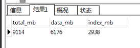
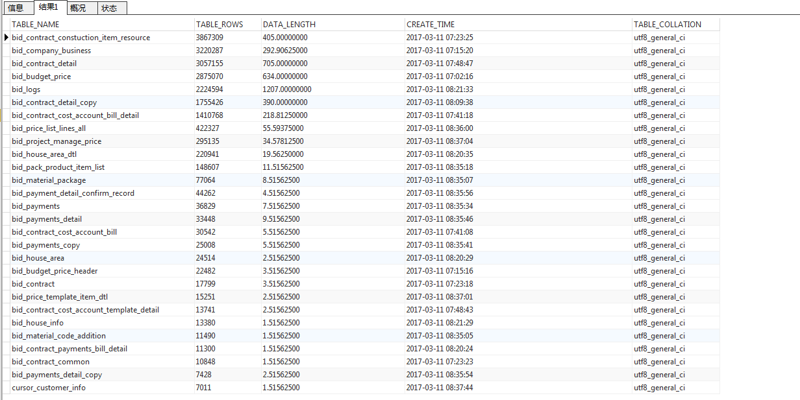

# MySQL 运维操作

## MySQL 性能优化和监控

### 常见影响MySQL性能的参数

* 连接
* 查询缓存
* 会话内存
* 慢速查询日志

### 备份数据必需操作-只读锁

```mysql
#super权限的用户也不能进行读写操作
mysql> flush tables with read lock;
# 解除只读锁
mysql> unlock tables;


#-----------------------------------------------------------'
mysql> show global variables like "%read_only%";
#将MySQL只读设置为只读状态的命令：
mysql> set global read_only=1;
#将salve库从只读状态变为读写状态，需要执行的命令是：
mysql> set global read_only=0;
#read_only=1只读模式，可以限定普通用户进行数据修改的操作，但不会限定具有super权限的用户（如超级管理员root用户）的数据修改操作
```

### MySQL服务器配置信息 

```mysql
mysql> show variables;  
mysql> show variables\G
```

### 查询MySQL服务器所有状态值(不经常用)

```mysql
 mysql> show global status;  
```

### 查询连接数(经常用)

```bash
mysql>  show variables like 'max_connections';
+-----------------+-------+
| Variable_name   | Value |
+-----------------+-------+
| max_connections | 2000  |
+-----------------+-------+
1 row in set
mysql>  show global status like 'max_used_connections'; 
+----------------------+-------+
| Variable_name        | Value |
+----------------------+-------+
| Max_used_connections | 828   |
+----------------------+-------+
1 row in set

#Connections，试图连接到（不管是否成功）MySQL服务器的连接数。
#Max_used_connections，服务器启动后已经同时使用的连接的最大数量。
#Threads_connected，当前的连接数

set global max_connections = 2000;  # 动态设置
```

这台mysql服务器最大连接数是2000,mysql服务器过去的最大连接数是828,没有达到服务器连接数上限256，应该没有出现1040错误，比较理想的设置是

> max_used_connections / max_connections * 100% ≈ 85% 

最大连接数占上限连接数的85％左右，如果发现比例在10%以下，mysql服务器连接数上限设置的过高了

#### MySQL max_connections 总是 214,修改/etc/my.cnf无效解决办法

```bash

It was indeed limits set by the OS. Resolved it with :

Edit file /usr/lib/systemd/system/mysqld.service
Add at end:

LimitNOFILE=65535
LimitNPROC=65535

$ systemctl daemon-reload
$ systemctl restart  mysqld.service
```


### 查询thread_cache线程

```mysql
mysql> show variables like 'thread%';
+--------------------+---------------------------+
| Variable_name      | Value                     |
+--------------------+---------------------------+
| thread_cache_size  | 20                        |
| thread_concurrency | 8                         |
| thread_handling    | one-thread-per-connection |
| thread_stack       | 524288                    |
+--------------------+---------------------------+
4 rows in set
mysql> show status like '%connections%';
+-----------------------------------+--------+
| Variable_name                     | Value  |
+-----------------------------------+--------+
| Connection_errors_max_connections | 0      |
| Connections                       | 104180 |
| Max_used_connections              | 1109   |
+-----------------------------------+--------+
3 rows in set
mysql> show status like '%thread%';
+------------------------------------------+-------+
| Variable_name                            | Value |
+------------------------------------------+-------+
| Delayed_insert_threads                   | 0     |
| Performance_schema_thread_classes_lost   | 0     |
| Performance_schema_thread_instances_lost | 0     |
| Slow_launch_threads                      | 0     |
| Threads_cached                           | 12    |
| Threads_connected                        | 838   |
| Threads_created                          | 4183  |
| Threads_running                          | 23    |
+------------------------------------------+-------+
8 rows in set
```

通过以上3个命令,可以看到服务器的:
thread_cache池中最多可以存放20[thread_cache_size]个连接线程
为每个客户端球使用一个线程.为每个连接的线程分配(524288/1024k)[thread_stack]的内存空间.
服务器总共有104180[Connections]次连接,最大并发连接数为1109[Max_used_connections ],
当前在thread_cache池中的连接数为12[Threads_cached]个,连接数为838[Threads_connected ]个,处于活跃状态的有23[ Threads_running ]个,共创建 了4183[Threads_created]次连接.
显然这里以短连接为主.可以算出thread_cache命中率;

>公式为:
>Thread_Cache_Hit=(Connections-Thread_created)/Connections*100%

当前服务器的Thread_cache命中率约为95.6%这个结果我还是比较满意的.但是可以看出 thread_cache_size有点多余改成?更合理一些.

> 注意:
>
> thread_concurrency 在GNU/Linux系统上没有用的。它只在Solaris < 9 的系统中有用。。。而且从mysql5.6.1开始，这个选项就被废了。

### 查询qcache

```bash
mysql>  show global status like '
thread%';
+-------------------+-------+
| Variable_name     | Value |
+-------------------+-------+
| Threads_cached    | 2     |
| Threads_connected | 719   |
| Threads_created   | 2096  |
| Threads_running   | 4     |
+-------------------+-------+
4 rows in set

mysql> 
```


### 查看查询缓存的配置

```mysql
mysql> show variables  like '%query_cache%';
+------------------------------+------------+
| Variable_name                | Value      |
+------------------------------+------------+
| have_query_cache             | YES        |
| query_cache_limit            | 104857600  | 100M
| query_cache_min_res_unit     | 512        |
| query_cache_size             | 4294967296 | 4G
| query_cache_type             | ON         |
| query_cache_wlock_invalidate | OFF        |
+------------------------------+------------+
6 rows in set
#-------------------------------------------
#have_query_cache 表示是否支持query cache;
#query_cache_limit 表示query cache存放的单条query最大结果集，默认值为1M，结果集大小超过该值的query不会被cache;
#query_cache_min_res_unit 表示query cache 每个结果集存放的最小内存大小，默认4k;
##query_cache_size 表示系统中用于query cache的内存大小;
#query_cache_type 系统是否打开了query cache功能;

#query_cache_wlock_invalidate 针对myisam存储引擎，设置当有write lock在某个table上面的时候，读请求是要等待write lock释放资源之后再查询还是允许直接从query cache中读取结果，默认是OFF，可以直接从query cache中取得结果
```


### 查看运行时查询缓存信息

```bash
#qcache
mysql>  SHOW STATUS LIKE 'qcache%';
+-------------------------+------------+
| Variable_name           | Value      |
+-------------------------+------------+
| Qcache_free_blocks      | 14079      |
| Qcache_free_memory      | 4067979760 | 3.788G
| Qcache_hits             | 2976969    |
| Qcache_inserts          | 2924537    |
| Qcache_lowmem_prunes    | 0          |
| Qcache_not_cached       | 2559966    |
| Qcache_queries_in_cache | 61081      |
| Qcache_total_blocks     | 137167     |
+-------------------------+------------+
8 rows in set
mysql> 
#Qcache_free_blocks 缓存中相邻内存块的个数。数目大说明可能有碎片。FLUSH QUERY CACHE 会对缓存中的碎片进行整理，从而得到一个空闲块。
#Qcache_free_memory 缓存中的空闲内存。
#Qcache_hits 每次查询在缓存中命中时就增大。

#Qcache_inserts 每次插入一个查询时就增大(未命中就插入)。命中次数除以插入次数就是不中比率；用 1 减去这个值就是命中率。在上面这个例子中，大约有 87% 的查询都在缓存中命中。

#Qcache_lowmem_prunes 缓存出现内存不足并且必须要进行清理以便为更多查询提供空间的次数(通俗的说: 多少条Query 因为内存不足而被清除出Query Cache)。这个数字最好长时间来看；如果这个数字在不断增长，就表示可能碎片非常严重，或者内存很少。(上面的 free_blocks 和 free_memory 可以告诉您属于哪种情况)通过"Qcache_lowmem_prunes"和"Qcache_free_memory"相互结合，能够更清楚的了解到我们系统中Query Cache 的内存大小是否真的足够，是否非常频繁的出现因为内存不足而有Query 被换出;

#Qcache_not_cached
不适合进行缓存的查询的数量，通常是由于这些查询不是 SELECT 语句。
#Qcache_queries_in_cache
当前缓存的查询（和响应）的数量。
#Qcache_total_blocks
缓存中块的数量。
```


### 查询缓存命中率

```mysql
缓存命中率的计算公式是：Qcache_hits/(Qcache_hits + Com_select)。

总的select查询数等于com_select(没命中) + qcache_hits(命中) + 解析错误的查询
com_select等于qcache_inserts(缓存失效) + qcache_not_cache(没有缓存) + 权限检查错误的查询。
mysql> SHOW STATUS LIKE 'Qcache_hits';
mysql> show status like '%Com_select%';
```


### 索引读的计数器handler_read%

```mysql
mysql>  SHOW GLOBAL STATUS LIKE 'handler_read%';
+-----------------------+----------------+
| Variable_name         | Value          |
+-----------------------+----------------+
| Handler_read_first    | 4698733773     |
| Handler_read_key      | 198744577673   |
| Handler_read_last     | 857451         |
| Handler_read_next     | 1280851496243  |
| Handler_read_prev     | 40200139960    |
| Handler_read_rnd      | 13471521439    |
| Handler_read_rnd_next | 29374430603730 |
+-----------------------+----------------+
7 rows in set (0.00 sec)

mysql> 
```

- Handler_read_first：索引中第一条被读的次数。如果较高，它表示服务器正执行大量全索引扫描；例如，SELECT col1 FROM foo，假定col1有索引（这个值越低越好）。
- Handler_read_key：如果索引正在工作，这个值代表一个行被索引值读的次数，如果值越低，表示索引得到的性能改善不高，因为索引不经常使用（这个值越高越好）。
- Handler_read_next ：按照键顺序读下一行的请求数。如果你用范围约束或如果执行索引扫描来查询索引列，该值增加。
- Handler_read_prev：按照键顺序读前一行的请求数。该读方法主要用于优化ORDER BY ... DESC。
- Handler_read_rnd ：根据固定位置读一行的请求数。如果你正执行大量查询并需要对结果进行排序该值较高。你可能使用了大量需要MySQL扫描整个表的查询或你的连接没有正确使用键。这个值较高，意味着运行效率低，应该建立索引来补救。
- Handler_read_rnd_next：在数据文件中读下一行的请求数。如果你正进行大量的表扫描，该值较高。通常说明你的表索引不正确或写入的查询没有利用索引。
- ​

```mysql
mysql> show status like 'handler_read_%';
+-----------------------+-------+
| Variable_name | Value |
+-----------------------+-------+
| Handler_read_first | 1 |
| Handler_read_key | 1 |
| Handler_read_last | 0 |
| Handler_read_next | 0 |
| Handler_read_prev | 0 |
| Handler_read_rnd | 0 |
| Handler_read_rnd_next | 21 |
+-----------------------+-------+
7 rows in set (0.01 sec)
```

```bash

5者应该有四种组合：
1. Handler_read_first 和 Handler_read_next 组合应该是索引覆盖扫描
2. Handler_read_key 基于索引取值
3. Handler_read_key 和 Handler_read_next 组合应该是索引范围扫描
4. Handler_read_last 和 Handler_read_prev 组合应该是索引范围扫描（orde by desc）

2）对数据文件的计数器：后面的2个都是对数据文件读情况的计数器，
Handler_read_rnd:
The number of requests to read a row based on a fixed position. This value is high if you are doing a lot of queries that require sorting of the result. You probably have a lot of queries that require MySQL to scan entire tables or you have joins that do not use keys properly.

Handler_read_rnd_next
The number of requests to read the next row in the data file. This value is high if you are doing a lot of
table scans. Generally this suggests that your tables are not properly indexed or that your queries are
not written to take advantage of the indexes you have.

这里很重要的一点要理解：索引项之间都是有顺序的，所以才有first, last, next, prev等等，所以前面的5个都是对索引读情况
的计数器，而后面的2个是对数据文件的读情况的计数器。
```


## MySQL 统计查询

### 查询某个库某个表有哪些字段

```mysql
select COLUMN_NAME,DATA_TYPE,COLUMN_COMMENT from information_schema.COLUMNS where table_name = 'bid_performance_snapshot' and table_schema = 'ykee_bid';
```

### 查询数据库中的存储过程和函数

 ```mysql
##方法一：
#存储过程
select `name` from mysql.proc where db = 'your_db_name' and `type` = 'PROCEDURE'   
#函数
select `name` from mysql.proc where db = 'your_db_name' and `type` = 'FUNCTION'  

##方法二：
show procedure status;  #存储过程
show function status;   #函数
 ```

### 查看存储过程或函数的创建代码

```mysql
show create procedure proc_name #存储过程
show create function func_name;  #函数
```

### 查看视图

```mysql
SELECT * from information_schema.VIEWS   #视图
SELECT * from information_schema.TABLES  #表
```

### 查看触发器

```mysql
##方法一：
#语法：
SHOW TRIGGERS [FROM db_name] [LIKE expr]
#实例：
SHOW TRIGGERS\G     //触发器

##方法二：
#对INFORMATION_SCHEMA数据库中的TRIGGERS表查询
mysql>SELECT * FROM triggers T WHERE trigger_name=”mytrigger” \G
```

### 如何判断mysql某个数据库某张表是否存在

```mysql
SELECT TABLE_NAME FROM INFORMATION_SCHEMA.TABLES WHERE TABLE_SCHEMA='dbname' AND TABLE_NAME='tablename' ;  
```


###查询数据库总占用空间(数据+索引)

```mysql
SELECT
	round(
		sum(data_length + index_length) / 1024 / 1024
	) AS total_mb,
	round(sum(data_length) / 1024 / 1024) AS data_mb,
	round(
		sum(index_length) / 1024 / 1024
	) AS index_mb
FROM
	INFORMATION_SCHEMA.TABLES
```



###统计某个数据库有多少张表

```mysql
SELECT
	table_schema,
	ENGINE,
	count(*) AS TABLES
FROM
	INFORMATION_SCHEMA. TABLES
WHERE
	table_schema NOT IN (
		'INFORMATION_SCHEMA',
		'PERFORMANCE_SCHEMA'
	)
GROUP BY
	table_schema,
	ENGINE
ORDER BY
	3 DESC
```


###统计一个数据库内各个表记录数,占用空间

```mysql
SELECT
	TABLE_NAME,
	TABLE_ROWS,
	DATA_LENGTH / 1024 / 1024 "DATA_LENGTH",
	CREATE_TIME,
	TABLE_COLLATION
FROM
	INFORMATION_SCHEMA. TABLES
WHERE
	TABLE_SCHEMA = 'ykee_bid'
ORDER BY
	TABLE_ROWS DESC
```



### 统计一个数据库总共的记录数

```mysql
SELECT

	sum(TABLE_ROWS)
	
FROM
	INFORMATION_SCHEMA. TABLES
WHERE
	TABLE_SCHEMA = 'ykee_bid'
ORDER BY
	TABLE_ROWS DESC
```


###统计所有数据库的表数,数据占用空间,索引占用空间

```mysql
#------多了静态表,动态表row_format
SELECT
	table_schema,
	table_name,
	ENGINE,
	row_format AS format,
	table_rows,
	avg_row_length AS avg_row,
	round(
		sum(data_length + index_length) / 1024 / 1024
	) AS total_mb,
	round(sum(data_length) / 1024 / 1024) AS data_mb,
	round(
		sum(index_length) / 1024 / 1024
	) AS index_mb,
	CURDATE() AS today
FROM
	information_schema. TABLES
WHERE
	table_schema NOT IN (
		'mysql',
		'information_schema',
		'performance_schema'
	)
GROUP BY
	table_schema,
-- 	table_name,
	ENGINE
ORDER BY
	table_schema,
	table_name

```


```mysql
SELECT
	table_schema,
	ENGINE,
	count(*) AS TABLES,
	round(
		sum(data_length + index_length) / 1024 / 1024
	) AS total_mb,
	round(sum(data_length) / 1024 / 1024) AS data_mb,
	round(
		sum(index_length) / 1024 / 1024
	) AS index_mb
FROM
	information_schema. TABLES
GROUP BY
	table_schema,
	ENGINE
ORDER BY
	3 DESC
```


### 统计一个数据库里面表数据占用空间,索引占用空间

```mysql

SELECT
	CONCAT(
		table_schema,
		'.',
		table_name
	) AS 'Table Name',
	CONCAT(
		ROUND(table_rows / 1000000, 4),
		'M'
	) AS 'Number of Rows',
	CONCAT(
		ROUND(
			data_length / (1024 * 1024 * 1024),
			4
		),
		'G'
	) AS 'Data Size',
	CONCAT(
		ROUND(
			index_length / (1024 * 1024 * 1024),
			4
		),
		'G'
	) AS 'Index Size',
	CONCAT(
		ROUND(
			(data_length + index_length) / (1024 * 1024 * 1024),
			4
		),
		'G'
	) AS 'Total'
FROM
	information_schema. TABLES
WHERE
	table_schema LIKE 'ykee_bid';
order by 'Index Size' desc
```


> 注意:
>
> 系统表里面的table_rows 不一定准确

### 查看查询进程

```mysql
SELECT * FROM information_schema.PROCESSLIST  WHERE COMMAND != "Sleep" order by TIME DESC;     
```

 ## 查询死锁

```mysql
BEGIN
		#author xieguopei
		#date   2016/12/9
		DECLARE done TINYINT DEFAULT 0;
		#DECLARE idSum INT(11) SET idSum = SELECT COUNT(*) FROM information_schema.innodb_trx;
		DECLARE threadId INT(11);
		#定义流程游标
		DECLARE cs CURSOR FOR 
		SELECT information_schema.INNODB_TRX.trx_mysql_thread_id FROM information_schema.innodb_trx;
		
		DECLARE CONTINUE HANDLER FOR SQLSTATE '02000' SET done = 1;

		OPEN cs;

		
		
		WHILE done <> 1 DO
			FETCH cs INTO threadId;
			SELECT threadId as '要删除的流程ID';
		KILL threadId;
		END WHILE;

		CLOSE cs;
		
		SELECT 'END';
END
```


```mysql
select concat(round(sum(data_length/1024/1024),2),'mb') as data from information_schema.tables where table_schema='ZABBIX';
```

### 慢查询日志

在MySQL中就要自己开启慢日志记录加以分析（记录可以保存在表或者文件中，默认是保存在文件中，我们系统使用的就是默认方式）

那么什么样的查询需要被日志呢？在MySQL中， 没有index的查询 以及 超过指定时间同时超过指定扫描行数的查询 需要记录在慢日志查询里面。

```mysql

mysql>  show global status like '%slow%';  
+---------------------+-------+
| Variable_name       | Value |
+---------------------+-------+
| Slow_launch_threads | 0     |
| Slow_queries        | 1423  |
+---------------------+-------+
2 rows in set

#慢查询日志保存位置
mysql> show variables like '%slow%';
+---------------------------+------------------------------------+
| Variable_name             | Value                              |
+---------------------------+------------------------------------+
| log_slow_admin_statements | OFF                                |
| log_slow_slave_statements | OFF                                |
| slow_launch_time          | 2                                  |
| slow_query_log            | ON                                 |
| slow_query_log_file       | /home/mysql/data/shj-db01-slow.log |
+---------------------------+------------------------------------+
5 rows in set

mysql> show variables like "%long%";
+--------------------------------------------------------+----------+
| Variable_name                                          | Value    |
+--------------------------------------------------------+----------+
| long_query_time                                        | 8.000000 |
| performance_schema_events_stages_history_long_size     | 10000    |
| performance_schema_events_statements_history_long_size | 10000    |
| performance_schema_events_waits_history_long_size      | 10000    |
+--------------------------------------------------------+----------+
4 rows in set

# long_query_time 超过8秒的查询就写入日志,可以在my.cnf 配置
long_query_time = 8
log-slow-queries = /tmp/mysql-slow.log  #指定慢查询保存位置
```
对于许多WEB程序来说，2秒的查询还是太长了。的确在许多站点中，一个SQL语句超过1秒的执行时间都算慢的了。
mysql5.1.21以后才提供更细粒度的long_query_time设定，之前的版本只能以秒做单位。
```bash
##没有index的查询记录开关
mysql> show global variables like '%indexes%';
+----------------------------------------+-------+
| Variable_name                          | Value |
+----------------------------------------+-------+
| log_queries_not_using_indexes          | OFF   |
| log_throttle_queries_not_using_indexes | 0     |
+----------------------------------------+-------+
2 rows in set

第一个参数 表示是否开启记录没有index的查询，第二个
参数用来做日志记录的流量控制，一分钟可以记录多少条，默认0是表示不限制。
超过指定时长的查询开关
mysql> show global variables like '%long_query%';
+-----------------+-----------+
| Variable_name  | Value   |
+-----------------+-----------+
| long_query_time | 10.000000 |
+-----------------+-----------+
1 row in set (0.00 sec)
就一个参数指定超过多少时长的查询需要被记录
超过指定行数的扫描查询开关
mysql> show variables like '%min_examined_row_limit%';
+------------------------+-------+
| Variable_name     | Value |
+------------------------+-------+
| min_examined_row_limit | 0   |
+------------------------+-------+
1 row in set (0.00 sec)
默认是0，代表不现在扫描行数
```

