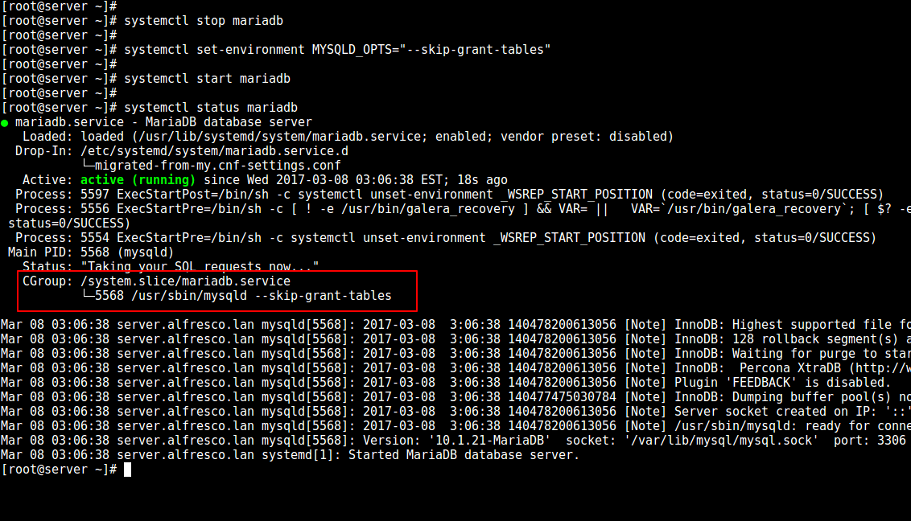

# 如何在 Linux 中重置 MySQL 或者 MariaDB 的 root 密码

如果你是第一次设置 MySQL 或 MariaDB 数据库，你可以直接运行 `mysql_secure_installation` 来实现基本的安全设置。

其中一项是设置数据库 root 帐户的密码 - 你必须保持私密，并仅在绝对需要时使用。如果你忘记了密码或需要重置密码（例如，当数据库管理员换人或被裁员！），这篇文章会派上用场。我们将解释如何在 Linux 中重置或恢复 MySQL 或 MariaDB 的 root 密码。

**建议阅读：** [更改 MySQL 或 MariaDB 的 root 密码](http://www.tecmint.com/change-mysql-mariadb-root-password/)。

虽然我们将在本文中使用 MariaDB，但这些说明同样也适用于 MySQL。

### 恢复 MySQL 或者 MariaDB 的 root 密码

开始之前，先停止数据库服务并检查服务状态，我们应该可以看到先前设置的环境变量：

```bash
------------- SystemD ------------- 
# systemctl stop mariadb
------------- SysVinit -------------
# /etc/init.d/mysqld stop
```

接下来，用 `--skip-grant-tables` 选项启动服务：

```bash
------------- SystemD ------------- 
# systemctl set-environment MYSQLD_OPTS="--skip-grant-tables"
# systemctl start mariadb
# systemctl status mariadb
------------- SysVinit -------------
# mysqld_safe --skip-grant-tables &
```



*使用 skip tables 启动 MySQL/MariaDB*

这可以让你不用 root 密码就能连接到数据库（你也许需要切换到另外一个终端上）：

```bash
# mysql -u root
```

接下来，按照下面列出的步骤来。

```mysql
MariaDB [(none)]> USE mysql;
MariaDB [(none)]> UPDATE user SET password=PASSWORD('YourNewPasswordHere') WHERE User='root' AND Host = 'localhost';
MariaDB [(none)]> FLUSH PRIVILEGES;
```

最后，停止服务，取消环境变量设置并再次启动服务：

```bash
------------- SystemD ------------- 
# systemctl stop mariadb
# systemctl unset-environment MYSQLD_OPTS
# systemctl start mariadb
------------- SysVinit -------------
# /etc/init.d/mysql stop
# /etc/init.d/mysql start
```

这可以让先前的改变生效，允许你使用新的密码连接到数据库。