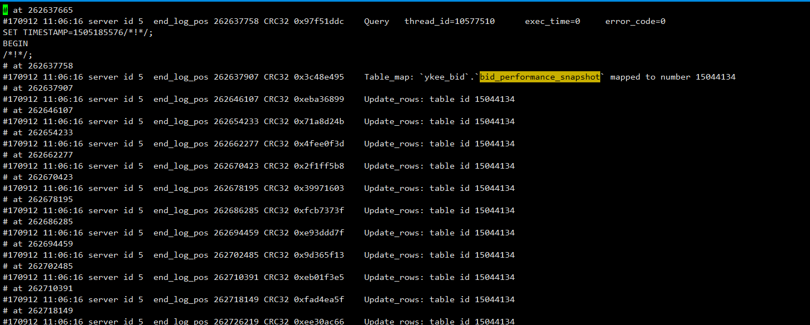
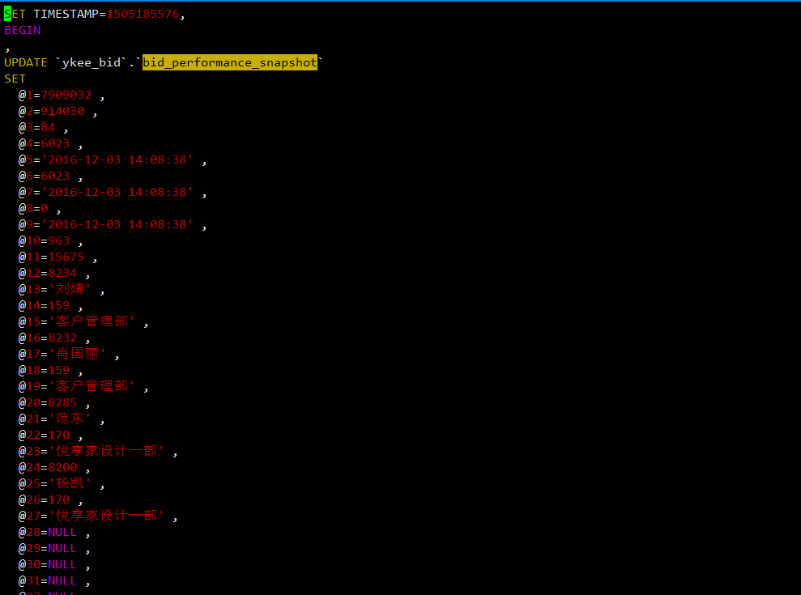

# MySQL 误操作后数据恢复（update,delete忘加where条件）

##UPDATE 忘加where条件误操作恢复数据(binglog格式必须是ROW)

###锁表

在线上的话，应该比较复杂，要先进行锁表，以免数据再次被污染。（锁表，查看正在写哪个二进制日志）

```mysql
mysql> lock tables t1 read ;
Query OK, 0 rows affected (0.00 sec)

mysql> show master status;
+------------------+----------+--------------+------------------+
| File             | Position | Binlog_Do_DB | Binlog_Ignore_DB |
+------------------+----------+--------------+------------------+
| mysql-bin.000255 |     **** |              |                  |
+------------------+----------+--------------+------------------+
1 row in set (0.00 sec)

mysql> 
```

###获取执行Update操作的时间

分析二进制日志，并且在其中找到相关记录，在更新时是address='zhuhai',我们可以在日志中过滤出来。

```bash
[root@shj-db01 home]# mysqlbinlog --no-defaults -v -v --base64-output=DECODE-ROWS /home/mysql/data/mysql-bin.000255  | grep -B 15 'UPDATE `ykee_bid`.`bid_performance_snapshot`' |grep more

[root@shj-db01 home]# mysqlbinlog --no-defaults -v -v --base64-output=DECODE-ROWS /home/mysql/data/mysql-bin.000255  | grep -B 15 'UPDATE `ykee_bid`.`bid_performance_snapshot`' |more
#170912 11:06:16 server id 5  end_log_pos 270839843 CRC32 0x7f43b795 	Update_rows: table id 15044134
# at 270839843
#170912 11:06:16 server id 5  end_log_pos 270847929 CRC32 0xa010daaf 	Update_rows: table id 15044134
# at 270847929
#170912 11:06:16 server id 5  end_log_pos 270856099 CRC32 0x18fd65d9 	Update_rows: table id 15044134
# at 270856099
#170912 11:06:16 server id 5  end_log_pos 270864251 CRC32 0x3da208f1 	Update_rows: table id 15044134
# at 270864251
#170912 11:06:16 server id 5  end_log_pos 270872281 CRC32 0x2832b285 	Update_rows: table id 15044134
# at 270872281
#170912 11:06:16 server id 5  end_log_pos 270880385 CRC32 0x786320e5 	Update_rows: table id 15044134
# at 270880385
#170912 11:06:16 server id 5  end_log_pos 270888537 CRC32 0x27f08d12 	Update_rows: table id 15044134
# at 270888537
#170912 11:06:16 server id 5  end_log_pos 270893323 CRC32 0xc931958e 	Update_rows: table id 15044134 flags: STMT_END_F
### UPDATE `ykee_bid`.`bid_performance_snapshot`
--
###   @27='悦享家设计一部' /* VARSTRING(120) meta=120 nullable=1 is_null=0 */
###   @28=NULL /* VARSTRING(120) meta=0 nullable=1 is_null=1 */
###   @29=NULL /* VARSTRING(120) meta=120 nullable=1 is_null=1 */
###   @30=NULL /* VARSTRING(120) meta=0 nullable=1 is_null=1 */
###   @31=NULL /* VARSTRING(120) meta=120 nullable=1 is_null=1 */
###   @32=NULL /* VARSTRING(120) meta=0 nullable=1 is_null=1 */
###   @33=NULL /* VARSTRING(120) meta=120 nullable=1 is_null=1 */
###   @34=NULL /* VARSTRING(120) meta=0 nullable=1 is_null=1 */
###   @35=NULL /* VARSTRING(120) meta=120 nullable=1 is_null=1 */
###   @36=NULL /* VARSTRING(120) meta=0 nullable=1 is_null=1 */
###   @37=NULL /* VARSTRING(120) meta=120 nullable=1 is_null=1 */
###   @38=NULL /* VARSTRING(120) meta=0 nullable=1 is_null=1 */
###   @39=NULL /* VARSTRING(120) meta=120 nullable=1 is_null=1 */
###   @40=NULL /* VARSTRING(120) meta=0 nullable=1 is_null=1 */
###   @41=81697.00 /* DECIMAL(12,2) meta=3074 nullable=1 is_null=0 */
### UPDATE `ykee_bid`.`bid_performance_snapshot`
--
###   @27='悦享家设计四部' /* VARSTRING(120) meta=120 nullable=1 is_null=0 */
```

###处理分析处理的二进制日志

```bash
[root@shj-db01 home]# mysqlbinlog --no-defaults -v -v --base64-output=DECODE-ROWS /home/mysql/data/mysql-bin.000255 | sed -n '/# at 262637665/,/COMMIT/p' > t1.txt 
```



###转换成update语句

```bash
[root@localhost mysql]# sed '/WHERE/{:a;N;/SET/!ba;s/\([^\n]*\)\n\(.*\)\n\(.*\)/\3\n\2\n\1/}' t1.txt | sed -r '/WHERE/{:a;N;/@41/!ba;s/###   @2.*//g}' | sed 's/### //g;s/\/\*.*/,/g' | sed '/WHERE/{:a;N;/@1/!ba;s/,/;/g};s/#.*//g;s/COMMIT,//g' | sed '/^$/d' > recover.sql 


##请注意sed -r '/WHERE/{:a;N;/@41/!ba;s/###   @2.*//g}'  @41 这个请根据真实情况替换;意思时候把where 后面的@2-@41删除掉,因为我们update where 可以只根据@1,也就是id直接更新;
```



### 替换@1,@2等字符

将文件中的@1,@2,@3,@4替换为t1表中id，name，sex，address字段，并删除最后字段的","号

```bash
[root@localhost mysql]# sed -i 's/@1/id/g;s/@2/name/g;s/@3/sex/g;s/@4/address/g' recover.sql
[root@localhost mysql]# sed -i -r 's/(address=.*),/\1/g' recover.sql
[root@localhost mysql]# cat recover.sql 


##
sed -i 's/@1=/id=/g;s/@2=/track_id=/g;s/@3=/org_id=/g;s/@4=/created_by=/g;s/@5=/created_date=/g;s/@6=/last_updated_by=/g;s/@7=/last_updated_date=/g;s/@8=/remove_flag=/g;s/@9=/actual_receive_date=/g;s/@10=/agreement_status=/g;s/@11=/bid_payments_id=/g;s/@12=/sales_id=/g;s/@13=/sales_name=/g;s/@14=/sales_dept_id=/g;s/@15=/sales_dept_name=/g;s/@16=/sales_manage_id=/g;s/@17=/sales_manage_name=/g;s/@18=/sales_manage_dept_id=/g;s/@19=/sales_manage_dept_name=/g;s/@20=/desingn_id=/g;s/@21=/desingn_name=/g;s/@22=/desingn_dept_id=/g;s/@23=/desingn_dept_name=/g;s/@24=/desingn_manage_id=/g;s/@25=/desingn_manage_name=/g;s/@26=/desingn_manage_dept_id=/g;s/@27=/desingn_manage_dept_name=/g;s/@28=/distribution_id=/g;s/@29=/distribution_name=/g;s/@30=/distribution_dept_id=/g;s/@31=/distribution_dept_name=/g;s/@32=/distribution_manage_id=/g;s/@33=/distribution_manage_name=/g;s/@34=/distribution_manage_dept_id=/g;s/@35=/distribution_manage_dept_name=/g;s/@36=/non_sales_id=/g;s/@37=/non_sales_name=/g;s/@38=/non_sales_dept_id=/g;s/@39=/non_sales_dept_name=/g;s/@40=/version=/g;s/@41=/actual_achievement_amount=/g' recover.sql
##去掉set 最后一个参数@41后面的逗号
[root@localhost mysql]# sed -i -r 's/(actual_achievement_amount=.*),/\1/g' recover.sql

```

到这里日志就处理好了现在导入即可（导入数据后，解锁表）；

###导入表,并解锁表

```mysql
mysql> source recover.sql;
Query OK, 1 row affected (0.12 sec)
Rows matched: 1  Changed: 1  Warnings: 0

Query OK, 1 row affected (0.00 sec)
Rows matched: 1  Changed: 1  Warnings: 0

Query OK, 1 row affected (0.01 sec)
Rows matched: 1  Changed: 1  Warnings: 0
```

##delete 忘加where条件误删除恢复(binglog格式必须是ROW)

其实这和update忘加条件差不多，不过这处理更简单,这里就用上面那张表做测试吧

###在binglog中去查找相关记录

```bash
/home/mysql/bin/mysqlbinlog --no-defaults -v -v --base64-output=DECODE-ROWS /data/mysql/data/mysql-bin.000037 | grep -B 15 'start_work_apply' >/home/delete.txt 

1. grep -A1 keyword filename
找出filename中带有keyword的行，输出中除显示该行外，还显示之后的一行(After 1)
2. grep -B1 keyword filename
找出filename中带有keyword的行，输出中除显示该行外，还显示之前的一行(Before 1)

 /home/mysql/bin/mysqlbinlog  --no-defaults -v -v --base64-output=decode-rows /data/mysql/data/mysql-bin.000037|grep -A 15 'DELETE FROM `ykee_biz`.`start_work_apply`'|more


[root@localhost mysql]# mysqlbinlog --no-defaults --base64-output=decode-rows -v -v mysql-bin.000024 | sed -n '/### DELETE FROM db01.t1/,/COMMIT/p' > delete.txt


[root@localhost mysql]# cat delete.txt 
### DELETE FROM db01.t1
### WHERE
###   @1=1 /* INT meta=0 nullable=0 is_null=0 */
###   @2='daiiy' /* STRING(60) meta=65084 nullable=0 is_null=0 */
###   @3=2 /* ENUM(1 byte) meta=63233 nullable=0 is_null=0 */
###   @4='guangzhou' /* VARSTRING(90) meta=90 nullable=0 is_null=0 */
### DELETE FROM db01.t1
### WHERE
###   @1=2 /* INT meta=0 nullable=0 is_null=0 */
###   @2='tom' /* STRING(60) meta=65084 nullable=0 is_null=0 */
###   @3=1 /* ENUM(1 byte) meta=63233 nullable=0 is_null=0 */
###   @4='shanghai' /* VARSTRING(90) meta=90 nullable=0 is_null=0 */
### DELETE FROM db01.t1
### WHERE
###   @1=3 /* INT meta=0 nullable=0 is_null=0 */
###   @2='liany' /* STRING(60) meta=65084 nullable=0 is_null=0 */
###   @3=2 /* ENUM(1 byte) meta=63233 nullable=0 is_null=0 */
###   @4='beijing' /* VARSTRING(90) meta=90 nullable=0 is_null=0 */
### DELETE FROM db01.t1
### WHERE
###   @1=4 /* INT meta=0 nullable=0 is_null=0 */
###   @2='lilu' /* STRING(60) meta=65084 nullable=0 is_null=0 */
###   @3=2 /* ENUM(1 byte) meta=63233 nullable=0 is_null=0 */
###   @4='zhuhai' /* VARSTRING(90) meta=90 nullable=0 is_null=0 */
# at 2719
#140305 11:41:00 server id 1  end_log_pos 2746  Xid = 78
COMMIT/*!*/;
[root@localhost mysql]# 
```

###将记录转换为SQL语句

```bash
[root@localhost mysql]# cat delete.txt | sed -n '/###/p' | sed 's/### //g;s/\/\*.*/,/g;s/DELETE FROM/INSERT INTO/g;s/WHERE/SELECT/g;' | sed -r 's/(@4.*),/\1;/g' | sed 's/@[1-9]=//g' > t1.sql
[root@localhost mysql]# cat t1.sql 
INSERT INTO db01.t1
SELECT
  1 ,
  'daiiy' ,
  2 ,
  'guangzhou' ;
INSERT INTO db01.t1
SELECT
  2 ,
  'tom' ,
  1 ,
  'shanghai' ;
INSERT INTO db01.t1
SELECT
  3 ,
  'liany' ,
  2 ,
  'beijing' ;
INSERT INTO db01.t1
SELECT
  4 ,
  'lilu' ,
  2 ,
  'zhuhai' ;
[root@localhost mysql]# 
```

###导入数据，验证数据完整性

```
mysql> source t1.sql;
Query OK, 1 row affected (0.00 sec)
Records: 1  Duplicates: 0  Warnings: 0

Query OK, 1 row affected (0.02 sec)
Records: 1  Duplicates: 0  Warnings: 0

Query OK, 1 row affected (0.02 sec)
Records: 1  Duplicates: 0  Warnings: 0

Query OK, 1 row affected (0.01 sec)
Records: 1  Duplicates: 0  Warnings: 0

mysql> select * from t1;
ERROR 1046 (3D000): No database selected
mysql> select * from db01.t1;
+----+-------+-----+-----------+
| id | name  | sex | address   |
+----+-------+-----+-----------+
|  1 | daiiy | m   | guangzhou |
|  2 | tom   | f   | shanghai  |
|  3 | liany | m   | beijing   |
|  4 | lilu  | m   | zhuhai    |
+----+-------+-----+-----------+
4 rows in set (0.00 sec)

mysql> 
```

到这里数据就完整回来了。将binglog格式设置为row有利有弊，好处是记录了每一行的实际变化，在主从复制时也不容易出问题。但是由于记录每行的变化，会占用大量磁盘，主从复制时带宽占用会有所消耗。到底是使用row还是mixed，需要在实际工作中自己去衡量，但从整体上来说，binglog的格式设置为row，都是不二的选择。

##总结

所以在数据库操作的过程中我们需要格外小心，当然开发那边我们需要做好权限的控制，不过有一个参数可以解决我们的问题，让我们不用担心类似的问题发生：

在[mysql]段落开启这个参数：

```
safe-updates
```

这样当我们在做DML操作时忘记加where条件时，mysqld服务器是不会执行操作的：

```mysql
mysql> select *  from t1;
+----+------------------+
| id | name             |
+----+------------------+
|  1 | yayun            |
|  2 | atlas            |
|  3 | mysql            |
|  6 | good yayun heheh |
+----+------------------+
4 rows in set (0.00 sec)

mysql> delete from t1;
ERROR 1175 (HY000): You are using safe update mode and you tried to update a table without a WHERE that uses a KEY column
mysql> 
```