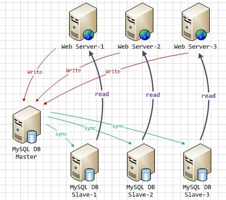

# MySQL-MySQL Proxy 实现读写分离

## 工作拓扑



## 环境描述

操作系统：CentOS6.3_x64

主服务器Master：192.168.0.202

从服务器Slave：192.168.0.203

调度服务器MySQL-Proxy：192.168.0.204

## mysql主从复制

(略)

## mysql-proxy实现读写分离

### 安装mysql-proxy

实现读写分离是有lua脚本实现的，现在mysql-proxy里面已经集成，无需再安装

下载：[http://dev.mysql.com/downloads/mysql-proxy/](http://dev.mysql.com/downloads/mysql-proxy/#downloads)

```bash
tar zxvf mysql-proxy-0.8.3-linux-glibc2.3-x86-64bit.tar.gz
mv mysql-proxy-0.8.3-linux-glibc2.3-x86-64bit /usr/local/mysql-proxy
```

### 配置mysql-proxy，创建主配置文件

```bash
cd /usr/local/mysql-proxy
mkdir lua #创建脚本存放目录
mkdir logs #创建日志目录
cp share/doc/mysql-proxy/rw-splitting.lua ./lua #复制读写分离配置文件
cp share/doc/mysql-proxy/admin-sql.lua ./lua #复制管理脚本
vi /etc/mysql-proxy.cnf   #创建配置文件
#----------------------------------------------------------#
[mysql-proxy]
user=root #运行mysql-proxy用户
admin-username=proxy #主从mysql共有的用户
admin-password=123.com #用户的密码
proxy-address=192.168.0.204:4000 #mysql-proxy运行ip和端口，不加端口，默认4040
proxy-read-only-backend-addresses=192.168.0.203 #指定后端从slave读取数据
proxy-backend-addresses=192.168.0.202 #指定后端主master写入数据
proxy-lua-script=/usr/local/mysql-proxy/lua/rw-splitting.lua #指定读写分离配置文件位置
admin-lua-script=/usr/local/mysql-proxy/lua/admin-sql.lua #指定管理脚本
log-file=/usr/local/mysql-proxy/logs/mysql-proxy.log #日志位置
log-level=info #定义log日志级别，由高到低分别有(error|warning|info|message|debug)
daemon=true    #以守护进程方式运行
keepalive=true #mysql-proxy崩溃时，尝试重启
#----------------------------------------------------------#
保存退出！
chmod 660 /etc/mysql-porxy.cnf
```

### 修改读写分离配置文件

```bash
vi /usr/local/mysql-proxy/lua/rw-splitting.lua
if not proxy.global.config.rwsplit then
 proxy.global.config.rwsplit = {
  min_idle_connections = 1, #默认超过4个连接数时，才开始读写分离，改为1
  max_idle_connections = 1, #默认8，改为1
  is_debug = false
 }
end
```

### 启动mysql-proxy

```bash
/usr/local/mysql-proxy/bin/mysql-proxy --defaults-file=/etc/mysql-proxy.cnf
netstat -tupln | grep 4000 #已经启动
tcp 0 0 192.168.0.204:4000 0.0.0.0:* LISTEN 1264/mysql-proxy
关闭mysql-proxy使用：killall -9 mysql-proxy
```

### 测试读写分离

* 在主服务器创建proxy用户用于mysql-proxy使用，从服务器也会同步这个操作

  ```bash
  mysql> grant all on *.* to 'proxy'@'192.168.0.204' identified by '123.com';
  ```


* 使用客户端连接mysql-proxy

  ```bash
  mysql -u proxy -h 192.168.0.204 -P 4000 -p123.com
  ```

* 创建数据库和表，这时的数据只写入主mysql，然后再同步从slave，可以先把slave的关了，看能不能写入，这里我就不测试了，下面测试下读的数据！

  ```mysql
  mysql> create table user (number INT(10),name VARCHAR(255));
  mysql> insert into test values(01,'zhangsan');
  mysql> insert into user values(02,'lisi');
  ```


* 登陆主从mysq查看新写入的数据如下

  ```mysql
  mysql> use test;
  Database changed
  mysql> select * from user;
  +--------+----------+
  | number | name |
  +--------+----------+
  | 1 | zhangsan |
  | 2 | lisi |
  +--------+----------+
  ```

* 再登陆到mysql-proxy，查询数据，看出能正常查询

  ```mysql
  mysql -u proxy -h 192.168.0.204 -P 4000 -p123.com
  mysql> use test;
  mysql> select * from user;
  +--------+----------+
  | number | name |
  +--------+----------+
  | 1 | zhangsan |
  | 2 | lisi |
  +--------+----------+
  ```

* 登陆从服务器关闭mysql同步进程，这时再登陆mysql-proxy肯定会查询不出数据

  ```mysql
  slave stop；
  ```

* 登陆mysql-proxy查询数据，下面看来，能看到表，查询不出数据

  ```mysql
  mysql> use test;
  Database changed
  mysql> show tables;
  +----------------+
  | Tables_in_test |
  +----------------+
  | user |
  +----------------+
  mysql> select * from user;
  ERROR 1146 (42S02): Table 'test.user' doesn't exist
  ```