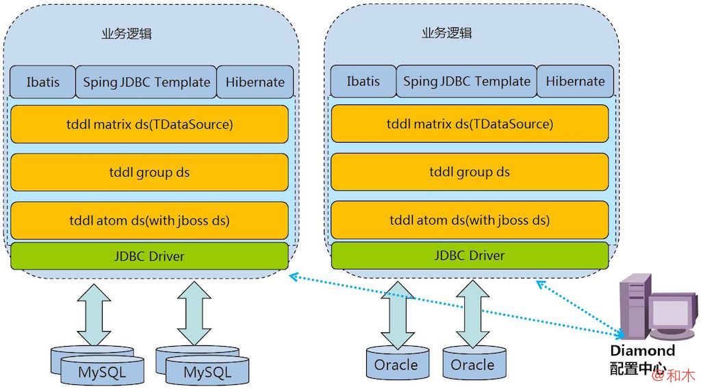
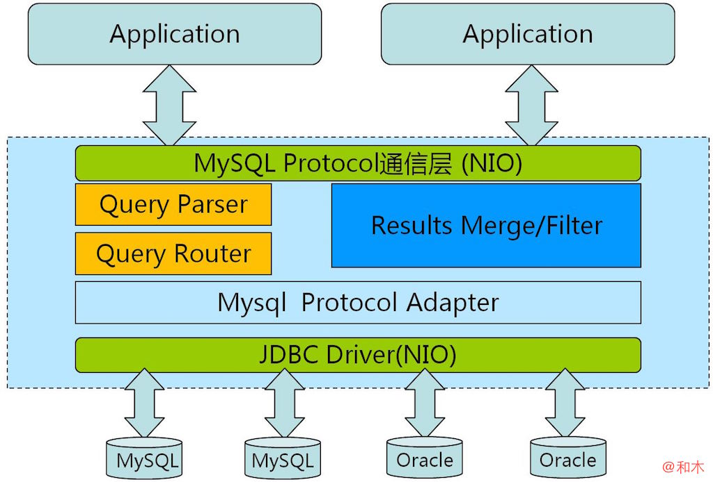
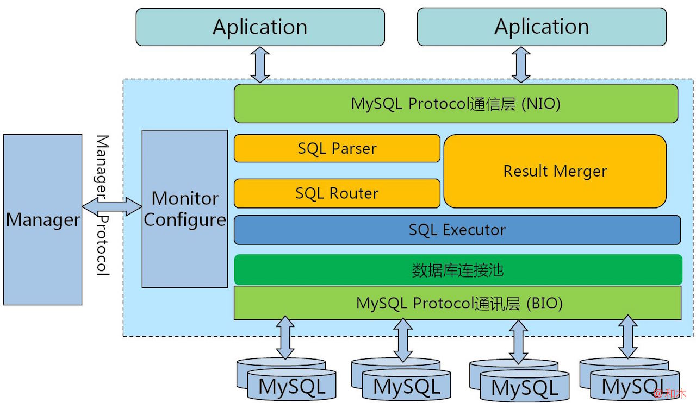
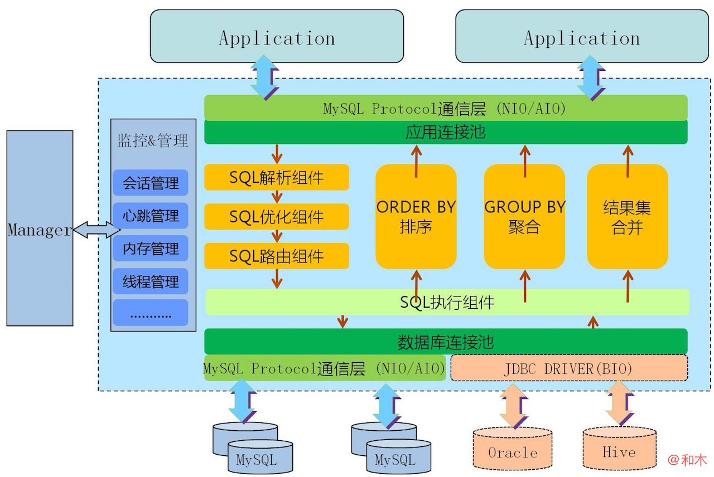

# MySQL-读写分离工具TDDL、Amoeba、Cobar、MyCAT架构比较

布式[数据库](http://lib.csdn.net/base/mysql)中间件TDDL、Amoeba、Cobar、MyCAT[架构](http://lib.csdn.net/base/architecture)比较分

> 比较了业界流行的[MySQL](http://lib.csdn.net/base/mysql)分布式数据库中间件，关于每个产品的介绍，网上的资料比较多，本文只是对几款产品的架构进行比较，从中可以看出中间件发展和演进路线

## 框架比较

### TDDL

### Amoeba

### Cobar

### MyCat

## 点评

1. TDDL不同于其它几款产品，并非独立的中间件，只能算作中间层，是以Jar包方式提供给应用调用。属于JDBC Shard的思想，网上也有很多其它类似产品。

2. 另外，网上有关于TDDL的图，如[http://www.tuicool.com/articles/nmeuu2](http://www.tuicool.com/articles/nmeuu2) 中的图 1-2 TDDL 所处领域模型定位，**把TDDL画在JDBC下层了，这个是不对的，正确的位置是TDDL夹在业务层和JDBC中间**

3. Amoeba是作为一个真正的独立中间件提供服务，即应用去连接Amoeba操作[mysql](http://lib.csdn.net/base/mysql)集群，就像操作单个MySQL一样。从架构中可以看来，Amoeba算中间件中的早期产品，后端还在使用JDBC Driver。

4. Cobar是在Amoeba基础上进化的版本，一个显著变化是把后端JDBC Driver改为原生的MySQL通信协议层。

5. 后端去掉JDBC Driver后，意味着不再支持JDBC规范，不能支持[Oracle](http://lib.csdn.net/base/oracle)、PostgreSQL等数据。但使用原生通信协议代替JDBC Driver，后端的功能增加了很多想象力，比如主备切换、读写分离、异步操作等。

6. MyCat又是在Cobar基础上发展的版本，两个显著点是：

   1. 后端由BIO改为NIO，并发量有大幅提高
   2. 增加了对Order By、Group By、limit等聚合功能的支持（，虽然Cobar也可以支持Order By、Group By、limit语法，但是结果没有进行聚合，只是简单返回给前端，聚合功能还是需要业务系统自己完成）。

7. 目前社区情况：

   1. TDDL处于停滞状态
   2. Amoeba处于停滞状态
   3. Cobar处于停滞状态
   4. **MyCAT社区非常活跃**

8. 感想：抛开TDDL不说，Amoeba、Cobar、MyCAT这三者的渊源比较深，若Amoeba能继续下去，Cobar就不会出来；若Cobar那批人不是都走光了的话，MyCAT也不会再另起炉灶。所以说，在中国开源的项目很多，但是能坚持下去的非常难，MyCAT社区现在非常活跃，也真是一件蛮难得的事。

   # 

## 其它资料

这个博客把几款产品的资料汇总在一起，倒也省得大家在网上到处搜了。 
mysql中间件研究(Atlas，cobar，TDDL，mycat，heisenberg,Oceanus,vitess) 
[http://songwie.com/articlelist/44](http://songwie.com/articlelist/44)

mysql中间件研究（Atlas，cobar，TDDL） 
[http://www.guokr.com/blog/475765/](http://www.guokr.com/blog/475765/)

