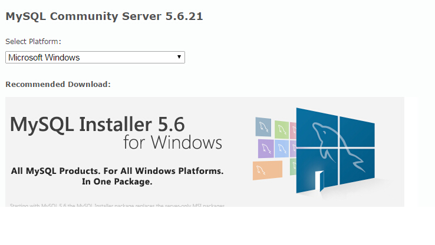
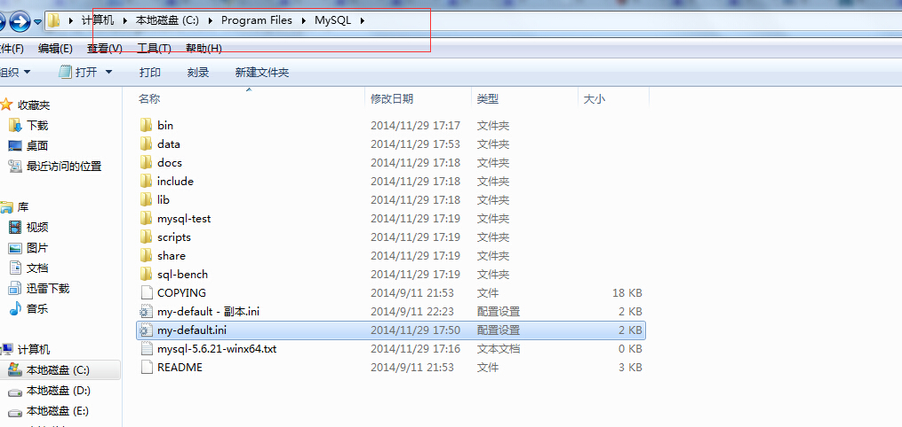
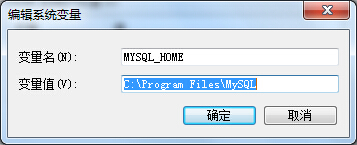
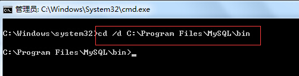
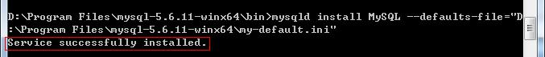
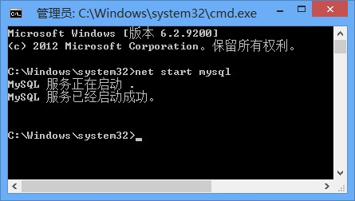
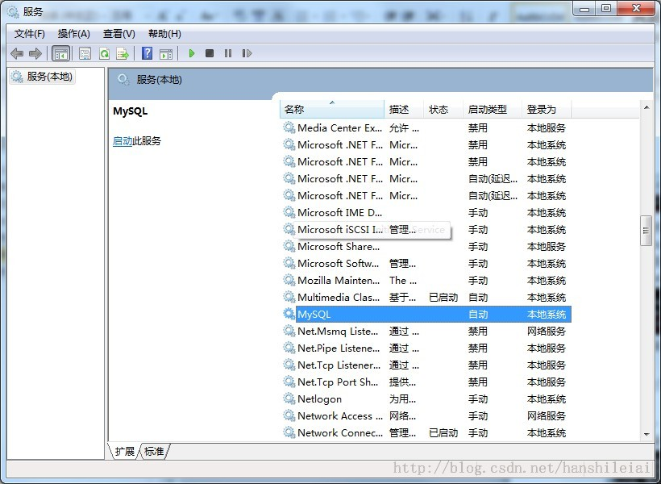

#MySQL5.6.11安装步骤（Windows7 64位）

## 下载MySQL Community Server 5.6.21，注意选择系统类型（32位/64位）
 
## 解压MySQL压缩包
将以下载的MySQL压缩包解压到自定义目录下。

## 添加环境变量
变量名：MYSQL_HOME
变量值：C:\Program Files\mysql
即为mysql的自定义解压目录。

再在Path中添加  %MYSQL_HOME%\bin

##注册windows系统服务
将mysql注册为windows系统服务
操作如下：
* 从控制台进入到MySQL解压目录下的 bin 目录下（注意 cmd最好以管理员身份运行）：
   
* 输入服务安装命令：
  mysqld install MySQL --defaults-file="C:\Program Files\mysql\my-default.ini"
  安装成功后会提示服务安装成功。
  注：my-default.ini文件在MySQL解压后的根目录下，如果没有，可从其他地方中获取。
  
  移除服务命令为：mysqld remove
##启动MySQL服务
* 方法一
  启动服务命令为：net start mysql
  
* 方法二
  打开管理工具 服务，找到MySQL服务。
   
  通过右键选择启动或者直接点击左边的启动来启动服务。
##修改 root 账号的密码
刚安装完成时root账号默认密码为空，此时可以将密码修改为指定的密码。如：123456
* 方法一
```
c:>mysql –uroot
mysql>show databases; 
mysql>use mysql;
mysql>UPDATE user SET password=PASSWORD("123456") WHERE user='root';
mysql>FLUSH PRIVILEGES;
mysql>QUIT
```
* 方法二
  利用第三方管理工具进行密码修改。如Navicat for MySQL