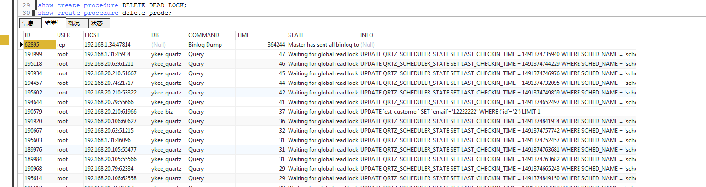

# MySQL使用mysqldump

[TOC]

利用[mysql](http://www.2cto.com/database/MySQL/)dump进行逻辑备份

 1）全逻辑备份： mysqldump -uxxx -p --flush-logs --delete-master-logs --all-databases > alldb.sql (每天晚上进行一次全备) 

2）增量备份： mysqladmin flush-logs (每小时刷一下，保存起来，进行了一次增量备份) 

3）缺点： 

1> --all-databases 包含了 mysql [数据库](http://www.2cto.com/database/)，其中包含了权限的数据，所以我们应该加上 --flush-privileges，在恢复时，权限才能生效； 注意 --all-databases 包括了my[sql数据库](http://www.2cto.com/database/)，但是不会包含 information_schema和performance_schema两个数据库。 

2> 因为 mysqldump 默认启用了 --lock-tables，所以会导致在备份期间对所有表持有读锁： lock table tb read local，所以所有的update，delete语句 会被阻塞。但是select语句和insert语句不会被阻塞。 

3> --delete-master-logs 备份之后，会执行 purge logs to 语句。删除了备份之后的master上的binary log. 一般而言，我们不建议随便删除binary log. 我们应该将它们保存起来，而不是直接删除。以防万一，要留条退路。 

4> 该备份方式，虽然在整个备份过程中持有了 lock table tb read local，但是还是可以执行 insert 语句的。所以得到的不是一致性的备份。虽然得到的不是 一致性的备份，但是因为flush log之后，所有的操作 也会记入新的binary log，所以如果使用了所有新的binary log来进行完全恢复的话，最后恢复的数据 也是一致性的。当然不一致性的备份无法用于搭建slave。 如果要得到一致性的备份的话，需要使用 --lock-all-tables 或者使用 --single-transaction 选项。前者使用了全局读锁，不允许任何修改操作。后者使用 了事务的特性来得到一致性备份。 所以我们应该对上面的备份方式进行改良。


使用mysqldump备份的最佳姿势 

1）优化锁 和 得到一致性备份： 我们可以使用结合使用 --single-transaction 、--master-data=2 、--flush-logs 来达到将锁定时间大大减少的目的。同时有得到了一致性的备份，而且该一致性备份和 flush 的日志也是一致的； 

2）去掉 --delete-master-logs 选项，改为在备份之后，将所有被刷新的 binary log 移到一个地方保存起来；

 3）因为使用了 --single-transaction 选项，针对的只能是 innodb 数据，但是mysql数据是Myisam引擎的，所以我们最好将mysql数据库的备份分开来， 另外专门针对 mysql 数据库进行一次操作。当然不分开来备份，可能也没有问题。 

4）还要加上 --routines 来备份存储过程和函数，触发器默认会备份。 优化之后，我们得到： 

mysqldump -uxxx -p --single-transaction --master-data=2 --routines --flush-logs --databases db1 db2 db3 > alldb.sql; mysqldump -uxxx -p --flush-privileges --databases mysql > mysql.sql; 

如果将mysql也一起备份的话：

 mysqldump -uxxx -p --single-transaction --master-data=2 --routines --flush-logs --flush-privileges --all-databases > alldb.sql;


使用mysqldump来搭建slave环境 搭建slave环境，一般有两种方法，对于规模不大的库，可以采用mysqldump来搭建；对于规模很大的库，最好采用xtrabackup来搭建，速度要快很多。 1）首先 分别在master和slave上设置不同的server_id=1/101，启用master上的log-bin=1，启用slave上的relog-log=relay-bin; 在master上设置： binlog_format=row；二进制日志的格式。maser上最好还设置sync_binlog=1 和 innodb_flush_log_at_trx_commit=1防止发生服务器崩溃时 导致复制破坏。在slave上最好还配置：read-only=1 和 skip-slave-start=1 前者可以防止没有super权限的用户在slave上进行写，后者防止在启动 slave数据库时，自动启动复制线程。以后需要手动start slave来启动复制线程。注意slave没有必要启用 log-bin=1，除非需要搭建二级slave。


```bash
在master上建立一个具有复制权限的用户：
 grant replication slave, replication client on *.* to repl@’192.168.%.%’ identified by ‘123456’;
3）备份master上的数据库，迁移到slave上：
```
```bash
[root@localhost ~]# mysqldump -uroot -p --routines --flush-logs --master-data=2 --databases db2 db1>/root/backup.sql
Enter password:
[root@localhost ~]# scp /root/backup.sql 192.168.137.9:/tmp/backup.sql
The authenticity of host '192.168.137.9 (192.168.137.9)' can't be established.
RSA key fingerprint is a4:cd:c0:13:d1:8c:c0:a5:e7:c4:43:b5:95:17:af:d3.
Are you sure you want to continue connecting (yes/no)? yes
Warning: Permanently added '192.168.137.9' (RSA) to the list of known hosts.
root@192.168.137.9's password:
backup.sql
```

因为slave的搭建需要一致性的备份，所以需要启用 --lock-all-tables(master-data=1/2会自动启用--lock-all-tables)或者--single-transaction；

另外还需要知道该一致性备份的数据，对应的master上的binary log的文件名，以及在该文件中的position，所以必须启用 master-data选项。

因为--master-data会启用--lock-all-tables 所以数据才是一致性的；但是导致了全局锁，不能进行任何修改操作；下面我们使用--single-transaction进行优化：

mysqldump -uroot -p --routines --flush-logs --single-transaction --master-data=2 --databases db1 db2 > /root/backup.sql; (--flush-logs非必须)

这样全局锁仅仅在备份的开始短暂的持有。不会再备份的整个过程中持有全局锁。


## 官方文档

```
https://dev.mysql.com/doc/refman/5.7/en/replication-solutions-backups-rawdata.html
```


## 常用命令

### 跨服务器导出导入数据

```bash
mysqldump --host=h1 -uroot -proot --databases db1 |mysql --host=h2 -uroot -proot db2
#将h1服务器中的db1数据库的所有数据导入到h2中的db2数据库中，db2的数据库必须存在否则会报错
mysqldump --host=192.168.80.137 -uroot -proot -C --databases test |mysql --host=192.168.80.133 -uroot -proot test 
#加上-C参数可以启用压缩传递。
```

### 备份全库(不包含 information_schema和performance_schema)

```bash
mysqldump --all-databases > test.sql

##注意 --all-databases 包括了mysql数据库，但是不会包含 information_schema和performance_schema两个数据库。
```

### 只备份指定库的表结构

```bash
mysqldump --no-data --databases mydatabase1 mydatabase2 mydatabase3 > test.sql
```

###  从备份文件恢复数据库

```bash
mysql [database name] < [backup file name]
```


## 重要参数解析(MySQL 5.6.14)

开启MySQL general_log,然后使用mysqldump操作,查看产生的日志.

```mysql
mysql> show variables like 'general_log%';
+------------------+----------------------------+
| Variable_name    | Value                      |
+------------------+----------------------------+
| general_log      | ON                         |
| general_log_file | /var/lib/mysql/mysql01.log |
+------------------+----------------------------+
2 rows in set
mysql> 
```


### --lock-tables(单数据库的单表上锁)

执行命令

```bash
mysqldump -uroot --lock-tables --databases db1 db2 > test.sql

mysqldump -uroot -p --lock-tables --databases ykee_bid ykee_biz >test/test.sql
```

它在导出db1的时候,会对db1所有的单个表上锁,导出结束之后释放锁.然后再同样导出db2.
**也就是说在db1导出的时候,db2的数据可能还在变化**


### --lock-all-tables(所有的数据库的所有表上锁)

mysqldump -uroot --lock-all-tables --databases db1 db2 > test.sql

```bash
mysqldump -uroot -p --lock-all-tables --databases db1 db2 > test.sql
mysqldump -uroot -p --lock-all-tables --databases ykee_bid ykee_biz >test/test.sql
```

它会在一开始就对所有的数据库的所有表上锁



**请注意它会使用FLUSH TABLES**


### --single-transaction

mysqldump -uroot --single-transaction --databases db1 db2 > test.sql
可以看到它设置整个导出的过程为一个事务.避免了锁


### --master-data

它对所有数据库的所有表上了锁,并且查询binlog的位置。**请注意它会使用FLUSH TABLES**


### --master-data + --single-transaction

mysqldump -uroot --master-data --single-transaction --databases db1 db2 > test.sql
这种组合,会先对所有数据库的所有表上锁,读取binlog的信息之后就立即释放锁,这个过程是十分短暂的。
然后整个导出过程都在一个事务里.
**请注意它会使用FLUSH TABLES**


### --dump-slave

```bash
A. =1和=2的区别很明显，只是自动执行和手工执行的区别
B. --master-data用于在master端dump数据，用于建立slave
--dump-slave用户在slave端dump数据，建立新的slave,至少是第2个slave,也就是已经有A-->B,现在从B上导出数据建立A-->C的复制
```


## MySQLDump在使用之前一定要想到的事情

如果mysqldump执行的过程中需要flush tables,而正在此时,有一个慢SQL正在运行,这时mysqldump会被阻塞（waiting for table flush）,
并且其他连接对这个表的所有操作（甚至查询）都被阻塞.系统Hung了.

这个问题在XtraBackup备份的时候同样存在.

如果是人工执行,一定要开启另外一个连接,监控 show processlist，查看是否阻塞.
如果是调度执行,拼人品了.

其实优化慢SQL才是正道.

## mysqldump全量备份+mysqlbinlog二进制日志增量备份和还原

从mysqldump备份文件恢复数据会丢失掉从备份点开始的更新数据，所以还需要结合mysqlbinlog二进制日志增量备份。确保my.ini或者my.cnf中包含下面的配置以启用二进制日志，或者mysqld ---log-bin：

```mysql
[mysqld]
log-bin=mysql-bin
```

  mysqldump命令必须带上--flush-logs选项以生成新的二进制日志文件：

```bash
mysqldump --single-transaction --flush-logs --master-data=2 > backup.sql
```

增量备份：

```bash
 mysqladmin flush-logs #每小时刷一下，保存起来，进行了一次增量备份
```

这样生成的增量二进制日志文件比如为mysql-bin.000003，那么恢复数据时如下：

```bash
shell> mysql -uroot -pPwd < backup_sunday_1_PM.sql
shell> mysqlbinlog mysql-bin.000003 | mysql -uroot -pPwd
```

  此外mysqlbinlog还可以指定--start-date、--stop-date、--start-position和--stop-position参数，用于精确恢复数据到某个时刻之前或者跳过中间某个出问题时间段恢复数据，直接摘录MySQL文档说明中相关内容如下：

* 指定恢复时间:

对于MySQL 4.1.4，可以在mysqlbinlog语句中通过--start-date和--stop-date选项指定DATETIME格式的起止时间。举例说明，假设在今天上午10:00(今天是2005年4月20日)，执行SQL语句来删除一个大表。要想恢复表和数据，你可以恢复前晚上的备份，并输入：

```bash
mysqlbinlog --stop-date="2005-04-20 9:59:59" /var/log/mysql/bin.123456 | mysql -u root -pmypwd
#该命令将恢复截止到在--stop-date选项中以DATETIME格式给出的日期和时间的所有数据。如果你没有检测到几个小时后输入的错误的SQL语句，可能你想要恢复后面发生的活动。根据这些，你可以用起使日期和时间再次运行mysqlbinlog：


mysqlbinlog --start-date="2005-04-20 10:01:00" /var/log/mysql/bin.123456 | mysql -u root -pmypwd \
#在该行中，从上午10:01登录的SQL语句将运行。组合执行前夜的转储文件和mysqlbinlog的两行可以将所有数据恢复到上午10:00前一秒钟。你应检查日志以确保时间确切。
```

* 指定恢复位置:

也可以不指定日期和时间，而使用mysqlbinlog的选项--start-position和--stop-position来指定日志位置。它们的作用与起止日选项相同，不同的是给出了从日志起的位置号。使用日志位置是更准确的恢复方法，特别是当由于破坏性SQL语句同时发生许多事务的时候。要想确定位置号，可以运行mysqlbinlog寻找执行了不期望的事务的时间范围，但应将结果重新指向文本文件以便进行检查。操作方法为：

```bash
mysqlbinlog --start-date="2005-04-20 9:55:00" --stop-date="2005-04-20 10:05:00"  /var/log/mysql/bin.123456 > /tmp/mysql_restore.sql
#该命令将在/tmp目录创建小的文本文件，将显示执行了错误的SQL语句时的SQL语句。你可以用文本编辑器打开该文件，寻找你不要想重复的语句。如果二进制日志中的位置号用于停止和继续恢复操作，应进行注释。用log_pos加一个数字来标记位置。使用位置号恢复了以前的备份文件后，你应从命令行输入下面内容：
mysqlbinlog --stop-position="368312" /var/log/mysql/bin.123456  | mysql -u root -pmypwd 
 
 
 
mysqlbinlog --start-position="368315" /var/log/mysql/bin.123456  | mysql -u root -pmypwd 
#上面的第1行将恢复到停止位置为止的所有事务。下一行将恢复从给定的起始位置直到二进制日志结束的所有事务。因为mysqlbinlog的输出包括每个SQL语句记录之前的SET TIMESTAMP语句，恢复的数据和相关MySQL日志将反应事务执行的原时间。
```


## --

##--

##--

## 实践操作

### 远程

```bash
[root@mysql01 ~]#cat $HOME/.ssh/config
Host bakup
HostName **.com
PreferredAuthentications publickey
User root
IdentityFile /home/root/.ssh/id_rsa


[root@mysql01 ~]# mysqldump -uroot -p --single-transaction --master-data=2 --routines --flush-logs --flush-privileges --all-databases | ssh backup "cat -> alldb.sql";

[root@mysql01 ~]#ssh backup "ls -h alldb.sql";

##压缩后推给远程主机
[root@mysql01 ~]# mysqldump -uroot -p --single-transaction --master-data=2 --routines --flush-logs --flush-privileges --all-databases | gzip|ssh backup "cat -> alldb.sql.gz";
##推给远程主机后压缩
[root@mysql01 ~]# mysqldump -uroot -p --single-transaction --master-data=2 --routines --flush-logs --flush-privileges --all-databases |ssh backup "cat - |gzip > alldb.sql.gz";

#还可以使用pv命令来节制一个管道中的通过率
[root@mysql01 ~]# mysqldump -uroot -p --single-transaction --master-data=2 --routines --flush-logs --flush-privileges --all-databases ||pv -L5m -1|ssh backup "cat -> alldb.sql";
```


### 首先进行一个上只读锁

```bash
#super权限的用户也不能进行读写操作
mysql> flush tables with read lock;
mysql> SET GLOBAL read_only = ON;

##参看当前有哪些进程还在使用
mysql> SELECT * FROM information_schema.PROCESSLIST  WHERE COMMAND != "Sleep" order by TIME DESC;     

#备份完后解除只读锁
mysql> SET GLOBAL read_only = OFF;
mysql> UNLOCK TABLES;
```

### 进行全备

使用了 --single-transaction 选项，针对的只能是 innodb 数据，但是mysql数据是Myisam引擎的，所以我们最好将mysql数据库的备份分开来， 另外专门针对 mysql 数据库进行一次操作。当然不分开来备份，可能也没有问题。 

**还要加上 --routines 来备份存储过程和函数，触发器默认会备份**

```bash
##备份业务库
[root@localhost ~]#mysqldump -uroot -p --single-transaction --master-data=2 --routines --flush-logs --databases db1 db2 db3 > alldb.sql;
##单独备份mysql库
[root@localhost ~]#mysqldump -uroot -p --flush-privileges --databases mysql > mysql.sql;


###排除Database|information_schema|mysql|test|performance_schema这几个库,批量备份

[root@localhost ~]# mysql -e "show databases;" -uroot -p| grep -Ev "Database|information_schema|mysql|test|performance_schema" | xargs mysqldump -uroot -p  --routines --flush-logs --master-data=2 --databases > mysql_dump.sql


#--------------------------------------------------------------------------------
 
#如果将mysql也一起备份的话：
[root@localhost ~]#mysqldump -uroot -p --single-transaction --master-data=2 --routines --flush-logs --flush-privileges --all-databases > alldb.sql;


##有时，还需要加入：--default-character-set=utf8/utf8mb4 ，该选项一般也可以配置在/etc/my.cnf中。
```
### 迁移生成的binary log,刷新mysql-bin.index (非必需)

将 备份时刷新之后的 binary log 利用 mv 命令移动到安全的位置，也就是--master-data=2输出的日志文件，它之前的日志文件都存储到安全的位置：

```bash
[root@localhost ~]# head -n 50 gs_ngx_lua_backup.sql
-- MySQL dump 10.13  Distrib 5.6.26, for linux-glibc2.5 (i686)
--
-- Host: localhost    Database: gs
... ...--
-- Position to start replication or point-in-time recovery from
--
-- CHANGE MASTER TO MASTER_LOG_FILE='mysql-bin.000027', MASTER_LOG_POS=120;
```

也就是将 MASTER_LOG_FILE='mysql-bin.000027' 之前的日志都存储到其它位置。

然后执行：purge binary logs to 'mysql-bin.000027' 更新了 mysql-bin.index 中的索引信息，这里并没有删除binary log，因为它们已经被mv走了。

```bash
[root@mysql01 home]# more  /var/lib/mysql/mysql-bin.index 
./mysql-bin.000001
./mysql-bin.000002
./mysql-bin.000003
./mysql-bin.000004
./mysql-bin.000005
./mysql-bin.000006

```

### 增量备份

```mysql
mysql> delete from user where id=5;
Query OK, 1 row affected (0.02 sec)
 
mysql> select * from user;
+----+----------+------+-------------+----------+
| id | name| sex  | phone  | addr|
+----+----------+------+-------------+----------+
|  1 | yuanfang |    1 | 14465463786 | hangzhou |
|  2 | Andy|    0 | 14465463786 | beijing  |
|  3 | peter    |    0 | 14465463786 | Hongkong |
|  4 | lexin    |    1 | 36565634    | shenzhen |
+----+----------+------+-------------+----------+
4 rows in set (0.00 sec)
 
mysql> flush logs;
Query OK, 0 rows affected (0.11 sec)
 
mysql> show binary logs;
+------------------+-----------+
| Log_name    | File_size |
+------------------+-----------+
| mysql-bin.000027 |  370 |
| mysql-bin.000028 |  120 |
+------------------+-----------+
2 rows in set (0.00 sec)
```

这里 flush logs 进行增量备份，然后将增量备份的 bianry log 文件 mysql-bin.000027 也存储起来。

然后在进行一条 delete 语句：

```bash
mysql> select * from user;
+----+----------+------+-------------+----------+
| id | name| sex  | phone  | addr|
+----+----------+------+-------------+----------+
|  1 | yuanfang |    1 | 14465463786 | hangzhou |
|  2 | Andy|    0 | 14465463786 | beijing  |
|  3 | peter    |    0 | 14465463786 | Hongkong |
+----+----------+------+-------------+----------+
3 rows in set (0.00 sec)
```

到这里数据库的最新状态是：user 表只有3条记录。然后我们同样将 mysql-bin.000028 也存储起来。

### 还原备份

#### 关闭Slave mysql服务

```bash
[root@localhost mysql]# pwd
/var/lib/mysql
[root@localhost mysql]# mv ./* /backup/before_delete/
#此时 data-dir 目录是空的。然后我们试图使用 mysqladmin -uroot -p shutdown 来关闭mysqld，发现早不到 mysql.sock 无法关闭，我们只好使用
killall mysqld
来关闭。


```

#### 重新初始化数据库

```bash
#进入到 /usr/local/mysql/script 目录，然后执行初始化：
./mysql_install_db  --user=mysql --datadir=/var/lib/mysql --basedir=/usr/local/mysql
 ./mysql_install_db


#初始化成功之后，执行：
/usr/local/mysql/bin/mysql_secure_installation 
#来进行密码设置。这一步可能会报错：找不到 /tmp/mysql.sock 文，解决方法，在/etc/my.cnf 中的[client], [mysql], [mysqld] 都进行下面的设置：
#--------------------
socket=/tmp/mysql.sock
#--------------------
#然后重新执行：/usr/local/mysql/bin/mysql_secure_installation 就行了。
```

#### 初始化完成之后，我们使用全量备份的sql脚本来进行恢复： 

```bash
[root@localhost ~]# mysql -uroot -p < gs_ngx_lua_backup.sql
#执行完成之后，发现 gs 和 ngx_lua 数据库都还原出来了，但是他们的数据不是最新的数据：

mysql> use gs;
Reading table information for completion of table and column names
You can turn off this feature to get a quicker startup with -A

Database changed
mysql> select * from user;
+----+----------+------+----------------+----------+
| id | name| sex  | phone| addr|
+----+----------+------+----------------+----------+
|  1 | yuanfang |    1 | 14465463786    | hangzhou |
|  2 | Andy|    0 | 14465463786    | beijing  |
|  3 | peter    |    0 | 14465463786    | Hongkong |
|  4 | lexin    |    1 | 36565634  | shenzhen |
|  5 | lexin2   |    1 | 43563436565634 | aomao    |
+----+----------+------+----------------+----------+
5 rows in set (0.01 sec)
```

这是因为，我们还没有使用 mysql-bin.000027 和 mysql-bin.000028 两个binary log。mysql-bin.000027 是我们前面模拟的增量备份，而mysql-bin.000028 是 删除data-dir目录时，最新的binary log。依次应用了这两个binary log之后，数据库才能恢复到最新的状态。

#### 应用 binary log:

```bash
[root@localhost backup]# pwd
/backup
##将binlog 转为可执行sql
[root@localhost backup]# mysqlbinlog mysql-bin.000027 > 27.sql
[root@localhost backup]# mysqlbinlog mysql-bin.000028 > 28.sql

##mysqlbinlog mysql-bin.000027 > 27.sql 得到了 27.sql 和 28.sql 之后，使用 mysql 来执行：
 
mysql -uroot -p < 27.sql; 
##应用了增量备份的binary log.然后查看数据：
mysql> select * from user;
+----+----------+------+-------------+----------+
| id | name| sex  | phone  | addr|
+----+----------+------+-------------+----------+
|  1 | yuanfang |    1 | 14465463786 | hangzhou |
|  2 | Andy|    0 | 14465463786 | beijing  |
|  3 | peter    |    0 | 14465463786 | Hongkong |
|  4 | lexin    |    1 | 36565634    | shenzhen |
+----+----------+------+-------------+----------+
4 rows in set (0.00 sec)
 
#然应用 28.sql ：
mysql -uroot -p < 28.sql;
#得到最新的状态：
mysql> select * from user;
+----+----------+------+-------------+----------+
| id | name| sex  | phone  | addr|
+----+----------+------+-------------+----------+
|  1 | yuanfang |    1 | 14465463786 | hangzhou |
|  2 | Andy|    0 | 14465463786 | beijing  |
|  3 | peter    |    0 | 14465463786 | Hongkong |
+----+----------+------+-------------+----------+
3 rows in set (0.00 sec)
```

可以看到，成功的还原到了删除 data-dir 目录之前的状态了。

### 根据binlog还原到具体某个时间点的数据

#### 查看binglog日志,找到需要恢复的时间点

```bash
mysqlbinlog -no--defaults /data/mysql/mysql-bin.000001
```


通过前面操作步骤我们知道，在删除数据之前，我们生成了 `mysql-bin.000002` 日志文件，所以我们只要恢复到这个时间点即可，上图中我已找到了这个时间。

```bash
mysqlbinlog –no-defaults –stop-datetime=’2017-04-11 09:48:48’/data/mysql/mysql-bin.000001 |mysql –uroot –p123456
```

