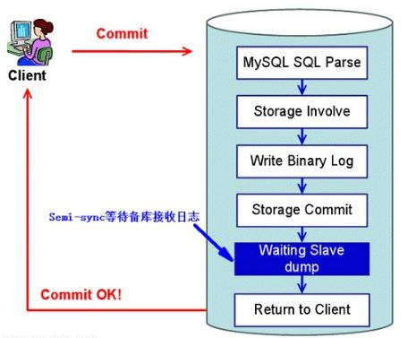

# MySQL半同步复制安装和配置

## MySQL复制同步类型

**异步复制（Asynchronous replication）**

MySQL默认的复制即是异步的，主库在执行完客户端提交的事务后会立即将结果返给给客户端，并不关心从库是否已经接收并处理，这样就会有一个问题，主如果crash掉了，此时主上已经提交的事务可能并没有传到从上，如果此时，强行将从提升为主，可能导致新主上的数据不完整。

**全同步复制（Fully synchronous replication）**

指当主库执行完一个事务，所有的从库都执行了该事务才返回给客户端。因为需要等待所有从库执行完该事务才能返回，所以全同步复制的性能必然会收到严重的影响。

**半同步复制（Semisynchronous replication）**

介于异步复制和全同步复制之间，主库在执行完客户端提交的事务后不是立刻返回给客户端，而是等待至少一个从库接收到并写到relay log中才返回给客户端。相对于异步复制，半同步复制提高了数据的安全性，同时它也造成了一定程度的延迟，这个延迟最少是一个TCP/IP往返的时间。所以，半同步复制最好在低延时的网络中使用。

## 半同步复制原理图

## 半同步复制的潜在问题

客户端事务在存储引擎层提交后，在得到从库确认的过程中，主库宕机了，此时，可能的情况有两种;

**事务还没发送到从库上**

此时，客户端会收到事务提交失败的信息，客户端会重新提交该事务到新的主上，当宕机的主库重新启动后，以从库的身份重新加入到该主从结构中，会发现，该事务在从库中被提交了两次，一次是之前作为主的时候，一次是被新主同步过来的。

**事务已经发送到从库上**

此时，从库已经收到并应用了该事务，但是客户端仍然会收到事务提交失败的信息，重新提交该事务到新的主上。

**无数据丢失的半同步复制**

针对上述潜在问题，MySQL 5.7引入了一种新的半同步方案：Loss-Less半同步复制。

针对上面这个图，“Waiting Slave dump”被调整到“Storage Commit”之前。

当然，之前的半同步方案同样支持，MySQL 5.7.2引入了一个新的参数进行控制-rpl_semi_sync_master_wait_point

rpl_semi_sync_master_wait_point有两种取值 

**AFTER_SYNC**

这个即新的半同步方案，Waiting Slave dump在Storage Commit之前。

**AFTER_COMMIT**

老的半同步方案，如图所示。

 

## 半同步复制的安装部署

