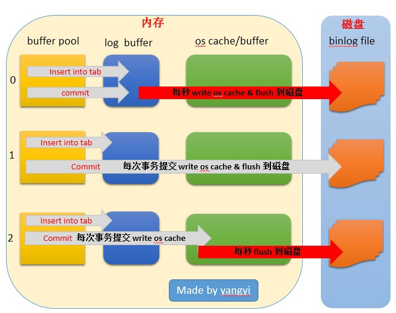
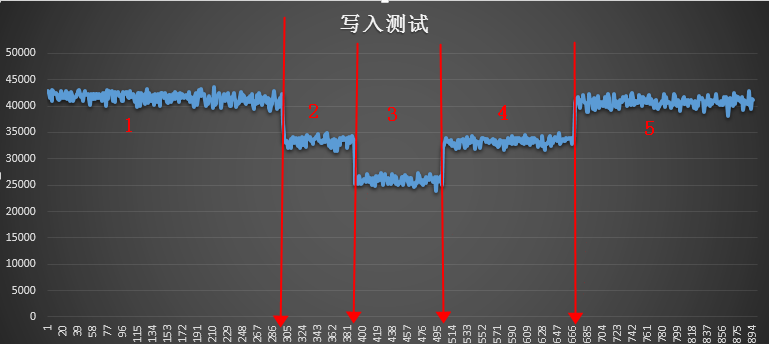

# MySQL配置文件my.cnf参数优化和中文详解

```bash
[client]
port = 3306
socket = /tmp/mysql.sock
[mysqld]
port = 3306
socket = /tmp/mysql.sock
basedir = /usr/local/mysql
datadir = /data/mysql
pid-file = /data/mysql/mysql.pid
user = mysql
bind-address = 0.0.0.0
server-id = 1 #表示是本机的序号为1,一般来讲就是master的意思
skip-name-resolve
# 禁止MySQL对外部连接进行DNS解析，使用这一选项可以消除MySQL进行DNS解析的时间。但需要注意，如果开启该选项，
# 则所有远程主机连接授权都要使用IP地址方式，否则MySQL将无法正常处理连接请求
#skip-networking
back_log = 600
# MySQL能有的连接数量。当主要MySQL线程在一个很短时间内得到非常多的连接请求，这就起作用，
# 然后主线程花些时间(尽管很短)检查连接并且启动一个新线程。back_log值指出在MySQL暂时停止回答新请求之前的短时间内多少个请求可以被存在堆栈中。
# 如果期望在一个短时间内有很多连接，你需要增加它。也就是说，如果MySQL的连接数据达到max_connections时，新来的请求将会被存在堆栈中，
# 以等待某一连接释放资源，该堆栈的数量即back_log，如果等待连接的数量超过back_log，将不被授予连接资源。
# 另外，这值（back_log）限于您的操作系统对到来的TCP/IP连接的侦听队列的大小。
# 你的操作系统在这个队列大小上有它自己的限制（可以检查你的OS文档找出这个变量的最大值），试图设定back_log高于你的操作系统的限制将是无效的。
max_connections = 1000
# MySQL的最大连接数，如果服务器的并发连接请求量比较大，建议调高此值，以增加并行连接数量，当然这建立在机器能支撑的情况下，因为如果连接数越多，介于MySQL会为每个连接提供连接缓冲区，就会开销越多的内存，所以要适当调整该值，不能盲目提高设值。可以过'conn%'通配符查看当前状态的连接数量，以定夺该值的大小。
max_connect_errors = 6000
# 对于同一主机，如果有超出该参数值个数的中断错误连接，则该主机将被禁止连接。如需对该主机进行解禁，执行：FLUSH HOST。
open_files_limit = 65535
# MySQL打开的文件描述符限制，默认最小1024;当open_files_limit没有被配置的时候，比较max_connections*5和ulimit -n的值，哪个大用哪个，
# 当open_file_limit被配置的时候，比较open_files_limit和max_connections*5的值，哪个大用哪个。
table_open_cache = 128
# MySQL每打开一个表，都会读入一些数据到table_open_cache缓存中，当MySQL在这个缓存中找不到相应信息时，才会去磁盘上读取。默认值64
# 假定系统有200个并发连接，则需将此参数设置为200*N(N为每个连接所需的文件描述符数目)；
# 当把table_open_cache设置为很大时，如果系统处理不了那么多文件描述符，那么就会出现客户端失效，连接不上
max_allowed_packet = 4M
# 接受的数据包大小；增加该变量的值十分安全，这是因为仅当需要时才会分配额外内存。例如，仅当你发出长查询或MySQLd必须返回大的结果行时MySQLd才会分配更多内存。
# 该变量之所以取较小默认值是一种预防措施，以捕获客户端和服务器之间的错误信息包，并确保不会因偶然使用大的信息包而导致内存溢出。
binlog_cache_size = 1M
# 一个事务，在没有提交的时候，产生的日志，记录到Cache中；等到事务提交需要提交的时候，则把日志持久化到磁盘。默认binlog_cache_size大小32K
max_heap_table_size = 8M
# 定义了用户可以创建的内存表(memory table)的大小。这个值用来计算内存表的最大行数值。这个变量支持动态改变
tmp_table_size = 16M
# MySQL的heap（堆积）表缓冲大小。所有联合在一个DML指令内完成，并且大多数联合甚至可以不用临时表即可以完成。
# 大多数临时表是基于内存的(HEAP)表。具有大的记录长度的临时表 (所有列的长度的和)或包含BLOB列的表存储在硬盘上。
# 如果某个内部heap（堆积）表大小超过tmp_table_size，MySQL可以根据需要自动将内存中的heap表改为基于硬盘的MyISAM表。还可以通过设置tmp_table_size选项来增加临时表的大小。也就是说，如果调高该值，MySQL同时将增加heap表的大小，可达到提高联接查询速度的效果
read_buffer_size = 2M
# MySQL读入缓冲区大小。对表进行顺序扫描的请求将分配一个读入缓冲区，MySQL会为它分配一段内存缓冲区。read_buffer_size变量控制这一缓冲区的大小。
# 如果对表的顺序扫描请求非常频繁，并且你认为频繁扫描进行得太慢，可以通过增加该变量值以及内存缓冲区大小提高其性能
read_rnd_buffer_size = 8M
# MySQL的随机读缓冲区大小。当按任意顺序读取行时(例如，按照排序顺序)，将分配一个随机读缓存区。进行排序查询时，
# MySQL会首先扫描一遍该缓冲，以避免磁盘搜索，提高查询速度，如果需要排序大量数据，可适当调高该值。但MySQL会为每个客户连接发放该缓冲空间，所以应尽量适当设置该值，以避免内存开销过大
sort_buffer_size = 8M
# MySQL执行排序使用的缓冲大小。如果想要增加ORDER BY的速度，首先看是否可以让MySQL使用索引而不是额外的排序阶段。
# 如果不能，可以尝试增加sort_buffer_size变量的大小
join_buffer_size = 8M
# 联合查询操作所能使用的缓冲区大小，和sort_buffer_size一样，该参数对应的分配内存也是每连接独享
thread_cache_size = 8
# 这个值（默认8）表示可以重新利用保存在缓存中线程的数量，当断开连接时如果缓存中还有空间，那么客户端的线程将被放到缓存中，
# 如果线程重新被请求，那么请求将从缓存中读取,如果缓存中是空的或者是新的请求，那么这个线程将被重新创建,如果有很多新的线程，
# 增加这个值可以改善系统性能.通过比较Connections和Threads_created状态的变量，可以看到这个变量的作用。(–>表示要调整的值)
# 根据物理内存设置规则如下：
# 1G  —> 8
# 2G  —> 16
# 3G  —> 32
# 大于3G  —> 64
query_cache_size = 8M
#MySQL的查询缓冲大小（从4.0.1开始，MySQL提供了查询缓冲机制）使用查询缓冲，MySQL将SELECT语句和查询结果存放在缓冲区中，
# 今后对于同样的SELECT语句（区分大小写），将直接从缓冲区中读取结果。根据MySQL用户手册，使用查询缓冲最多可以达到238%的效率。
# 通过检查状态值'Qcache_%'，可以知道query_cache_size设置是否合理：如果Qcache_lowmem_prunes的值非常大，则表明经常出现缓冲不够的情况，
# 如果Qcache_hits的值也非常大，则表明查询缓冲使用非常频繁，此时需要增加缓冲大小；如果Qcache_hits的值不大，则表明你的查询重复率很低，
# 这种情况下使用查询缓冲反而会影响效率，那么可以考虑不用查询缓冲。此外，在SELECT语句中加入SQL_NO_CACHE可以明确表示不使用查询缓冲
query_cache_limit = 2M
#指定单个查询能够使用的缓冲区大小，默认1M
key_buffer_size = 4M
#指定用于索引的缓冲区大小，增加它可得到更好处理的索引(对所有读和多重写)，到你能负担得起那样多。如果你使它太大，
# 系统将开始换页并且真的变慢了。对于内存在4GB左右的服务器该参数可设置为384M或512M。通过检查状态值Key_read_requests和Key_reads，
# 可以知道key_buffer_size设置是否合理。比例key_reads/key_read_requests应该尽可能的低，
# 至少是1:100，1:1000更好(上述状态值可以使用SHOW STATUS LIKE 'key_read%'获得)。注意：该参数值设置的过大反而会是服务器整体效率降低
ft_min_word_len = 4
# 分词词汇最小长度，默认4
transaction_isolation = REPEATABLE-READ
# MySQL支持4种事务隔离级别，他们分别是：
# READ-UNCOMMITTED, READ-COMMITTED, REPEATABLE-READ, SERIALIZABLE.
# 如没有指定，MySQL默认采用的是REPEATABLE-READ，ORACLE默认的是READ-COMMITTED
log_bin = mysql-bin
binlog_format = mixed
expire_logs_days = 30 #超过30天的binlog删除
log_error = /data/mysql/mysql-error.log #错误日志路径
slow_query_log = 1
long_query_time = 1 #慢查询时间 超过1秒则为慢查询
slow_query_log_file = /data/mysql/mysql-slow.log
performance_schema = 0
explicit_defaults_for_timestamp
#lower_case_table_names = 1 #不区分大小写
skip-external-locking #MySQL选项以避免外部锁定。该选项默认开启
default-storage-engine = InnoDB #默认存储引擎
innodb_file_per_table = 1
# InnoDB为独立表空间模式，每个数据库的每个表都会生成一个数据空间
# 独立表空间优点：
# 1．每个表都有自已独立的表空间。
# 2．每个表的数据和索引都会存在自已的表空间中。
# 3．可以实现单表在不同的数据库中移动。
# 4．空间可以回收（除drop table操作处，表空不能自已回收）
# 缺点：
# 单表增加过大，如超过100G
# 结论：
# 共享表空间在Insert操作上少有优势。其它都没独立表空间表现好。当启用独立表空间时，请合理调整：innodb_open_files
innodb_open_files = 500
# 限制Innodb能打开的表的数据，如果库里的表特别多的情况，请增加这个。这个值默认是300
innodb_buffer_pool_size = 64M
# InnoDB使用一个缓冲池来保存索引和原始数据, 不像MyISAM.
# 这里你设置越大,你在存取表里面数据时所需要的磁盘I/O越少.
# 在一个独立使用的数据库服务器上,你可以设置这个变量到服务器物理内存大小的80%
# 不要设置过大,否则,由于物理内存的竞争可能导致操作系统的换页颠簸.
# 注意在32位系统上你每个进程可能被限制在 2-3.5G 用户层面内存限制,
# 所以不要设置的太高.
innodb_write_io_threads = 4
innodb_read_io_threads = 4
# innodb使用后台线程处理数据页上的读写 I/O(输入输出)请求,根据你的 CPU 核数来更改,默认是4
# 注:这两个参数不支持动态改变,需要把该参数加入到my.cnf里，修改完后重启MySQL服务,允许值的范围从 1-64
innodb_thread_concurrency = 0
# 默认设置为 0,表示不限制并发数，这里推荐设置为0，更好去发挥CPU多核处理能力，提高并发量
innodb_purge_threads = 1
# InnoDB中的清除操作是一类定期回收无用数据的操作。在之前的几个版本中，清除操作是主线程的一部分，这意味着运行时它可能会堵塞其它的数据库操作。
# 从MySQL5.5.X版本开始，该操作运行于独立的线程中,并支持更多的并发数。用户可通过设置innodb_purge_threads配置参数来选择清除操作是否使用单
# 独线程,默认情况下参数设置为0(不使用单独线程),设置为 1 时表示使用单独的清除线程。建议为1
innodb_flush_log_at_trx_commit = 2
# 0：如果innodb_flush_log_at_trx_commit的值为0,log buffer每秒就会被刷写日志文件到磁盘，提交事务的时候不做任何操作（执行是由mysql的master thread线程来执行的。
# 主线程中每秒会将重做日志缓冲写入磁盘的重做日志文件(REDO LOG)中。不论事务是否已经提交）默认的日志文件是ib_logfile0,ib_logfile1
# 1：当设为默认值1的时候，每次提交事务的时候，都会将log buffer刷写到日志。
# 2：如果设为2,每次提交事务都会写日志，但并不会执行刷的操作。每秒定时会刷到日志文件。要注意的是，并不能保证100%每秒一定都会刷到磁盘，这要取决于进程的调度。
# 每次事务提交的时候将数据写入事务日志，而这里的写入仅是调用了文件系统的写入操作，而文件系统是有 缓存的，所以这个写入并不能保证数据已经写入到物理磁盘
# 默认值1是为了保证完整的ACID。当然，你可以将这个配置项设为1以外的值来换取更高的性能，但是在系统崩溃的时候，你将会丢失1秒的数据。
# 设为0的话，mysqld进程崩溃的时候，就会丢失最后1秒的事务。设为2,只有在操作系统崩溃或者断电的时候才会丢失最后1秒的数据。InnoDB在做恢复的时候会忽略这个值。
# 总结
# 设为1当然是最安全的，但性能页是最差的（相对其他两个参数而言，但不是不能接受）。如果对数据一致性和完整性要求不高，完全可以设为2，如果只最求性能，例如高并发写的日志服务器，设为0来获得更高性能
innodb_log_buffer_size = 2M
# 此参数确定些日志文件所用的内存大小，以M为单位。缓冲区更大能提高性能，但意外的故障将会丢失数据。MySQL开发人员建议设置为1－8M之间
innodb_log_file_size = 32M
# 此参数确定数据日志文件的大小，更大的设置可以提高性能，但也会增加恢复故障数据库所需的时间
innodb_log_files_in_group = 3
# 为提高性能，MySQL可以以循环方式将日志文件写到多个文件。推荐设置为3
innodb_max_dirty_pages_pct = 90
# innodb主线程刷新缓存池中的数据，使脏数据比例小于90%
innodb_lock_wait_timeout = 120 
# InnoDB事务在被回滚之前可以等待一个锁定的超时秒数。InnoDB在它自己的锁定表中自动检测事务死锁并且回滚事务。InnoDB用LOCK TABLES语句注意到锁定设置。默认值是50秒
bulk_insert_buffer_size = 8M
# 批量插入缓存大小， 这个参数是针对MyISAM存储引擎来说的。适用于在一次性插入100-1000+条记录时， 提高效率。默认值是8M。可以针对数据量的大小，翻倍增加。
myisam_sort_buffer_size = 8M
# MyISAM设置恢复表之时使用的缓冲区的尺寸，当在REPAIR TABLE或用CREATE INDEX创建索引或ALTER TABLE过程中排序 MyISAM索引分配的缓冲区
myisam_max_sort_file_size = 10G
# 如果临时文件会变得超过索引，不要使用快速排序索引方法来创建一个索引。注释：这个参数以字节的形式给出
myisam_repair_threads = 1
# 如果该值大于1，在Repair by sorting过程中并行创建MyISAM表索引(每个索引在自己的线程内) 
interactive_timeout = 28800
# 服务器关闭交互式连接前等待活动的秒数。交互式客户端定义为在mysql_real_connect()中使用CLIENT_INTERACTIVE选项的客户端。默认值：28800秒（8小时）
wait_timeout = 28800
# 服务器关闭非交互连接之前等待活动的秒数。在线程启动时，根据全局wait_timeout值或全局interactive_timeout值初始化会话wait_timeout值，
# 取决于客户端类型(由mysql_real_connect()的连接选项CLIENT_INTERACTIVE定义)。参数默认值：28800秒（8小时）
# MySQL服务器所支持的最大连接数是有上限的，因为每个连接的建立都会消耗内存，因此我们希望客户端在连接到MySQL Server处理完相应的操作后，
# 应该断开连接并释放占用的内存。如果你的MySQL Server有大量的闲置连接，他们不仅会白白消耗内存，而且如果连接一直在累加而不断开，
# 最终肯定会达到MySQL Server的连接上限数，这会报'too many connections'的错误。对于wait_timeout的值设定，应该根据系统的运行情况来判断。
# 在系统运行一段时间后，可以通过show processlist命令查看当前系统的连接状态，如果发现有大量的sleep状态的连接进程，则说明该参数设置的过大，
# 可以进行适当的调整小些。要同时设置interactive_timeout和wait_timeout才会生效。
[mysqldump]
quick
max_allowed_packet = 16M #服务器发送和接受的最大包长度
[myisamchk]
key_buffer_size = 8M
sort_buffer_size = 8M
read_buffer = 4M
write_buffer = 4M
```


## table_open_cache(文件描述符有关)

table_open_cache指定表高速缓存的大小。每当MySQL访问一个表时，如果在表缓冲区中还有空间，该表就被打开并放入其中，这样可以更快地访问表内容。

**table_open_cache:表描述符缓存大小，可减少文件打开/关闭次数**

通过检查峰值时间的状态值Open_tables和Opened_tables，可以决定是否需要增加table_open_cache的值。

> 如果你发现open_tables等于table_open_cache，并且opened_tables在不断增长，那么你就需要增加table_open_cach的值了

(上述状态值可甀SHOW STATUS LIKE ‘Open%tables’获得)。

> 注意:
> 不能盲目地把table_open_cache设置成很大的值。如果设置得太高，可能会造成文件描述符不足，从而造成性能不稳定或者连接失败。

假定系统有200个并发连接，则需将此参数设置为200*N(N为每个连接所需的文件描述符数目)；
倘若cache已满且没有可清理的对象，则会临时调大该值，类似于oracle的pga设置；
可通过监控系统状态变量opened_tables查看此cache的繁忙程度，如果opened_tables不断飙升且系统不运行flush tables，则考虑加大table_open_cache值；
当无法为新连接分配足够的描述符时，会遭遇ERROR '...' not found (errno: 23)或者 Can't open file: ... (errno: 24)，此时可考虑减小table_open_cache或max_connections
也可以通过open_files_limit调大mysqld可打开的文件数目，但依旧受shell limit所限
```mysql
mysql> show status like 'open%tables';
+---------------+-------+
| Variable_name | Value |
+---------------+-------+
| Open_tables   | 1046  |
| Opened_tables | 0     |
+---------------+-------+
2 rows in set
#open_tables 为1046,故需要增大table_open_cache
mysql> show variables like '%table_open_cache%';
+----------------------------+-------+
| Variable_name              | Value |
+----------------------------+-------+
| table_open_cache           | 100   |
| table_open_cache_instances | 1     |
+----------------------------+-------+
2 rows in set
mysql> set global table_open_cache=10240;
mysql> show variables like '%table_open_cache%';
+----------------------------+-------+
| Variable_name              | Value |
+----------------------------+-------+
| table_open_cache           | 10240 |
| table_open_cache_instances | 1     |
+----------------------------+-------+
2 rows in set
mysql> 

```
## table_open_cache问题例子

```bash

版本为5.0.67，该系统有81个数据库且全为MyISAM和MyISAM merge表，在查询information_schema下的tables表时速度奇慢
mysql> SELECT COUNT(*) FROM tables;
+----------+
| COUNT(*) |
+----------+
|    23687 |
+----------+
1 row in set (4 min 37.46 sec
另外涉及连接tables和columns两表的sql经常遭遇 errcode：24，相关参数为open_files_limit=65535和table_cache=32768
调用flush tables with read lock关闭系统中所有打开的表，然后运行上述sql同时监控相应状态变量
admin@localhost (none)>SHOW STATUS LIKE 'open%';
+---------------+-------+
| Variable_name | Value |
+---------------+-------+
| Open_files    | 22696 |
| Open_streams  | 0     |
| Open_tables   | 8095  |
| Opened_tables | 0     |
+---------------+-------+
4 rows in set (0.00 sec)
再次运行该sql
admin@localhost (none)>SHOW STATUS LIKE 'open%';
+---------------+-------+
| Variable_name | Value |
+---------------+-------+
| Open_files    | 32848 |
| Open_streams  | 0     |
| Open_tables   | 12013 |
| Opened_tables | 0     |
+---------------+-------+
4 rows in set (0.00 sec
将table_open_cache降低为5000，相应sql性能反而得到提升；
原因是如果系统同时运行很多复杂sql，则table_open_cache很容易被占满，mysql采用线性算法O(n)找出最近最少使用的表将其清除，当打开的文件过多时这一操作会比较耗时；将来的版本会引入hash算法
 
```


## thread_cache_size和thread_stack

```mysql
mysql> show variables like 'thread%';
+--------------------+---------------------------+
| Variable_name      | Value                     |
+--------------------+---------------------------+
| thread_cache_size  | 20                        |
| thread_concurrency | 8                         |
| thread_handling    | one-thread-per-connection |
| thread_stack       | 524288                    |
+--------------------+---------------------------+
4 rows in set
mysql> show status like '%connections%';
+-----------------------------------+--------+
| Variable_name                     | Value  |
+-----------------------------------+--------+
| Connection_errors_max_connections | 0      |
| Connections                       | 104180 |
| Max_used_connections              | 1109   |
+-----------------------------------+--------+
3 rows in set
mysql> show status like '%thread%';
+------------------------------------------+-------+
| Variable_name                            | Value |
+------------------------------------------+-------+
| Delayed_insert_threads                   | 0     |
| Performance_schema_thread_classes_lost   | 0     |
| Performance_schema_thread_instances_lost | 0     |
| Slow_launch_threads                      | 0     |
| Threads_cached                           | 12    |
| Threads_connected                        | 838   |
| Threads_created                          | 4183  |
| Threads_running                          | 23    |
+------------------------------------------+-------+
8 rows in set
```

```bash
通过以上3个命令,可以看到服务器的:
thread_cache池中最多可以存放20[thread_cache_size]个连接线程
为每个客户端球使用一个线程.为每个连接的线程分配(524288/1024k)[thread_stack]的内存空间.
服务器总共有104180[Connections]次连接,最大并发连接数为1109[Max_used_connections ],
当前在thread_cache池中的连接数为12[Threads_cached]个,连接数为838[Threads_connected ]个,处于活跃状态的有23[ Threads_running ]个,共创建 了4183[Threads_created]次连接.
显然这里以短连接为主.可以算出thread_cache命中率;
>公式为:
>Thread_Cache_Hit=(Connections-Thread_created)/Connections*100%

当前服务器的Thread_cache命中率约为95.6%这个结果我还是比较满意的.但是可以看出 thread_cache_size有点多余改成16或8更合理一些.
```

> 注意:
>
> thread_concurrency 在GNU/Linux系统上没有用的。它只在Solaris < 9 的系统中有用。。。而且从mysql5.6.1开始，这个选项就被废了。

## query_cache_type

如果设置为0，那么可以说，你的缓存根本就没有用，相当于禁用了。但是这种情况下query_cache_size设置的大小系统是否要为其分配呢，这个问题有待于测试？

如果设置为1，将会缓存所有的结果，除非你的select语句使用SQL_NO_CACHE禁用了查询缓存。

如果设置为2，则只缓存在select语句中通过SQL_CACHE指定需要缓存的查询。

## query_cache(配合qcache)

主要用来缓存 MySQL 中的 ResultSet，也就是一条SQL语句执行的结果集，所以仅仅只能针对select语句。
当我们打开了 Query Cache 功能，MySQL在接受到一条select语句的请求后，如果该语句满足Query Cache的要求(未显式说明不允许使用Query Cache，或者已经显式申明需要使用Query Cache)，MySQL 会直接根据预先设定好的HASH算法将接受到的select语句以字符串方式进行hash，然后到Query Cache 中直接查找是否已经缓存。也就是说，如果已经在缓存中，该select请求就会直接将数据返回，从而省略了后面所有的步骤(如 SQL语句的解析，优化器优化以及向存储引擎请求数据等)，极大的提高性能。

​    当然，**Query Cache 也有一个致命的缺陷，那就是当某个表的数据有任何任何变化，都会导致所有引用了该表的select语句在Query Cache 中的缓存数据失效。**所以，当我们的数据变化非常频繁的情况下，使用Query Cache 可能会得不偿失。

​    Query Cache的使用需要多个参数配合，其中最为关键的是 query_cache_size 和 query_cache_type ，前者设置用于缓存 ResultSet 的内存大小，后者设置在何场景下使用 Query Cache。在以往的经验来看，如果不是用来缓存基本不变的数据的MySQL数据库，query_cache_size 一般 256MB 是一个比较合适的大小。当然，这可以通过计算Query Cache的命中率(Qcache_hits/(Qcache_hits+Qcache_inserts)*100))来进行调整。query_cache_type可以设置为0(OFF)，1(ON)或者2(DEMOND)，分别表示完全不使用query cache，除显式要求不使用query cache(使用sql_no_cache)之外的所有的select都使用query cache，只有显示要求才使用query cache(使用sql_cache)。

```mysql

mysql> show variables  like '%query_cache%';
+------------------------------+------------+
| Variable_name                | Value      |
+------------------------------+------------+
| have_query_cache             | YES        |
| query_cache_limit            | 104857600  | 100M
| query_cache_min_res_unit     | 512        |
| query_cache_size             | 4294967296 | 4G
| query_cache_type             | ON         |
| query_cache_wlock_invalidate | OFF        |
+------------------------------+------------+
6 rows in set
#-------------------------------------------
#have_query_cache 表示是否支持query cache;
#query_cache_limit 表示query cache存放的单条query最大结果集，默认值为1M，结果集大小超过该值的query不会被cache;
#query_cache_min_res_unit 表示query cache 每个结果集存放的最小内存大小，默认4k;
##query_cache_size 表示系统中用于query cache的内存大小;
#query_cache_type 系统是否打开了query cache功能;

#query_cache_wlock_invalidate 针对myisam存储引擎，设置当有write lock在某个table上面的时候，读请求是要等待write lock释放资源之后再查询还是允许直接从query cache中读取结果，默认是OFF，可以直接从query cache中取得结果
```

当查询进行的时候，Mysql把查询结果保存在qurey cache中，但如果要保存的结果比较大，超过query_cache_min_res_unit的值 ，这时候mysql将一边检索结果，一边进行保存结果，所以，有时候并不是把所有结果全部得到后再进行一次性保存，而是每次分配一块 query_cache_min_res_unit 大小的内存空间保存结果集，使用完后，接着再分配一个这样的块，如果还不不够，接着再分配一个块，依此类推，也就是说，有可能在一次查询中，mysql要 进行多次内存分配的操作。
2）内存碎片的产生。当一块分配的内存没有完全使用时，MySQL会把这块内存Trim掉，把没有使用的那部分归还以重 复利用。比如，第一次分配4KB,只用了3KB，剩1KB，第二次连续操作，分配4KB，用了2KB，剩2KB，这两次连续操作共剩下的 1KB+2KB=3KB，不足以做个一个内存单元分配， 这时候，内存碎片便产生了。
3）使用flush query cache，可以消除碎片

4）如果Qcache_free_blocks值过大，可能是query_cache_min_res_unit值过大，应该调小些
5）query_cache_min_res_unit的估计值：

>(query_cache_size - Qcache_free_memory) / Qcache_queries_in_cache

"query_cache_limit"和"query_cache_min_res_unit"，都需要根据业务做一些调整;
比如cache的结果集大都小于4k的话，可以适当的调整"query_cache_min_res_unit"的值，以避免造成内存的浪费,
如果结果集的大小又都大于1M时，就得调整"query_cache_limit"的值，避免因为结果集大小超过限制而不被mysql cache住。


## qcache(配合query_cache()

```mysql
#qcache
mysql>  SHOW STATUS LIKE 'qcache%';
+-------------------------+------------+
| Variable_name           | Value      |
+-------------------------+------------+
| Qcache_free_blocks      | 14079      |
| Qcache_free_memory      | 4067979760 | 3.788G
| Qcache_hits             | 2976969    |
| Qcache_inserts          | 2924537    |
| Qcache_lowmem_prunes    | 0          |
| Qcache_not_cached       | 2559966    |
| Qcache_queries_in_cache | 61081      |
| Qcache_total_blocks     | 137167     |
+-------------------------+------------+
8 rows in set
mysql> 
#Qcache_free_blocks 缓存中相邻内存块的个数。数目大说明可能有碎片。FLUSH QUERY CACHE 会对缓存中的碎片进行整理，从而得到一个空闲块。
#Qcache_free_memory 缓存中的空闲内存。
#Qcache_hits 每次查询在缓存中命中时就增大。

#Qcache_inserts 每次插入一个查询时就增大(未命中就插入)。命中次数除以插入次数就是不中比率；用 1 减去这个值就是命中率。在上面这个例子中，大约有 87% 的查询都在缓存中命中。

#Qcache_lowmem_prunes 缓存出现内存不足并且必须要进行清理以便为更多查询提供空间的次数(通俗的说: 多少条Query 因为内存不足而被清除出Query Cache)。这个数字最好长时间来看；如果这个数字在不断增长，就表示可能碎片非常严重，或者内存很少。(上面的 free_blocks 和 free_memory 可以告诉您属于哪种情况)通过"Qcache_lowmem_prunes"和"Qcache_free_memory"相互结合，能够更清楚的了解到我们系统中Query Cache 的内存大小是否真的足够，是否非常频繁的出现因为内存不足而有Query 被换出;

#Qcache_not_cached
不适合进行缓存的查询的数量，通常是由于这些查询不是 SELECT 语句。
#Qcache_queries_in_cache
当前缓存的查询（和响应）的数量。
#Qcache_total_blocks
缓存中块的数量。
```

Qcache_free_blocks    代表内存自由块的多少，反映了内存碎片的情况


```mysql
mysql> show global variables like "%open_files_limit%";
+------------------+-------+
| Variable_name    | Value |
+------------------+-------+
| open_files_limit | 10000 |
+------------------+-------+
1 row in set

mysql> 

mysql> show global status like 'bin%';
+----------------------------+-------+
| Variable_name              | Value |
+----------------------------+-------+
| Binlog_cache_disk_use      | 901   |
| Binlog_cache_use           | 70937 |
| Binlog_stmt_cache_disk_use | 0     |
| Binlog_stmt_cache_use      | 0     |
+----------------------------+-------+
4 rows in set

#Binlog_cache_disk_use表示因为我们binlog_cache_size设计的内存不足导致缓存二进制日志用到了临时文件的次数
#Binlog_cache_use  表示 用binlog_cache_size缓存的次数
#当对应的Binlog_cache_disk_use 值比较大的时候 我们可以考虑适当的调高 binlog_cache_size 对应的值
```


## tmp_table_size&&max_heap_table_size

内存速度是相当快的，因此我们希望所有的排序操作都在内存中进行，我们可以通过调整查询让结果集更小以实现内存排序，或将变量设置得更大。

tmp_table_size
max_heap_table_size

```mysql
mysql> show global status like 'created_tmp%';
+-------------------------+---------+
| Variable_name           | Value   |
+-------------------------+---------+
| Created_tmp_disk_tables | 6751    |
| Created_tmp_files       | 6607    |
| Created_tmp_tables      | 1682682 |
+-------------------------+---------+
3 rows in set

#tmp_table_size它规定了内部内存临时表的最大值，每个线程都要分配。（实际起限制作用的是tmp_table_size和max_heap_table_size的最小值。）如果内存临时表超出了限制，MySQL就会自动地把它转化为基于磁盘的MyISAM表，存储在指定的tmpdir目录下，默认在tmpdir

mysql> SHOW VARIABLES LIKE 'max_heap_table_size%';
+---------------------+-----------+
| Variable_name       | Value     |
+---------------------+-----------+
| max_heap_table_size | 268435456 |
+---------------------+-----------+
1 row in set

mysql> 
mysql>  show variables like "tmpdir";
+---------------+-------+
| Variable_name | Value |
+---------------+-------+
| tmpdir        | /tmp  |
+---------------+-------+
1 row in set

#Created_tmp_files表示MySQL服务创建的临时文件文件数
```

通过设置tmp_table_size选项来增加一张临时表的大小，例如做高级GROUP BY操作生成的临时表。如果调高该值，MySQL同时将增加heap表的大小，可达到提高联接查询速度的效果，建议尽量优化查询，要确保查询过程中生成的临时表在内存中，避免临时表过大导致生成基于硬盘的MyISAM表。

无论何时在MySQL中创建临时表，它都会使用这两个变量的最小值作为临界值，除了在磁盘上构建临时表外，还会创建许多会话，这些会话会抢占有 限制的资源，因此最好是调整查询而不是将这些参数设置得更高，同时，需要注意的是有BLOB或TEXT字段类型的表将直接写入磁盘。

每次创建临时表，Created_tmp_tables增加，如果临时表大小超过tmp_table_size，则是在磁盘上创建临时表，Created_tmp_disk_tables也增加,Created_tmp_files表示MySQL服务创建的临时文件文件数，比较理想的配置是：

Created_tmp_disk_tables / Created_tmp_tables * 100% <= 25%比如上面的服务器Created_tmp_disk_tables / Created_tmp_tables * 100% ＝1.20%，应该相当好了

默认为16M，可调到64-256最佳，线程独占，太大可能内存不够I/O堵塞

如果动态页面要调大点，100M以上，如果网站大部分都是静态内容，一般64M足够。

**优化查询语句的时候，要避免使用临时表，如果实在避免不了的话，要保证这些临时表是存在内存中的。如果需要的话并且你有很多group by语句，并且你有很多内存，增大tmp_table_size(和max_heap_table_size)的值。这个变量不适用与用户创建的内存表(memory table).**

## sync_binlog

innodb_flush_log_at_trx_commit和sync_binlog 两个参数是控制MySQL 磁盘写入策略以及数据安全性的关键参


sync_binlog”：这个参数是对于MySQL系统来说是至关重要的，他不仅影响到Binlog对MySQL所带来的性能损耗，而且还影响到MySQL中数据的完整性。对于“sync_binlog”参数的各种设置的说明如下：

sync_binlog=0，当事务提交之后，MySQL不做fsync之类的磁盘同步指令刷新binlog_cache中的信息到磁盘，而让Filesystem自行决定什么时候来做同步，或者cache满了之后才同步到磁盘。

sync_binlog=n，当每进行n次事务提交之后，MySQL将进行一次fsync之类的磁盘同步指令来将binlog_cache中的数据强制写入磁盘。

在MySQL中系统默认的设置是sync_binlog=0，也就是不做任何强制性的磁盘刷新指令，这时候的性能是最好的，但是风险也是最大的。因为一旦系统Crash，在binlog_cache中的所有binlog信息都会被丢失。而当设置为“1”的时候，是最安全但是性能损耗最大的设置。因为当设置为1的时候，即使系统Crash，也最多丢失binlog_cache中未完成的一个事务，对实际数据没有任何实质性影响。

**从以往经验和相关测试来看，对于高并发事务的系统来说，“sync_binlog”设置为0和设置为1的系统写入性能差距可能高达5倍甚至更多。**

sync_binlog 的默认值是0，像操作系统刷其他文件的机制一样，MySQL不会同步到磁盘中去而是依赖操作系统来刷新binary log。

当sync_binlog =N (N>0) ，MySQL 在每写 N次 二进制日志binary log时，会使用fdatasync()函数将它的写二进制日志binary log同步到磁盘中去。

> 注:
>  如果启用了autocommit，那么每一个语句statement就会有一次写操作；否则每个事务对应一个写操作。

  

## innodb_flush_log_at_trx_commit 

 innodb_flush_log_at_trx_commit和sync_binlog 两个参数是控制MySQL 磁盘写入策略以及数据安全性的关键参

如果innodb_flush_log_at_trx_commit设置为0，log buffer将每秒一次地写入log file中，并且log file的flush(刷到磁盘)操作同时进行.该模式下，在事务提交的时候，不会主动触发写入磁盘的操作。

如果innodb_flush_log_at_trx_commit设置为1，每次事务提交时MySQL都会把log buffer的数据写入log file，并且flush(刷到磁盘)中去.

如果innodb_flush_log_at_trx_commit设置为2，每次事务提交时MySQL都会把log buffer的数据写入log file.但是flush(刷到磁盘)操作并不会同时进行。该模式下,MySQL会每秒执行一次 flush(刷到磁盘)操作。

>注意：
>
>  由于进程调度策略问题,这个“每秒执行一次 flush(刷到磁盘)操作”并不是保证100%的“每秒”。




## innodb_flush_log_at_trx_commit&&sync_binlog测试 



测试场景1 

  innodb_flush_log_at_trx_commit=2 

  sync_binlog=1000

 测试场景2 

  innodb_flush_log_at_trx_commit=1 

  sync_binlog=1000

 测试场景3 

  innodb_flush_log_at_trx_commit=1 

  sync_binlog=1

 测试场景4

  innodb_flush_log_at_trx_commit=1

  sync_binlog=1000

 测试场景5 

  innodb_flush_log_at_trx_commit=2 

  sync_binlog=1000 

 

| 场景   | TPS   |
| ---- | ----- |
| 场景1  | 41000 |
| 场景2  | 33000 |
| 场景3  | 26000 |
| 场景4  | 33000 |

**由此可见，当两个参数设置为双1的时候，写入性能****最差，sync_binlog=N (N>1 ) ****innodb_flush_log_at_trx_commit=2 时，(在当前模式下)MySQL的写操作才能达到最高性能。**

当innodb_flush_log_at_trx_commit和sync_binlog  都为 1 时是最安全的，在mysqld 服务崩溃或者服务器主机crash的情况下，binary log 只有可能丢失最多一个语句或者一个事务。但是鱼与熊掌不可兼得，双11 会导致频繁的io操作，因此该模式也是最慢的一种方式。

当innodb_flush_log_at_trx_commit设置为0，mysqld进程的崩溃会导致上一秒钟所有事务数据的丢失。
当innodb_flush_log_at_trx_commit设置为2，只有在操作系统崩溃或者系统掉电的情况下，上一秒钟所有事务数据才可能丢失。

**双1适合数据安全性要求非常高，而且磁盘IO写能力足够支持业务，比如订单,交易,充值,支付消费系统。双1模式下，当磁盘IO无法满足业务需求时 比如11.11 活动的压力。推荐的做法是 innodb_flush_log_at_trx_commit=2 ，sync_binlog=N (N为500 或1000) 且使用带蓄电池后备电源的缓存cache，防止系统断电异常。**

## skip-name-resolve

该选项表示禁用DNS解析，属于官方一个系统上的特殊设定不管，链接的的方式是经过hosts或是IP的模式，他都会对DNS做反查，由于反查解析过慢，就会无法应付过量的查询。

单机运行MySQL使用skip-networking关闭MySQL的TCP/IP连接方式

## skip-networking

开启该选项后就不能远程访问MySQL

## binlog-do-db

指定mysql的binlog日志记录哪个db

实验：
主库：
binlog-do-db=test
binlog-do-db=xiaobin

* 在binlog_format=STATEMENT时，在用use dbname的格式下，如果dbname没有在binlog-do-db里，DDL和DML语句都不会被记录在binlog里。即使指定具体的test.dd

  ```mysql
  root@[mysql]>show variables like '%binlog_format';
  +---------------+-----------+
  | Variable_name | Value     |
  +---------------+-----------+
  | binlog_format | STATEMENT |
  +---------------+-----------+
  1 row in set (0.00 sec)

  root@[mysql]>use mysql;
  Database changed

  root@[mysql]>create table test.dd (id int);
  Query OK, 0 rows affected (0.00 sec)

  root@[mysql]>select * from test.dd;
  Empty set (0.02 sec)
  ```


  从库：
  (testing)root@localhost [test]> use test;
  Database changed

  (testing)root@localhost [test]> show tables;
  Empty set (0.01 sec)

  ----------------------------------------------

  主库：
  root@[mysql]>use xiaobin;
  Reading table information for completion of table and column names
  You can turn off this feature to get a quicker startup with -A

  Database changed
  root@[xiaobin]>create table test.dd (id int);
  Query OK, 0 rows affected (0.02 sec)

  从库：
  (testing)root@localhost [test]> show tables;
  +----------------+
  | Tables_in_test |
  +----------------+
  | dd             |
  +----------------+
  1 row in set (0.00 sec)
  ```

  ​

* 在row模式下，在用use dbname的格式下，如果dbname没有在binlog-do-db里，DDL语句都不会被记录在binlog里。即使指定具体的test.dd；DML语句会记录。

  ```mysql
  主库：
  root@[(none)]>show variables like '%binlog_format';
  +---------------+-------+
  | Variable_name | Value |
  +---------------+-------+
  | binlog_format | ROW   |
  +---------------+-------+
  1 row in set (0.00 sec)

  root@[(none)]>use mysql
  Reading table information for completion of table and column names
  You can turn off this feature to get a quicker startup with -A

  Database changed
  root@[mysql]>create table test.dd (id int);
  Query OK, 0 rows affected (0.01 sec)

  从库：
  (testing)root@localhost [test]> show tables;
  Empty set (0.02 sec)
  ---------

  主库：
  root@[mysql]>insert into test.dd values(11);
  Query OK, 1 row affected (0.00 sec)

  root@[mysql]>commit;
  Query OK, 0 rows affected (0.01 sec)

  从库：
  (testing)root@localhost [test]> select * from dd;
  +------+
  | id   |
  +------+
  |   11 |
  +------+
  1 row in set (0.00 sec)
  ```

  ​

* 在mixed模式下，在用use dbname的格式下，如果dbname没有在binlog-do-db里，DDL、DML语句都不会被记录在binlog里。即使指定具体的test.dd；

  ```mysql
  主库：
  root@[(none)]>show variables like '%binlog_format';
  +---------------+-------+
  | Variable_name | Value |
  +---------------+-------+
  | binlog_format | MIXED |
  +---------------+-------+
  1 row in set (0.00 sec)

  root@[(none)]>use mysql
  Reading table information for completion of table and column names
  You can turn off this feature to get a quicker startup with -A

  Database changed
  root@[mysql]>create table test.dd (id int);
  Query OK, 0 rows affected (0.01 sec)

  从库：
  (testing)root@localhost [test]> show tables;
  Empty set (0.02 sec)
  ---------
  主库：
  root@[mysql]>insert into test.dd values(11);
  Query OK, 1 row affected (0.00 sec)

  root@[mysql]>commit;
  Query OK, 0 rows affected (0.01 sec)

  从库：
  (testing)root@localhost [test]> select * from dd;
  Empty set (0.01 sec)

  结论：在mixed模式下，在用use dbname的格式下，如果dbname没有在binlog-do-db里，DDL、DML语句都不会被记录在binlog里。即使指定具体的test.dd；
  ```

  >总结：
  >
  >在有几个数据库的情况下
  >binlog-do-db=db1
  >
  >use db1;
  >update db1.table1 set col1=10,db2.table2 set col2=10;
  >当使用statement模式时，两个修改都会被记录到binlog里；当使用row模式时，只有table1的修改会记录到binlog，table2不会记录。
  >
  >use db4;
  >update db1.table1 set col1=10,db2.table2 set col2=10;
  >当使用statement模式时，两个修改都不会被记录到binlog里；当使用row模式时，只有table1的修改会记录到binlog，table2不会记录。

  ​

## replicate-do-db=mydb    

## replicate-innore-db=test,mysql  

不进行复制的复制的database

## 连接超时wait_timeout

```mysql
show global variables like 'wait_timeout'
```

pool-size可以缓存索引和行数据，值越大，IO读写就越少，如果单纯的做数据库服务，该参数可以设置到电脑物理内存的80%，哇，这个参数简直太棒了。紧接着，我们经过大量的测试发现，在**innodb_buffer_pool_size=2G和innodb_buffer_pool_instances=1**


---------------------------

MySQL5.5 的可配置系统变量超过300个.这些变量中许多对MySQL处理数据库备份和崩溃恢复时如何操作有直接影响,理解什么系统变量确实改变及如何改变MySQL服务器的行为.本章将讨论以下内容:

- 数据管理系统变量
- 复制系统变量
- 恢复系统变量

### 数据管理

这里提供一个变量列表:从主服务器到从服务器,从分区到分区,这些变量必须相同:

#### 数据位置

- datadir 默认情况下,datadir是所有数据库,表,InnoDB数据,服务器日志和二进制日志文件在文件系统上的存储目录.datadir中的目录代表数据库.数据库中的表用文件代表,这些文件因存储引擎和服务器的配置而异.除非用其他变量指定,InnoDB的表空间和事务是指将存储在这里.服务器日志,如慢查询日志和错误日志以及二进制日志文件和中继日志文件都是如此.对于Linux系统,默认情况下,这个目录是:/var/lib/mysql

- basedir basedir是MySQL的安装目录在文件系统的位置.把这个目录放到PATH中以便访问MySQL服务器和客户端实用程序是一个好主意.已定记住,在Linux上basedir默认都是/usr,但可能一个公司与另一个公司都不同.这种情况下,应将$basedir/bin放到PATH中,这样访问MySQL服务器和客户端使用软件时就不必输入完整路径了.

- innodb_data_file_path这个变量确定单个InnoDB数据文件的位置以及它们的大小和行为.InnoDB数据文件的位置也被称为表空间.单个文件大小极限因操作系统而异,当默认情况下,文件总和至少要10MB.InnoDB文件也可被设置为autoextend的.这种情况下,随着这些InnoDB文件增长,一旦数据突破最初设定的大小,那么"自动扩展"就被激活了.请注意,这些文件目前是InnoDB发挥作用所需要的,并被视为系统表空间.这包括Innodb_file_per_table设置InnoDB何时运行

- innodb_data_home_dir 如果在innodb_data-file_path系统变量中没有用绝对路径确定共享的表空间,则可以用innodb_data_home_dir来指定所有普通的InnoDB数据文件在文件系统上的位置.与innodb_data_file_path一样,当innodb_file_per_table被激活时,这个变量并不影响逐文件表空间的位置.这个变量的默认值是MySQL的datadir.

- Innodb_file_per_table 当innodb-file_per_table被激活时,所有使用InnoDB存储引擎创建的表都将创建自己的表空间.所有创建的逐表空间在相应的数据库目录中庸tablename.idb来表示.ibd文件是数据和索引存储的地方.如果innodb-file_per_table被关掉,则默认情况下,所有数据和索引都保存到系统表空间中.从Barracuda开始,如果想使用较新的InnlDB文件格式,必须将Innodb_file_per_table激活.

  > 警告:
  >
  > 在创建任何数据库对象之前,应首先设置innpdb_file_per_table变量.不可能有混合模型.从一个系统表空间安全转移一个逐表表空间的唯一方法是:转存所有数据,停用所有对象,然后重建数据库对象并重新载入所有数据.

#### 数据一致性

这些配置选项影响MySQL如何将数据写到磁盘或从磁盘中清楚数据.MySQL能够为所有事务提供在写性能和持久性(即ACID的D)之间进行折中的选项.不同磁盘硬件配置的组合,诸如电池支持的写缓存(BBWC)RAID控制器,也能影响一致性.

- sync_binlog  当sync_binlog的值被设为1时候,如果自动提交激活的话,最安全的设置是每次替吉奥后将事件同步到二进制日志中,这样在mysqld崩溃事件中,最多只丢失一条语句.将sync_binlog的值设为大于默认值0的数,就会使MySQL以慢的多的速度进行事件同步(减轻磁盘的工作量).尽管将sync_binlog设为1是最缓慢的设置,但是可以用电池支持的写缓存来加速.
  如前所述,将sunc_binlog的值设为1是最缓慢但最安全的设置.因为InnoDB将在每次提交后都与日志文件同步,但其结果也增加了系统上的I/O量.目前SSD驱动器越来越便宜并在许多安装中也变得越来越流行.如果在系统上使用SSD,当sync_binlog的值设为1时,几乎感觉不到性能变化.

- innodb_flush_log_at_trx_commit 默认是1,意味着每次提交后都把日志缓存区的内容写到InnpDB日志文件中,并在该日志文件上执行清楚磁盘操作.把innodb_flush_log_at_trx_commit的值设为2,则意味着将以每秒一次的松散间隔将日志缓冲区中的内容写到InnoDB日志文件中,不推荐使用0;

  > 警告
  >
  > 将innodb_flush_log_at_trx_commit 的值设为1并不能确保完全符合ACID.再有,把这个值设为1是复制的最影响性能的方面之一

- innodb_support_xa 这个选项能使InnoDB对XA事务进行两阶段提交,且其默认状态是enabled.这个变量对使用二进制日志并有一个以上能够改变XA事务中InnoDB数据的线程的系统必不可少.尽管激活innodb_support_xa会带来额外的磁盘清除以便为事务做准备,但确保事务被以正确的顺序放入二进制日志中却更为必要.唯一应该关掉这个变量的时刻是当系统只使用一个线程(1)或修改数据或者不适用复制时

  > 提示
  >
  > 但回复SQL备份且log-bin被激活时,将innodb_support_xa 关掉或设为0在性能上是有好处的.这将避免使额外的fsync().为了得到较快的整体性能,可关掉innpodb_support_xa,但是必须评估由此带来的数据不一致的风险

- innodb_doublewrite 所有被InnoDB的I/O线程清楚的数据页,在被写到合适的随机数据文件位置之前,InnoDB都要对它们执行一次顺序写和同步找错.如果发生了MySQL崩溃,缓冲区可以用来在崩溃恢复过程中获得数据页的正确拷贝.这个变量默认地是enabled的(值是1).InnoDB的双写缓存区保证了页的可恢复性并减少了fsync到磁盘的数据量
  当这个变量被激活时,大量的页就被写到双写缓存区中,后面跟一个fsync,然后,这些页就被写到表空间中,后面再跟一个fsync.如果innodb_doublewrite被关掉,着每一个被写的也都需要fsync;

- innobd_flush_method 它有三个有效值:O_DSYNC和O_DIRECT,以及默认值fdatasync.这个变量的总体目标是要修改同步I/O时的行为.

  默认是fdatasync，调用fsync()去刷数据文件与redo log的buffer
  为O_DSYNC时，innodb会使用O_SYNC方式打开和刷写redo log,使用fsync()刷写数据文件
  为O_DIRECT时，innodb使用O_DIRECT打开数据文件，使用fsync()刷写数据文件跟redo log

  首先文件的写操作包括三步：open,write,flush
  上面最常提到的fsync(int fd)函数，该函数作用是flush时将与fd文件描述符所指文件有关的buffer刷写到磁盘，并且flush完元数据信息(比如修改日期、创建日期等)才算flush成功。
  使用O_SYNC方式打开redo文件表示当write日志时，数据都write到磁盘，并且元数据也需要更新，才返回成功
  O_DIRECT则表示我们的write操作是从MySQ innodb buffer里直接向磁盘上写

  至此我再总结一下三者写数据方式：
  fdatasync模式：写数据时，write这一步并不需要真正写到磁盘才算完成（可能写入到操作系统buffer中就会返回完成），真正完成是flush操作，buffer交给操作系统去flush,并且文件的元数据信息也都需要更新到磁盘。

  O_DSYNC模式：写日志操作是在write这步完成，而数据文件的写入是在flush这步通过fsync完成

  O_DIRECT模式：数据文件的写入操作是直接从mysql innodb buffer到磁盘的，并不用通过操作系统的缓冲，而真正的完成也是在flush这步,日志还是要经过OS缓冲
  

  > 注：在类unix操作系统中，文件的打开方式为O_DIRECT会最小化缓冲对io的影响，该文件的io是直接在用户空间的buffer上操作的，并且io操作是同步的，因此不管是read()系统调用还是write()系统调用，数据都保证是从磁盘上读取的；O_SYNC方式表示以同步io的方式打开文件，任何写操作都将阻塞到数据写入物理磁盘后才返回。fsync(int filedes)函数只对由文件描述符filedes指定的单一文件起作用，并且等待写磁盘操作结束，然后返回。fdatasync(int filedes)函数类似于fsync，但它只影响文件的数据部分。而除数据外，fsync还会同步更新文件的元信息到磁盘。 

- innodb_dast_shutdown 能改变InnoDB关机时的行为固然是好的,但却可能是危险的.innodb_fast_shutdown有三个有效值:0,1(默认)和2.
  当值为0时,InnoDB执行一个慢关机,即在关机前进行一个完全的清楚和一个插入缓冲区合并.把值设为1时,InnoDB跳过清楚和合并,进行快速关机,这样加快了关机速度,但仍然是安全的.当把值设为2时,这时候最危险的,InnoDB清楚其日志并冷关机,就像发生了崩溃一样尽管没有丢失被提交的事务,但下次启动时,却要进行INnoDB崩溃恢复,并可能要花些时间后该实例才能够上线.

- default_storage_engine 有时,一个环境和另一个环境的表引擎都不相同(即,DEV,TEST,QA和Production).在环境所有部分中把default_storage_engine都设置为相同的值以便确保在产品生命周期的所有点上表的行为都是正确的额,这样做是非常重要的.从MySQL版本3.23到5.5.4 中,默认都是MyISAM,在5.5.5及更高的都是InnoDB;

#### 二进制日志

对MySQL二进制日志的配置来讲,下面这些原始的选项都是要强制设置的.这些选项对确保可能的时间点恢复(PITR)是很有必要的.这些设置对激活一台主服务器上的复制也是很有必要的;

- server_id 对于当前复制的思想方式来讲,MySQL要求复制过程只能在专门的服务器上执行语句,以避免重复工作.给MySQL拓扑中的每一台从服务器设置一个唯一的server_id值将确保复制数据能够被正确应用.如果MySQL拓扑中出现了车辆过户的服务器id,则将发生一些错误.复制不会开始,并且从服务器会给出一个出错信息,告知主服务器和从服务器主机有相同的server_id.
  一个较好的做法是吧server_id设置成基于整数而又不是该服务器的IP地址的整数,IP192.169.0.1的整数地址是3232235521并能被设置为server_id的值,只有这个整数小于等于4294967295就行,例如:

  ```mysql
  mysql> select INET_ATON('192.168.1.121');
  +----------------------------+
  | INET_ATON('192.168.1.121') |
  +----------------------------+
  |                 3232235897 |
  +----------------------------+
  1 row in set
  mysql> 
  ```

- log_bin 它激活二进制日志,并且如果想得到复制数据和/或时间点备份的话,它是绝对必要的.为log_bin设置一个绝对路径和全路径名(basename)是一个控制二进制日志名称的好做法.如果没有全路径名,MySQL将会把binlogs 放到datadir中,并以"host_name-bin"座位全路径名

- log_bin_index 文件保留二进制日志名并以之座位索引.再有,如果没有指定文件名并在log_bin中省略了全路径名,MySQL将使用"host_name-bin.index"作为默认的文件名

- binlog_fomat 用这个变量可以控制MySQL所使用的二进制日志的类型.将它的值设为STATRMENT,这是默认值,将使MySQL使用基于语句的复制.在复制中所有语句都记录到binlog中.将它的值设为ROW将使MySQL对二进制日志使用基于行的复制和发生了变更的块日志.最后,如果把binglog_format设置为MISED,语句和块都能插入到二进制日志中.

- binlog_do_db&binlog_ignore_db 这些变量用在主服务器上.如果使用基于语句的复制,将被记录到二进制日志中的语句是那些前面有USER database_name语句的语句,记住,尽量把一个不同的数据库设置成默认数据库或根本没有选择数据库,但跨书居库的语句是不会被记录到日志中的.当使用基于行的复制时,不论是否使用了USER语句,变化的只有数据库的名称;相反,可使用biglog_ignore_db从主服务器主机上的二进制日志中删除数据库;

- binlog_cache_size
  如果一台MySQL主机激活了记录二进制日志的工嗯那个并且使用事务性存储引擎(例如InnoDB)以及大规模事务的话,可以增加binlog_cache_size的值以便尽可能提高性能.这个缓存用于在事务过程中保存二进制日志的变化.
  通过检查服务器状态变量的值,即binkog_cache_use的值,就可以确定使用二进制日志缓存的事务数量.binlong_cache_disk_use是另一个需要检查的服务器状态变量,它指示使用二进制日志浑春但超过了binlog_cache_size的值的事务的数量和使用临时文件存储变化的事务的数量

- binlog_stmt_cache_size 指定使用二进制日志语句缓存的非事务性语句的数量

- binlog_row_event_max_size单位是字节,默认为1024,并且应该是256的背书.这个变量代表基于行的二进制日志时间的最大大小;

### MySQL复制

- relay_log 中继日志,在SQL线程把被复制的书居库变化应用到从服务器上之前,MySQL使用一个编了号的被称为中继日志的文件集合来保留它们.

- relay_log_index 这个系统变量保留所有中继日志的名称以便快速查找

- replicate_do_db&replicate_ignore_db从服务器使用,
  如果一台从服务器被设置成使用replicate_do_db并只使用基于语句的复制的话,前面有一个USE database_name语句的那些语句将被应用到从服务器主机上.如果使用基于行的复制,则一条带有限定的database_name.table_name的语句将被应用到从服务器主机上;
  replicate_ignore_db所有指定书居库相关的事务都不会应用到从服务器主机上

- slave_skip_errors 当指定了slave_skip_errors时,复制错误代码可以被自动跳过.正常起个款下,单SQL线程遇到一个错误时,将会停止复制,但是这个变量会使SQL线程跳过那些列在本变量值中的错误.(考虑到数据的票便宜和数据的完整性,这个最好不要指定)

- slave_exec_mode 有两个有效值:IDEMPOTENT和STRICT
  这个变量用于解析复制冲突和检查错误.**MySQL默认的slave执行方式是严格的。类似主键重复的问题，会直接停止复制，等待人工介入。slave_exec_mode**是一个动态参数，如果设置为IDEMPOTENT可以自动忽略主键重复和没有找到记录的错误。

  ```bash
  ##slave_exec_mode 主要是控制MySQL 主从复制中 insert 出现 duplicate-key， update 出现 no-key-found  情况下的处理方式做控制。
  #-----------------------------------------
  stop slave;
  set global slave_exec_mode=idempotent
  start slave;

  #idempotent 模式影响：
   主机      备机
  insert     duplicate-key  slave 执行的是replace into 
  update  no-key-found   slave 不做任何处理

  #-----------------------------------------
  stop slave;
  set global slave_exec_mode=idempotent
  start slave;
  #strict 模式影响
   主机      备机
  insert    duplicate-key   slave  报duplicate-key errors
  update  no-key-found   slave 报no-key-found  errors
  ```

- log_salge_updates
  当把log_slave_updates设为真并把二进制日志打开时,从服务器主机将把所有被和uzhide变化写到自己的二进制日志中.这个选项用于把复制中的多个点链接在一起.例如,如果有三台服务器A,B,C,并想把它们连成一条链,那么就应该在B上使用log_slave_updates,这样B将会从A复制,C从B复制,从而形成一个链(A->B->C)

### 恢复

InnoDB具有在崩溃或检测到错误后自动恢复的能力.在版本5.0中,MyISAM现在能够在检查到错误或崩溃时自动运行检查和恢复.

- innodb_force_recovery
  应该使用innodb_force_recovery来恢复已经毁坏到页级别的InnoDB表.把这个变量的值设为大于0的值(0是默认值)将使管理员可以启动MySQL服务器并运行一条SELECT....INTO OUTFILE或者mysqldump.毁坏可能会引起InnoDB崩溃,引发维护或导致下面两种情况的回滚恢复:

  从InnoDB后台线程回滚到崩溃或从发布一条SELECT ...FROM table_name语句的时刻回滚到崩溃.Innodb_force_recovery用来阻InnoDB后台操作的运行,一遍用户可以启动服务器并转出数据.

  1. (DEFAULT) 不进行强制恢复的普通启动

  2. (SRV_FORCE_IGNORE_CORRUPT):允许服务器在即便检测到一个受损的页时也运行.这件允许InnoDB在运行SELECT* FROM table_name时跳过受损的索引记录和页.忽略检查到的corrupt页。

  3. (SRV_FORCE_NO_BACKGROUND):如果在清洗过程中发生了崩溃,把值设为2将阻止主线程运行.阻止主线程的运行，如主线程需要执行full purge操作，会导致crash。

  4. (SRV_FORCE_NO_TRX_UNDO):不执行事务回滚操作。

  5. (SRV_FORCE_NO_IBUF_MERGE):不计算表统计数据,不执行插入缓冲的合并操作。

  6. (SRV_FORCE_NO_UNDO_LOG_SCAN):不查看重做日志，InnoDB存储引擎会将未提交的事务视为已提交。

  7. (SRV_FORCE_NO_LOG_REDO):确保日志签滚不与恢复一起执行,不执行前滚的操作。

     > 注意
     >
     >   a 当设置参数值大于0后，可以对表进行select,create,drop操作,但insert,update或者delete这类操作是不允许的。
     >   b 当innodb_purge_threads 和 innodb_force_recovery一起设置会出现一种loop现象:   

  ​

- innodb_purge_thread

- myisam_recover 有四个值可用:DEFAULT,BACKUP,FORCE,和QUICK.此外,这四个值可以任意组合使用,只需要用都好将它们隔开就行.如果myisam_recover 的状态是enabled的,每当一个MyISAM表被打开时,MySQL都要检查是否该表被标记为已崩溃的或是否被适当的关掉.

  - DEFAULT 没有备份,强制或快速检查的恢复
  - BACKUP 如果在恢复过程中数据文件变了,就运行表的备份.这种情况下,table_name.MYD的备份将被保存为table_name-datatime.BAK
  - FORCE即使.MYD文件的多个数据行丢失也要运行恢复
  - QUICK 如果没有被删除的块,就不检查表中的行

  当使用MyISAM且又想从问题最大的地方自动回复时,就应该用BACKUP.FORCE作为myisam_recover的值.重要的是要注意,在服务器自动修复表之前,该服务器将在错误日志中写一条注释

- myisam_max_sort_file_size它的默认值是2GB,它代表在执行REPAIR TABLE.ALTER TABLE或LOAD DATA INFILE的过程中当重建一个MyISAM索引时,允许文件的最大大小.如果索引的大小大于myisam_max_sort_file_size的值,就改用关键缓存.要记住,在原始索引文件置于其上的那个文件系统上,空间必须是可用的.

- myisam_sort_buffer_size这个设置指定当在进行REPAIR TABLE的过程中对MyISAM索引进行归类时或但创建索引时被分配的缓冲区大小.