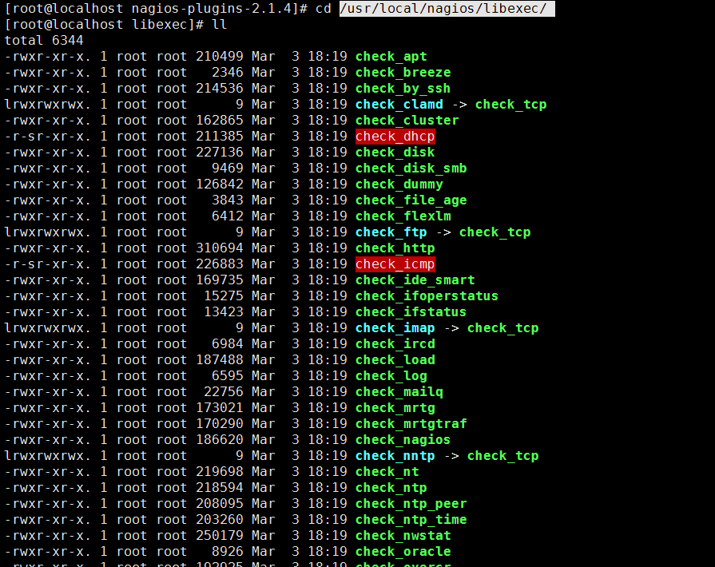
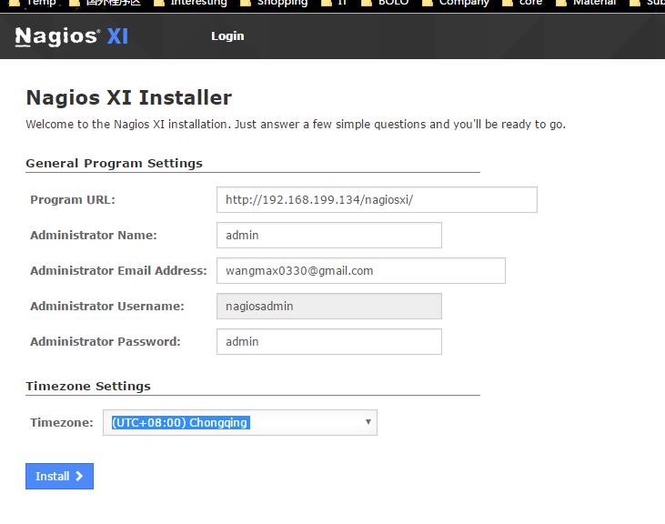

# Nagios 安装学习

## 监控的问题

*   系统监控说消耗的总体带宽是多少
*   为确保监控系统正常运行,客户端所需的UID 是什么?
*   路由器或者其他系统依赖于什么
*   在主机和监控系统之间,是否有敏感信息以明文传输

## 安装

### 安装依赖

```bash
[root@localhost soft]# yum -y install php httpd net-snmp gcc perl-CPAN
```

### 创建nagios 用户

```bash

##Nagios 默认运行时使用的用户是nagios ,使用的组是nagios ,所以需要添加用户
[root@localhost soft]# groupadd nagios
##/bin/false是最严格的禁止login选项，一切服务都不能用，而/sbin/nologin只是不允许系统login，可以使用其他ftp等服务
[root@localhost soft]# useradd -s /bin/false -g nagios nagios
```

### 解压缩

```bash
[root@localhost soft]# tar -zxvf nagios-cn-3.2.0.tar.bz2
[root@localhost soft]# tar -zxvf nagios-plugins-2.0.1.tar.gz
[root@localhost soft]# tar -zxvf nagios-snmp-plugins.1.1.1.tgz
```

### .configure

```bash
[root@localhost soft]# cd /home/soft/nagios-cn-3.2.0
[root@localhost nagios-cn-3.2.0]# ./configure -refix=/usr/local/nagios
```

```bash
*** Configuration summary for nagios 3.2.0 08-12-2009 ***:

 General Options:
 -------------------------
        Nagios executable:  nagios
        Nagios user/group:  nagios,nagios
       Command user/group:  nagios,nagios
            Embedded Perl:  no
             Event Broker:  yes
        Install ${prefix}:  /usr/local/nagios
                Lock file:  ${prefix}/var/nagios.lock
   Check result directory:  ${prefix}/var/spool/checkresults
           Init directory:  /etc/rc.d/init.d
  Apache conf.d directory:  /etc/httpd/conf.d
             Mail program:  /bin/mail
                  Host OS:  linux-gnu

 Web Interface Options:
 ------------------------
                 HTML URL:  http://localhost/nagios/
                  CGI URL:  http://localhost/nagios/cgi-bin/
 Traceroute (used by WAP):  


Review the options above for accuracy.  If they look okay,
type 'make all' to compile the main program and CGIs.
```

### make all

```bash
##nagios 在安装的过程中,需要5个make 目标来构建Nagios的各个部分
[root@localhost nagios-cn-3.2.0]# make all
#---------------------------------------------------------------------
*** Compile finished ***

If the main program and CGIs compiled without any errors, you
can continue with installing Nagios as follows (type 'make'
without any arguments for a list of all possible options):

  make install
     - This installs the main program, CGIs, and HTML files

  make install-init
     - This installs the init script in /etc/rc.d/init.d

  make install-commandmode
     - This installs and configures permissions on the
       directory for holding the external command file

  make install-config
     - This installs *SAMPLE* config files in /usr/local/nagios/etc
       You'll have to modify these sample files before you can
       use Nagios.  Read the HTML documentation for more info
       on doing this.  Pay particular attention to the docs on
       object configuration files, as they determine what/how
       things get monitored!

  make install-webconf
     - This installs the Apache config file for the Nagios
       web interface


*** Support Notes *******************************************
#---------------------------------------------------------------------
```

### make install 

```bash
[root@localhost nagios-cn-3.2.0]# make install   				#安装nagios的相关程序文件
[root@localhost nagios-cn-3.2.0]# make install-init			#安装nagios启动的初始化脚本
[root@localhost nagios-cn-3.2.0]# make install-commandmode 	#安装nagios的命令文件
[root@localhost nagios-cn-3.2.0]# make install-config			#安装nagios的配置文件
[root@localhost nagios-cn-3.2.0]# make install-webconf		#安装nagios的web配置文件。

注意：如果apache是使用源码安装的话，我们在执行make install-webconf会报错。我们只需要把sample-config/httpd.conf复制到/usr/local/apache2/conf/下，并重命名为nagios.conf即可。在这apache是安装到/usr/local/apache2下。如下：
```

### 安装nagios插件

```bash
[root@localhost nagios-plugins-2.1.4]# cd /home/soft/nagios-plugins-2.1.4
[root@localhost nagios-plugins-2.1.4]# ./configure -prefix=/usr/local/nagios/
#-------------------------------------------------------------------------
...
config.status: creating po/Makefile
            --with-apt-get-command: 
              --with-ping6-command: /usr/sbin/ping6 -n -U -w %d -c %d %s
               --with-ping-command: /usr/bin/ping -n -U -w %d -c %d %s
                       --with-ipv6: yes
                      --with-mysql: no
                    --with-openssl: no
                     --with-gnutls: no
               --enable-extra-opts: yes
                       --with-perl: /usr/bin/perl
             --enable-perl-modules: no
                     --with-cgiurl: /nagios/cgi-bin
               --with-trusted-path: /usr/local/sbin:/usr/local/bin:/sbin:/bin:/usr/sbin:/usr/bin
                   --enable-libtap: no
configure: creating ./config.status
...
#-------------------------------------------------------------------------
[root@localhost nagios-plugins-2.1.4]# make&&make install
```

### 查看插件(安装目录下libexec文件夹)

```bash
ll  /usr/local/nagios/libexec
```



### 把nagios加入到系统的服务中

```bash
chkconfig on nagios
chkconfig  nagios on
chkconfig --list nagios
```

### 为nagios配置登录的用户名和密码

有关nagios登录的用户名和密码，我们可以查看nagios.conf文件，如下：

```bash
[root@localhost plugins]#find / -name 'nagios.conf'
/etc/httpd/conf.d/nagios.conf
[root@localhost plugins]# cd /etc/httpd/conf.d/
[root@localhost conf.d]# cat nagios.conf |grep -v ^#|grep -v ^$
ScriptAlias /nagios/cgi-bin "/usr/local/nagios/sbin"
<Directory "/usr/local/nagios/sbin">
   Options ExecCGI
   AllowOverride None
   Order allow,deny
   Allow from all
   AuthName "Nagios Access"
   AuthType Basic
   AuthUserFile /usr/local/nagios/etc/htpasswd.users
   Require valid-user
</Directory>
Alias /nagios "/usr/local/nagios/share"
<Directory "/usr/local/nagios/share">
   Options None
   AllowOverride None
   Order allow,deny
   Allow from all
   AuthName "Nagios Access"
   AuthType Basic
   AuthUserFile /usr/local/nagios/etc/htpasswd.users
   Require valid-user
</Directory>
Alias /pub/images "/usr/local/nagios/share/docs/images"
<Directory "/usr/local/nagios/share/docs/images">
   Options None
   AllowOverride None
   Order allow,deny
   Allow from all
   AuthName "Nagios Access"
   AuthType Basic
   AuthUserFile /usr/local/nagios/etc/htpasswd.users
   Require valid-user
</Directory>
[root@localhost conf.d]# 
```

```bash

##注意：nagios默认的用户名是nagiosadmin。我们可以通过查看/usr/local/nagios/etc/cgi.conf文件得知。如下：
[root@localhost conf.d]# cd /usr/local/nagios/etc/
[root@localhost etc]# cat cgi.cfg |grep -v ^#|grep -v ^$
main_config_file=/usr/local/nagios/etc/nagios.cfg
physical_html_path=/usr/local/nagios/share
url_html_path=/nagios
show_context_help=0
use_pending_states=1
use_authentication=1
use_ssl_authentication=0
 
authorized_for_system_information=nagiosadmin
authorized_for_configuration_information=nagiosadmin
authorized_for_system_commands=nagiosadmin
authorized_for_all_services=nagiosadmin
authorized_for_all_hosts=nagiosadmin
authorized_for_all_service_commands=nagiosadmin
authorized_for_all_host_commands=nagiosadmin
statusmap_background_image=zytianbk.png
default_statusmap_layout=0
default_statuswrl_layout=4
ping_syntax=/bin/ping -n -U -c 5 $HOSTADDRESS$
refresh_rate=90
escape_html_tags=1
action_url_target=_blank
notes_url_target=_blank
lock_author_names=1
ttf_file=/usr/local/nagios/sbin/simhei.ttf
statusmap_mod=0
[root@localhost etc]# 
```

### nagios 生成新密码(admin)

```bash
[root@localhost etc]# htpasswd -c /usr/local/nagios/etc/htpasswd.users nagiosadmin
New password: 
Re-type new password: 
Adding password for user nagiosadmin
[root@localhost etc]# 
```

### nagios 启动关闭

```bash
##启动http服务器
[root@localhost etc]# systemctl start httpd.service 
## 启动nagios
[root@localhost etc]#/etc/init.d/nagios start
```


```bash
wget http://assets.nagios.com/downloads/nagiosxi/xi-latest.tar.gz
##解压并进如安装目录
./fullinstall

nagioadmin
admin
```

User: root
Pass: nagiosfusion

User: root
Pass: nagiosna

User: root
Pass: nagiosls


