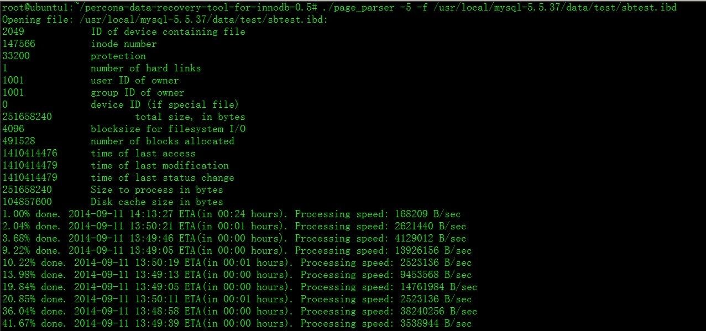
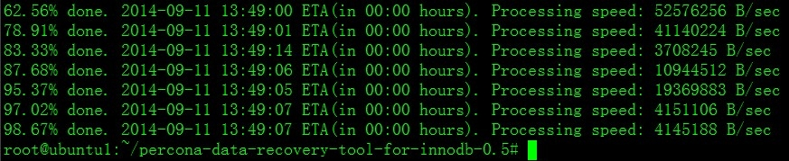
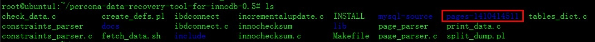
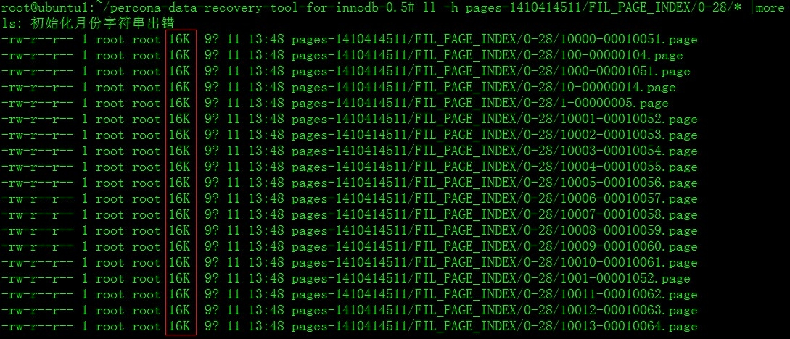
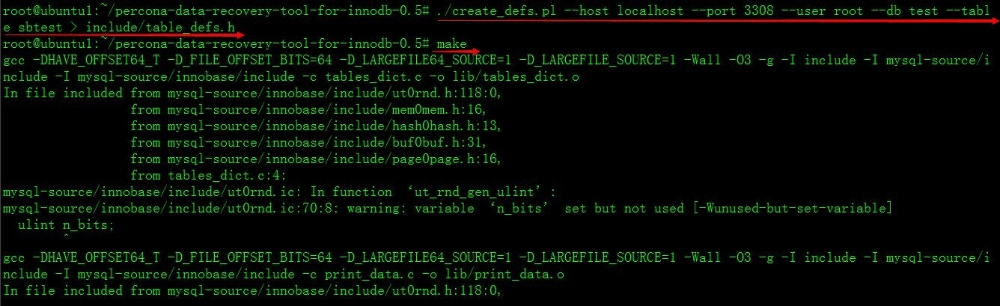
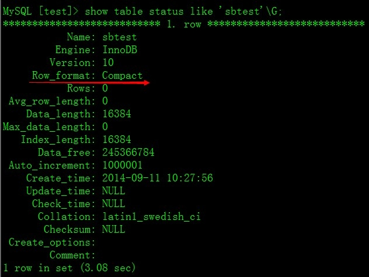
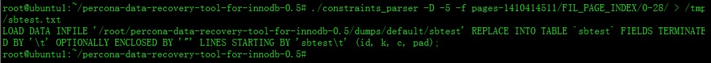
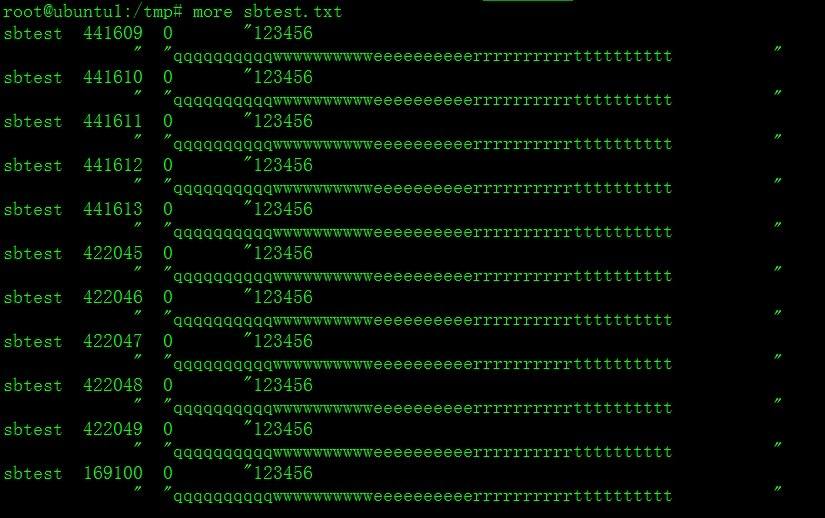
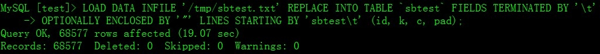

# Percona-Data Recovery Tool for InnoDB工具恢复误DELETE 操作数据

## 原理

在InnoDB引擎，delete删除操作，不是真正的删除物理文件上的行，而是增加一个删除的标记，我们都用过WORD吧？在修改字体的时候，有一个删除线的标记，如~~《MySQL 管理之道》~~，该工具利用这个特性，找回那些标注了删除线的数据，并存入到一个文本里，然后通过load data命令，批量插入到表里。**Percona Data Recovery Tool for InnoDB工具（仅支持InnoDB，MyISAM不支持），可以找回被删除的数据。**

> 注意:
> truncate不能恢复（truncate是直接清空数据行，并不是添加删除标记，你可以通过查看物理文件，执行了truncate操作，ibd文件变小，而执行了delete操作，ibd文件还跟之前的一样大），drop不能恢复(数据文件都没了，还怎么恢复？)

## 安装Percona Data Recovery Tool for InnoDB工具

```bash
# get https://launchpad.net/percona-data-recovery-tool-for-innodb/trunk/release-0.5/+download/percona-data-recovery-tool-for-innodb-0.5.tar.gz
# cd percona-data-recovery-tool-for-innodb-0.5/mysql-source
# ./configure
# cd ..
# make
```

## 全表删除sbtest表

```mysql
delete from sbtest;
```

## 恢复

### 提取ibd物理文件，按照每页16K，单独存放。

```bash
# cd percona-data-recovery-tool-for-innodb-0.5/
# ./page_parser -5 -f /usr/local/mysql-5.5.37/data/test/sbtest.ibd

```





会在当前目录生成一个pages-1410414511目录（后面的数字是变化的，在你的机器上会跟我的不同）





在FIL_PAGE_INDEX目录下面，会生成主键和索引，数据最小的是主键，后面依次是每个列的索引


在这里，0-28是sbtest表的主键(id)，0-29是sbtest表的索引(k)。记住这个目录数字，后面我们需要通过这个目录恢复数据。

### 生成表结构

```bash
# cd percona-data-recovery-tool-for-innodb-0.5/
# ./create_defs.pl --host localhost --port 3306 --user root --password 123456 --db test --table sbtest > include/table_defs.h

-- host 主机地址
-- port 端口
-- user 用户名
-- password 密码
-- db 数据库名
-- table 表名
```

### 再次执行make编译命令

```bash
# cd percona-data-recovery-tool-for-innodb-0.5/
# make
```



### 恢复删除的数据

```bash
# cd percona-data-recovery-tool-for-innodb-0.5/
# ./constraints_parser -D -5 -f pages-1410414511/FIL_PAGE_INDEX/0-28/ > /tmp/sbtest.txt

```

-D 恢复删除的行

-5 表的文件格式，默认是Compact

-f 指定生成sbtest表的主键目录

（不清楚的朋友，可以用show table status命令查看）



执行完毕，如下图：



会自动生成一个load data infile命令，请把这个复制下来，一会我们要导入数据。

在/tmp目录下，会生成sbtest.txt，我们就要用这个文件做恢复。



### 导入到表里

```mysql
LOAD DATA INFILE '/tmp/sbtest.txt' REPLACE INTO TABLE `sbtest` FIELDS TERMINATED BY '\t' OPTIONALLY ENCLOSED BY '"' LINES STARTING BY 'sbtest\t' (id, k, c, pad);
```



## 总结：

通过上述方法，顺利的完成了delete数据恢复。在数据被删除后，切记要备份ibd数据文件，一定不要覆盖，否则都是不能完成修复的。目前该工具不支持字符串set类型。


