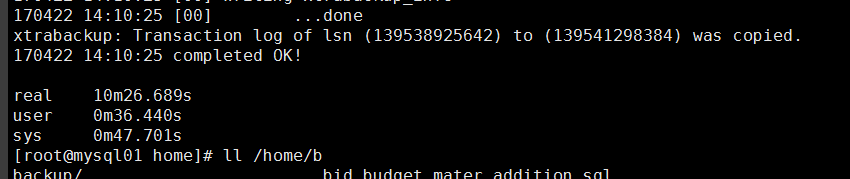

# XtraBackup  热备份MySQL

## 介绍

XtraBackup是Percona提供的开源产品,可执行InnoDB热备份.此工具也具有支持XtraDB存储引擎的额外特征,XtraDB存储引擎是InnoDB的开源变体

## mysqldump&&XtraBackup选择

使用mysqldump来进行备份与恢复，在备份的时候锁住表，然后全部备份，在数据少的时候没问题，但如果数据很多，不允许锁表，同时需要恢复数据块的情况，mysqldump就不适合了，我在恢复一个4G数据文件的数据库的时候，恢复的数据是使用mysqldump的数据，恢复了3个小时还没有反应，造成的影响很严重，所以我开始寻找其他的别发软件来满足以上的需求，幸好找到了，就是使用xtrabackup来进行备份与恢复，恢复4G数据文件的数据库，仅需要14秒，同时在备份的时候不会锁表，而且支持增量备份，所以把我的比较分享给大家，希望对大家有益！

## 安装

### 下载地址

https://www.percona.com/downloads/XtraBackup/LATEST/

### 安装依赖

```bash
# yum -y install perl perl-devel libaio libaio-devel perl-Time-HiRes perl-DBD-MySQL

# yum install rsync -y

# yum -y install perl-Digest-MD5 
```

### 安装编译

```bash
##Ubunut 安装
apt-get install -y libaiol
dpkg -i percona-xtrabackup_*.deb
xtrabackup -help

##Centos 7安装
[root@own-server soft]# rpm -ivh percona-xtrabackup-24-2.4.6-2.el7.x86_64.rpm 

##Centos 6安装
[root@own-server soft]# rpm -ivh percona-xtrabackup-24-2.4.6-2.el6.x86_64
[root@own-server soft]# xtrabackup -help
```

>   注意:
>
>   XtraBackup可能需要安装一部I/O库安装包(Ubunut 是libaiol,REHL 上是libaio)

### MySQL 启动关闭进入控制台

```bash
#启动命令
[root@shj-db01 ~]# /home/mysql/bin/mysqld_safe --defaults-file=/home/mysql/my.cnf &
# 关闭命令
[root@shj-db01 ~]# /home/mysql/bin/mysqladmin -uroot -p'shjdb2016' --socket=/home/mysql/run/mysql.sock shutdown
#进入控制台
[root@shj-db01 ~]# /home/mysql/bin/mysql -uroot -p'shjdb2016' --socket=/home/mysql/run/mysql.sock
```

### 数据备份前必选锁表或者停服务

xtrabackup只能备份和恢复InnoDB表，而且只有ibd文件，frm文件它不管，恢复时就需要DBA提供frm。innobackupex可以备份和恢复MyISAM表以及frm文件，并且对xtrabackup也做了很好的封装，所以可以使用innobackupex来备份MySQL数据库。还有一个问题，

**就是innobackupex备份MyISAM表之前要对全库进行加READ LOCK，**阻塞写操作，若备份是在从库上进行的话会影响主从同步，造成延迟。对InnoDB表备份不会阻塞读写。

```mysql
#super权限的用户也不能进行读写操作
mysql> flush tables with read lock;
mysql> SET GLOBAL read_only = ON;

##参看当前有哪些进程还在使用
mysql> SELECT * FROM information_schema.PROCESSLIST  WHERE COMMAND != "Sleep" order by TIME DESC;     

#备份完后解除只读锁
mysql> SET GLOBAL read_only = OFF;
mysql> UNLOCK TABLES;
```

### 备份恢复操作

安装XtraBackup后，其实会有几个工具：

*   innobackupex：这个是其实是下面三个工具的一个perl脚本封装，可以备份MyISAM, InnoDB, XtraDB表。但在处理Myisam时需要加一个读锁。
*   xtrabackup：一个由C编译而来的二进制文件，只能备份InnoDB和XtraDB数据。
*   xbcrypt：用来加密或解密备份的数据。
*   xbstream：用来解压或压缩xbstream格式的压缩文件。

**建议使用perl封装的innobackupex来作数据库备份，因为比较容易使用**

#### XtraBackup

*   无需停止数据库进行InnoDB热备
*   增量备份MySQL
*   流压缩到传输到其它服务器
*   能比较容易地创建主从同步
*   备份MySQL时不会增大服务器负载

--backup  XtraBackup备份分为两步操作.

*   第一步操作: 用backup选项执行物理备份.
*   第二部操作: 用--prepare选项对被拷贝的表空间文件和被积累的事务日志进行一次内部崩溃恢复,以便产生一个一致性备份,该备份随后可以按预先规定的时间被恢复.

##### xtrabackup --backup 

```bash
mkdir -p /mnt/backup/mysql
time xtrabackup --user=root --password=123456 --socket=/home/mysql/run/mysql.sock  --backup --datadir=/home/mysql/data --target-dir=/mnt/backup/mysql --tables=zabbix.*
#--------------------------
--datadir     存放数据的目录
--target-dir  备份的目录
```

```bash
#操作实例
####################################################################################
[root@own-server soft]# cp /home/mysql/my.cnf /home/soft/my_backup.cnf
[root@own-server soft]# vim my_backup.cnf 
#--------------------------------------------------
innodb_data_home_dir = /home/mysql/data
#iinnodb_data_file_path = "ibdata1:10M:autoextend"
innodb_log_group_home_dir =/home/mysql/data
#--------------------------------------------------

[root@own-server soft]# xtrabackup --defaults-file=./my_backup.cnf --print-param
# This MySQL options file was generated by XtraBackup.
[mysqld]
datadir=/home/mysql/data
innodb_data_home_dir=/home/mysql/data
innodb_log_group_home_dir=/home/mysql/data


[root@own-server soft]# time xtrabackup --user=root --password=123456 --socket=/home/mysql/run/mysql.sock  --backup --datadir=/home/mysql/data --target-dir=/mnt/backup/mysql
Unrecognized character \x01; marked by <-- HERE after <-- HERE near column 1 at - line 1374.
170315 04:31:57 Connecting to MySQL server host: localhost, user: root, password: set, port: not set, socket: /home/mysql/run/mysql.sock
Using server version 5.6.12
xtrabackup version 2.4.6 based on MySQL server 5.7.13 Linux (x86_64) (revision id: 8ec05b7)
xtrabackup: uses posix_fadvise().
xtrabackup: cd to /home/mysql/data
xtrabackup: open files limit requested 0, set to 1024
xtrabackup: using the following InnoDB configuration:
xtrabackup:   innodb_data_home_dir = .
xtrabackup:   innodb_data_file_path = ibdata1:12M:autoextend
xtrabackup:   innodb_log_group_home_dir = ./
xtrabackup:   innodb_log_files_in_group = 2
xtrabackup:   innodb_log_file_size = 50331648
InnoDB: Number of pools: 1
170315 04:31:57 >> log scanned up to (206233290)
xtrabackup: Generating a list of tablespaces
InnoDB: Allocated tablespace ID 1 for mysql/innodb_table_stats, old maximum was 0
170315 04:31:57 [01] Copying ./ibdata1 to /mnt/backup/mysql/ibdata1
170315 04:31:57 [01]        ...done
170315 04:31:58 [01] Copying ./mysql/innodb_table_stats.ibd to /mnt/backup/mysql/mysql/innodb_table_stats.ibd
170315 04:31:58 [01]        ...done
170315 04:31:58 [01] Copying ./mysql/innodb_index_stats.ibd to /mnt/backup/mysql/mysql/innodb_index_stats.ibd
170315 04:31:58 >> log scanned up to (206233290)
.....................
170315 04:32:02 Finished backing up non-InnoDB tables and files
170315 04:32:02 Executing FLUSH NO_WRITE_TO_BINLOG ENGINE LOGS...
xtrabackup: The latest check point (for incremental): '206233290'
xtrabackup: Stopping log copying thread.
.170315 04:32:02 >> log scanned up to (206233290)

170315 04:32:02 Executing UNLOCK TABLES
170315 04:32:02 All tables unlocked
170315 04:32:02 Backup created in directory '/mnt/backup/mysql/'
170315 04:32:02 [00] Writing backup-my.cnf
170315 04:32:02 [00]        ...done
170315 04:32:02 [00] Writing xtrabackup_info
170315 04:32:02 [00]        ...done
xtrabackup: Transaction log of lsn (206233290) to (206233290) was copied.
170315 04:32:02 completed OK!

real	0m5.818s
user	0m0.575s
sys	0m1.423s
[root@own-server soft]# ll -h /mnt/backup/mysql
total 77M
-rw-r-----. 1 root root  418 Mar 15 04:32 backup-my.cnf
-rw-r-----. 1 root root  76M Mar 15 04:31 ibdata1
drwxr-x---. 2 root root 4.0K Mar 15 04:32 mysql
drwxr-x---. 2 root root 4.0K Mar 15 04:32 performance_schema
drwxr-x---. 2 root root   19 Mar 15 04:32 test
-rw-r-----. 1 root root  117 Mar 15 04:32 xtrabackup_checkpoints
-rw-r-----. 1 root root  511 Mar 15 04:32 xtrabackup_info
-rw-r-----. 1 root root 2.5K Mar 15 04:32 xtrabackup_logfile
drwxr-x---. 2 root root 4.0K Mar 15 04:32 ykee_sys
drwxr-x---. 2 root root 8.0K Mar 15 04:32 zabbix
[root@own-server soft]# du -h  /mnt/backup/mysql
1.9M	/mnt/backup/mysql/mysql
26M	/mnt/backup/mysql/zabbix
181M	/mnt/backup/mysql/ykee_sys
4.0K	/mnt/backup/mysql/test
636K	/mnt/backup/mysql/performance_schema
285M	/mnt/backup/mysql
[root@own-server soft]#
```

##### xtrabackup --prepare

--prepare XtraBackup的准备步骤启动嵌入式InnoDB,执行一次数据和累加事务日志的崩溃恢复,并产生一个干净且一致的备份,以满足任何回复的需要.
这个步骤可以发生在任何具有备份文件且安装了相同版本dXtraBackup的服务器上.而在已经做了备份的机器上,这个步骤就不需要了.


```bash
time xtrabackup --defaults-file=/home/soft/my_backup.cnf --prepare --target-dir=/mnt/backup/mysql/test1

time xtrabackup --user=root --password=123456 --socket=/home/mysql/run/mysql.sock --defaults-file=/home/soft/my_backup.cnf --prepare --target-dir=./mnt/backup/mysql/test1
```

#### innobackupex全量备份还原

这个命令自动备份放到一个用日期/时间形式命名的子目录中,不希望自动放置的话,可用--no-timestamp选项来将此功能关闭

```bash
##########################备份################################
###################全量备份
time innobackupex --defaults-file=/home/mysql/my.cnf --user=root --password=123456 /mnt/backup/mysql/full
#或者
time innobackupex --defaults-file=/home/mysql/my.cnf --user=root --password=shjdb2016 --socket=/home/mysql/run/mysql.sock /home/backup/mysql/full

###################apply-log和redo-only
innobackupex --apply-log --redo-only /mnt/backup/mysql/full/2017-03-16_01-42-57/

#################全量还原
innobackupex --defaults-file=/home/mysql/my.cnf --user=root --password='123456' --copy-back /mnt/backup/mysql/full/2017-03-16_01-42-57/

chown mysql.mysql -R /home/mysql/data
```

#### innobackupex全量备份还原(带压缩)

```bash
##全量备份(13G文件),并使用用压缩
##使用压缩
[root@mysql01 ~]#  time innobackupex --defaults-file=/etc/my.cnf --user=root --password=yk2015 --stream=tar ./ |gzip - > /home/backup/mysql/full/2017-05-01_23-47-41.tar.gz
#-----------------------------------------有压缩备份用了12m4.097s
trabackup: Transaction log of lsn (142594752669) to (142595078017) was copied.
170502 00:25:33 completed OK!

real	12m4.097s
user	10m50.934s
sys	0m39.978s
#--------------------------------------------有压缩备份占用2.3g空间
[root@mysql01 ~]# ll -h /home/backup/mysql/full/2017-05-01_23-47-41.tar.gz
-rw-r--r--. 1 root root 2.3G May  2 00:25 /home/backup/mysql/full/2017-05-01_23-47-41.tar.gz
[root@mysql01 ~]# 
#取备份文件时候,要使用下面的语法:
tar -zxvfi /home/backup/mysql/full/backup/tar.gz
```


#### innobackupex增量备份和还原

```bash
###增量备份是基于全量备份的基础上弄的,所以先要弄个全量备份
#-----------------------------------------------
#全量备份
time innobackupex --defaults-file=/home/mysql/my.cnf --user=root --password=123456 /mnt/backup/mysql/full

#第一次增量备份
time innobackupex --defaults-file=/home/mysql/my.cnf --incremental --incremental-basedir=/mnt/backup/mysql/full/2017-03-16_01-42-57/ --user=root --password='123456' /mnt/backup/mysql/rec

#指定备份目录/mnt/backup/mysql/rec 并且告知增量是相对于--incremental-basedir=/mnt/backup/mysql/2017-03-16_00-50-31/

第一次增量对应为上一次完全备份，第二次增量对应为第一次增量以此类推。所以这里明确说明增量相对位置
而对于MyISAM表是没办法做增量备份的，所以每次对MyISAM做备份的时候都是完全备份，准备增量备份与准备完全备份有所不同，只提交事物，而不会滚事物

#第二次增量备份
time innobackupex --defaults-file=/home/mysql/my.cnf --incremental --incremental-basedir=/mnt/backup/mysql/rec/2017-03-16_04-20-48/ --user=root --password='123456' /mnt/backup/mysql/rec

#############################增量还原#############################

#####当应用0级备份恢复增量备份的时候记住要使用--redo-only参数
#恢复前的准备,应用日志中提交的事物 --apply-log --redo-only
innobackupex --defaults-file=/home/mysql/my.cnf --user=root --password='123456' --apply-log --redo-only /mnt/backup/mysql/full/2017-03-16_01-42-57
#将1级备份应用到0级备份 --apply-log --redo-only
innobackupex --defaults-file=/home/mysql/my.cnf --user=root --password='123456' --apply-log --redo-only /mnt/backup/mysql/full/2017-03-16_01-42-57 --incremental-dir=/mnt/backup/mysql/rec/2017-03-16_04-20-48/
#将2级备份应用到0级备份 --apply-log --redo-only
innobackupex --defaults-file=/home/mysql/my.cnf --user=root --password='123456' --apply-log --redo-only /mnt/backup/mysql/full/2017-03-16_01-42-57 --incremental-dir=/mnt/backup/mysql/rec/2017-03-16_04-24-45/

#当恢复完增量备份,在一次应用0级备份回滚没有提交的事物 --apply-log
innobackupex --defaults-file=/home/mysql/my.cnf --user=root --password='123456' --apply-log  /mnt/backup/mysql/full/2017-03-16_01-42-57

#停止MySQL,恢复0级备份 --copy-back
[root@centos-server-6 mysql]# /home/mysql/bin/mysqladmin -uroot -p'123456' --socket=/home/mysql/run/mysql.sock shutdown
[root@centos-server-6 mysql]# rm -rf data/
[root@centos-server-6 mysql]# innobackupex --defaults-file=/home/mysql/my.cnf --user=root --password='123456' --copy-back /mnt/backup/mysql/full/2017-03-16_01-42-57/
[root@centos-server-6 mysql]# chown mysql.mysql -R /home/mysql/data
[root@centos-server-6 mysql]# /home/mysql/bin/mysqld_safe --defaults-file=/home/mysql/my.cnf &
查看位置
[root@test22014-04-06_15-40-04]# cat xtrabackup_checkpoints
backup_type= incremental #类型为增量备份
from_lsn= 1615147 #从此位置开始，这个位置正是完全备份后的最后的位置
to_lsn= 1621213 #到此位置结束
last_lsn= 1621213
compact= 0
```

```bash
备份文件说明

xtrabackup_binlog_info —— mysql服务器当前正在使用的二进制日志文件及至备份这一刻为止二进制日志事件的位置。会自动记录二进制位置的，不需要手动记录；
xtrabackup_binlog_pos_innodb —— 二进制日志文件及用于InnoDB或XtraDB表的二进制日志文件的当前position。特定于innodb存储引擎的；
xtrabackup_binary —— 备份中用到的xtrabackup的可执行文件；
backup-my.cnf —— 备份命令用到的配置选项信息，将选项全部保留；

目前操作，主要我们关注xtrabackup_checkpoints
[root@test22014-04-06_15-02-15]# cat xtrabackup_checkpoints
backup_type =full-backuped #备份类型为完全备份
from_lsn = 0 #从哪个逻辑单元号开始
to_lsn = 1613626 #到哪个逻辑单元号码
last_lsn = 1613626 #上一次最近最后一个单元号码
compact = 0 #是否压缩，0为没有，以没有为加密方式备份
#对应二进制文件的事件位置
[root@test2 2014-04-06_15-02-15]# cat xtrabackup_binlog_info
mysql-bin.000001 107
二进制本身的日志文件
[root@test22014-04-06_15-02-15]# file xtrabackup_logfile
xtrabackup_logfile:data

 
备份数据时使用的配置文件信息
关于mysqld相关配置
[root@test22014-04-06_15-02-15]# cat backup-my.cnf
# This MySQLoptions file was generated by innobackupex.
# The MySQL server
[mysqld]
innodb_data_file_path=ibdata1:10M:autoextend
innodb_log_files_in_group=2
innodb_log_file_size=5242880
innodb_fast_checksum=0
innodb_page_size=16384
innodb_log_block_size=512
备份完成之后是不能用来直接恢复的，还需要做准备工作
如果有增量备份只能提交事物不能回滚事物
使用--apply-log参数提已提交事物至数据文件，回滚提交事物
使用此参数的时候必须确保mysqld已启动
这里后面再说
如果做了完全备份之后，没有出现任何意外情况，也没修改任何数据，那么就在这时数据库崩溃了，所以我们要对其进行恢复操作
```


### 解压缩命令,用于传输数据

```bash
#Master,压缩备份的数据
[root@mysql01 full]# time tar -zcvf 2017-04-07_09-16-17.tar.gz /home/backup/mysql/full/2017-04-07_09-16-17


##Slave,下载主库的数据,解压主库的数据到/home/mysql/data/
[root@mysql01 full]# scp -rp root@192.168.1.20:/home/backup/mysql/full/2017-04-07_09-16-17.tar.gz /home/backup/mysql

[root@mysql01 full]# tar -zxvf /home/backup/mysql/2017-04-07_09-16-17.tar.gz -C /home/mysql/data/
```
## 查看备份的binglog位置

```bash
[root@mysql01 home]# cat  /home/backup/mysql/full/2017-04-22_13-59-59/xtrabackup_binlog_info 
mysql-bin.000013	176840555
[root@mysql01 home]# 
```

## 常用命令

```bash
--defaults-file：指定my.cnf参数文件的位置[此配置文件里必须指定datadir]
--apply-log：同xtrabackup的--prepare参数,一般情况下,在备份完成后，数据尚且不能用于恢复操作，因为备份的数据中可能会包含尚未提交的事务或已经提交但尚未同步至数据文件中的事务。因此，此时数据 文件仍处理不一致状态。--apply-log的作用是通过回滚未提交的事务及同步已经提交的事务至数据文件使数据文件处于一致性状态。
--copy-back
做数据恢复时将备份数据文件拷贝到MySQL服务器的datadir ；
--remote-host=HOSTNAME
通过ssh将备份数据存储到进程服务器上；
--stream=[tar]
备 份文件输出格式, tar时使用tar4ibd , 该文件可在XtarBackup binary文件中获得.如果备份时有指定--stream=tar, 则tar4ibd文件所处目录一定要在$PATH中(因为使用的是tar4ibd去压缩, 在XtraBackup的binary包中可获得该文件)。
在 使用参数stream=tar备份的时候，你的xtrabackup_logfile可能会临时放在/tmp目录下，如果你备份的时候并发写入较大的话 xtrabackup_logfile可能会很大(5G+)，很可能会撑满你的/tmp目录，可以通过参数--tmpdir指定目录来解决这个问题。
--tmpdir=DIRECTORY
当有指定--remote-host or --stream时, 事务日志临时存储的目录, 默认采用MySQL配置文件中所指定的临时目录tmpdir
--redo-only --apply-log组,
强制备份日志时只redo ,跳过rollback。这在做增量备份时非常必要。

redo-only 只对增量备份有作用，
让我们先看看 官方解释：
This option should be used when preparing the base full backup and when merging all incrementals except the last one；
也就是说 对于全备份和增量备份（出最后一个增备外） 都需要加 redo-only ;
这个选项是 让xtrabackup跳过 rollback 阶段，只进行redo 阶段（中间的增备如果 rollback ，那增备之间可以无法衔接起来）
你也可以进行测试，但必须是在高压下测试，才有可能 测试redo-only 的影响，否则， 对redo-only 是无法测出的！

--use-memory=#
该参数在prepare的时候使用，控制prepare时innodb实例使用的内存量,默认100M
--throttle=IOS
同xtrabackup的--throttle参数
--sleep=是给ibbackup使用的，指定每备份1M数据，过程停止拷贝多少毫秒，也是为了在备份时尽量减小对正常业务的影响，具体可以查看ibbackup的手册 ；
--compress[=LEVEL]
对备份数据迚行压缩，仅支持ibbackup，xtrabackup还没有实现；
--include=REGEXP
对 xtrabackup参数--tables的封装，也支持ibbackup。备份包含的库表，例如：--include="test.*"，意思是要备份 test库中所有的表。如果需要全备份，则省略这个参数；如果需要备份test库下的2个表：test1和test2,则写 成：--include="test.test1|test.test2"。也可以使用通配符，如：--include="test.test*"。
--databases=LIST
列出需要备份的databases，如果没有指定该参数，所有包含MyISAM和InnoDB表的database都会被备份；
--uncompress
解压备份的数据文件，支持ibbackup，xtrabackup还没有实现该功能；
--slave-info,
备 份从库, 加上--slave-info备份目录下会多生成一个xtrabackup_slave_info 文件, 这里会保存主日志文件以及偏移, 文件内容类似于:CHANGE MASTER TO MASTER_LOG_FILE='', MASTER_LOG_POS=0
--socket=SOCKET
指定mysql.sock所在位置，以便备份进程登录mysql.

--parallel
此参数用于开启多个子进程并发备份多个数据文件（注意，一个数据文件只会有一个进程完成备份）。可以加快备份速度。但是在服务器资源不足时，谨慎使用。
innobackupex --user=root --password=123456 --parallel=16 /tmp  
--throttle
此参数用于限制备份过程中每秒的IO次数。
```

## 优化

 --use-memory=4G   没啥区别

```bash
 time innobackupex --defaults-file=/etc/my.cnf  --user=root --password=yk2015 --no-timetamp /home/backup/mysql/full/
```



```bash
time innobackupex --defaults-file=/etc/my.cnf  --user=root --password=yk2015 --no-timetamp --use-memory=4G /home/backup/mysql/full/
```


## 安装常见问题

### libev.so.4()(64bit) is needed by percona-xtrabackup-24-2.4.6-2.el7.x86_64

```bash
[root@own-server soft]# rpm -ivh percona-xtrabackup-24-2.4.6-2.el7.x86_64.rpm 
warning: percona-xtrabackup-24-2.4.6-2.el7.x86_64.rpm: Header V4 DSA/SHA1 Signature, key ID cd2efd2a: NOKEY
error: Failed dependencies:
	libev.so.4()(64bit) is needed by percona-xtrabackup-24-2.4.6-2.el7.x86_64
	perl(Digest::MD5) is needed by percona-xtrabackup-24-2.4.6-2.el7.x86_64
	rsync is needed by percona-xtrabackup-24-2.4.6-2.el7.x86_64
[root@own-server soft]# yum install  libev.so.4 
Loaded plugins: fastestmirror
...
Loading mirror speeds from cached hostfile
 * base: mirrors.btte.net
 * epel: mirror01.idc.hinet.net
 * extras: mirrors.btte.net
 * updates: centos.ustc.edu.cn
No package libev.so.4 available.
Error: Nothing to do
[root@own-server soft]#  wget ftp://rpmfind.net/linux/atrpms/el6-x86_64/atrpms/stable/libev-4.04-2.el6.x86_64.rpm
```

### perl(Digest::MD5) is needed by percona-xtrabackup-24-2.4.6-2.el7.x86_64

```bash
[root@own-server soft]# rpm -ivh percona-xtrabackup-24-2.4.6-2.el7.x86_64.rpm 
warning: percona-xtrabackup-24-2.4.6-2.el7.x86_64.rpm: Header V4 DSA/SHA1 Signature, key ID cd2efd2a: NOKEY
error: Failed dependencies:
	perl(Digest::MD5) is needed by percona-xtrabackup-24-2.4.6-2.el7.x86_64
	rsync is needed by percona-xtrabackup-24-2.4.6-2.el7.x86_64

## 解决方法
[root@own-server soft]# yum -y install perl-Digest-MD5 
```

### rsync is needed by percona-xtrabackup-24-2.4.6-2.el7.x86_64

```bash
yum install rsync -y
```

###	libnuma.so.1()(64bit) is needed by percona-xtrabackup-24-2.4.6-2.el6.x86_64

```bash
yum install -y numactl-devel 
```

###	libstdc++.so.6(GLIBCXX_3.4.15)(64bit) is needed by percona-xtrabackup-24-2.4.6-2.el7.x86_64

```bash
yum whatprovides libstdc++.so.6
yum install libstdc++.so.6

```


## 使用常见问题

### xtrabackup备份MySQL时报错'Too many open files'

```bash
##临时生效.重启无效
ulimit -n 65535

##永久生效
在/etc/security/limits.conf最后增加如下两行记录
*               soft    nofile          1024000
*               hard    nofile          1024000

```

