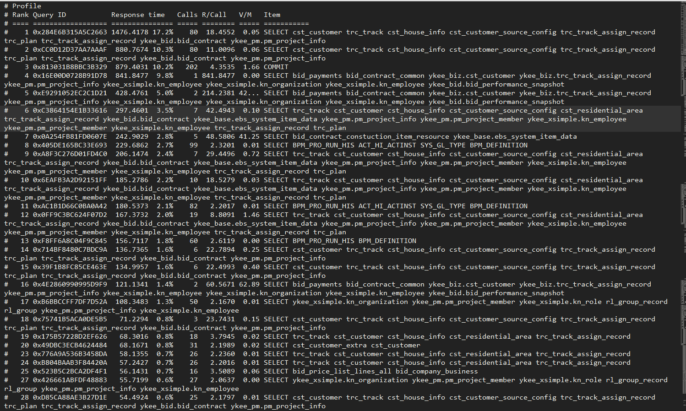

# Percona-toolkit工具包的安装和使用

## 作用

检查master和slave数据的一致性

有效地对记录进行归档

查找重复的索引

对服务器信息进行汇总

分析来自日志和tcpdump的查询

当系统出问题的时候收集重要的系统信息

## 下载地址

> https://www.percona.com/downloads/

## 检查和安装

### 安装依赖

```bash
yum -y install perl perl-devel libaio libaio-devel perl-Time-HiRes  
yum -y install perl-IO-Socket-SSL.noarch
yum -y install perl-TermReadKey.x86_64
yum -y install perl-Digest-MD5 
```

### 快速安装

```bash
[root@own-server soft]# wget https://www.percona.com/downloads/percona-toolkit/2.2.17/RPM/percona-toolkit-2.2.17-1.noarch.rpm 
[root@own-server soft]# yum install percona-toolkit-2.2.17-1.noarch.rpm
```

### RPM 安装

```bash
[root@own-server soft]# rpm -ivh percona-toolkit-2.2.17-1.noarch.rpm
error: Failed dependencies:
        perl(Time::HiRes) is needed by percona-toolkit-2.2.14-1.noarch
        perl(IO::Socket::SSL) is needed by percona-toolkit-2.2.14-1.noarch
        perl(Term::ReadKey) is needed by percona-toolkit-2.2.14-1.noarch
        perl(DBD::mysql) >= 1.0 is needed by percona-toolkit-2.2.17-1.noarch


#----------------------------------------------------
那么需要以下处理
[root@own-server soft]# yum list |grep Time |HiRes
[root@own-server soft]# perl-Time-HiRes.x86_64
 
[root@own-server soft]# yum install perl-Time-HiRes.x86_64
[root@own-server soft]# yum list |grep Socket |grep SSL
 perl-IO-Socket-SSL.noarch
[root@own-server soft]# yum install perl-IO-Socket-SSL.noarch
[root@own-server soft]# yum list |grep Term |grep ReadKey
perl-TermReadKey.x86_64
[root@own-server soft]# yum install perl-TermReadKey.x86_64
yum list |grep DBD 
perl-DBD-MySQL.x86_64                      4.013-3.el6                 @base    
perl-DBD-SQLite.x86_64                     1.27-3.el6                  @anaconda-CentOS-201508042137.x86_64/6.7
perl-DBD-AnyData.noarch                    0.09-1.el5.rf               rpmforge 
perl-DBD-CSV.noarch                        0.22-1.2.el5.rf             rpmforge 
perl-DBD-Chart.noarch                      0.82-1.el5.rf               rpmforge 
perl-DBD-File.noarch                       0.34-1.2.el5.rf             rpmforge 
perl-DBD-LDAP.noarch                       0.20-1.el5.rf               rpmforge 
perl-DBD-Mock.noarch                       1.39-1.el5.rf               rpmforge 
perl-DBD-Multi.noarch                      0.14-1.el5.rf               rpmforge 
perl-DBD-ODBC.x86_64                       1.23-1.el5.rf               rpmforge 
perl-DBD-Pg.x86_64                         2.15.1-4.el6_3              base     
perl-DBD-PgLite.noarch                     0.11-1.el5.rf               rpmforge 
perl-DBD-PgPP.noarch                       0.08-1.el5.rf               rpmforge 
perl-DBD-SQLite2.x86_64                    0.33-1.el5.rf               rpmforge 
perl-DBD-Sybase.x86_64                     1.10-1.el5.rf               rpmforge 
perl-DBD-XBase.noarch                      0.241-1.2.el5.rf            rpmforge 
perl-DBIx-AnyDBD.noarch                    2.01-1.2.el5.rf             rpmforge
[root@own-server soft]# yum install perl-DBD-MySQL.x86_6
```

安装后，可以通过下面的命令确认是否安装成功：

```bash
[root@own-server soft]# pt-query-digest --help
[root@own-server soft]# pt-table-checksum --help
```

如果命令提示可以正常显示，则说明pt工具已经正常安装和使用了。

## pt-table-checksum

*(本人在Master执行,指定了host 在哪台机器上执行都没问题)*

### 介绍

`pt-table-checksum` 是 Percona-Toolkit 的组件之一，用于检测MySQL主、从库的数据是否一致。其原理是在主库执行基于statement的sql语句来生成主库数据块的checksum，把相同的sql语句传递到从库执行，并在从库上计算相同数据块的checksum，最后，比较主从库上相同数据块的checksum值，由此判断主从数据是否一致。检测过程根据唯一索引将表按row切分为块（chunk），以为单位计算，可以避免锁表。检测时会自动判断复制延迟、 master的负载， 超过阀值后会自动将检测暂停，减小对线上服务的影响。

`pt-table-checksum` 默认情况下可以应对绝大部分场景，官方说，即使上千个库、上万亿的行，它依然可以很好的工作，这源自于设计很简单，一次检查一个表，不需要太多的内存和多余的操作；必要时，`pt-table-checksum` 会根据服务器负载动态改变 chunk 大小，减少从库的延迟。

为了减少对数据库的干预，`pt-table-checksum`还会自动侦测并连接到从库，当然如果失败，可以指定`--recursion-method`选项来告诉从库在哪里。它的易用性还体现在，复制若有延迟，在从库 checksum 会暂停直到赶上主库的计算时间点（也通过选项`--`设定一个可容忍的延迟最大值，超过这个值也认为不一致）。

为了保证主数据库服务的安全，该工具实现了许多保护措施：

1. 自动设置 `innodb_lock_wait_timeout` 为1s，避免引起
2. 默认当数据库有25个以上的并发查询时，`pt-table-checksum`会暂停。可以设置 `--max-load` 选项来设置这个阀值
3. 当用 Ctrl+C 停止任务后，工具会正常的完成当前 chunk 检测，下次使用 `--resume` 选项启动可以恢复继续下一个 chunk

**在Master主库执行pt-table-checksum命令。它会使用concat_ws函数将数据合并为一行，然后使用crc32函数生成校验码,最后将其插入percona库的checksums表中。**


### 参数说明

```bash
--create-replicate-table 选项会自动创建 percona.checksums 表，但也意味着赋予额外的 CREATE TABLE权限给 percona@'xxx' 用户。默认yes
--nocheck-replication-filters ：表示不需要检查 Master 配置里是否指定了 Filter。 默认会检查，如果配置了 Filter，如 replicate_do_db,replicate-wild-ignore-table,binlog_ignore_db 等，在从库checksum就与遇到表不存在而报错退出，所以官方默认是yes（--check-replication-filters）但我们实际在检测中时指定--databases=，所以就不存在这个问题，干脆不检测
--no-check-binlog-format      : 不检查复制的binlog模式，要是binlog模式是ROW，则会报错。
--empty-replicate-table：每个表checksum开始前，清空它之前的检测数据（不影响其它表的checksum数据），默认yes。当然如果使用--resume启动检测数据不会清空。当启用--noempty-replicate-table即不清空时，不计算计算chunk,只计算。
--replicate-check-only :只显示不同步的信息。
--replicate=   ：把checksum的信息写入到指定表中，建议直接写到被检查的数据库当中。 
--databases=   ：指定需要被检查的数据库，多个则用逗号隔开。--databases-regex 正则匹配要检测的数据库，--ignore-databases[-regex]忽略检查的库。Filter选项。
--tables=，-t：要检查的表，逗号分隔。如果要检查的表分布在不同的db中，可以用--tables=dbname1.table1,dbnamd2.table2的形式。同理有--tables-regex，--ignore-tables，--ignore-tables-regex。--replicate指定的checksum表始终会被过滤。
--recursion-method：发现从库的方式。pt-table-checksum 默认可以在主库的 processlist 中找到从库复制进程，从而识别出有哪些从库，但如果使用是非标准3306端口，会导致找不到从库信息。此时就会自动采用host方式，但需要提前在从库 my.cnf 里面配置report_host、report_port信息，如：
    report_host = MASTER_HOST
    report_port = 13306
h=127.0.0.1    ：Master的地址
u=root         ：用户名
p=123456       ：密码
P=3306         ：端口
```

### 实践(使用root账号检测,不推荐,生产环境权限分离)

```bash
##检查Master 上面ykee_biz数据库的cst_customer表的,并保存在ykee_biz.checksums表中
[root@mysql01 soft]# pt-table-checksum --nocheck-replication-filters --replicate=ykee_biz.checksums --databases=ykee_biz --tables=cst_customer h=localhost,u=root,p=yk2015,P=3306
*******************************************************************
 Using the default of SSL_verify_mode of SSL_VERIFY_NONE for client
 is deprecated! Please set SSL_verify_mode to SSL_VERIFY_PEER
 together with SSL_ca_file|SSL_ca_path for verification.
 If you really don't want to verify the certificate and keep the
 connection open to Man-In-The-Middle attacks please set
 SSL_verify_mode explicitly to SSL_VERIFY_NONE in your application.
*******************************************************************
  at /usr/bin/pt-table-checksum line 331.
*******************************************************************
 Using the default of SSL_verify_mode of SSL_VERIFY_NONE for client
 is deprecated! Please set SSL_verify_mode to SSL_VERIFY_PEER
 together with SSL_ca_file|SSL_ca_path for verification.
 If you really don't want to verify the certificate and keep the
 connection open to Man-In-The-Middle attacks please set
 SSL_verify_mode explicitly to SSL_VERIFY_NONE in your application.
*******************************************************************
  at /usr/bin/pt-table-checksum line 331.
TS ERRORS  DIFFS     ROWS  CHUNKS SKIPPED    TIME TABLE
04-03T09:40:24      0      0   226002       8       0   3.643 ykee_biz.cst_customer

#-------------------------------------数据一致性检查信息
#TS            ：完成检查的时间。
#ERRORS        ：检查时候发生错误和警告的数量。
#DIFFS         ：0表示一致，1表示不一致。当指定--no-replicate-check时，会一直为0，当指定--replicate-check-only会显示不同的信息。
#ROWS          ：表的行数。
#CHUNKS        ：被划分到表中的块的数目。
#sKIPPED       ：由于错误或警告或过大，则跳过块的数目。
#tIME          ：执行的时间。
#TABLE         ：被检查的表名。

```


检查checksums表的数据


### 实践(生产环境)

#### 创建用户checksums(Master库中)

因为主从环境，这个数据会复制到Slave也就是说Slave的percona.checksums表，存放的是主库数据的校验码。所以在Slave对数据执行同样的校验,然后比对checksums表中的数据,就可以验证主从是否一致.

**所以执行pt-table-checksum命令的帐号,至少需要有全库的只读权限和percona库的读写权限。**

 ```mysql
mysql> GRANT SELECT, PROCESS, SUPER, REPLICATION SLAVE ON *.* TO 'checksums'@'192.168.1.20' IDENTIFIED BY '123456';
mysql> grant all privileges on percona.* TO 'checksums'@'%' IDENTIFIED BY '123456';
 ```

#### 检查

##### 检查所有库的主从一致情况,默认保存在percona.checksums中

```mysql
TS ERRORS  DIFFS     ROWS  CHUNKS SKIPPED    TIME TABLE
04-03T11:35:05      0      0        0       1       0   0.548 mysql.columns_priv
04-03T11:35:06      0      0        5       1       0   0.278 mysql.db
04-03T11:35:06      0      0        0       1       0   0.278 mysql.event
04-03T11:35:06      0      0        0       1       0   0.277 mysql.func
04-03T11:35:06      0      0       40       1       0   0.284 mysql.help_category
```

##### 检查ykee_biz库的主从一致,并把信息保存在percona.checksums

```bash
[root@mysql01 soft]# pt-table-checksum h='192.168.1.20',u='checksums',p='123456',P=3306 -d ykee_biz --nocheck-replication-filters --replicate=percona.ykee_biz
```

##### 检查ykee_biz库的cst_customer表主从一致,并把信息保存在percona.ykee_biz_cst_customer

```bash
[root@mysql01 soft]# pt-table-checksum --nocheck-replication-filters --replicate=percona.ykee_biz_cst_customer --databases=ykee_biz --tables=cst_customer h='192.168.1.20',u='checksums',p='123456',P=3306 
            TS ERRORS  DIFFS     ROWS  CHUNKS SKIPPED    TIME TABLE
04-04T11:11:19      0      1   226002       8       0   2.916 ykee_biz.cst_customer

#DIFFS=1 表示有主从不一致的情况
```

#### 怎样才算主从不一致

pt-table-checksum 如果出现DIFFS =1 则表示存在主从不一致的情况;


### 常见问题

#### There is no good index and the table is oversized.

> 表上没有主键或者唯一索引
>
> 因为该工具是根据主键索引或者唯一索引来分块进行校验的,默认是1000行为一块.

## pt-table-sync(会加锁)

### 介绍

顾名思义，它用来修复多个实例之间数据的不一致。它可以让主从的数据修复到最终一致，也可以使通过应用双写或多写的多个不相关的数据库实例修复到一致。同时它还内部集成了pt-table-checksum的校验功能，可以一边校验一边修复，也可以基于pt-table-checksum的计算结果来进行修复,

### 注意事项(必须保证被replace的表上有主键或唯一键)

pt-table-sync可以做单向和双向同步的表数据。可以同步单个表，也可以同步整个库。但它不同步表结构、索引、或任何其他模式对象。所以在修复一致性之前需要保证他们表存在。

> pt-table-sync工具很复杂也很强大。它修改数据库的内容，所以可能造成安全事故。为了安全，建议：使用pt-table-checksum定期检测数据的一致性，并手动重建损坏较为严重的从库，最后才用pt-table-sync修复剩下的从库。

- 采用replace into来修复主从不一致，必须保证被replace的表上有主键或唯一键，否则replace into退化成insert into，起不到修复的效果。这种情况下pt-table-sync会采用其他校验和修复算法，但是效率非常低，例如对所有列的group by然后求count(*)(表一定要有主键！)。
- 主从数据不一致需要通过replace into来修复，该sql语句必须是语句级。pt-table-sync会把它发起的所有sql语句都设置为statement格式，而不管全局的binlog_format值。这在级联A-B-C结构中，也会遇到pt-table-checksum曾经遇到的问题，引起行格式的中继库的从库卡库是必然。不过pt-table-sync默认会无限递归的对从库的binlog格式进行检查并警告： 
- 由于pt-table-sync每次只能修复一个表，所以如果修复的是父表，则可能导致子表数据连带被修复，这可能会修复一个不一致而引入另一个不一致；如果表上有触发器，也可能遇到同样问题。所以在有触发器和主外键约束的情况下要慎用。pt-table-sync工具同样也不欢迎主从异构的结构。pt-table-sync工具默认会进行先决条件的检查。
- pt-table-sync在修复过程中不能容忍从库延迟，这正好与pt-table-checksum相反。如果从库延迟太多，pt-table-sync会长期持有对chunk的for update锁，然后等待从库的master_pos_wait执行完毕或超时。从库延迟越大，等待过程就越长，主库加锁的时间就越长，对线上影响就越大。因此要严格设置max-lag。
- 对从库数据的修复通常是在主库执行sql来同步到从库。因此，在有多个从库时，修复某个从库的数据实际会把修复语句同步到所有从库。数据修复的代价取决于从库与主库不一致的程度，如果某从库数据与主库非常不一致，举例说，这个从库只有表结构，那么需要把主库的所有数据重新灌一遍，然后通过binlog同步，同时会传递到所有从库。这会给线上带来很大压力，甚至拖垮集群。正确的做法是，先用pt-table-checksum校验一遍，确定不一致的程度：如果不同步的很少，用pt-table-sync直接修复；否则，用备份先替换它，然后用pt-table-sync修复。 说明： 这实际提供了一种对myisam备份的思路：如果仅有一个myisam的主库，要为其增加从库，则可以：先mysqldump出表结构到从库上，然后启动同步，然后用pt-table-sync来修复数据。

### 工作原理

#### 单行数据checksum值的计算

计算逻辑与pt-table-checksum一样，也是先检查表结构，并获取每一列的数据类型，把所有数据类型都转化为字符串，然后用concat_ws()函数进行连接，由此计算出该行的checksum值。checksum默认采用crc32计算

#### 数据块checksum值的计算

同pt-table-checksum工具一样，pt-table-sync会智能分析表上的索引，然后把表的数据split成若干个chunk，计算的时候以chunk为单位。可以理解为把chunk内所有行的数据拼接起来，再计算crc32的值，即得到该chunk的checksum值。

#### 坏块检测和修复

前面两步，pt-table-sync与pt-table-checksum的[算法](http://lib.csdn.net/base/datastructure)和原理一样。再往下，就开始有所不同：
pt-table-checksum只是校验，所以它把checksum结果存储到统计表，然后把执行过的sql语句记录到binlog中，任务就算完成。语句级的复制把计算逻辑传递到从库，并在从库执行相同的计算。pt-table-checksum的算法本身并不在意从库的延迟，延迟多少都一样计算(有同事对此不理解，可以参考我的前一篇文章)，不会影响计算结果的正确性(但是我们还是会检测延迟，因为延迟太多会影响业务，所以总是要加上-max-lag来限流)。 

pt-table-sync则不同。它首先要完成chunk的checksum值的计算，一旦发现主从上同样的chunk的checksum值不同，就深入到该chunk内部，逐行比较并修复有问题的行。其计算逻辑描述如下(以修复主从结构的数据不一致为例，业务双写的情况修复起来更复杂—因为涉及到冲突解决和基准选择的问题，限于篇幅，这里不介绍)：

### 参数说明

```bash
--replicate=  ：指定通过pt-table-checksum得到的表，这2个工具差不多都会一直用。
--databases=  : 指定执行同步的数据库，多个用逗号隔开。
--tables=     ：指定执行同步的表，多个用逗号隔开。
--sync-to-master ：指定一个DSN，即从的IP，他会通过show processlist或show slave status 去自动的找主。
h=127.0.0.1   ：服务器地址，命令里有2个ip，第一次出现的是Master的地址，第2次是Slave的地址。
u=root        ：帐号。
p=123456      ：密码。
--print       ：打印，但不执行命令。
--execute     ：执行命令。
```

### 实践操作(注意REPLACE INTO)

#### 获取修复的sql

```bash
### 使用print参数，他会在屏幕显示修复的SQL语句。然后可以手工确认并执行。
[root@mysql01 soft]# pt-table-sync --replicate=percona.ykee_biz_cst_customer h=192.168.1.20,u=checksums,p=123456 h=192.168.1.34,u=checksums,p=123456 --print
REPLACE INTO `ykee_biz`.`cst_customer`(`id`, `code`, `org_id`, `dept_id`, `current_seller_id`, `is_vip`, `input_type`, `name`, `mobile`, `email`, `qq`, `wx_code`, `sex`, `birthday`, `photo`, `source_dic_id`, `require_dic_id`, `competitor`, `tmall_order_no`, `tmall_manager`, `ali_account`, `fvisits_number_dic_id`, `visits_times_dic_id`, `profession_dic_id`, `house_dic_id`, `level_dic_id`, `name1`, `phone1`, `name2`, `phone2`, `first_date`, `store_days`, `description`, `region_id`, `wx_id`, `wx_nickname`, `open_id`, `public_id`, `sent_msg_count`, `is_default`, `is_subscribing`, `remove_flag`, `created_by`, `created_date`, `last_updated_by`, `last_updated_date`, `customer_code`, `pinyin`, `first_letter`, `is_build`, `vip_submitter_id`, `source_dept_id`, `from_terminal`) VALUES ('100391', 'CDKH1502000229', '85', '195', '25696', '0', '4', '??', '13438202057', NULL, NULL, NULL, '2', NULL, NULL, '649', NULL, NULL, NULL, NULL, NULL, '20150227153013', '3', '327', NULL, NULL, NULL, NULL, NULL, NULL, NULL, NULL, NULL, NULL, NULL, NULL, NULL, NULL, NULL, NULL, '', '', '0', '2015-02-27 00:00:00', '6108', '2016-12-26 13:24:17', NULL, NULL, NULL, NULL, NULL, '612', NULL) /*percona-toolkit src_db:ykee_biz src_tbl:cst_customer src_dsn:h=192.168.1.20,p=...,u=checksums dst_db:ykee_biz dst_tbl:cst_customer dst_dsn:h=192.168.1.34,p=...,u=checksums lock:1 transaction:1 changing_src:percona.ykee_biz_cst_customer replicate:percona.ykee_biz_cst_customer bidirectional:0 pid:10483 user:root host:mysql01*/;
[root@mysql01 soft]# 

#没有预料到 MySQL 在数据冲突时实际上是删掉了旧记录，再写入新记录，这是使用 REPLACE INTO 时最大的一个误区，拿之前的例子来说，执行完 REPLACE INTO auto (k, v) VALUES (1, ‘1-1’) 之后，由于新写入记录时并未给 extra 字段指定值，原记录 extra 字段的值就「丢失」了，而通常这并非是业务上所预期的，更常见的需求实际上是，当存在 k=1 的记录时，就把 v 字段的值更新为 ‘1-1’，其他未指定的字段则保持原状，而满足这一需求的 MySQL 方言是 INSERT INTO auto (k, v) VALUES (1, ‘1-1’) ON DUPLICATE KEY UPDATE v=VALUES(v)

#鉴于此，很多使用 REPLACE INTO 的场景，实际上需要的是 INSERT INTO … ON DUPLICATE KEY UPDATE，在正确理解 REPLACE INTO 行为和副作用的前提下，谨慎使用 REPLACE INTO
```

#### 直接执行修复的sql(会加锁)

```bash
##使用checksums是没有权限进行修改数据库的权限的,所以修复的时候要用可以修改数据的用户

[root@mysql01 soft]# pt-table-sync --replicate=percona.ykee_biz_cst_customer h=192.168.1.20,u=checksums,p=123456 h=192.168.1.34,u=checksums,p=123456 --execute
INSERT, DELETE command denied to user 'checksums'@'192.168.1.20' for table 'cst_customer' [for Statement "REPLACE INTO `ykee_biz`.`cst_customer`(`id`, `code`, `org_id`, `dept_id`, `current_seller_id`, `is_vip`, `input_type`, `name`, `mobile`, `email`, `qq`, `wx_code`, `sex`, `birthday`, `photo`, `source_dic_id`, `require_dic_id`, `competitor`, `tmall_order_no`, `tmall_manager`, `ali_account`, `fvisits_number_dic_id`, `visits_times_dic_id`, `profession_dic_id`, `house_dic_id`, `level_dic_id`, `name1`, `phone1`, `name2`, `phone2`, `first_date`, `store_days`, `description`, `region_id`, `wx_id`, `wx_nickname`, `open_id`, `public_id`, `sent_msg_count`, `is_default`, `is_subscribing`, `remove_flag`, `created_by`, `created_date`, `last_updated_by`, `last_updated_date`, `customer_code`, `pinyin`, `first_letter`, `is_build`, `vip_submitter_id`, `source_dept_id`, `from_terminal`) VALUES ('2', '102161021000256', '85', '195', '6075', NULL, '3', '???', '13608255271', '', '', '', '3', NULL, NULL, '684', '267', '?', '', '', '', '309', NULL, '324', NULL, '288', '', '', '', '', NULL, NULL, '', NULL, NULL, NULL, NULL, NULL, NULL, NULL, NULL, ' at line 10791 while doing ykee_biz.cst_customer on 192.168.1.34
[root@mysql01 soft]# pt-table-sync --replicate=percona.ykee_biz_cst_customer h=192.168.1.20,u=root,p=yk2015 h=192.168.1.34,u=root,p=yk2015 --execute
```

### 总结

pt-table-sync工具很复杂也很强大。它修改数据库的内容，所以可能造成安全事故。为了安全，建议：使用pt-table-checksum定期检测数据的一致性，并手动重建损坏较为严重的从库，最后才用pt-table-sync修复剩下的从库。


## pt-query-digest

### 介绍

pt-query-digest是用于分析mysql慢查询的一个工具，它可以分析binlog、General log、slowlog，也可以通过SHOWPROCESSLIST或者通过tcpdump抓取的MySQL协议数据来进行分析。可以把分析结果输出到文件中，分析过程是先对查询语句的条件进行参数化，然后对参数化以后的查询进行分组统计，统计出各查询的执行时间、次数、占比等，可以借助分析结果找出问题进行优化。
pt-query-digest是一个perl脚本，只需下载并赋权即可执行。

```bash
[root@test1 ]# wget percona.com/get/pt-query-digest 
[root@test1 ]# chmod u+x pt-query-digest
```

### 语法

```bash
pt-query-digest [OPTIONS] [FILES] [DSN]
--create-review-table  当使用--review参数把分析结果输出到表中时，如果没有表就自动创建。
--create-history-table  当使用--history参数把分析结果输出到表中时，如果没有表就自动创建。
--filter  对输入的慢查询按指定的字符串进行匹配过滤后再进行分析
--limit限制输出结果百分比或数量，默认值是20,即将最慢的20条语句输出，如果是50%则按总响应时间占比从大到小排序，输出到总和达到50%位置截止。
--host  MySQL服务器地址
--user  mysql用户名
--password  mysql用户密码
--history 将分析结果保存到表中，分析结果比较详细，下次再使用--history时，如果存在相同的语句，且查询所在的时间区间和历史表中的不同，则会记录到数据表中，可以通过查询同一CHECKSUM来比较某类型查询的历史变化。
--review 将分析结果保存到表中，这个分析只是对查询条件进行参数化，一个类型的查询一条记录，比较简单。当下次使用--review时，如果存在相同的语句分析，就不会记录到数据表中。
--output 分析结果输出类型，值可以是report(标准分析报告)、slowlog(Mysql slow log)、json、json-anon，一般使用report，以便于阅读。
--since 从什么时间开始分析，值为字符串，可以是指定的某个”yyyy-mm-dd [hh:mm:ss]”格式的时间点，也可以是简单的一个时间值：s(秒)、h(小时)、m(分钟)、d(天)，如12h就表示从12小时前开始统计。
--until 截止时间，配合—since可以分析一段时间内的慢查询。
```

### 标准分析

#### 第一部分：总体统计结果


Overall: 总共有多少条查询，上例为总共1.17k个查询。
Time range: 查询执行的时间范围。
unique: 唯一查询数量，即对查询条件进行参数化以后，总共有多少个不同的查询，该例为127
total: 总计   min:最小   max: 最大  avg:平均
95%: 把所有值从小到大排列，位置位于95%的那个数，这个数一般最具有参考价值。
median: 中位数，把所有值从小到大排列，位置位于中间那个数

#### 第一部分：总体统计结果



由上图可见，这部分对查询进行参数化并分组，然后对各类查询的执行情况进行分析，结果按总执行时长，从大到小排序。
Response: 总的响应时间。
time: 该查询在本次分析中总的时间占比。
calls: 执行次数，即本次分析总共有多少条这种类型的查询语句。
R/Call: 平均每次执行的响应时间。
Item : 查询对象

#### 第三部分：每一种查询的详细统计结果


由上图可见，12号查询的详细统计结果，最上面的表格列出了执行次数、最大、最小、平均、95%等各项目的统计。
Databases: 库名
Users: 各个用户执行的次数（占比）
Query_time distribution : 查询时间分布, 长短体现区间占比，本例中1s-10s之间查询数量是10s以上的两倍。
Tables: 查询中涉及到的表
Explain: 示例


### 用法示例

```bash
#直接分析慢查询文件:
pt-query-digest  slow.log > slow_report.log

#分析最近12小时内的查询：
pt-query-digest  --since=12h  ./data/mysql01-slow.log > slow_report2.log

#分析指定时间范围内的查询：
pt-query-digest slow.log --since '2014-04-17 09:30:00' --until '2014-04-17 10:00:00'> > slow_report3.log

#分析指含有select语句的慢查询
pt-query-digest--filter '$event->{fingerprint} =~ m/^select/i' slow.log> slow_report4.log

#针对某个用户的慢查询
pt-query-digest--filter '($event->{user} || "") =~ m/^root/i' slow.log> slow_report5.log

#查询所有所有的全表扫描或full join的慢查询
pt-query-digest--filter '(($event->{Full_scan} || "") eq "yes") ||(($event->{Full_join} || "") eq "yes")' slow.log> slow_report6.log

#把查询保存到query_review表
pt-query-digest  --user=root –password=abc123 --review  h=localhost,D=test,t=query_review--create-review-table  slow.log

#把查询保存到query_history表
pt-query-digest  --user=root –password=abc123 --review  h=localhost,D=test,t=query_ history--create-review-table  slow.log_20140401
pt-query-digest  --user=root –password=abc123--review  h=localhost,D=test,t=query_history--create-review-table  slow.log_20140402

#通过tcpdump抓取mysql的tcp协议数据，然后再分析
tcpdump -s 65535 -x -nn -q -tttt -i any -c 1000 port 3306 > mysql.tcp.txt
pt-query-digest --type tcpdump mysql.tcp.txt> slow_report9.log

#分析binlog
mysqlbinlog mysql-bin.000093 > mysql-bin000093.sql
pt-query-digest  --type=binlog  mysql-bin000093.sql > slow_report10.log

#分析general log
pt-query-digest  --type=genlog  localhost.log > slow_report11.log
```


## pt-duplicate-key-checker检查数据库的重复索引

```bash
[root@mysql01 mysql]#  pt-duplicate-key-checker  --host=192.168.1.20 --user='root' --password='yk2015'  --databases=ykee_biz --tables=cst_customer
*******************************************************************
 Using the default of SSL_verify_mode of SSL_VERIFY_NONE for client
 is deprecated! Please set SSL_verify_mode to SSL_VERIFY_PEER
 together with SSL_ca_file|SSL_ca_path for verification.
 If you really don't want to verify the certificate and keep the
 connection open to Man-In-The-Middle attacks please set
 SSL_verify_mode explicitly to SSL_VERIFY_NONE in your application.
*******************************************************************
  at /usr/bin/pt-duplicate-key-checker line 3895.
# ########################################################################
# Summary of indexes                                                      
# ########################################################################

# Total Indexes  10
[root@mysql01 mysql]#  pt-duplicate-key-checker  --host=192.168.1.20 --user='root' --password='yk2015'  --databases=ykee_biz --tables=trc_track
# ########################################################################
# Summary of indexes                                                      
# ########################################################################

# Total Indexes  8
[root@mysql01 mysql]# 
```

因为现在的索引设计尽可能的设计成组合索引，而不要单独的列进行索引，所以pt-duplicate-key-checker在判断的时候尽可能的让组合索引保持下来。

## toolkit包含的32个命令介绍

可以分为7大类：

| 工具类别                    | 工具命令                     | 工具作用             | 备注   |
| ----------------------- | ------------------------ | ---------------- | ---- |
| 开发类                     | pt-duplicate-key-checker | 列出并删除重复的索引和外键    |      |
| pt-online-schema-change | 在线修改表结构                  |                  |      |
| pt-query-advisor        | 分析查询语句，并给出建议，有bug        | 已废弃              |      |
| pt-show-grants          | 规范化和打印权限                 |                  |      |
| pt-upgrade              | 在多个服务器上执行查询，并比较不同        |                  |      |
| 性能类                     | pt-index-usage           | 分析日志中索引使用情况，并出报告 |      |
| pt-pmp                  | 为查询结果跟踪，并汇总跟踪结果          |                  |      |
| pt-visual-explain       | 格式化执行计划                  |                  |      |
| pt-table-usage          | 分析日志中查询并分析表使用情况          | pt 2.2新增命令       |      |
| 配置类                     | pt-config-diff           | 比较配置文件和参数        |      |
| pt-mysql-summary        | 对mysql配置和status进行汇总      |                  |      |
| pt-variable-advisor     | 分析参数，并提出建议               |                  |      |
| 监控类                     | pt-deadlock-logger       | 提取和记录mysql死锁信息   |      |
| pt-fk-error-logger      | 提取和记录外键信息                |                  |      |
| pt-mext                 | 并行查看status样本信息           |                  |      |
| pt-query-digest         | 分析查询日志，并产生报告             | 常用命令             |      |
| pt-trend                | 按照时间段读取slow日志信息          | 已废弃              |      |
| 复制类                     | pt-heartbeat             | 监控mysql复制延迟      |      |
| pt-slave-delay          | 设定从落后主的时间                |                  |      |
| pt-slave-find           | 查找和打印所有mysql复制层级关系       |                  |      |
| pt-slave-restart        | 监控salve错误，并尝试重启salve     |                  |      |
| pt-table-checksum       | 校验主从复制一致性                |                  |      |
| pt-table-sync           | 高效同步表数据                  |                  |      |
| 系统类                     | pt-diskstats             | 查看系统磁盘状态         |      |
| pt-fifo-split           | 模拟切割文件并输出                |                  |      |
| pt-summary              | 收集和显示系统概况                |                  |      |
| pt-stalk                | 出现问题时，收集诊断数据             |                  |      |
| pt-sift                 | 浏览由pt-stalk创建的文件         | pt 2.2新增命令       |      |
| pt-ioprofile            | 查询进程IO并打印一个IO活动表         | pt 2.2新增命令       |      |
| 实用类                     | pt-archiver              | 将表数据归档到另一个表或文件中  |      |
| pt-find                 | 查找表并执行命令                 |                  |      |
| pt-kill                 | Kill掉符合条件的sql            | 常用命令             |      |
| pt-align                | 对齐其他工具的输出                | pt 2.2新增命令       |      |
| pt-fingerprint          | 将查询转成密文                  | pt 2.2新增命令       |      |

 

 

上面是pt工具各个命令的基本功能介绍，可以使用 command --help 来查看每个命令的具体作用和使用方法；

有的命令也可以使用 man command 命令查询相关命令详细信息。

目前使用的比较多的命令是： pt-query-digest ，pt-kill等命令。

加字段例子：

   

```
pt-online-schema-change --alter "ADD COLUMN c1 INT" h=192.168.60.64,P=3306,p=123,u=root,D=td,t=so_item -print -statistics -EXECUTE
```


## 

