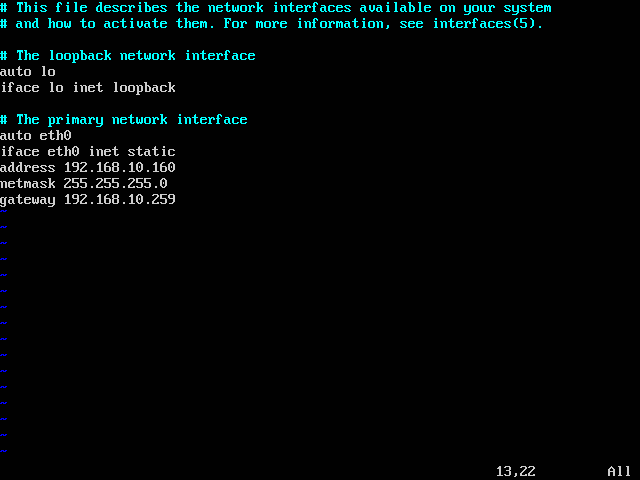

#SSH 连接VirtualBox虚拟机中Ubuntu

[TOC]
1. 我们需要在虚拟机得Ubuntu系统安装ssh服务，其安装命令为：
```
sudo apt-get install ssh  
```
2.  查询其服务时候安装成功的命令：

```
netstat -tlp  
```
3.  如显示如下结果，即表明服务启动成功：

命令行内容代码  收藏代码
```ssh
tcp        0      0 *:ssh                   *:*                     LISTEN   
```
4. 修改VirtualBox虚拟机的网络连接方式，其默认为NAT连接方式，我们将其改为Bridged Adapter连接方式
5. 修改虚拟机中Ubuntu的IP地址，使其与外面系统在同一网段，例如我的外面机器IP为192.168.0.2，那么我
  将其内部IP地址修改如下：
```
sudo vim /etc/network/interfaces  
```
6. 将这个interfaces文件的增加以下内容：

```
auto eth0   
iface eth0 inet static  
address 192.168.0.3  
netmask 255.255.255.0  
gateway 192.168.0.1  
```


7. 然后查看DNS文件，一般默认即为正确的：
```
sudo vim /etc/resolv.conf  
```
8. 然后重启网络，或者重启系统即可，然后我们发现使用远程连接软件putty或者加强版的pietty连接即可！
```
sudo /etc/init.d/networking restart
```