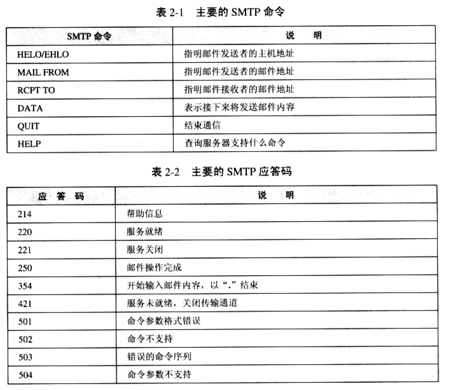

# Socket 教程

[TOC]

##2 Socket 用法详解

### 2.3  关闭Socker

### 2.4 半关闭Socket

####问题1

进程A与进程B通过Socket通信,假定进程A输出数据,进程B读入数据.进程A如何告诉进程B所有的数据已经输出完毕呢?

- 当进程A与进程B交换的是字符流,并且都一行一行地读/写数据时,可以事先约定以一个特殊的标志作为结束标志.

- 进程A先发送一条消息,告诉所发送的正文长度,然后再发送正文.进程B先获知进程A将发送的正文的长度,接下来只要读取完该长度的字符或者字节,就停止读数据.

- 进程A发完所有的数据后,关闭Socket.当进程B读入进程A发送的所有数据后,再次执行输入流read()方法时,该方法返回-1;

- 当掉用Socket的close)方法关闭Socket时,它的输出流和输入流也关闭.有的时候,可能仅仅希望关闭输出流或输入流之一.此时可以采用Socket类提供的半关闭方法.

  - shutdownInput()关闭输入流
  - shutdownIotput() 关闭输出流

  值得注意的是,先后掉用Socket的shutdownInput()和shutdownOutput()方法,仅仅关闭了输入流和输出流,并不等价于调用Socket的close()方法.在通信结束后,仍然调用Socket的close()方法,因为只有该方法才会释放Socket占用的资源.如占用的本地端口等.

  当客户与服务器通信,如果有一方断开连接会怎么样


### 2.5 设置Socket的选项

Socket 有以下几个选项

* TCP_NODELAY 表示立即发送数据
* SO_RESUSEADDR 表示时候允许重用Socket所绑定的本地地址
* SO_TIMEOUT 表示接受数据时的等待超时时间.
* SO_LINGER 表示执行Socket的close()方法,是否立即关闭giceng的Socket
* SO_SNFBUF 表示发送数据的缓冲区的大小
* SO_RECVUF表示接受数据的缓冲区大小
* SO_KEEPALIVE 表示对于长时间处于空闲状态的Socket,时候要自动把它关闭
* OOBINLINE表示时候支持发送一个字节的TCP紧急数据

#### 2.5.9 服务类型选项

IP规定了4种服务类型,用来定性地描述服务的质量

* 低成本:发送成本低
* 高可靠性:保证把数据可靠地送达目的地
* 最高吞吐量:一次可以接受或发送大批量的数据
* 最小延迟:传输数据的速度快,把数据快速送达目的地

这4种服务类型还可以进行组合.例如,可以同时要求获得高可靠性和最小延迟,Socket类中提供了设置和读取服务类型.

* 设置服务类型 setTrafficeCLass(int trafficCLass)
* 读取服务类型 getTrafficeCLass
* 低成本: 0x02(二进制倒数第二位为1)
* 高可靠性:0x04(二进制倒数第三位为1)
* 最高吞吐量:0x08(二进制倒数第四位为1)

例如:一下代码请求高可靠性传输服务

```java
Socket socket=new Socket("www.javathinker.org",80)
socket.setTrafficeClass(0x04)
```

再例如,一下代码请求高可靠性和最小延迟传输服务

```java
Socket socket=new Socket("www.javathinker.org",80)
socket.setTrafficeClass(0x04|0x10)
```

#### 2.5.10 设定连接时间,延迟和带宽的相对重要性

setPerformancePreperences(int connectionTime,int latency,int bandwidth)

* connection 表示用最小时间建立连接

* latency 表示最小延迟

* bandwidth 表示最高带宽


### 2.6 发送邮件的SMTP客户程序




### 2.7小结

Socket建立在TCP/IP协议基础之上,可看做是通信连接两端的收发器,服务器客户都通过Socket来手法数据.出了Socket的第一个不带参数的构造方法以外,其构造方法都会试图建立与服务器的连接,如果连接成功了,就返回Socket对象;如果因为某些原因失败,就会抛出异常.

当客户请求与服务器程序连接时,可能要等待一段时间.默认情况下,客户会一直等待下去,知道连接成功,或者出现异常.如果希望限定等待时间,可以通过connect(SocketAddress endpoint,int timeout)设置超时时间.毫秒为单位.

在通信过程中,如果发送方没有关闭Socket,就突然终止程序,接收方在接受数据时会抛出SocketException


## 3 ServerSocket 用法详解

### 3.1 构造ServerSocket

#### 3.1.1 绑定端口

```java
ServerSocket serverSocker=new ServerSocket(80)
```


* 端口已经被其他服务器进程占用
* 在某些操作系统中,如果没有以超级管理员的身份运行服务器程序,那么操作系统不允许服务器绑定1-1023之间的端口.

如果把场所port设为0,表示由操作系统来为服务器分配一个任意可用的端口,由操作系统分配的端口也称为匿名端口.对于多数服务器,会使用明确的端口,而不会使用匿名端口,因为客户程序需要事先知道服务器的端口,才能方便地访问服务器,

####3.1.2 设定客户连接请求队列的长度

当服务器进程运行时,可能会同事监听多个客户的连接请求.例如,每当一个客户进程执行以下代码:

```java
ServerSocket serverSocker=new ServerSocket("www.javathinker.org",80)
```

就意味着在远程www.javathinker.org主机的80端口上,监听到了一个客户的连接请求.管理客户连接请求的任务是由操作系统来完成的.操作系统把这些连接存储在一个先进先出的队列中.许多曹旭哦系统限定了队列的最大长度,一般为50.当队列中的请求连接达到队列的最大容量时,服务器进程所在的主机会拒绝信的连接情趣.只有当服务器进程通过ServerSocket的accept()方法从队列中取出连接请求,使队列腾出空位,队列才能继续加入新的连接请求.

ServerSOcket 构造方法的backlog参数用来显示设置连接队列的长度,它将覆盖操作系统限定的队列的最大长度.,在一下情况总共,仍然会采用操作系统限定的队列的最大长度.

* backlog 参数的值大于操作系统限定的队列的最大长度
* backlog参数的值小于或等于0
* 在ServerSOcket构造方法中没有设置backlog参数


#### 3.1.3绑定IP地址

如果一个花柱基有两张网卡,一个网卡用于连接到Internet,IP地址为226.57.5.94,还有一个网卡用于连接到本地局域网,IP地址为192.168.3.4/如果服务器仅仅被本地局域网中的额客户访问,那么可以直接按如下方式创建ServerSocket:

```java
ServerSocket serverSocket=new ServerSocket(8000,10,InetAddress.getByName("192.168.1.3.4"));
```

#### 3.1.4 默认构造方法的作用

允许服务器在绑定特定端口之前,先设置ServerSocket的一些选项.因为一旦服务器与特定端口绑定,有些选项就不能再改变了.比如setReuseAddress(true);

### 3.2 接受和关闭与客户的连接


### 3.6 创建多线程的服务器

用多线程来同时为多个客户提供服务,并且对每个客户作出响应的速度越低,表明并发性能越高.本节按照3种方式来重新实现EchoServer,它们都使用了多线程;

* 为每个客户分配一个工作线程
* 创建一个线程池,由其中的工作线程来为客户服务
* 利用JDK的Java类库中现成的线程池,由它的工作线程来为客户服务;


#### 3.6.1 为每个客户分配一个线程

#### 3.6.2 创建线程池

* 服务器创建和销毁线程的开销(包括所花费的时间和系统资源)很大.如果服务器需要玉许多客户通信,并且与每个客户的通信时间都很段,那么有可能服务器为客户创建的新县城的开销比实际与客户通信的开销还要大.
* 除了创建和销毁线程的开销之外,活动的现成也消耗系统资源.每个县城本身都会占用一定的内存(每个线程需要大约1md内存)如果同时有大量客户连接服务器,就必须创建大量工作线程,他们消耗了大量内存,可能搞回导致系统的内存空间不足.
* 如果线程数目固定,并且每个线程都有很长的生命周期,那么线程切换相对规定,不同操作系统有不同的切换周期,一般再20毫秒左右.这里所说的线程切换是指在Java虚拟机,以及底层操作系统的调度下,线程之间转让CPU的使用权.如果频繁创建和小费线程,那么将导致频繁地切换线程,因为一个线程被销毁后,必然要把CPU转让给连一个已经就绪的线程,使该线程获得运行机会.在这种情况下,线程之间的切换不再遵循系统的固定切换周期,切换线程的开销甚至比创建及销毁线程的开销还大.


线程池优点:

* 减少了创建和销毁线程的次数,每个工作线程都可以一直被重用,能执行多个任务.
* 可以根据系统的承载能力,方便地调整线程池中线程的数目,防止因为消耗过量系统资源而导致系统崩溃.


