# Spring MVC启动过程详解

[TOC]

##Web容器初始化过程

1. 启动一个 WEB 项目的时候， WEB 容器会去读取它的配置文件 web.xml ，读取  `<listener>  `和  `<context-param> ` 两个结点。

2. 紧急着，容创建一个  `ServletContext `（ servlet 上下文），这个 web 项目的所有部分都将共享这个上下文。

3. 容器将 ` <context-param>  `转换为键值对，并交给 servletContext 。
4. 容器创建  `<listener> ` 中的类实例，创建监听器。

**1. Servlet容器的启动过程** 
Web应用由Tomcat实例添加到Tomcat中，即由Tomcat管理一个新添加的Context容器。前面已经提到一个Web应用对应一个Context容器，也就是Servlet运行时的Servlet容器。 
在 Servlet API 中有一个 ServletContextListener 接口，它能够监听 ServletContext 对象的生命周期，实际上就是监听 Web 应用的生命周期。 
当Web 应用启动或终止时，会触发ServletContextEvent 事件，该事件由 ServletContextListener 来处理。在 ServletContextListener 接口中定义了处理ServletContextEvent 事件的两个方法。 contextInitialized(ServletContextEvent event)和contextDestroyed(ServletContextEvent event)方法，对别 在Servlet 容器启动Web 应用时和终止Web 应用时调用。

- Servlet容器启动时，触发servletContextEvent事件,并通知相应的监听器servletContextListener；
- Servlet容器在启动的过程中通过servletContextListener监视servletContext的状态（初始化或者销毁servletContext）；即
- servletContextListener中通过contextInitialized初始化方法，根据web.xml对servletContext进行配置，即将Context容器的属性缓存在内存中，供Service服务利用；

contextConfig在Tomcat创建Context容器时被加入到servletContext中，contextConfig负责整个Web应用的配置文件（包括web.xml）的解析工作。

**2. web应用的初始化** 
web的初始化是在contextConfig中实现的，应用的初始化主要是对web.xml进行解析，这个文件描述了Web应用的关键信息，也是整个Web应用的入口。 
Tomcat将web.xml文件解析后，将其中的属性设置到Context容器中，这里包括创建Servlet实例，Filter和Listener。将Servlet包装成Context中的包装类Wrapper。

**3. 创建Servlet实例** 
如果Servlet在web.xml中load-on-startup的配置大于0，那么在Context容器启动时就会被实例化。

**4. Servlet初始化** 
通过调用Servlet的init方法，同时把包装了StandarWrapper对象的StandarWrapperFacade作为ServletConfig传给Servlet。

Servlet从web.xml被解析到初始化。ServletConfig 和 ServletContext的区别ServletConfig:从一个servlet被实例化后，对任何客户端在任何时候访问有效，但仅对本servlet有效，一个servlet的ServletConfig对象不能被另一个servlet访问。

**5. servlet 的运行机制** 
与Servlet关联的有四个对象servletContext,servletConfig,servletRequest,servletResponse。 
Servlet的运行模式是典型的“握手型交互式”运行模式，servletContext提供交互场景模式，而交互场景的初始化由servletConfig来描述的。servletRequest和servletResponse是交互的具体对象。 

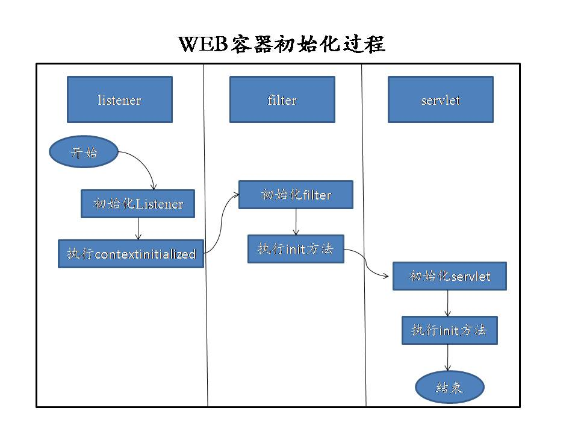

##SpringMVC中web.xml配置

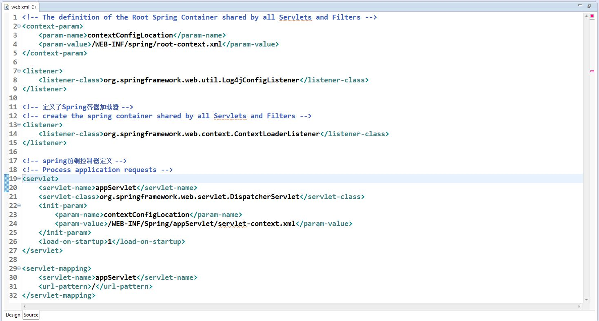

**上图是截取的web.xml中的配置，在<listener>标签中定义了spring容器加载器；在<servlet>标签中定义了spring前端控制器。**

##认识ServletContextListener

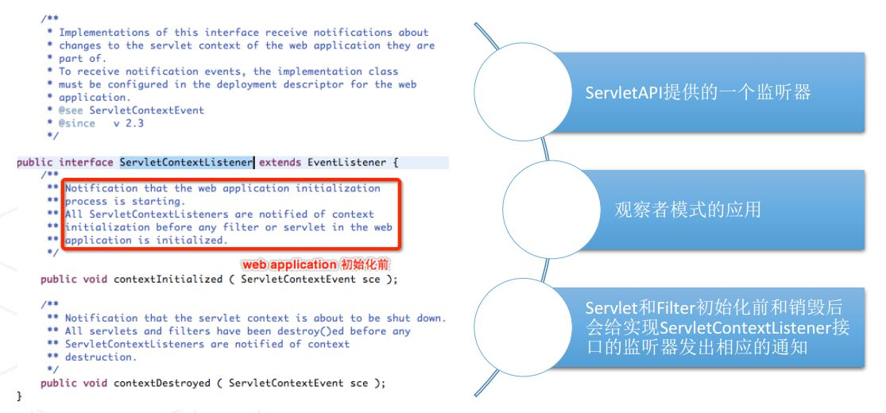

**上图是源码中接口ServletContextListener的定义，可以看到在其注释中指明：servlet和Filter初始化前和销毁后，都会给实现了servletContextListener接口的监听器发出相应的通知。**

##认识ContextLoaderListener

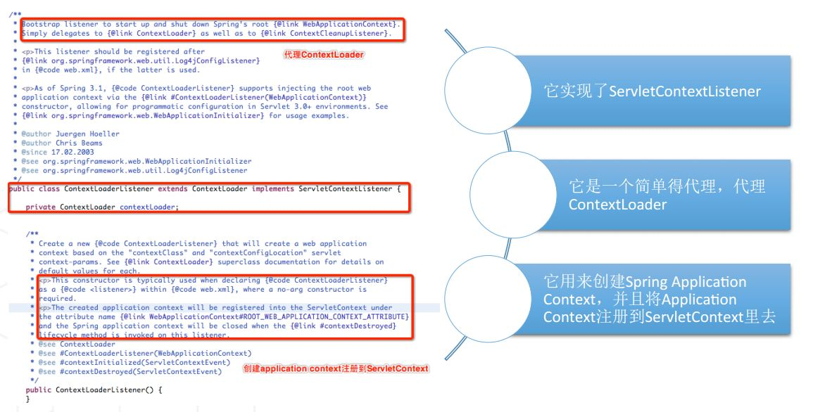

**上面是类ContextLoadListener的定义，它实现了上面的servletContextListener。这里用到了代理模式，简单的代理了ContextLoader类。ContextLoadListener类用来创建Spring application context，并且将application context注册到servletContext里面去。**

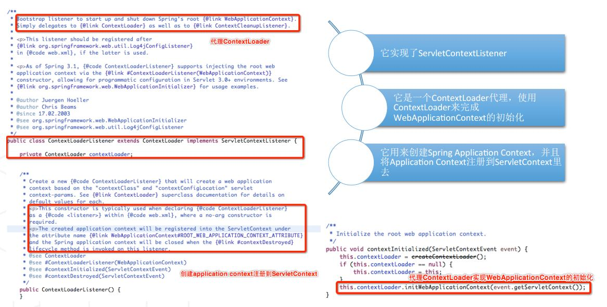

**结合上面的WEB容器启动的过程，以及接口ServletContextListener和类ContextLoadListener。我们知道：**

在 Servlet API中有一个ServletContextListener接口，它能够监听ServletContext对象的生命周期，实际上就是监听Web应用的生命周期。当Servlet容器启动或终止Web应用时，会触发ServletContextEvent事件，该事件由ServletContextListener来处理。在ServletContextListener接口中定义了处理ServletContextEvent 事件的两个方法contextInitialized()和contextDestroyed()。

**ContextLoaderListener监听器的作用就是启动Web容器时，自动装配ApplicationContext的配置信息。因为它实现了ServletContextListener这个接口，在web.xml配置了这个监听器，启动容器时，就会默认执行它实现的方法。由于在ContextLoaderListener中关联了ContextLoader这个类，所以整个加载配置过程由ContextLoader来完成。**

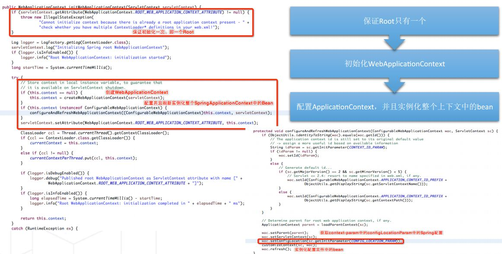

**上面是initWebApplicationContext的过程，方法名称即是其含义。方法中首先创建了WebApplicationContext，配置并且刷新实例化整个SpringApplicationContext中的Bean。因此，如果我们的Bean配置出错的话，在容器启动的时候，会抛异常出来的。**

**综上，ContextLoaderListener类起着至关重要的作用。它读取web.xml中配置的context-param中的配置文件，提前在web容器初始化前准备业务对应的Application context;将创建好的Application context放置于ServletContext中，为springMVC部分的初始化做好准备。**

##DispatcherServlet初始化（HttpServletBean • FrameworkServlet • DispatcherServlet

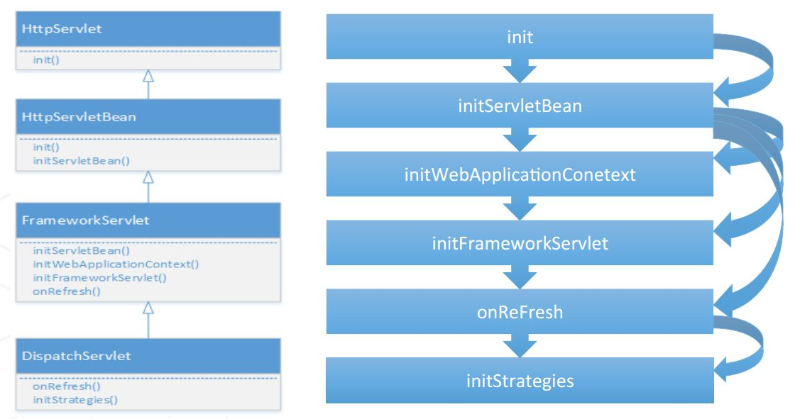

DisptcherServlet 继承FrameworkServlet 继承HttpSerletBean

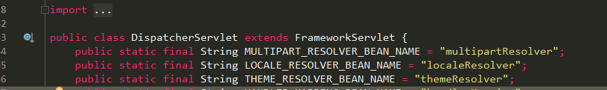

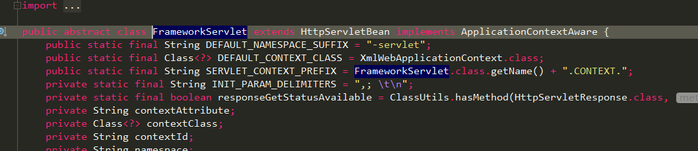

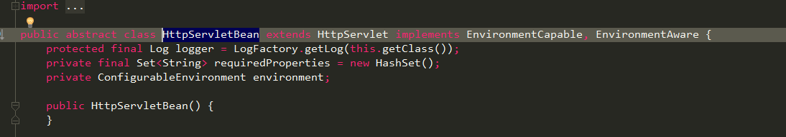

DispatchServlet名如其义，它的本质上是一个Servlet。从上面图可以看到，下层的子类不断的对HttpServlet父类进行方法扩展。

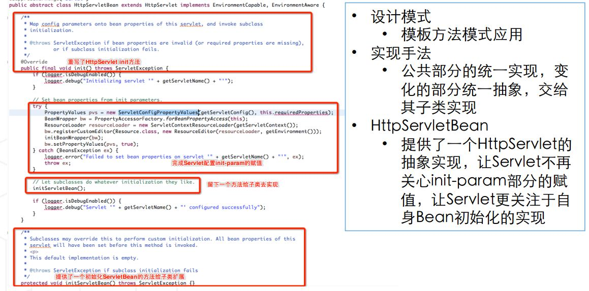

上图是抽象类HttpServletBean的实现，我们知道HttpServlet有两大核心方法：init()和service()方法。HttpServletBean重写了init()方法，在这部分，我们可以看到其实现思路：公共的部分统一来实现，变化的部分统一来抽象，交给其子类来实现，故用了abstract class来修饰类名。此外，HttpServletBean提供了一个HttpServlet的抽象实现，使的Servlet不再关心init-param部分的赋值，让servlet更关注于自身Bean初始化的实现。

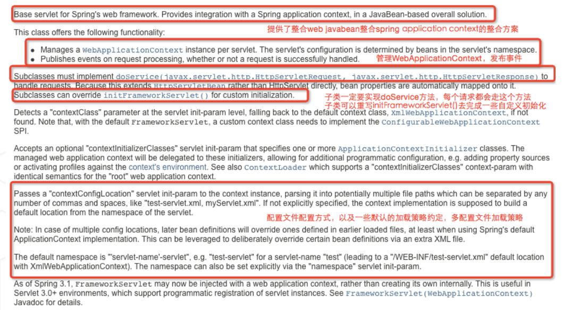

上图是FrameworkServlet的官方定义， 它提供了整合web javabean和spring application context的整合方案。

**其实FrameworkServlet是springMVC初始化IOC容器的核心，通过读取配置的contextConfigLocation配置的springMVC配置文件的地址来读取各种初始化信息和Bean注入信息，来完成springMVC IOC 容器的初始化。**

FrameworkServlet重写了service()方法，

那么它是如何实现的呢？在源码中我们可以看到通过执行initWebApplicationContext()方法和initFrameworkServlet()方法实现。

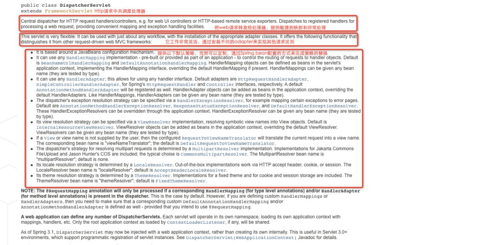

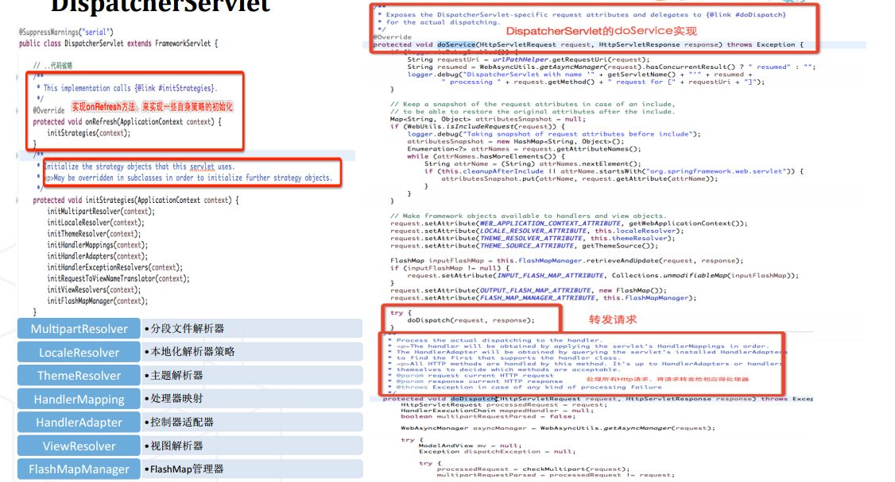

DispatchServlet是HTTP请求的中央调度处理器，它将web请求转发给controller层处理，它提供了敏捷的映射和异常处理机制。DispatchServlet转发请求的核心代码在doService()方法中实现，详细代码参照图上。

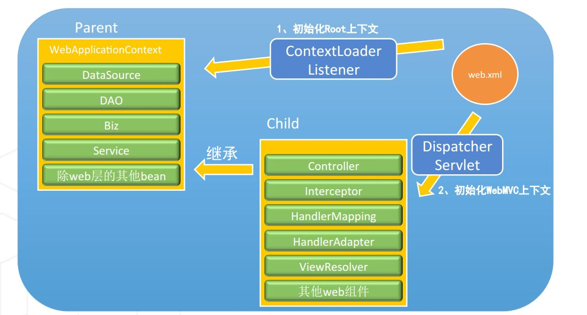

上图是DispatchServlet类和ContextLoaderListener类的关系图。首先，用ContextLoaderListener初始化上下文，接着使用DispatchServlet来初始化WebMVC的上下文。

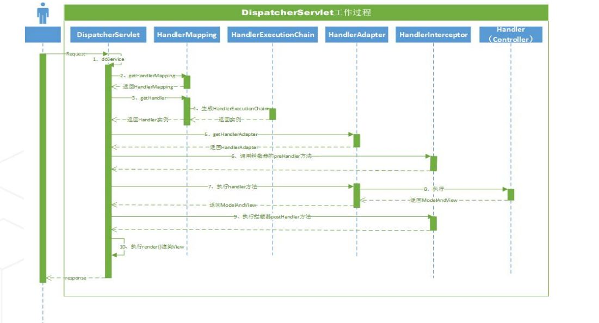

上图是DispatchServlet的工作流程图，作为HTTP请求的中央控制器，它在SpringMVC中起着分发请求的作用。下面总结了DispatchServlet设计的一些特点总结。

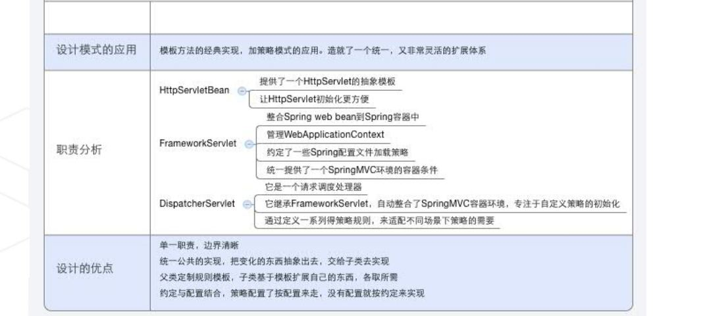

##ContextLoaderListener与DispatcherServlet关系

##DispatcherServlet的设计

##DispatcherServlet工作原理

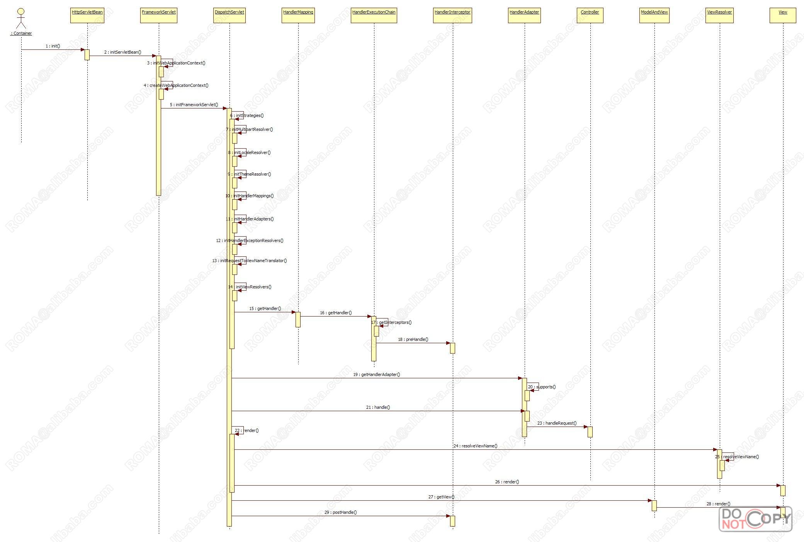