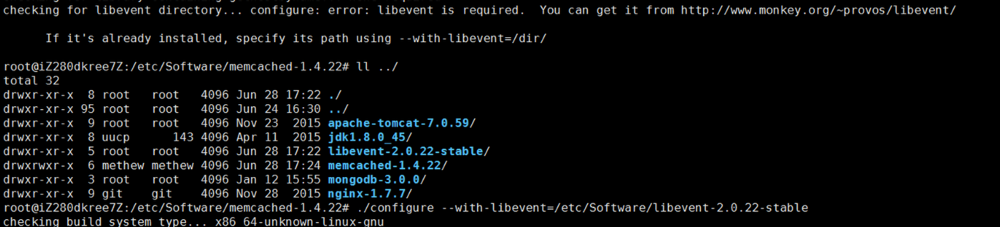

#Ubunut 安装Memcached
##系统环境
Ubunut 14.04 server


#安装Memcached
```
$ wget http://memcached.org/latest
$ mv latest memcached-1.x.x.tar.gz
$ tar -zxvf memcached-1.x.x.tar.gz
$ cd memcached-1.x.x

$ ./configure && make && make test && sudo make install
或者自定义安装目录
$ ./configure -prefix=/usr/local/memcached 
```

注意:源码编译的时候可能会报错:
>checking for libevent directory... configure: error: libevent is required.  You can get it from http://www.monkey.org/~provos/libevent/

到[官网](http://libevent.org/)下载最新的下来编译一下就ok了,重新编译一下memcached



测试是否成功安装memcached：
```
$ ls -al /usr/local/bin/mem*
```
启动Memcache的服务器端：
```
$ /usr/local/bin/memcached -d -m 10 -u root -l 127.0.0.1 -p 11211 -c 256 -P /tmp/memcached.pid
```
-d    选项是启动一个守护进程，
-m   是分配给Memcache使用的内存数量，单位是MB，我这里是10MB，
-u    是运行Memcache的用户，我这里是root，
-l     是监听的服务器IP地址，如果有多个地址的话，我这里指定了服务器的IP地址127.0.0.1，用于限制IP访问
-p    是设置Memcache监听的端口，我这里设置了11211，最好是1024以上的端口，
-c    选项是最大运行的并发连接数，默认是1024，我这里设置了256，按照你服务器的负载量来设定，
-P    是设置保存Memcache的pid文件，我这里是保存在 /tmp/memcached.pid，

如果要结束Memcache进程，执行：
```
# kill 'cat /tmp/memcached.pid'
```
也可以启动多个守护进程，不过端口不能重复。