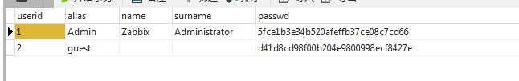
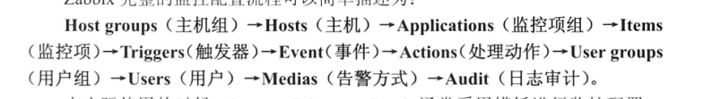

# Zabbix 学习与使用

## 基础部分

### 为何需要监控系统

一个监控系统的组成大体分为两部分:数据采集部分和数据存储告警暂时部分

### 监控系统的实现

### 监控系统的开源软件现状

### 监控系统的原理探究

| **监控项目**  | **详细内容**                                 |
| --------- | ---------------------------------------- |
| **主机监控**  | CPU,内存,磁盘的剩余空间/利用率和I/O,SWAP使用率,系统UP时间,进程数,负载 |
| **网卡监控**  | Ping的往返时间及包成功率,网卡流量,包括流入/流出量和错误的数据包数     |
| **文件监控**  | 监控文件大小,Hash值,匹配查询,字符串存在与否                |
| **URL监控** | 监测指定URL访问过程中的返回码,下载时间及文件大小,支持内容匹配        |
| **应用程序**  | 端口和内存使用率,CPU使用率,服务状态,请求数,并发连接数,消息队列字节数,Client事务处理数,Servcice 状态等; |
| **数据库**   | 检测数据库中指定的表空间,数据库的游标数,Session数,事务数,死锁数,缓存池民众率,库Cache民众率,当前连接数,进程的内存利用率等性能参数 |
| **日志**    | 错误日志配置,特定字符串匹配                           |
| **硬件**    | 温度,风扇转速,电压等                              |

## Zabbix简介(初级)

## 安装和部署(初级)

### Zabbix相关术语(命令)

* zabbix_server 
  Zabbix服务端的核心程序

* zabbix_proxy
  Zabbix代理服务的程序,用于分布式监控proxy模式

* zabbix_agent
  用超级服务(xinetd)的方式来启动的,对应配置文件为zabbix_agent.conf
  zabbix_agent是Zabbix专用客户端的程序

* zabbix_java_gateway
   Zabbix的Java采集服务端,用于JMX的监控方式

* zabbix_get 
  一个数据获取测试命令,相当于snmp中的snmpwalk

###Zabbix init脚本解析

Zabbix 源码包

````bash
[root@localhost zabbix-3.0.8]# tree misc/init.d/
misc/init.d/
├── aix
│   └── zabbix_agentd
├── debian
│   ├── zabbix-agent
│   └── zabbix-server
├── fedora
│   ├── core
│   │   ├── zabbix_agentd #RHEL6 Centos6 用此脚本
│   │   └── zabbix_server
│   └── core5
│       ├── zabbix_agentd  #RHEL5 Centos5 用此脚本
│       └── zabbix_server
├── freebsd
│   ├── zabbix_agentd
│   └── zabbix_server
├── gentoo
│   ├── zabbix-agentd
│   └── zabbix-server
├── README
├── suse
│   ├── 9.1
│   │   ├── zabbix_agentd
│   │   └── zabbix_server
│   ├── 9.2
│   │   ├── zabbix_agentd
│   │   └── zabbix_server
│   └── 9.3
│       ├── zabbix_agentd
│       └── zabbix_server
├── tru64
│   ├── zabbix_agentd
│   └── zabbix_server
└── ubuntu
    ├── zabbix-agent.conf
    └── zabbix-server.conf

13 directories, 22 files
[root@localhost zabbix-3.0.8]# 
````


### 高可用和安全

#### 高可用

由于Zabbix运行在单节点上,难免会造成服务的不可用,对于比较严格的生产环境,配置服务的高可用称为必需的要求.

#### 安全

由于Zabbix-server,Zabbix-Proxy,Zabbix-Agent的通信会涉及跨网络,跨地域的大型分布式混进,会面临互联网的复杂环境,所以各服务间的通信安全成了必需考虑的因素.为了使Zabbix之间的通信采用安全方式,可以考虑一下方法;

* Zabbix-Server和Zabbix-Proxy之间通过VPN连接
* Zabbix-server和Zabbix-Proxy之间通过SSH通道连接
* Zabbix-server和Zabbix-Proxy之间通过Stunnel连接
* 设置严格的防火墙策略,只允许特定的服务器访问,如Zabbix-server只允许Zabbix-Proxy访问或者只允许特定的网段访问
* 市场关注Zabbix官方漏洞消息,及时更新补丁

### 禁用Zabbix的重新安装

```bash
vim /usr.share/zabbix/include/menu.inc.php
```

### Zabbix数据库备份

这里选择对单表备份,而非全部备份排除一下的表(原因是以下的表为监控的历史展示数据,非配置类数据)

备份脚本如下:

zabbix_MySQLdump_per_table.sh

```bash
#!/bin/bash  
#author: itnihao  
#mail: itnihao@qq.com  
#http://wwww.itnihao.com  
#https://github.com/itnihao/zabbix-book/blob/master/03-chapter/Z  
abbix_MySQLdump_per_table.sh  
source /etc/bashrc && source /etc/profile  
MySQL_USER=zabbix 
MySQL_PASSWORD=zabbix 
MySQL_HOST=localhost 
MySQL_PORT=3306 
MySQL_DUMP_PATH=/mysql_backup  
MySQL_DATABASE_NAME=zabbix 
DATE=$(date '+%Y-%m-%d')  
[ -d ${MySQL_DUMP_PATH} ] || mkdir ${MySQL_DUMP_PATH}  
cd ${MySQL_DUMP_PATH}  
[ -d logs ] || mkdir logs  
[ -d ${DATE} ] || mkdir ${DATE}  
cd ${DATE}  
TABLE_NAME_ALL=$(mysql -u${MySQL_USER} -p${MySQL_PASSWORD} -P${My  
SQL_PORT} -h${MySQL_HOST} ${MySQL_DATABASE_NAME} -e "show tables"|egr  
ep -v "(Tables_in_zabbix|history*|trends*|acknowledges|alerts|auditl  
og|events|service_alarms)")  
for TABLE_NAME in ${TABLE_NAME_ALL}  
do  
mysqldump -u${MySQL_USER} -p${MySQL_PASSWORD} -P${MySQL_PORT}  
-h${MySQL_HOST} ${MySQL_DATABASE_NAME} ${TABLE_NAME} >${TABLE_NAME}.  
sql  
sleep 1  
done  
[ "$?" == 0 ] && echo "${DATE}: Backup zabbix succeed" >> ${MyS  
QL_DUMP_PATH}/logs/ZabbixMysqlDump.log  
[ "$?" != 0 ] && echo "${DATE}: Backup zabbix not succeed" >> ${MyS  
QL_DUMP_PATH}/logs/ZabbixMysqlDump.log  
cd ${MySQL_DUMP_PATH}/  
rm -rf $(date +%Y%m%d --date='5 days ago')  
exit 0 
```


## 快速配置和使用(初级)

默认用户名Admin,密码Zabbix,其用户名和密码存于数据库中:

```mysql
select * from zabbix.user where alias ='Admin'
```



如果忘记Admin用户名和密码,可以直接修改数据库密码字段,命令如下

```mysql
mysql>update zabbix.user set passwd=md5('zabbix') where alias='Admin';
mysql> flush privileges;
```

### 配置流程

Zabbix完整的监控配置流程可以简单描述为:



## 深入配置和使用(初级)

## 告警配置(初级)

## 监控方式解析(中级)

## 分布式监控(中级)

## Zabbix与自动化运维(中级)

## 使用经验技巧

## 性能优化(高级)

## Zabbix API 使用(高级)

## 使用Zabbix协议(高级)

## 大型分布式监控案例(高级)


## 安装环境

> nginx-1.10.1.tar.gz
>
> php-5.6.30.tgz
>
> zabbix-3.0.8
>
> mysql-5.6.32-linux-glibc2.5-x86_64.tar.gz

## Zabbix 监控MySQL


```bash
# 添加mysql帐号：
use mysql;
GRANT PROCESS,SUPER,REPLICATION CLIENT ON *.* TO zabbix@'127.0.0.1' IDENTIFIED BY 'zabbix_opera';     flush privileges;   
 
添加check脚本权限：
chmod u+x /usr/local/zabbix/chk_mysql.sh
chown -R zabbix.zabbix /usr/local/zabbix/chk_mysql.sh
去zabbix服务器上面检查基本mysql服务器信息是否能正常获取到，zabbix_get -s 192.168.1..62 -p10050 -k "system.cpu.load[all,avg15]";：
[root@hch_test_121_12 html]# zabbix_get -s 192.168.1..62 -p10050 -k "system.cpu.load[all,avg15]";
0.050000
[root@hch_test_121_12 html]#
接下来准备mysql的运行信息监控，需要准备新的mysql监控脚本
```


## 常见问题

### 中文乱码

上传文件到 zabbix 中
找到本地 C:\Windows\Fonts\simkai.ttf（楷体）上传到服务器 zabbix 网站目录 fonts 目录下。

```bash
#修改 zabbix php 配置文件
[root@own-server zabbix]#  cd /data/site/www.ttlsa.com/zabbix/ # 我 zabbix 安装目录
[root@localhost zabbix]# pwd
/data/site/monitor.ttlsa.com/zabbix
[root@own-server zabbix]# sed -i 's/DejaVuSans/simkai/g' ./include/defines.inc.php
```


服务器列表

192.168.1.54  Zabbix server

192.168.1.122  Zabbix client

192.168.1.123 Zabbix client  