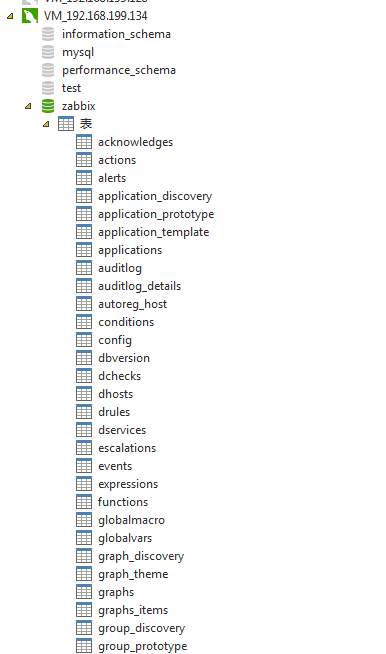
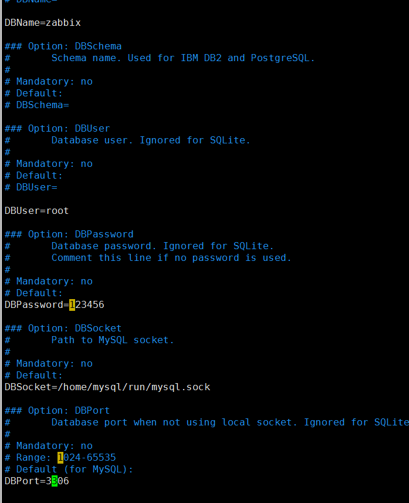
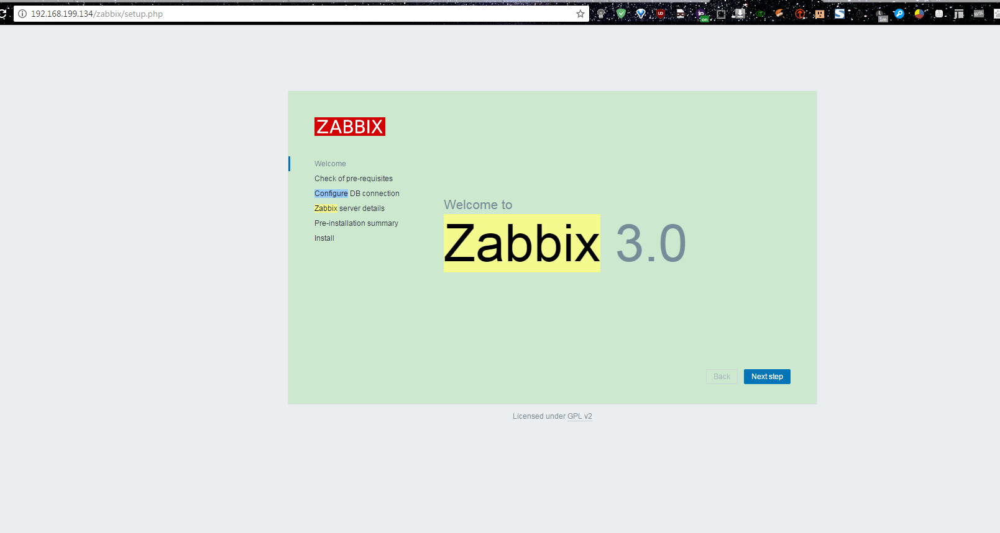
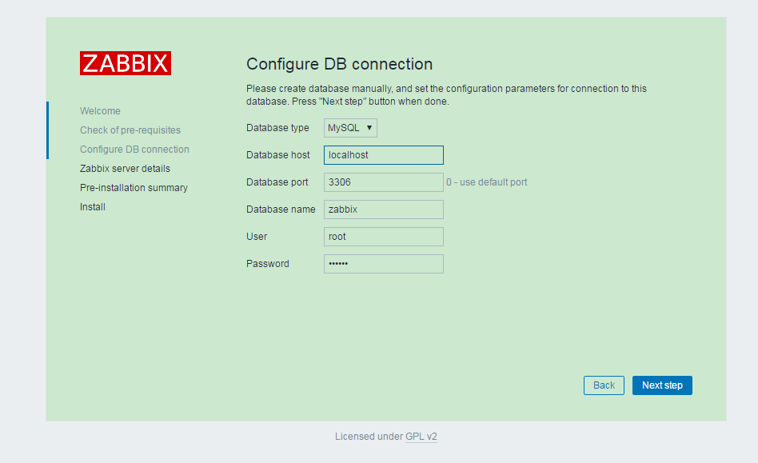
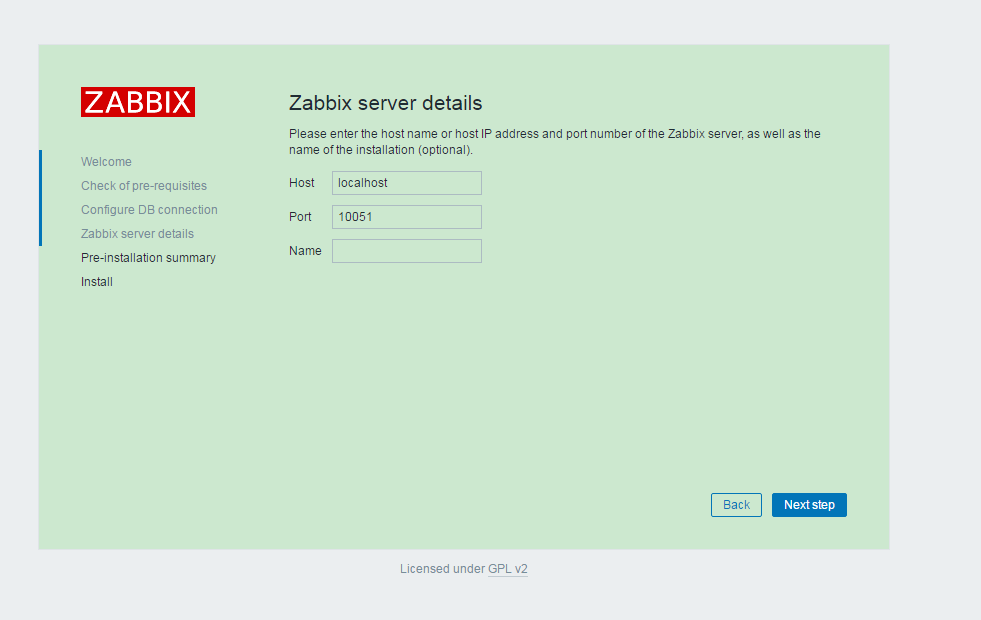
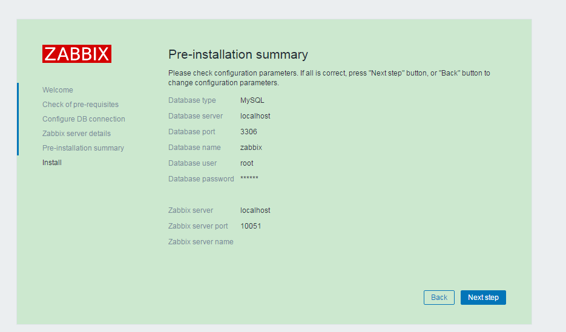

# Zabbix 安装配置

## 安装环境

>   nginx-1.10.1.tar.gz
>
>   php-5.6.30.tgz
>
>   zabbix-3.0.8
>
>   mysql-5.6.32-linux-glibc2.5-x86_64.tar.gz

## 快捷命令

```bash
##启动MySQL
/home/mysql/bin/mysqld_safe --defaults-file=/home/mysql/my.cnf &
##启动Php
/usr/local/php-5.6.30/sbin/php-fpm
##启动Zabbix客户端,默认端口 10050
/usr/local/zabbix-client/sbin/zabbix_agentd
##启动Zabbix服务端,默认端口 10051
/usr/local/zabbix-3.0.8/sbin/zabbix_server   
##启动nginx
/usr/local/nginx-1.10.3/sbin/nginx
##访问Zabbix
#浏览器打开 
http://monitor.ttlsa.com/zabbix
#或者   
http://192.168.199.134/zabbix
```


## 安装配置

### 安装nginx

#### 安装pcre

为了支持rewrite功能，我们需要安装pcre

```bash
[root@own-server soft]# yum install pcre* 
```

#### 安装openssl

需要ssl的支持，如果不需要ssl支持，请跳过这一步

```bash
[root@own-server soft]# yum install openssl*
```

#### 编译安装nginx

```bash
[root@own-server nginx-1.10.3]# ./configure --prefix=/usr/local/nginx-1.10.3 --with-http_ssl_module --with-http_stub_status_module --with-pcre
[root@own-server nginx-1.10.3]# make&&make install

#------------------------------------------------------------------
--with-http_stub_status_module：支持nginx状态查询
--with-http_ssl_module：支持https
--with-http_spdy_module：支持google的spdy,想了解请百度spdy,这个必须有ssl的支持
--with-pcre：为了支持rewrite重写功能，必须制定pcre
```

#### 修改Nginx 配置文件

```nginx

```


#### 启动、关闭、重置nginx

```bash
#启动：直接执行以下命令,nginx就启动了,不需要改任何配置文件,nginx配置多域名虚拟主机请参考后续文章.
[root@own-server nginx-1.10.3]#  /usr/local/nginx-1.10.3/sbin/nginx
#试试访问
[root@own-server nginx-1.10.3]# curl -s http://localhost | grep nginx.com
<a href="http://nginx.com/">nginx.com</a>.</p>
##关闭：
[root@own-server nginx-1.10.3]# /usr/local/nginx-1.10.3/sbin/nginx -s stop
#重置：当你有修改配置文件的时候，只需要reload以下即可
[root@own-server nginx-1.10.3]# /usr/local/nginx-1.10.3/sbin/nginx -s reload
```

### 安装PHP(注意configure和php.ini的配置)

#### 安装依赖

```bash
[root@localhost ~]#yum install gcc make gd-devel libjpeg-devel libpng-devel libxml2-devel bzip2-devel libcurl-devel -y
```

#### 配置和安装

```bash
[root@localhost php-5.6.30]# ./configure --prefix=/usr/local/php-5.6.30 \
--with-config-file-path=/usr/local/php-5.6.30/etc --with-bz2 --with-curl \
--enable-ftp --enable-sockets --disable-ipv6 --with-gd \
--with-jpeg-dir=/usr/local --with-png-dir=/usr/local \
--with-freetype-dir=/usr/local --enable-gd-native-ttf \
--with-iconv-dir=/usr/local --enable-mbstring --enable-calendar \
--with-gettext --with-libxml-dir=/usr/local --with-zlib \
--with-pdo-mysql=mysqlnd --with-mysqli=mysqlnd --with-mysql=mysqlnd \
--enable-dom --enable-xml --enable-fpm --with-libdir=lib64 --enable-bcmath
[root@localhost php-5.6.30]# make&&make install
[root@localhost php-5.6.30]# cp php.ini-production /usr/local/php-5.6.30/etc/php.ini
[root@localhost php-5.6.30]# cp /usr/local/php-5.6.30/etc/php-fpm.conf.default /usr/local/php-5.6.30/etc/php-fpm.conf


```

#### 修改php.ini

打开 php.ini 配置文件，修改以下配置（zabbix 硬性要求）

```ini
#/usr/local/php-5.6.30/etc/php.ini

max_execution_time = 300
memory_limit = 128M
post_max_size = 16M
upload_max_filesize = 2M
max_input_time = 300
date.timezone = Asia/Shanghai
always_populate_raw_post_data = -1


#---------------------------------------------------

sed -i "s/;date.timezone=/date.timezone = Asia\/Shanghai/g" /etc/php.ini
sed -i "s#max_execution_time =30#max_execution_time = 300#g" /etc/php.ini
sed -i "s#post_max_size =8M#post_max_size = 32M#g" /etc/php.ini
sed -i "s#max_input_time =60#max_input_time = 300#g" /etc/php.ini
sed -i "s#memory_limit =128M#memory_limit = 128M#g" /etc/php.ini
sed -i "/;mbstring.func_overload =0/ambstring.func_overload = 2\n" /etc/php.ini

```

#### 启动

```bash
#启动php-fpm
[root@localhost php-5.6.30]# /usr/local/php-5.6.30/sbin/php-fpm
#关闭 
kill -9 
```

### 配置测试站点test.php.com

```bash
[root@own-server php-5.6.30]# mkdir -p /data/logs/nginx/ # 用于存放nginx日志.请看2.3的配置文件
[root@own-server php-5.6.30]# mkdir -p /data/site/test.php.com/ # 站点根目录
[root@own-server php-5.6.30]# vim /data/site/test.php.com/info.php
<?php
phpinfo();
?>
```

#### Nginx 配置说明

nginx将会连接回环地址9000端口执行PHP文件,需要使用tcp/ip协议,速度比较慢.建议大家换成使用socket方式连接。将fastcgi_pass 127.0.0.1:9000;改成fastcgi_pass unix:/var/run/phpfpm.sock;
启动nginx

```nginx
 server {
                listen 70;
                server_name test.php.com;
  
                access_log /data/logs/nginx/test.php.com.access.log main;   #注意:开启了日志就要把log_format 打开

                index index.php index.html index.html;
                root /data/site/test.php.com;

                location /
                {
                        try_files $uri $uri/ /index.php?$args;
                }

                location ~ .*\.(php)?$
                {
                        expires -1s;
                        try_files $uri =404;
                        fastcgi_split_path_info ^(.+\.php)(/.+)$;
                        include fastcgi_params;
                        fastcgi_param PATH_INFO $fastcgi_path_info;
                        fastcgi_index index.php;
                        fastcgi_param SCRIPT_FILENAME $document_root$fastcgi_script_name;
                        fastcgi_pass 127.0.0.1:9000;  # 链接Php
                }
        }
```

#### 访问测试

```bash
#启动Nginx
# /usr/local/nginx/sbin/nginx
# curl http://test.php.com/info.php
test php
```

### 打开防火墙端口

#### Centos7

```bash
[root@rhel7 ~]# firewall-cmd --zone=public --add-port=80/tcp --permanent
[root@rhel7 ~]# firewall-cmd --zone=public --add-port=70/tcp --permanent
10050
[root@rhel7 ~]# firewall-cmd --reload  
[root@rhel7 ~]#firewall-cmd --zone=public --list-ports		#列出 public 级别的被允许的进入端口
```

#### Centos6

```bash
[root@localhost nginx-new]# vim /etc/sysconfig/iptables
#----------------------
-A INPUT -p tcp -m state --state NEW -m tcp --dport 70 -j ACCEPT
-A INPUT -p tcp -m state --state NEW -m tcp --dport 90 -j ACCEPT

##服务端需要开启10051 端口
-A INPUT -p tcp -m state --state NEW -m tcp --dport 10051 -j ACCEPT
##客户端需要开启10050 端口
-A INPUT -p tcp -m state --state NEW -m tcp --dport 10050 -j ACCEPT
#----------------------
[root@localhost nginx-new]# service iptables restart
```


### 安装MySQL(略)

### 安装Zabbix服务端

#### 安装依赖

```bash
yum install perl-ExtUtils-MakeMaker -y
yum install net-snmp-devel -y
```

#### 创建Zabbix客户

为了安全考虑 zabbix 只使用普通用户运行，假如你当前用户叫 ttlsa，那么你运行他，他便使用 ttlsa 身份运行。但
是如果你在 root 环境下运行 zabbix，那么 zabbix 将会主动尝试以 zabbix 身份来运行。但是如果你的系统没有名叫
zabbix 的用户，你需要创建一个用户，如下：

```bash
[root@localhost ~]# groupadd zabbix
[root@localhost ~]# useradd -g zabbix zabbix
```

zabbix server 一般充当两个角色：server、angent （需要监控自己），所以上面的配置参数也同时加上了--enable-agent。
备注：请安装好 MySQL，snmp，curl 开发库

#### RPM方式安装Zabbix-Server

```bash
yum install -y zabbix zabbix-get zabbix-server zabbix-web-mysql zabbix-web zabbix-agent
```


#### 源码方式安装Zabbix-Server

```bash
[root@localhost ~]# wget
https://downloads.sourceforge.net/project/zabbix/ZABBIX%20Latest%20Stable/3.0.8/zabbix-3.0.8.tar.gz?r=http%3A%2F%2Fwww.zabbix.com%2Fdownload&ts=1488611839&use_mirror=jaist

[root@localhost ~]# tar -xzvf zabbix-3.0.8.tar.gz
[root@localhost ~]# cd zabbix-3.0.8
################################注意:这里指定了mysql 安装目录的################################
[root@localhost ~]# ./configure --prefix=/usr/local/zabbix-3.0.8/ --enable-server \
--enable-agent --with-mysql=/home/mysql/bin/mysql_config --with-net-snmp --with-libcurl --with-libxml2
[root@localhost ~]# make&&make install
```

#### 初始化数据库(导入Zabbix 默认表)

zabbix server 与 proxy 需要数据库，angent 不需要。尤其要注意的是 proxy 只需要导入一个 sql 文件，而 server 一共要导入 3 个 sql 文件。我当时在搭建 proxy 的时候导入了 3 个 sql，导致出现报错。后来才发现 proxy 只需要导入一个表结构即可。
我假想你安装好了 MySQL，用户名为 root，密码为 123456

```bash
[root@localhost zabbix-3.0.8]# find / -name 'schema.sql'
/home/soft/zabbix-3.0.8/database/ibm_db2/schema.sql
/home/soft/zabbix-3.0.8/database/mysql/schema.sql
/home/soft/zabbix-3.0.8/database/oracle/schema.sql
/home/soft/zabbix-3.0.8/database/postgresql/schema.sql
/home/soft/zabbix-3.0.8/database/sqlite3/schema.sql
```

```bash
##MySQL免安装版本用这种方式进入控制台(请进去Zabbix 解压缩目录)
[root@localhost zabbix-3.0.8]# pwd
/home/soft/zabbix-3.0.8
[root@localhost zabbix-3.0.8]#/home/mysql/bin/mysql -uroot -p'123456' --socket=/home/mysql/run/mysql.sock
mysql> create database zabbix default charset utf8;
mysql> quit;
[root@localhost zabbix-3.0.8]# /home/mysql/bin/mysql -uroot -p'123456' --socket=/home/mysql/run/mysql.sock zabbix  < database/mysql/schema.sql
Warning: Using a password on the command line interface can be insecure.
[root@localhost zabbix-3.0.8]# 

#---------------------------------------------------------------------------

##MySQL安装版本用这种方式进入控制台
[root@localhost zabbix-3.0.8]# mysql -uroot -p123456
mysql> create database zabbix default charset utf8;
mysql> quit;
[root@localhost ~]# mysql -uroot -p123456 zabbix < database/mysql/schema.sql
```

如果你仅仅是初始化 proxy 的数据库，那么够了。如果初始化 server，那么接着导入下面两个 sql

```bash
##MySQL免安装版本用这种方式进入控制台( 请进去Zabbix 解压缩目录)
[root@localhost zabbix-3.0.8]# pwd
/home/soft/zabbix-3.0.8
[root@localhost zabbix-3.0.8]# /home/mysql/bin/mysql -uroot -p'123456' --socket=/home/mysql/run/mysql.sock zabbix  <  database/mysql/images.sql
[root@localhost zabbix-3.0.8]# /home/mysql/bin/mysql -uroot -p'123456' --socket=/home/mysql/run/mysql.sock zabbix  < database/mysql/data.sql

#--------------------------------------------------

##MySQL安装版本用这种方式进入控制台
[root@localhost ~]# mysql -uroot -pttlsapwd zabbix < database/mysql/images.sql
[root@localhost ~]# mysql -uroot -ppttlsapwd zabbix < database/mysql/data.sql
```

安装好的MySQL 数据库表如下



其 他 数 据 库 （ db2\sqlite\oracle ） 数 据 库 初 始 化 方 法 参 考 ：
https://www.zabbix.com/documentation/2.2/manual/appendix/install/db_scripts

#### Zabbix 服务端配置

配置 zabbix_server 配置文件,zabbix 安装目录下

```bash
[root@localhost zabbix-3.0.8]# vim etc/zabbix_server.conf
DBName=zabbix
DBUser=root
DBPassword=123456
DBPort=3306
DBSocket=/home/mysql/run/mysql.sock
```



#### 启动 zabbix server

```bash
[root@localhost zabbix-3.0.8]# /usr/local/zabbix-3.0.8/sbin/zabbix_server
默认端口 10051
```

#### 防火墙配置

```bash
##服务端需要开启10051 端口
-A INPUT -p tcp -m state --state NEW -m tcp --dport 10051 -j ACCEPT
##客户端需要开启10050 端口
-A INPUT -p tcp -m state --state NEW -m tcp --dport 10050 -j ACCEPT
```

#### Zabbix 管理网站配置

##### 拷贝前端文件

```bash
[root@localhost zabbix-3.0.8]# mkdir -p /data/logs/nginx
[root@localhost zabbix-3.0.8]# mkdir -p  /data/site/monitor.ttlsa.com/zabbix
[root@localhost zabbix-3.0.8]# pwd
/home/soft/zabbix-3.0.8
[root@localhost zabbix-3.0.8]# find / -name 'frontends'
/home/soft/zabbix-3.0.8/frontends
[root@localhost zabbix-3.0.8]# cp -rp frontends/php/* /data/site/monitor.ttlsa.com/zabbix
```

##### 配置虚拟主机(请相应修改你的配置文件路径)

```bash
[root@localhost nginx]# mkdir conf/vhost
#编辑Nginx 配置文件,加入vhost
[root@localhost nginx]# vim conf/nginx.conf
#-----------------------------------------------------增加这句话,把其他server 去掉
include  /usr/local/nginx/conf/vhost/*.conf;
#-----------------------------------------------------
```

```nginx
[root@localhost nginx]# vim /usr/local/nginx/conf/vhost/monitor.ttlsa.com.conf
#-----------------------------------------------------
server {
    listen 80;
    server_name monitor.ttlsa.com;
    access_log /data/logs/nginx/monitor.ttlsa.com.access.log main;
    index index.html index.php index.html;
      root /data/site/monitor.ttlsa.com;
      location /
      {
      try_files $uri $uri/ /index.php?$args;
      }
    location ~ ^(.+.php)(.*)$ {
    fastcgi_split_path_info ^(.+.php)(.*)$;
    include fastcgi.conf;
    fastcgi_pass 127.0.0.1:9000;
    fastcgi_index index.php;
    fastcgi_param PATH_INFO $fastcgi_path_info;
    }
}
#-----------------------------------------------------
```

##### 在线配置Zabbix

浏览器打开 http://monitor.ttlsa.com/zabbix
或者   http://192.168.199.134/zabbix

如下是 zabbix 2.2 的安装界面，包括欢迎界面一共 6 步.









### Zabbix客户端安装

#### 创建Zabbix 用户

zabbix 的用户，你需要创建一个用户，如下：

```bash
[root@localhost ~]# groupadd zabbix
[root@localhost ~]# useradd -g zabbix zabbix
```


#### RPM 方式安装客户端

```bash
# 下载安装包
wget http://repo.zabbix.com/zabbix/3.0/rhel/6/x86_64/zabbix-agent-3.0.0-2.el6.x86_64.rpm
rpm -ivh zabbix-agent-3.0.0-2.el6.x86_64.rpm
# 报错信息如下：
[root@db_m1_slave_1 zabbix]# rpm -ivh zabbix-agent-3.0.0-2.el6.x86_64.rpm
warning: zabbix-agent-3.0.0-2.el6.x86_64.rpm: Header V4 DSA/SHA1 Signature, key ID 79ea5ed4: NOKEY
error: Failed dependencies:
libodbc.so.2()(64bit) is needed by zabbix-agent-3.0.0-2.el6.x86_64
[root@db_m1_slave_1 zabbix]#
# 解决方法：
yum -y install unixODBC

#启动agent：
# 启动(指定配置文件位置)
/usr/sbin/zabbix_agentd -c /etc/zabbix/zabbix_agentd.conf
# 添加开机自启动：
chkconfig --add zabbix_agentd
```

#### 源码编译安装客户端

所有版本下载地址：http://www.zabbix.com/download.php，可以直接下载已经编译好的二进制文件，或者也可以源
码安装。

```bash
# cd /usr/local/src
# wget
"http://downloads.sourceforge.net/project/zabbix/ZABBIX%20Latest%20Stable/2.2.2/zabbix-2.2.2.tar.gz?r=http%3A%2F%2Fwww.zabbix.com%2Fdownload.php&ts=1395066528&use_mirror=jaist"
##从其他服务器下载zabbix
scp -rp root@192.168.1.54:/home/soft/zabbix-3.0.8.tar.gz /data/soft/

# tar -xzvf zabbix-2.2.2.tar.gz
# cd zabbix-2.2.2
# ./configure --prefix=/usr/local/zabbix-client --enable-agent
# make&&make install
```

#### Zabbix 客户端配置

```bash
配置 zabbix_server 配置文件,zabbix 源码目录下
[root@localhost zabbix-client]# pwd
/usr/local/zabbix-client
[root@localhost zabbix-client]# vim /usr/local/zabbix-client/etc/zabbix_agentd.conf
Server=127.0.0.1
ServerActive=127.0.0.1
Hostname=Zabbix serve

#RPM安装的话,zabbix_agentd.conf在/etc目录下
[root@mysql01 soft]# egrep -v "(^#|^$)" /etc/zabbix/zabbix_agentd.conf
PidFile=/var/run/zabbix/zabbix_agentd.pid
LogFile=/var/log/zabbix/zabbix_agentd.log
LogFileSize=0
Server=192.168.1.54
ServerActive=192.168.1.54
Hostname=Zabbix server
Include=/etc/zabbix/zabbix_agentd.d/
UnsafeUserParameters=1
[root@mysql01 soft]# 
```

其中 Server 和 ServerActive 都指定 zabbixserver 的 IP 地址，不同的是，前者是被动后者是主动。也就是说 Server
这个配置是用来允许 127.0.0.1 这个 ip 来我这取数据。而 serverActive 的 127.0.0.1 的意思是，客户端主动提交数据给
他。明白了吗？为什么要分主动和被动？后续再来讨论这个问题！
其他主机安装客户端记得添加 zabbix 用户。

#### Zabbix 客户端启动

```bash
###源码安装方式启动
[root@localhost zabbix-client]# /usr/local/zabbix-client/sbin/zabbix_agentd
默认端口 10050

###RPM方式安装的启动
[root@mysql01 soft]# /usr/sbin/zabbix_agentd -c /etc/zabbix/zabbix_agentd.conf
[root@mysql01 soft]# ps -ef|grep zabbix
zabbix   20810     1  0 14:15 ?        00:00:00 /usr/sbin/zabbix_agentd -c /etc/zabbix/zabbix_agentd.conf
zabbix   20811 20810  0 14:15 ?        00:00:00 /usr/sbin/zabbix_agentd: collector [idle 1 sec]
zabbix   20812 20810  0 14:15 ?        00:00:00 /usr/sbin/zabbix_agentd: listener #1 [waiting for connection]
zabbix   20813 20810  0 14:15 ?        00:00:00 /usr/sbin/zabbix_agentd: listener #2 [waiting for connection]
zabbix   20814 20810  0 14:15 ?        00:00:00 /usr/sbin/zabbix_agentd: listener #3 [waiting for connection]
zabbix   20815 20810  0 14:15 ?        00:00:00 /usr/sbin/zabbix_agentd: active checks #1 [idle 1 sec]
root     20817 20656  0 14:15 pts/0    00:00:00 grep --color=auto zabbix
[root@mysql01 soft]# 

```

#### 防火墙配置

```bash
##服务端需要开启10051 端口
-A INPUT -p tcp -m state --state NEW -m tcp --dport 10051 -j ACCEPT
##客户端需要开启10050 端口
-A INPUT -p tcp -m state --state NEW -m tcp --dport 10050 -j ACCEPT
```


### 登陆 zabbix,使用默认密码

默认用户名：Admin，密码：zabbix

## 安装常见问题

### configure: error: MySQL library not found

```bash
 ##找不到mysql 安装目录,指定一下mysql 安装目录就可以了
 
 ./configure --prefix=/usr/local/zabbix-3.0.8/ --enable-server \
--enable-agent --with-mysql=/home/mysql/bin/mysql_config --with-net-snmp --with-libcurl --with-libxml2
```

### configure: error: Invalid Net-SNMP directory - unable to find net-snmp-config

```bash
yum install net-snmp-devel
```

### Error connecting to database: No such file or directory

```bash
[root@own-server mysql]# vim /usr/local/php-5.6.30/etc/php.ini
#-------------------------------------------------Mysql 指定了sock,修改php配置指向mysql.sock
mysqli.default_socket =/home/mysql/run/mysql.sock
#-------------------------------------------------
```

### Configuration file"/var/www/html/zabbix/conf/zabbix.conf.php" created: Fail

Unable to create the configuration file.Please install it manually, or fix permissions on the conf directory.

Press the "Download configuration file" button, download the configuration file and save it as"/var/www/html/zabbix/conf/zabbix.conf.php"When done, press the "Retry" button

```bash
按提示点击“Download configuration file”按钮，并将下载的zabbix.conf.php保存到
/var/www/html/zabbix/conf/下，点击“Retry”按钮重试
```

#### Can't connect to local MySQL server through socket '/var/lib/mysql/mysql.sock' (2)

```bash
##通过软连接的方式
mkdir -p /var/lib/mysql/
ln -s /home/mysql/run/mysql.sock /var/lib/mysql/mysql.sock
```

#### libodbc.so.2()(64bit) is needed by zabbix-agent-3.0.0-2.el6.x86_64

```bash
yum -y install unixODBC
```


### 图像不加载任何数据

```bash
 #找到zabbix 的日志文件
 find / -name 'zabbix_server.log'
```


```bash
3017:20170307:195042.095 item "Zabbix server:zabbix[process,ipmi poller,avg,busy]" became not supported: No "ipmi poller" processes started.
  3017:20170307:195043.100 item "Zabbix server:zabbix[process,java poller,avg,busy]" became not supported: No "java poller" processes started.
  3017:20170307:195048.120 item "Zabbix server:zabbix[process,snmp trapper,avg,busy]" became not supported: No "snmp trapper" processes started.
  3017:20170307:195049.126 item "Zabbix server:zabbix[process,vmware collector,avg,busy]" became not supported: No "vmware collector" processes started.
  3018:20170307:195056.160 item "Zabbix server:zabbix[vmware,buffer,pfree]" became not supported: No "vmware collector" processes started.
```

### 中文乱码

上传文件到 zabbix 中
找到本地 C:\Windows\Fonts\simkai.ttf（楷体）上传到服务器 zabbix 网站目录 fonts 目录下。

```bash
#修改 zabbix php 配置文件
[root@own-server zabbix]#  cd /data/site/www.ttlsa.com/zabbix/ # 我 zabbix 安装目录
[root@localhost zabbix]# pwd
/data/site/monitor.ttlsa.com/zabbix
[root@own-server zabbix]# sed -i 's/DejaVuSans/simkai/g' ./include/defines.inc.php
```

### error while loading shared libraries: libmysqlclient.so.18，

```bash
#没有那个文件或目录   建立一个软链接 
[root@localhost lib]# ln -s /usr/local/mysql/lib/libmysqlclient.so.18 /usr/lib 
##重新生效
[root@localhost zabbix-3.0.8]# /sbin/ldconfig -v
```

