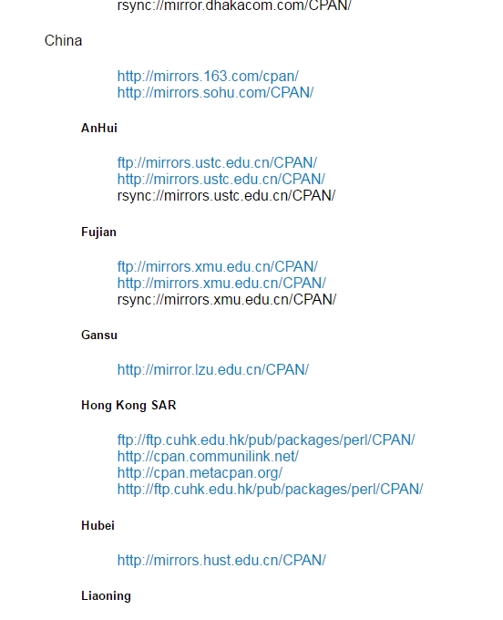

# Perl中CPAN的安装

```bash
yum -y install perl
yum -y install perl-CPAN


CPAN安装完毕后，我们现在登陆进去。使用：
perl -MCPAN -e shell，注意该命令中的 -MCAPN是在一起的没有分开。

接下来我们就可以正常安装相关的模块。因为我测试的是nagios的SNMP监控插件，所以需要安装Net::SNMP（注意该模块名称的大小写）模块。如下图：


cpan[1]> install Net::SNMP
```

第一次启动CPAN 的时候会要求你配置镜像地址

```
Warning: You do not have write permission for Perl library directories.

To install modules, you need to configure a local Perl library directory or
escalate your privileges.  CPAN can help you by bootstrapping the local::lib
module or by configuring itself to use 'sudo' (if available).  You may also
resolve this problem manually if you need to customize your setup.

What approach do you want?  (Choose 'local::lib', 'sudo' or 'manual')
```


找到CPAN的Config.pm文件，如下图：

```bash
[root@localhost libexec]# find / -name 'Config.pm'
/usr/lib64/perl5/vendor_perl/Encode/Config.pm
/usr/lib64/perl5/Config.pm
/usr/share/perl5/vendor_perl/ExtUtils/MakeMaker/Config.pm
/usr/share/perl5/Net/Config.pm
[root@localhost libexec]# 
```

可以看到CPAN的Config.pm文件，进行编辑，如下图：

```bash
vim /usr/lib64/perl5/vendor_perl/Encode/Config.pm
```


找到urllist选项，如上图。然后填入国内的CPAN镜像站点即可，因为默认是使用国外的CPAN镜像站点，所以会很慢。

## CPAN 国内镜像

查找国内的CPAN镜像站点，可以到http://www.cpan.org/SITES.html，这个站点进行查询

