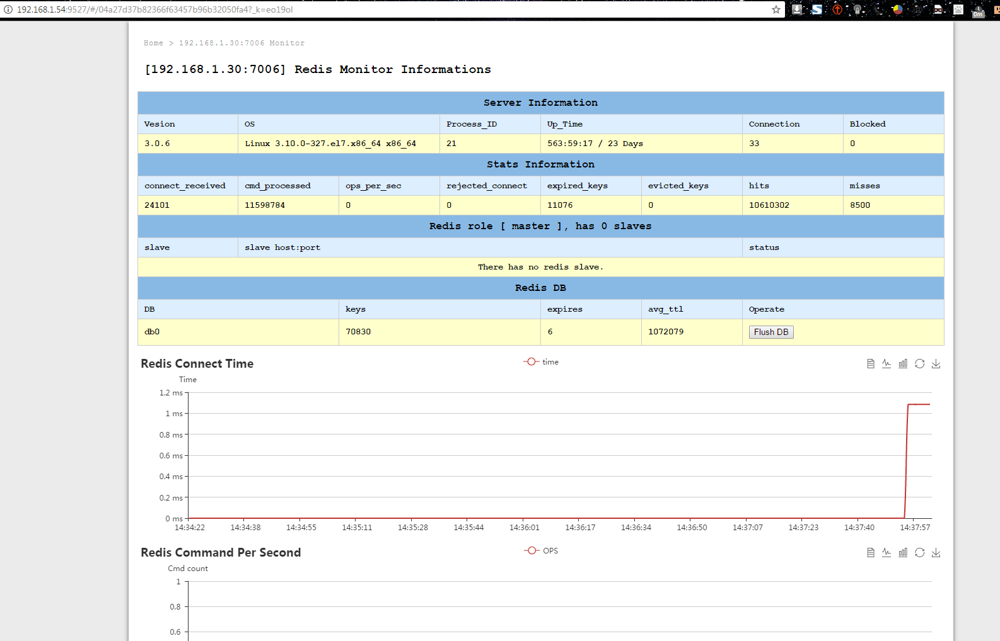

# redis-monitor 安装配置

## 安装EPEL

```bash
##Centos 6 安装EPEL
[root@localhost opt]# rpm -ivh http://dl.fedoraproject.org/pub/epel/6/x86_64/epel-release-6-8.noarch.rpm
Retrieving http://dl.fedoraproject.org/pub/epel/6/x86_64/epel-release-6-8.noarch.rpm
Preparing...                ########################################### [100%]
[root@localhost opt]#  rpm --import /etc/pki/rpm-gpg/RPM-GPG-KEY-EPEL-6


##Centos 7 安装EPEL
[root@localhost opt]# yum -y install epel-release
```

## 安装PIP

```bash
[root@localhost opt]# yum install python-pip
[root@localhost opt]# pip install requests
 
 #或者
[root@localhost opt]# yum install wget
[root@localhost opt]# wget https://bootstrap.pypa.io/get-pip.py
[root@localhost opt]# python get-pip.py
```

## 安装Redis-Monitor

```bash
[root@localhost opt]# yum -y install git
[root@localhost opt]# git clone https://github.com/wangmax0330/redis-monitor.git
Initialized empty Git repository in /opt/redis-monitor/.git/
remote: Counting objects: 238, done.
remote: Total 238 (delta 0), reused 0 (delta 0), pack-reused 238
Receiving objects: 100% (238/238), 934.58 KiB | 12 KiB/s, done.
Resolving deltas: 100% (97/97), done.
[root@localhost opt]# ll
total 20
drwxr-xr-x  3 root root 4096 Feb 28 13:54 bak
drwxr-xr-x  4 root root 4096 Feb 28 14:01 calculator
drwxr-xr-x 21 1000 root 4096 Mar 10 15:45 jenkins_home
drwxr-xr-x  2 root root 4096 Jan  5 16:26 maven
drwxr-xr-x  5 root root 4096 Mar 23 14:15 redis-monitor
[root@localhost opt]# cd redis-monitor/
##首先安装Flask Web需要得库
[root@localhost redis-monitor]# pip install -r requirements.txt

##运行web程序即可
[root@localhost redis-monitor]# ./run_monitor
## 本地打开127.0.0.1:7259

```

## 安装最新版本 

GitHub:https://github.com/wangmax0330/redis-monitor

```bash
pip install redis-monitor
redis-monitor init
redis-monitor start


[root@localhost opt]#pip install redis-monitor
...
Successfully built redis-monitor flask-sqlalchemy Flask-Script itsdangerous SQLAlchemy MarkupSafe
Installing collected packages: click, MarkupSafe, jinja2, Werkzeug, itsdangerous, flask, SQLAlchemy, flask-sqlalchemy, pymysql, redis, Flask-Script, redis-monitor
Successfully installed Flask-Script-2.0.5 MarkupSafe-1.0 SQLAlchemy-1.1.6 Werkzeug-0.12.1 click-6.7 flask-0.11.1 flask-sqlalchemy-2.1 itsdangerous-0.24 jinja2-2.8 pymysql-0.7.9 redis-2.10.5 redis-monitor-1.0.3
[root@localhost opt]# redis-monitor init
OK: init configuration file into `/root/.redis-monitor/redis_monitor_config.py`.
OK: database is initialed into `/root/.redis-monitor/redis_monitor.db`.
[root@localhost opt]# nohup redis-monitor start >/opt/redis-monitor.log 2>&1&
```

## 开启防火墙(9527)端口

```bash
[root@localhost opt]# vim /etc/sysconfig/iptables
[root@localhost opt]# service iptables restart
```

## 访问

> 127.0.0.1:9527

