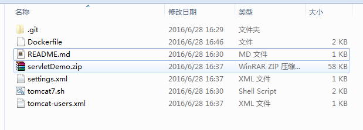
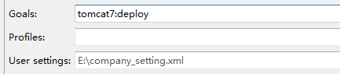

# 一个 Dockerfile 包含有了 jdk7, tomcat7 和一个利用Maven远程部署到镜像中的servlet项目
##docker 部署
一个 Dockerfile 包含有了 jdk7, tomcat7 和一个利用Maven远程部署到镜像中的servlet项目
###目录结构


### 前提条件

 [安装Docker](https://docs.docker.com/engine/getstarted/)

### 使用方式

build一个新的镜像
```
$ git clone https://github.com/wangmax0330/docker-jdk-tomcat.git
$ cd docker-jdk-tomcat
$ sudo docker build -t docker-jdk-tomcat .
```

运行镜像
```
$ sudo docker run -d -p 8090:8080 docker-jdk-tomcat
```
打开`http://<host>:8090`可以看到tomcat 首页

###常用命令

* 进去运行时的容器
```
$ docker exec -it <contain id> /bin/bash
```
* 列出当前所有正在运行的container  
```
$docker ps  
```
* 列出所有的container  (包括历史)
```
$docker ps -a  
```
* 列出最近一次启动的container  
```
$docker ps -l  
```
--------------------------
##Maven 远程部署Tomcat 项目
pom.xml配置部署的server
```xml
<plugin>
	<groupId>org.apache.tomcat.maven</groupId>
	<artifactId>tomcat7-maven-plugin</artifactId>
	<version>2.2</version>
	<configuration>
		<url>http://121.42.212.240:8090/manager/text</url>
		<server>TomcatServer</server>
		<path>/sample</path>
		<username>methew</username>
		<password>methewAdmin</password>
	</configuration>
</plugin>
```
Maven 

tomcat7:deploy