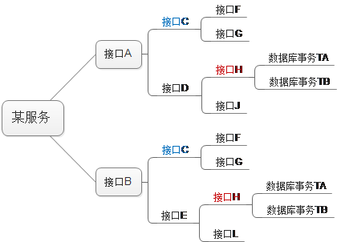

# 分布式事务研究

　　关于分布式事务，笔者推荐的处理方法是“尽量避免”，如果实在避免不了（这已经是高并发、用户量比较多的网站了）则使用“最终一致性”处理（参照CAP理论base思想），如果处理了事务，但还是遇到了数据错误，那还有最后一道保障，那就是“日志”，可以通过日志找回数据，其实大部分互联网公司也都是这么做的。说到“尽量避免”，可能有人认为这不是一个解决问题的办法。这里举个例子，我们生活在城市，其实是每天面临危险的，走路有可能遇到天上掉下的板砖，坐车有可能遇到酒驾，甚至不少人摔个跟头都能淹死，这些低概率的危险我们无法避免。但如果你生活在一个交通事故频发的地段，如果你还有小孩，这个时候你最先想到的解决办法是什么？是提议政府改善公路构造？还是立刻搬走？相信，正常人都会选择搬走，这就是我们所说的“尽量避免”，在微服务应用中如果无休止的创建跨事务服务，那么事务的复杂性也将永无止境，如下图：

​       这棵服务调用树如果继续延伸下去，相信到了某一时刻，神仙也解决不了出现的问题。其实，即使是数据库本身它们的事务也不是能够百分百保证，就拿Oracle来说，遇到突然停电或宕机照样丢失数据。笔者有一次安装了SAP的一个系统，数据库用的是Oracle，结果一次停电后竟然连表都整个丢失。SAP的系统足够强大了，Oracle也足够强大，当两个复杂的系统相遇，出现的问题将更复杂。每次遇到数据库丢数据，最终解决办法都是看日志找回数据。从这里也可以看出“日志”是事务或者说数据一致性的最后保障。

​       在复杂的服务调用结构中我们遇到的最困难的问题是“并发性”问题。如上图，A、B两个接口同时调用了C接口，如果A、B是同时调用的，如何保证C调用的有序性？假如C就是电子商务中的购买接口，我们知道某商品购买是需要有序执行的，因为每购买一次商品数量会减少。这个时候显然需要为A、B设置一个锁机制，保证A、B接口的调用有序性，比如我们在共享内存中建立A、B的锁：      

　　锁名称A-B   锁值0

​      那么不管什么时候要执行A、B接口都需要来查询锁的值，如果锁的值是0，就修改为1，并执行，执行完后将该锁值修改为0，表示释放该锁。这只是执行成功的情况，如果A、B其中一个执行失败，情况就更复杂了。假设A、B都执行C成功，但A在执行D时失败，那么A需要回滚C的数据，但此时B正在提交C的数据。此时如何处理？此时我们采用“最终一致性”方法，处理的方法就是，你把执行上下文和错误情况作为事件进行“记录和汇报”。记录可以是记录日志，汇报可以是发送消息给消息队列，或者发送给一个专门处理分布式事务错误的处理单元。这很像现实中我们处理问题的方法，比如家里进小偷了，警察来后会这样问：在什么情况下（执行的上下文），你丢了什么（产生了什么调用失败），只有把这些汇报给他后他才能处理。

​      如果是上面这个例子，C代表购买接口，那么你需要发送的数据包括：A在执行C时，C所操作的数据的最初值（上下文数据），以及C最后把数据更新到了什么值（错误信息）。这样分布式事务错误处理单元即使在B提交了事务后也可以对A所操作的C进行回滚，这个回滚方法也要经过编程的，并不是直接恢复某个值那么简单，很可能有复杂的处理逻辑。

​      现在看到了，只是调用树最外层A、B两个服务的调用就如此复杂，那么如果有几百个服务，服务之间又有错综复杂的调用，那情况都不可想象。此时有些情况估计XA分布式事务也无法处理，因为它并不知道执行的上下文，这个上下文是你自己编写，更何况还有一些在XA之外的外部接口，还可能有除数据库之外的其它存储方式包含在事务当中。不过还是可以通过上面我们所说的方法进行处理的，因为再复杂也不可能超过现实中事物的复杂。当然，最好的办法还是我们之前提到的“尽量避免”，那属于防患于未然。要尽量避免可以从以下方面去做（可能不全面）：

*   避免出现循环调用。
*   尽量避免出现并发性调用。
*   服务要分层，上层接口只能调用下层接口。
*   事务强相关性表尽量放同一个库。
*   可以将事务性操作，封装成一个接口，在代码级处理跨库事务。

　　其中1）是要完全避免的，这根我们线程编程一样的，如果出现A调用B，B又调用A，线程是很容易死锁的，对于接口不会出现死锁但会出现数据丢失，而且是毫无蛛丝马迹的丢失。至于5），在代码级处理跨库事务有很多方法，XA就是其中一种，当然因为集群问题（只支持单点部署，无法部署高可用集群），也要慎用。

　　微服务中分布式事务的使用涉及“利益”和|“风险”的关系。利益和风险永远成正比。这里的利益是指：系统的执行性能提升、开发成本减少等，风险是指：数据不一致、性能下降等。分布式事务是减少风险，但又同时减少了利益。所以，这是个要权衡利弊的操作，没有也不会存在一个完美的方案，只会存在一个适用于某种情况下的方案。孢子框架在这里推荐两种轻量级方案：

*   假如有接口C，实现C的回滚接口，A调用C、D，如果C调用成功，D调用失败，A中直接调用C回滚接口。

*   假如有接口C，实现C的回滚接口，A调用C、D，如果C调用成功，D调用失败，A中发送C调用上下文及错误信息到消息队列，消息队列持久化该消息，C监听该消息并调用回滚接口，或者专门的事务失败处理服务监听该消息并调用C的回滚接口。

　很显然1）方案很多种情况会回滚失败，所以它适合于数据一致性要求不是很高的情况，比如删掉一篇留言。分析1）回滚失败有以下几个方面：

*    C服务因高负载宕机
*   C服务所关联数据库宕机
*   C服务因网络原因调用不了
*    C服务本线程死掉

　　其中a比较严重，此时会积累大量的C回滚请求没有处理，所以这种情况下宕机，数据失败的比较多。至于c概率较小，因为前面你已经调用C成功了，说明网络没问题。至于b就概率更小了，而且数据库宕机这种情况一旦发生恐怕后果不仅仅是分布式事务的问题了，这个问题要在数据库方面解决。剩下的d，说明编码逻辑有问题，这就要求提高编码的水平，保证只要不是外设和停电的问题，都能运行正常，需要编程方面的技巧。那么可以看来，只有a才是限制这种方法的最根本原因，所以在并发不是很高的情况下，该方案基本不会出现什么问题。

　　方案2）其实也是很多专家们提到的了。就是先将回滚信息持久化，然后再处理回滚。这种情况也会失败，具体失败原因应该和XA这种分布式方案差不多了，分析如下：

*   停电
*   消息队列不可用（XA的TM不可用）

　　至于b只要使用高可用的消息队列集群就可以避免，或者监控消息队列的执行情况，避免因存储空间不足而宕机。这个方案失败基本是因为停电等一霎那进程失败所导致。比如正在向消息队列发送回滚事件的一霎那停电，比如正在回滚数据时数据库一霎那停电等等。这种进程内失败的问题，任何系统都无法避免，但这毕竟是小概率事件。所以这个方案有着比XA更高可靠性（XA是不能部署集群的）。其实，包括oracle等数据库以及office里面的word等文字处理工具，都是用类似方案处理。比如orcale，他会记录事务里面的每一步操作，如果事务失败它就把这些操作进行反向操作，如果你删除了一条数据，它此时就增加这条数据，如果你修改了某字段，它就把某字段恢复旧值（要记录旧值，这很关键）。所以，这个方案看上去很简单，但回滚处理比较复杂，回滚处理要按业务场景处理，也就是按失败上下文去处理。