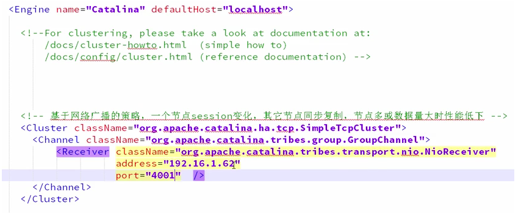
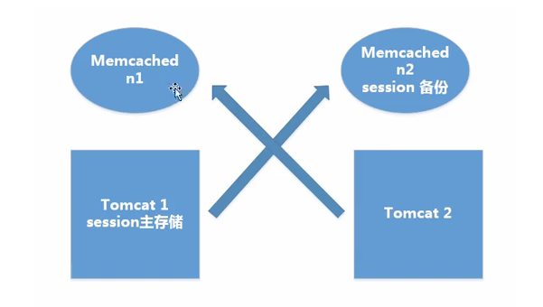
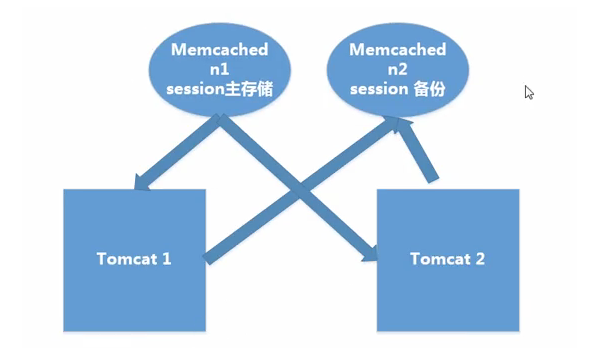
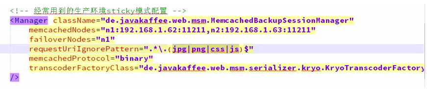
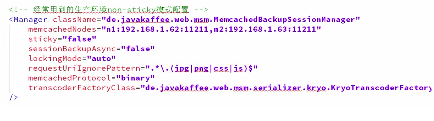

# 分布式环境下三种Session管理方法的使用场景

[TOC]

##Session Replication 方式管理 (即session复制)

 	**简介**：将一台机器上的Session数据广播复制到集群中其余机器上

​        **使用场景**：机器较少，网络流量较小

​        **优点**：实现简单、配置较少、当网络中有机器Down掉时不影响用户访问

​        **缺点**：广播式复制到其余机器有一定廷时，带来一定网络开销

​	**实现方式 **：
​	1 设置tomcat ，server.xml 开启tomcat集群功能Address:填写本机ip即可，设置端口号，预防端口冲突。

​	2 在应用里增加信息：通知应用当前处于集群环境中，支持分布式 在web.xml中添加选项

##Session Sticky 方式管理

​	 **简介 **：即粘性Session、当用户访问集群中某台机器后，强制指定后续所有请求均落到此机器上

 	**使用场景 **：机器数适中、对稳定性要求不是非常苛刻

 	**优点 **：实现简单、配置方便、没有额外网络开销

 	**缺点 **：网络中有机器Down掉时、用户Session会丢失、容易造成单点故障

 	**实现方式 **：以Nginx为例，在upstream模块配置ip_hash属性即可实现粘性Session。

```nginx
upstream mycluster{
    #这里添加的是上面启动好的两台Tomcat服务器
    ip_hash;#粘性Session
     server 192.168.22.229:8080 weight=1;
     server 192.168.22.230:8080 weight=1;
}
```

##缓存集中式管理

​	 **简介 **：将Session存入分布式缓存集群中的某台机器上，当用户访问不同节点时先从缓存中拿Session信息

 	**使用场景 **：集群中机器数多、网络环境复杂

​	**优点 **：可靠性好

​	**缺点 **：实现复杂、稳定性依赖于缓存的稳定性、Session信息放入缓存时要有合理的策略写入

使用分布式缓存方案比如memcached、redis，但是要求Memcached或Redis必须是集群。

使用Session共享也分两种机制，两种情况如下：

###粘性session处理方式

原理：不同的 tomcat指定访问不同的主memcached。多个Memcached之间信息是同步的，能主从备份和高可用。用户访问时首先在tomcat中创建session，然后将session复制一份放到它对应的memcahed上。memcache只起备份作用，读写都在tomcat上。当某一个tomcat挂掉后，集群将用户的访问定位到备tomcat上，然后根据cookie中存储的SessionId找session，找不到时，再去相应的memcached上去session，找到之后将其复制到备tomcat上。



###非粘性session处理方式

原理：memcached做主从复制，写入session都往从memcached服务上写，读取都从主memcached读取，tomcat本身不存储session



优点：可容错，session实时响应。

实现方式：用开源的msm插件解决tomcat之间的session共享：Memcached_Session_Manager（MSM）

a. 复制相关jar包到tomcat/lib 目录下

```
JAVA memcached客户端：spymemcached.jar

msm项目相关的jar包：

1. 核心包，memcached-session-manager-{version}.jar
2. Tomcat版本对应的jar包：memcached-session-manager-tc{tomcat-version}-{version}.jar

序列化工具包：可选kryo，javolution,xstream等，不设置时使用jdk默认序列化。12345678
```

b. 配置Context.xml ，加入处理Session的Manager

粘性模式配置：



非粘性配置：



##session持久化到数据库

原理：就不用多说了吧，拿出一个数据库，专门用来存储session信息。保证session的持久化。

优点：服务器出现问题，session不会丢失

缺点：如果网站的访问量很大，把session存储到数据库中，会对数据库造成很大压力，还需要增加额外的开销维护数据库。

##terracotta实现session复制

原理：Terracotta的基本原理是对于集群间共享的数据，当在一个节点发生变化的时候，Terracotta只把变化的部分发送给Terracotta服务器，然后由服务器把它转发给真正需要这个数据的节点。可以看成是对第二种方案的优化。

 
优点：这样对网络的压力就非常小，各个节点也不必浪费CPU时间和内存进行大量的序列化操作。把这种集群间数据共享的机制应用在session同步上，既避免了对数据库的依赖，又能达到负载均衡和灾难恢复的效果。

##小结

以上讲述的就是集群或分布式环境下，session的5种处理策略。其中就应用广泛性而言，第三种方式，也就是基于第三方缓存框架共享session，应用的最为广泛，无论是效率还是扩展性都很好。而Terracotta作为一个JVM级的开源群集框架，不仅提供HTTP Session复制，它还能做分布式缓存，POJO群集，跨越群集的JVM来实现分布式应用程序协调等，也值得学习一下。

