# 算法导论-图解B+树的插入和删除

 M阶B+树的定义(M阶是指一个节点最多能拥有的孩子数,M>2) 

* 根结点只有1个，分支数量范围[2,m]。        
* 除根以外的非叶子结点,每个结点包含分支数范围[[m/2],m],其中[m/2]表示取大于m/2的最小整数。

## M阶B+树的定义

(M阶是指一个节点最多能拥有的孩子数,M>2)

* 根结点只有1个，分支数量范围[2,m]
* 除根以外的非叶子结点，每个结点包含分支数范围[[m/2],m]，其中[m/2]表示取大于m/2的最小整数。
* 所有非叶子节点的关键字数目等于它的分支数量。
* 所有叶子节点都在同一层，且关键字数目范围是[[m/2],m]，其中[m/2]表示取大于m/2的最小整数。
* 所有非叶子节点的关键字可以看成是索引部分，这些索引等于其子树（根结点）中的最大（或最小）关键字。例如一个非叶子节点包含信息: (n，A0,K0, A1,K1,……,Kn,An)，其中Ki为关键字，Ai为指向子树根结点的[指针](http://baike.baidu.com/view/159417.htm)，n表示关键字个数。即Ai所指子树中的关键字均小于或等于Ki，而Ai+1所指的关键字均大于Ki（i=1，2，……，n）。
* 叶子节点包含全部关键字的信息(非叶子节点只包含索引)，且叶子结点中的所有关键字依照大小顺序链接(所以一个B+树通常有两个头指针，一个是指向根节点的root，另一个是指向最小关键字的sqt)。

## 3阶B+树的插入

### 例一:往下图的3阶B+树中插入关键字9

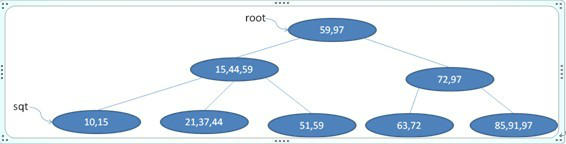

首先查找9应插入的叶节点(最左下角的那一个),插入发现没有破坏B+树的性质,完毕。插完如下图所示:

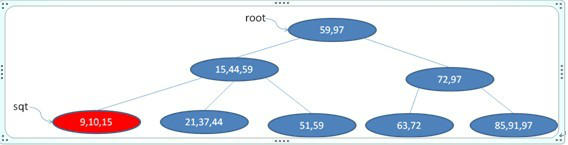

### 例二:往下图的3阶B+树插入20

首先查找20应插入的叶节点(第二个叶子节点),插入，如下图

发现第二个叶子节点已经破坏了B+树的性质,则把之分解成[20 21], [37 44]两个,并把21往父节点移，如下图

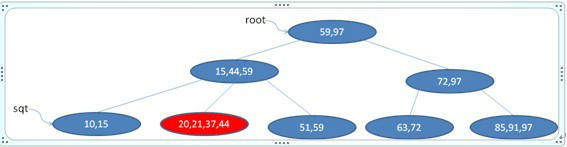

发现父节点也破坏了B+树的性质,则把之再分解成[15 21], [44 59]两个,并把21往其父节点移，如下图

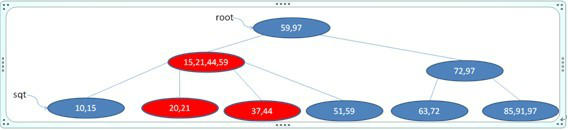

这次没有破坏B+树的性质(如果还是不满足B+树的性质,可以递归上去,直到满足为至),插入完毕。

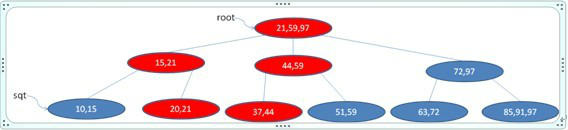

### 例三:往下图的3阶B+树插入100

首先查找100应插入的叶节点(最后一个节点), 插入，如下图

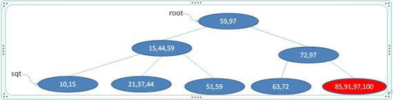

修改其所有父辈节点的键值为100(只有插入比当前树的最大数大的数时要做此步),如下图

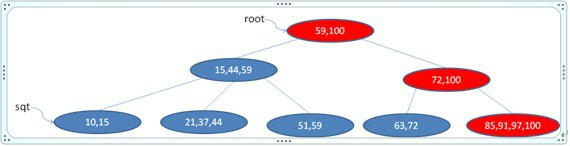

然后重复Eg.2的方法拆分节点,最后得

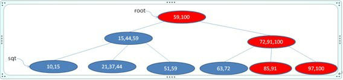

## 3阶B+树的删除

### 例一:删除下图3阶B+树的关键字91

首先找到91所在叶节点(最后一个节点),删除之，如下图

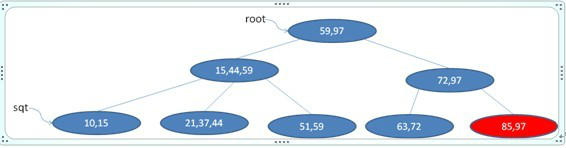

没有破坏B+树的性质,删除完毕

### 例二:删除下图3阶B+树的关键字97

首先找到97所在叶节点(最后一个节点),删除之，然后修改该节点的父辈的键字为91(只有删除树中最大数时要做此步)，如下图

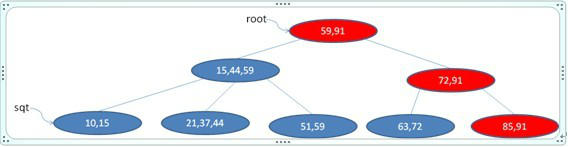

### 例三:删除下图3阶B+树的关键字51

首先找到51所在节点(第三个节点),删除之，如下图

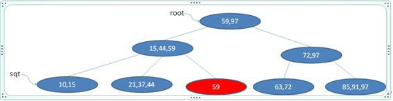

破坏了B+树的性质,从该节点的兄弟节点(左边或右边)借节点44，并修改相应键值,判断没有破坏B+树,完毕，如下图

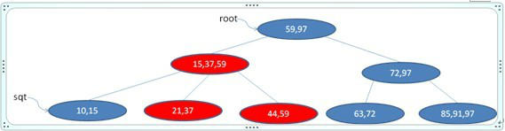

### 例四:删除下图3阶B+树的关键字59

首先找到59所在叶节点(第三个节点),删除之，如下图

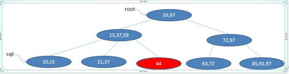

破坏B+树性质,尝试借节点,无效(因为左兄弟节点被借也会破坏B+树性质),合并第二第三叶节点并调整键值，如下图

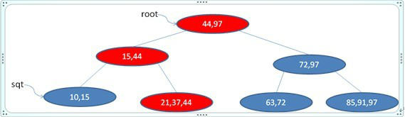

### 例五:删除下图3阶B+树的关键字63

首先找到63所在叶节点(第四个节点),删除之，如下图

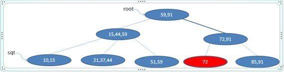

合并第四五叶节点并调整键值，如下图

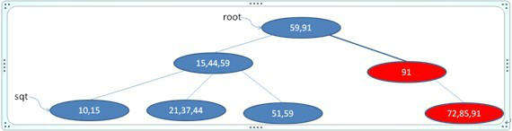

发现第二层的第二个节点不满足B+树性质,从第二层的第一个节点借59,并调整键值，如下图

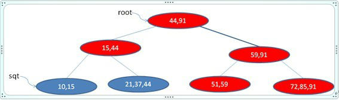